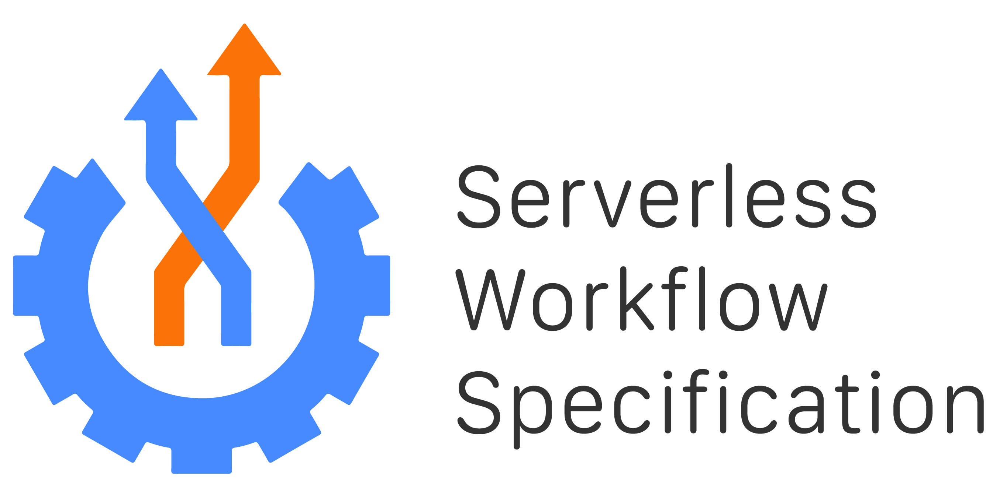

 
 

A specification for defining declarative workflow models
that orchestrate event-driven, serverless applications.

Serverless Workflow is hosted by the [Cloud Native Computing Foundation (CNCF)](https://www.cncf.io/) and was approved as a 
Cloud Native Sandbox level project on July 14, 2020.

## Table of Contents

- [Releases](#Releases)
- [SDKs](#SDKs)
- [Tooling](#Tooling)
- [Community](#Community)
    - [Communication](#Communication)
    - [Code of Conduct](#Code-of-Conduct)
    - [Meetings](#Meetings)
    - [Meeting Minutes](#Meeting-Minutes)
- [Repository Structure](#Repository-Structure)

## Releases

| | Latest release | Latest release branch | Working branch | 
| --- |  :---: | :---: | :---: |
| **Core Specification** | |
| Serverless Workflow | [v0.5](https://github.com/serverlessworkflow/specification/releases) | [0.5.x](https://github.com/serverlessworkflow/specification/tree/0.5.x) | [master](https://github.com/serverlessworkflow/specification) |
| **Additional Components** | |
| Java SDK | [1.0.1.Final](https://github.com/serverlessworkflow/sdk-java/releases) | [1.0.x](https://github.com/serverlessworkflow/sdk-java/tree/1.0.x) | [master](https://github.com/serverlessworkflow/sdk-java) |
| GO SDK | [v1.0.0](https://github.com/serverlessworkflow/sdk-go/releases) | [1.0.x](https://github.com/serverlessworkflow/sdk-go/tree/1.0.x) | [master](https://github.com/serverlessworkflow/sdk-go) |
| VSCode Extension | [1.3.0](https://marketplace.visualstudio.com/items?itemName=serverlessworkflow.serverless-workflow-vscode-extension) | | [master](https://github.com/serverlessworkflow/vscode-extension) |

## SDKs

In addition to the documentation mentioned above, there is also a set of SDKs being developed and are part of the specification:

- [Go](https://github.com/serverlessworkflow/sdk-go)
- [Java](https://github.com/serverlessworkflow/sdk-java)

Being an open source community the Serverless Workflow team is open for new members as well open to their contributions. 
In order to ensure that an SDK is going to be supported and maintained, the Serverless Workflow community would like to ensure that:

* Each SDK has active points of contact.
* Each SDK supports the latest(N), and N-1, major releases of the specification.
* Within the scope of a major release, only support for the latest minor version is needed.

Support for release candidates is not required, but strongly encouraged.

## Tooling

In order to enhance developer experience with the specification, we also provide a [Visual Studio Code extension](https://marketplace.visualstudio.com/items?itemName=serverlessworkflow.serverless-workflow-vscode-extension).
The sources of the extension are found [here](https://github.com/serverlessworkflow/vscode-extension).

In order to ensure that the VSCode Extension is going to be supported and maintained, the Serverless Workflow community 
would like to ensure that is has a dedicated point of contact.

## Community

We have an growing community working together to build a dynamic serverless workflow
ecosystem. Community contributions are welcome and much needed to foster specification growth.

See [here](community/contributors.md) for the list of all community members that have contributed to the specification.

To learn how to contribute to the specification reference the ['how to contribute'](contributing.md) doc.
  
### Communication

- Serverless WG Email: [cncf-wg-serverless](mailto:cncf-wg-serverless@lists.cncf.io)
- Serverless WG Subscription: [https://lists.cncf.io/g/cncf-wg-serverless](https://lists.cncf.io/g/cncf-wg-serverless)
- Project Maintainers Email: [cncf-serverlessws-maintainers](mailto:cncf-serverlessws-maintainers@lists.cncf.io)
- Community Slack Channel: [https://slack.cncf.io/](https://slack.cncf.io/) -  #serverless-workflow

### Code of Conduct

As contributors and maintainers of this project, and in the interest of fostering
an open and welcoming community, we pledge to respect all people who contribute
through reporting issues, posting feature requests, updating documentation,
submitting pull requests or patches, and other activities.

We are committed to making participation in this project a harassment-free experience for
everyone, regardless of level of experience, gender, gender identity and expression,
sexual orientation, disability, personal appearance, body size, race, ethnicity, age,
religion, or nationality.

See our full project Code of Conduct information [here](code-of-conduct.md).

### Meetings

* [CNCF public events calendar](https://www.cncf.io/calendar/)

The Serverless Workflow team meets weekly, every Monday at 10AM PT (USA Pacific).

Join from PC, Mac, Linux, iOS or Android via [zoom](https://zoom.us/my/cncfserverlesswg?pwd=YjNqYzhOdjRRd01YWFkzS1lHbDZqUT09)

Or iPhone one-tap :

    US: +16465588656,,3361029682#  or +16699006833,,3361029682#

Or Telephone:

    Dial:
        US: +1 646 558 8656 (US Toll) or +1 669 900 6833 (US Toll)
        or +1 855 880 1246 (Toll Free) or +1 877 369 0926 (Toll Free)

Meeting ID: 336 102 9682

International numbers available:
https://zoom.us/zoomconference?m=QpOqQYfTzY_Gbj9_8jPtsplp1pnVUKDr

NOTE: Please use \*6 to mute/un-mute your phone during the call.

World Time Zone Converter:
http://www.thetimezoneconverter.com/?t=9:00%20am&tz=San%20Francisco&

### Meeting Minutes

The minutes from our calls are available
[here](https://docs.google.com/document/d/1xwcsWQmMiRN24a7o7oy9MstzMroAup31oOkM5Dru1jQ/edit#).

Periodically, the group may have in-person meetings that coincide with a major
conference. Please see the
[meeting minutes](https://docs.google.com/document/d/1xwcsWQmMiRN24a7o7oy9MstzMroAup31oOkM5Dru1jQ/edit#)
for any future plans.

## Repository Structure

Here is the outline of the repository to help navigate the specification
documents:

| File/folder | Description | 
| --- | --- | 
| [specification.md](specification.md) | The main specification document | 
| [OWNERS](OWNERS) | Defines the current specification maintainers and approvers | 
| [LICENSE](LICENSE) | Specification License doc | 
| [MAINTAINERS.md](MAINTAINERS.md) | Project Maintainers Info | 
| [GOVERNANCE.md](GOVERNANCE.md) | Project Governance Info | 
| [contributing.md](contributing.md) | Documentation on how to contribute to the spec | 
| [code-of-conduct.md](code-of-conduct.md) | Defines the spec Code of Conduct | 
| [usecases](usecases/README.md) | Specification Use Cases | 
| [schema](schema) | Contains all specification JSON Schemas | 
| [roadmap](roadmap/README.md) | Specification Roadmap |
| [references](references/README.md) | References used for specification docs |
| [media](media) | Includes all images used in spec docs |
| [extensions](extensions/README.md) | Information on spec extensions |
| [examples](examples) | Specification examples |
| [community](community) | Contains info on the spec community |
