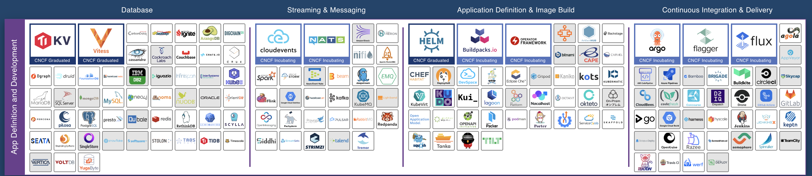

 
 

##  About

CNCF Serverless Workflow defines a vendor-neutral, open-source, and fully community-driven
ecosystem for defining and running DSL-based workflows that target the Serverless technology domain.</h3>

This project is composed of:

* [Specification](specification.md) for defining DSL-based workflows
* [Developer SDKs](#sdks) for different programming languages
* [Workflow runtimes](#runtime) supporting the specification
* Developer [tooling support](#tooling) for writing DSL-based workflows

CNCF Serverless Workflow is hosted by the [Cloud Native Computing Foundation (CNCF)](https://www.cncf.io/) and was approved as a 
Cloud Native Sandbox level project on July 14, 2020.

## Table of Contents

- [CNCF Landscape](#CNCF-Landscape)
- [Releases](#Releases)
- [SDKs](#SDKs)
- [Runtimes](#Runtimes)
- [Tooling](#Tooling)
- [Community](#Community)
    - [Communication](#Communication)
    - [Code of Conduct](#Code-of-Conduct)
    - [Meetings](#Meetings)
    - [Meeting Minutes](#Meeting-Minutes)
- [Repository Structure](#Repository-Structure)
- [Support](#Support)

## CNCF Landscape

Serverless Workflow project falls under the [CNCF "App Definition and Development"](https://landscape.cncf.io/card-mode?category=app-definition-and-development&grouping=category) category.

It is a member project of the [CNCF Serverless Working Group](https://github.com/cncf/wg-serverless).

Check out our project DevStats [here](https://serverlessworkflow.devstats.cncf.io).

## Releases

| | Latest release | Latest release branch | Working branch | 
| --- |  :---: | :---: | :---: |
| **Core Specification** | |
| [Serverless Workflow](https://github.com/serverlessworkflow/specification) | [v0.7](https://github.com/serverlessworkflow/specification/releases) | [0.7.x](https://github.com/serverlessworkflow/specification/tree/0.7.x) | [main](https://github.com/serverlessworkflow/specification) |
| **Additional Components** | |
| [Synapse](https://github.com/serverlessworkflow/synapse) | [0.1.0-alpha1](https://github.com/serverlessworkflow/synapse/releases) |  | [main](https://github.com/serverlessworkflow/synapse) |
| [GO SDK](https://github.com/serverlessworkflow/sdk-go) | [v2.0.0](https://github.com/serverlessworkflow/sdk-go/releases) | [1.0.x](https://github.com/serverlessworkflow/sdk-go/tree/1.0.x) | [main](https://github.com/serverlessworkflow/sdk-go) |
| [Java SDK](https://github.com/serverlessworkflow/sdk-java) | [3.0.0.Final](https://github.com/serverlessworkflow/sdk-java/releases) | [3.0.x](https://github.com/serverlessworkflow/sdk-java/tree/3.0.x) | [main](https://github.com/serverlessworkflow/sdk-java) |
| [.NET SDK](https://github.com/serverlessworkflow/sdk-net) | [v0.7.4.4](https://github.com/serverlessworkflow/sdk-net/releases) |  | [main](https://github.com/serverlessworkflow/sdk-net) |
| [TypeScript SDK](https://github.com/serverlessworkflow/sdk-typescript) | [v2.0.0](https://github.com/serverlessworkflow/sdk-typescript/releases) | [2.0.x](https://github.com/serverlessworkflow/sdk-typescript/tree/2.0.x) | [main](https://github.com/serverlessworkflow/sdk-typescript) |
| [VSCode Extension](https://github.com/serverlessworkflow/vscode-extension) | [1.6.0](https://marketplace.visualstudio.com/items?itemName=serverlessworkflow.serverless-workflow-vscode-extension) | | [main](https://github.com/serverlessworkflow/vscode-extension) |

## Runtimes

- [Synapse](https://github.com/serverlessworkflow/synapse)

Serverless Workflow is open to host open-source runtime implementations that would like to
be part and grow alongside the core specification.

[Synapse](https://github.com/serverlessworkflow/synapse) is a Kubernetes-native workflow runtime which supports and is part of the Serverless
Workflow eco-system.

## SDKs

- [Go](https://github.com/serverlessworkflow/sdk-go)
- [Java](https://github.com/serverlessworkflow/sdk-java)
- [.NET](https://github.com/serverlessworkflow/sdk-net)
- [TypeScript](https://github.com/serverlessworkflow/sdk-typescript)

Serverless Workflow encourages development of SDKs dedicated to help developers with 
consuming, parsing, validating and testing their workflows that use the Serverless Workflow DSL.

## Tooling

In order to enhance developer experience with the specification, we also provide a [Visual Studio Code extension](https://marketplace.visualstudio.com/items?itemName=serverlessworkflow.serverless-workflow-vscode-extension).
The sources of the extension are found [here](https://github.com/serverlessworkflow/vscode-extension).

## Community

We have a growing community working together to build a community-driven and vendor-neutral
workflow ecosystem. Community contributions are welcome and much needed to foster project growth.

See [here](community/contributors.md) for the list of community members that have contributed to the specification.

To learn how to contribute to the specification reference the ['how to contribute'](contributing.md) doc.

If you have any copyright questions when contributing to a CNCF project like this one,
reference the [Ownership of Copyrights in CNCF Project Contributions](https://github.com/cncf/foundation/blob/master/copyright-notices.md) doc.
  
### Communication

- Community Slack Channel: [https://slack.cncf.io/](https://slack.cncf.io/) -  #serverless-workflow
- [Weekly project meetings](#Meetings)
- Project Maintainers Email: [cncf-serverlessws-maintainers](mailto:cncf-serverlessws-maintainers@lists.cncf.io)
- Serverless WG Email: [cncf-wg-serverless](mailto:cncf-wg-serverless@lists.cncf.io)
- Serverless WG Subscription: [https://lists.cncf.io/g/cncf-wg-serverless](https://lists.cncf.io/g/cncf-wg-serverless)

### Code of Conduct

As contributors and maintainers of this project, and in the interest of fostering
an open and welcoming community, we pledge to respect all people who contribute
through reporting issues, posting feature requests, updating documentation,
submitting pull requests or patches, and other activities.

We are committed to making participation in this project a harassment-free experience for
everyone, regardless of level of experience, gender, gender identity and expression,
sexual orientation, disability, personal appearance, body size, race, ethnicity, age,
religion, or nationality.

See our full project Code of Conduct information [here](code-of-conduct.md).

### Meetings

* [CNCF public events calendar](https://www.cncf.io/calendar/)

The Serverless Workflow team meets weekly, every Monday at 10AM PT (USA Pacific).

Join from PC, Mac, Linux, iOS or Android via [zoom](https://zoom.us/my/cncfserverlesswg?pwd=YjNqYzhOdjRRd01YWFkzS1lHbDZqUT09)

Or iPhone one-tap :

    US: +16465588656,,3361029682#  or +16699006833,,3361029682#

Or Telephone:

    Dial:
        US: +1 646 558 8656 (US Toll) or +1 669 900 6833 (US Toll)
        or +1 855 880 1246 (Toll Free) or +1 877 369 0926 (Toll Free)

Meeting ID: 336 102 9682

International numbers available:
https://zoom.us/zoomconference?m=QpOqQYfTzY_Gbj9_8jPtsplp1pnVUKDr

NOTE: Please use \*6 to mute/un-mute your phone during the call.

World Time Zone Converter:
http://www.thetimezoneconverter.com/?t=9:00%20am&tz=San%20Francisco&

### Meeting Minutes

You can find meeting minutes [here](meetingminutes).
Note that unfortunately we have lost our Google doc which contained meeting info for our prior meetings.
We will move all meeting info to our github repo so that this never happens again.

## Repository Structure

Here is the outline of the repository to help navigate the specification
documents:

| File/folder | Description | 
| --- | --- | 
| [specification.md](specification.md) | The main specification document | 
| [OWNERS](OWNERS) | Defines the current specification maintainers and approvers | 
| [LICENSE](LICENSE) | Specification License doc | 
| [MAINTAINERS.md](MAINTAINERS.md) | Project Maintainers Info | 
| [GOVERNANCE.md](GOVERNANCE.md) | Project Governance Info | 
| [contributing.md](contributing.md) | Documentation on how to contribute to the spec | 
| [code-of-conduct.md](code-of-conduct.md) | Defines the spec Code of Conduct | 
| [usecases](usecases/README.md) | Specification Use Cases | 
| [schema](schema) | Contains all specification JSON Schemas | 
| [roadmap](roadmap/README.md) | Specification Roadmap |
| [references](references/README.md) | References used for specification docs |
| [media](media) | Includes all images used in spec docs |
| [extensions](extensions/README.md) | Information on spec extensions |
| [examples](examples) | Specification examples |
| [comparisons](comparisons) | Comparisons of Serverless Workflow with other workflow DSLs |
| [community](community) | Contains info on the spec community |
| [annualreviews](annualreviews) | Contains the project annual reviews presented to the CNCF TOC |
| [meetingminutes](meetingminutes) | Contains the projects community meeting minutes |

## Support

Support our project by [becoming a Sponsor](https://crowdfunding.lfx.linuxfoundation.org/projects/serverless-workflow).
