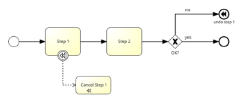
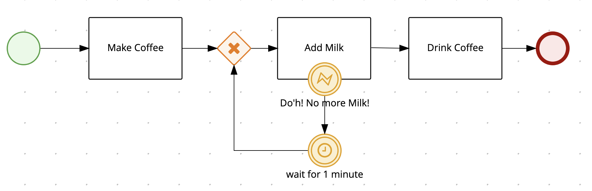

# Comparisons - BPMN2

The [Business Process Model and Notation (BPMN)](https://www.omg.org/spec/BPMN/2.0/PDF) defines a flowchart-based
DSL for workflows. It is maintained by the [Object Management Group (OMG)](https://www.omg.org/). 
The latest version of BPMN is [2.0.2](https://www.omg.org/spec/BPMN/2.0.2/), published in 2014.

BPMN2 defines a graphical notation to specify workflows. This notation can then be shared between tooling and organizations.
The graphical notation is translated into XML which then can be used for execution on runtime engines.

For this comparison we will compare the Serverless Workflow language with the graphical representation of BPMN2,
and not its underlying XML DSl. The BPMN2 XML is very difficult to understand and quite large for even the smallest 
workflows, so it makes more sense to use its graphical notation for comparisons.

Serverless Workflow is a declarative workflow language, represented with JSON or YAML. It currently does not 
define a graphical notation however can be graphically represented using different flowcharting techniques such as 
UML activity diagrams. The [Serverless Workflow Java SDK](https://github.com/serverlessworkflow/sdk-java#building-workflow-diagram) 
as well as its [VSCode Extension](https://github.com/serverlessworkflow/vscode-extension) provide means to generate SVG diagrams based on the workflow
JSON/YAML. 

## Note when reading provided examples

The BPMN2 graphical notation does not provide details about things like data inputs/outputs, mapping and transformation. 
BPMN2 does provide graphical representation for this such as Data Objects, however most of the examples
available do not use them. Execution semantics such as task and event properties are also not visual.
For this reason the event, function, retry, and data mapping 
defined in the associated Serverless Workflow YAML are assumed. 


## Table of Contents

- [Simple File Processor](#File-Processor)
- [Process Application](#Process-Application)
- [Compensation](#Compensation)
- [Error Handling with Retries](#Error-Handling-With-Retries)


### File Processor

<table>
<tr>
    <th>BPMN2 Diagram</th>
    <th>Serverless Workflow</th>
</tr>
<tr>
<td valign="top">
<p align="center">

</p>
</td>
<td valign="top">

```yaml
id: processfile
name: Process File Workflow
version: '1.0'
states:
- name: Process File
  type: operation
  start: true
  actions:
  - functionRef: processFile
  end: true
functions:
- name: processFile
  operation: file://myservice.json#process
```

</td>
</tr>
</table>

### Process Application

<table>
<tr>
    <th>BPMN2 Diagram</th>
    <th>Serverless Workflow</th>
</tr>
<tr>
<td valign="top">
<p align="center">

</p>
</td>
<td valign="top">

```yaml
id: processapplication
name: Process Application
version: '1.0'
states:
- name: ProcessNewApplication
  type: event
  start: true
  onEvents:
  - eventRefs:
    - ApplicationReceivedEvent
    actions:
    - functionRef: processApplicationFunction
    - functionRef: acceptApplicantFunction
    - functionRef: depositFeesFunction
  end:
    produceEvents:
    - eventRef: NotifyApplicantEvent
functions:
- name: processApplicationFunction
  operation: file://myservice.json#process
- name: acceptApplicantFunction
  operation: file://myservice.json#accept
- name: depositFeesFunction
  operation: file://myservice.json#deposit
events:
- name: ApplicationReceivedEvent
  type: application
  source: "/applications/new"
- name: NotifyApplicantEvent
  type: notifications
  source: "/applicants/notify"
```

</td>
</tr>
</table>

### Compensation

<table>
<tr>
    <th>BPMN2 Diagram</th>
    <th>Serverless Workflow</th>
</tr>
<tr>
<td valign="top">
<p align="center">

</p>
</td>
<td valign="top">

```yaml
id: simplecompensation
name: Simple Compensation
version: '1.0'
states:
- name: Step 1
  start: true
  type: operation
  actions:
  - functionRef: step1function
  compensatedBy: Cancel Step 1
  transition: Step 2
- name: Step 2
  type: operation
  actions:
  - functionRef: step2function
  transition: OK?
- name: OK?
  type: switch
  dataConditions:
  - name: 'yes'
    condition: ${ .outcome | .ok == "yes" }
    end: true
  - name: 'no'
    condition: ${ .outcome | .ok == "no" }
    end:
      compensate: true
- name: Cancel Step 1
  type: operation
  usedForCompensation: true
  actions:
  - functionRef: undostep1
functions:
- name: step1function
  operation: file://myservice.json#step1
- name: step2function
  operation: file://myservice.json#step2
- name: undostep1function
  operation: file://myservice.json#undostep1
```

</td>
</tr>
</table>

### Error Handling With Retries

<table>
<tr>
    <th>BPMN2 Diagram</th>
    <th>Serverless Workflow</th>
</tr>
<tr>
<td valign="top">
<p align="center">

</p>
</td>
<td valign="top">

```yaml
id: errorwithretries
name: Error Handling With Retries Workflow
version: '1.0'
states:
- name: Make Coffee
  start: true
  type: operation
  actions:
  - functionRef: makeCoffee
  transition: Add Milk
- name: Add Milk
  type: operation
  actions:
  - functionRef: addMilk
  onErrors:
  - error: D'oh! No more Milk!
    retryRef: noMilkRetries
    end: true
  transition: Drink Coffee
- name: Drink Coffee
  type: operation
  actions:
  - functionRef: drinkCoffee
  end: true
retries:
- name: noMilkRetries
  delay: PT1M
  maxAttempts: 10
functions:
- name: makeCoffee
  operation: file://myservice.json#make
- name: addMilk
  operation: file://myservice.json#add
- name: drinkCoffee
  operation: file://myservice.json#drink
```

</td>
</tr>
</table>


