# Examples

Provides Serverless Workflow language examples

## Table of Contents

- [Hello World](#Hello-World-Example)
- [Greeting](#Greeting-Example)
- [Event-based greeting (Event State)](#Event-Based-Greeting-Example)
- [Solving Math Problems (ForEach state)](#Solving-Math-Problems-Example)
- [Parallel Execution](#Parallel-Execution-Example)
- [Async Function Invocation](#Async-Function-Invocation-Example)
- [Async SubFlow Invocation](#Async-SubFlow-Invocation-Example)
- [Event Based Transitions (Event-based Switch)](#Event-Based-Transitions-Example)
- [Applicant Request Decision (Data-based Switch + SubFlows)](#Applicant-Request-Decision-Example)
- [Provision Orders (Error Handling)](#Provision-Orders-Example)
- [Monitor Job for completion (Polling)](#Monitor-Job-Example)
- [Send CloudEvent on Workflow Completion](#Send-CloudEvent-On-Workflow-Completion-Example)
- [Monitor Patient Vital Signs (Event state)](#Monitor-Patient-Vital-Signs-Example)
- [Finalize College Application (Event state)](#Finalize-College-Application-Example)
- [Perform Customer Credit Check (Callback state)](#Perform-Customer-Credit-Check-Example)
- [Handle Car Auction Bids (Scheduled start Event state)](#Handle-Car-Auction-Bids-Example)
- [Check Inbox Periodically (Cron-based Workflow start)](#Check-Inbox-Periodically)
- [Event-based service invocation (Event triggered actions)](#Event-Based-Service-Invocation)
- [Reusing Function and Event Definitions](#Reusing-Function-And-Event-Definitions)
- [New Patient Onboarding (Error checking and Retries)](#New-Patient-Onboarding)
- [Purchase order deadline (ExecTimeout)](#Purchase-order-deadline)
- [Accumulate room readings and create timely reports (ExecTimeout and KeepActive)](#Accumulate-room-readings)
- [Car vitals checks (SubFlow Repeat)](#Car-Vitals-Checks)
- [Book Lending Workflow](#Book-Lending)
- [Filling a glass of water (Expression functions)](#Filling-a-glass-of-water)
- [Online Food Ordering](#Online-Food-Ordering)
- [Continuing as a new Execution](#Continuing-as-a-new-Execution)
- [Process Transactions (Foreach State with conditions)](#Process-Transactions)

### Hello World Example

#### Description

In this simple example we use an [Inject State](../specification.md#Inject-State) to inject
`Hello World` in the states data (as the value of the 'result' property).
After the state execution completes, since it is an end state, its data output becomes the workflow
data output, which is:

```json
{
  "result": "Hello World"
}
```

#### Workflow Diagram

<p align="center">
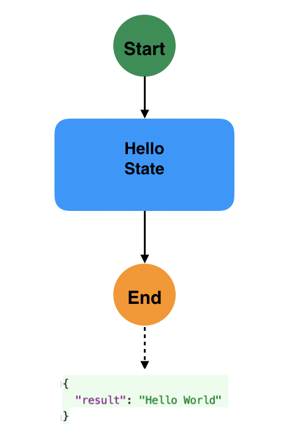
</p>

#### Workflow Definition

<table>
<tr>
    <th>JSON</th>
    <th>YAML</th>
</tr>
<tr>
<td valign="top">

```json
{
"id": "helloworld",
"version": "1.0",
"specVersion": "0.8",
"name": "Hello World Workflow",
"description": "Inject Hello World",
"start": "Hello State",
"states":[
  {
     "name":"Hello State",
     "type":"inject",
     "data": {
        "result": "Hello World!"
     },
     "end": true
  }
]
}
```

</td>
<td valign="top">

```yaml
id: helloworld
version: '1.0'
specVersion: '0.8'
name: Hello World Workflow
description: Inject Hello World
start: Hello State
states:
- name: Hello State
  type: inject
  data:
    result: Hello World!
  end: true
```

</td>
</tr>
</table>

### Greeting Example

#### Description

This example shows a single [Operation State](../specification.md#operation-state) with one action that calls the "greeting" function.
The workflow data input is assumed to be the name of the person to greet:

```json
{
  "person": {
    "name": "John"
  }
}
```

The results of the action is assumed to be the greeting for the provided persons name:

```json
{
   "greeting":  "Welcome to Serverless Workflow, John!"
}
```

Which is added to the states data and becomes the workflow data output.

#### Workflow Diagram

<p align="center">
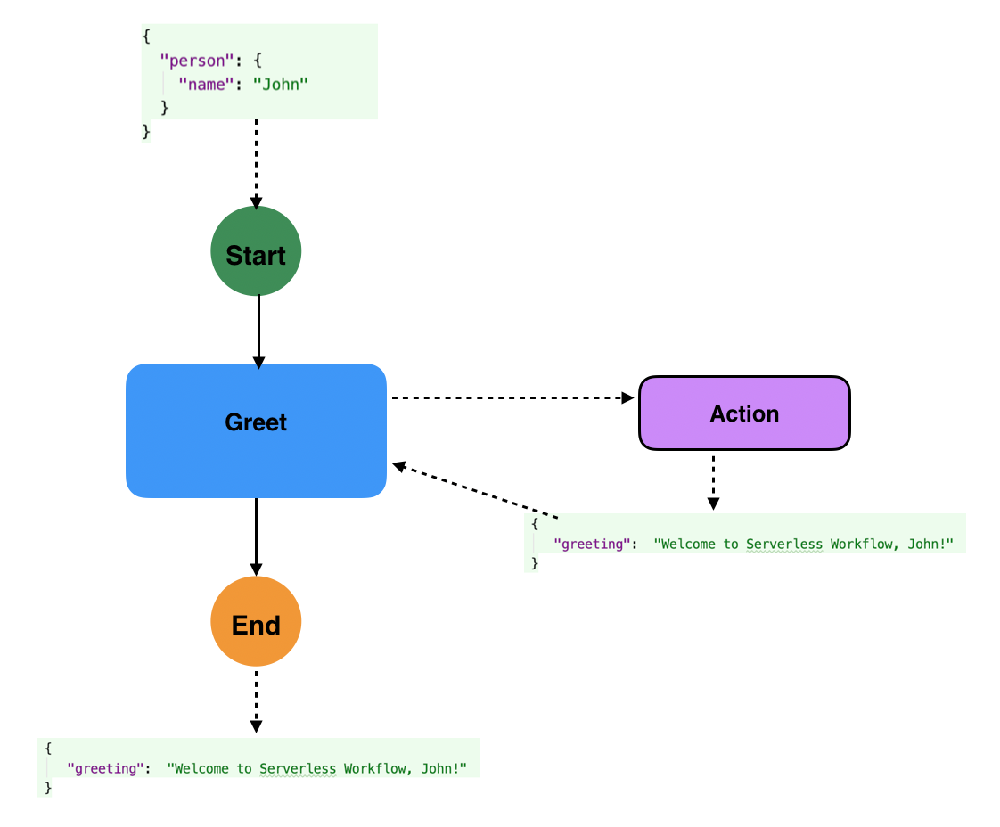
</p>

#### Workflow Definition

<table>
<tr>
    <th>JSON</th>
    <th>YAML</th>
</tr>
<tr>
<td valign="top">

```json
{
"id": "greeting",
"version": "1.0",
"specVersion": "0.8",
"name": "Greeting Workflow",
"description": "Greet Someone",
"start": "Greet",
"functions": [
  {
     "name": "greetingFunction",
     "operation": "file://myapis/greetingapis.json#greeting"
  }
],
"states":[
  {
     "name":"Greet",
     "type":"operation",
     "actions":[
        {
           "functionRef": {
              "refName": "greetingFunction",
              "arguments": {
                "name": "${ .person.name }"
              }
           },
           "actionDataFilter": {
              "results": "${ .greeting }"
           }
        }
     ],
     "end": true
  }
]
}
```

</td>
<td valign="top">

```yaml
id: greeting
version: '1.0'
specVersion: '0.8'
name: Greeting Workflow
description: Greet Someone
start: Greet
functions:
- name: greetingFunction
  operation: file://myapis/greetingapis.json#greeting
states:
- name: Greet
  type: operation
  actions:
  - functionRef:
      refName: greetingFunction
      arguments:
        name: "${ .person.name }"
    actionDataFilter:
      results: "${ .greeting }"
  end: true
```

</td>
</tr>
</table>

### Event Based Greeting Example

#### Description

This example shows a single [Event State](../specification.md#event-state) with one action that calls the "greeting" function.
The event state consumes cloud events of type "greetingEventType". When an even with this type
is consumed, the Event state performs a single action that calls the defined "greeting" function.

For the sake of the example we assume that the cloud event we will consume has the format:

```json
{
    "specversion" : "1.0",
    "type" : "greetingEventType",
    "source" : "greetingEventSource",
    "data" : {
      "greet": {
          "name": "John"
        }
    }
}
```

The results of the action is assumed to be the full greeting for the provided persons name:

```json
{
  "payload": {
    "greeting": "Welcome to Serverless Workflow, John!"
  }
}
```

Note that in the workflow definition you can see two filters defined. The event data filter defined inside the consume element:

```json
{
  "eventDataFilter": {
    "data": "${ .data.greet } "
  }
}
```

which is triggered when the greeting event is consumed. It extracts its "data.greet" of the event data (payload) and
merges it with the state data.

The second, a state data filter, which is defined on the event state itself:

```json
{
  "stateDataFilter": {
     "output": "${ .payload.greeting }"
  }
}
```

filters what is selected to be the state data output which then becomes the workflow data output (as it is an end state):

```text
   "Welcome to Serverless Workflow, John!"
```

#### Workflow Diagram

<p align="center">

</p>

#### Workflow Definition

<table>
<tr>
    <th>JSON</th>
    <th>YAML</th>
</tr>
<tr>
<td valign="top">

```json
{
"id": "eventbasedgreeting",
"version": "1.0",
"specVersion": "0.8",
"name": "Event Based Greeting Workflow",
"description": "Event Based Greeting",
"start": "Greet",
"events": [
 {
  "name": "GreetingEvent",
  "type": "greetingEventType",
  "source": "greetingEventSource"
 }
],
"functions": [
  {
     "name": "greetingFunction",
     "operation": "file://myapis/greetingapis.json#greeting"
  }
],
"states":[
  {
     "name":"Greet",
     "type":"event",
     "onEvents": [{
         "eventRefs": ["GreetingEvent"],
         "eventDataFilter": {
            "data": "${ .greet }",
            "toStateData": "${ .greet }"
         },
         "actions":[
            {
               "functionRef": {
                  "refName": "greetingFunction",
                  "arguments": {
                    "name": "${ .greet.name }"
                  }
               }
            }
         ]
     }],
     "stateDataFilter": {
        "output": "${ .payload.greeting }"
     },
     "end": true
  }
]
}
```

</td>
<td valign="top">

```yaml
id: eventbasedgreeting
version: '1.0'
specVersion: '0.8'
name: Event Based Greeting Workflow
description: Event Based Greeting
start: Greet
events:
- name: GreetingEvent
  type: greetingEventType
  source: greetingEventSource
functions:
- name: greetingFunction
  operation: file://myapis/greetingapis.json#greeting
states:
- name: Greet
  type: event
  onEvents:
  - eventRefs:
    - GreetingEvent
    eventDataFilter:
      data: "${ .greet }"
      toStateData: "${ .greet }"
    actions:
    - functionRef:
        refName: greetingFunction
        arguments:
          name: "${ .greet.name }"
  stateDataFilter:
    output: "${ .payload.greeting }"
  end: true
```

</td>
</tr>
</table>

### Solving Math Problems Example

#### Description

In this example we show how to iterate over data using the [ForEach State](../specification.md#foreach-state).
The state will iterate over a collection of simple math expressions which are
passed in as the workflow data input:

```json
    {
      "expressions": ["2+2", "4-1", "10x3", "20/2"]
    }
```

The ForEach state will execute a single defined operation state for each math expression. The operation
state contains an action which calls a serverless function which actually solves the expression
and returns its result.

Results of all math expressions are accumulated into the data output of the ForEach state which become the final
result of the workflow execution.

#### Workflow Diagram

<p align="center">

</p>

#### Workflow Definition

<table>
<tr>
    <th>JSON</th>
    <th>YAML</th>
</tr>
<tr>
<td valign="top">

```json
{
"id": "solvemathproblems",
"version": "1.0",
"specVersion": "0.8",
"name": "Solve Math Problems Workflow",
"description": "Solve math problems",
"start": "Solve",
"functions": [
{
  "name": "solveMathExpressionFunction",
  "operation": "http://myapis.org/mapthapis.json#solveExpression"
}
],
"states":[
{
 "name":"Solve",
 "type":"foreach",
 "inputCollection": "${ .expressions }",
 "iterationParam": "singleexpression",
 "outputCollection": "${ .results }",
 "actions":[
   {
      "functionRef": {
         "refName": "solveMathExpressionFunction",
         "arguments": {
           "expression": "${ .singleexpression }"
         }
      }
   }
 ],
 "stateDataFilter": {
    "output": "${ .results }"
 },
 "end": true
}
]
}
```

</td>
<td valign="top">

```yaml
id: solvemathproblems
version: '1.0'
specVersion: '0.8'
name: Solve Math Problems Workflow
description: Solve math problems
start: Solve
functions:
- name: solveMathExpressionFunction
  operation: http://myapis.org/mapthapis.json#solveExpression
states:
- name: Solve
  type: foreach
  inputCollection: "${ .expressions }"
  iterationParam: singleexpression
  outputCollection: "${ .results }"
  actions:
  - functionRef:
      refName: solveMathExpressionFunction
      arguments:
        expression: "${ .singleexpression }"
  stateDataFilter:
    output: "${ .results }"
  end: true
```

</td>
</tr>
</table>

### Parallel Execution Example

#### Description

This example uses a [Parallel State](../specification.md#parallel-state) to execute two branches (simple wait states) at the same time.
The completionType type is set to "allOf", which means the parallel state has to wait for both branches
to finish execution before it can transition (end workflow execution in this case as it is an end state).

#### Workflow Diagram

<p align="center">

</p>

#### Workflow Definition

<table>
<tr>
    <th>JSON</th>
    <th>YAML</th>
</tr>
<tr>
<td valign="top">

```json
{
"id": "parallelexec",
"version": "1.0",
"specVersion": "0.8",
"name": "Parallel Execution Workflow",
"description": "Executes two branches in parallel",
"start": "ParallelExec",
"states":[
  {
     "name": "ParallelExec",
     "type": "parallel",
     "completionType": "allOf",
     "branches": [
        {
          "name": "ShortDelayBranch",
          "actions": [{
            "subFlowRef": "shortdelayworkflowid"
          }]
        },
        {
          "name": "LongDelayBranch",
          "actions": [{
            "subFlowRef": "longdelayworkflowid"
          }]
        }
     ],
     "end": true
  }
]
}
```

</td>
<td valign="top">

```yaml
id: parallelexec
version: '1.0'
specVersion: '0.8'
name: Parallel Execution Workflow
description: Executes two branches in parallel
start: ParallelExec
states:
- name: ParallelExec
  type: parallel
  completionType: allOf
  branches:
  - name: ShortDelayBranch
    actions:
    - subFlowRef: shortdelayworkflowid
  - name: LongDelayBranch
    actions:
    - subFlowRef: longdelayworkflowid
  end: true
```

</td>
</tr>
</table>

We assume that the two referenced workflows, namely `shortdelayworkflowid` and `longdelayworkflowid` both include a single delay state,
with the `shortdelayworkflowid` workflow delay state defining its `timeDelay` property to be shorter than that of the `longdelayworkflowid` workflows
delay state.

### Async Function Invocation Example

#### Description

This example uses a [Operation State](../specification.md#operation-state) to invoke a function async. 
This functions sends an email to a customer.
Async function execution is a "fire-and-forget" type of invocation. The function is invoked and workflow execution
does not wait for its results.

#### Workflow Diagram

<p align="center">
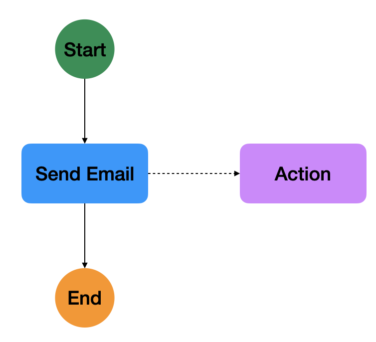
</p>

#### Workflow Definition

<table>
<tr>
    <th>JSON</th>
    <th>YAML</th>
</tr>
<tr>
<td valign="top">

```json
{
 "id": "sendcustomeremail",
 "version": "1.0",
 "specVersion": "0.8",
 "name": "Send customer email workflow",
 "description": "Send email to a customer",
 "start": "Send Email",
 "functions": [
  {
   "name": "emailFunction",
   "operation": "file://myapis/emailapis.json#sendEmail"
  }
 ],
 "states":[
  {
   "name":"Send Email",
   "type":"operation",
   "actions":[
    {
     "functionRef": {
      "invoke": "async",
      "refName": "emailFunction",
      "arguments": {
       "customer": "${ .customer }"
      }
     }
    }
   ],
   "end": true
  }
 ]
}
```

</td>
<td valign="top">

```yaml
id: sendcustomeremail
version: '1.0'
specVersion: '0.8'
name: Send customer email workflow
description: Send email to a customer
start: Send Email
functions:
 - name: emailFunction
   operation: file://myapis/emailapis.json#sendEmail
states:
 - name: Send Email
   type: operation
   actions:
    - functionRef:
       invoke: async
       refName: emailFunction
       arguments:
        customer: "${ .customer }"
   end: true
```

</td>
</tr>
</table>

### Async SubFlow Invocation Example

#### Description

This example uses a [Operation State](../specification.md#operation-state) to invoke a [SubFlow](../specification.md#Subflow-Action) async.
This SubFlow is responsible for performing some customer business logic.
Async SubFlow invocation is a "fire-and-forget" type of invocation. The SubFlow is invoked and workflow execution
does not wait for its results. In addition, we specify that the SubFlow should be allowed to continue its execution 
event if the parent workflow completes its own execution. This is done by defining the actions `onParentComplete`
property to `continue`.

#### Workflow Diagram

<p align="center">
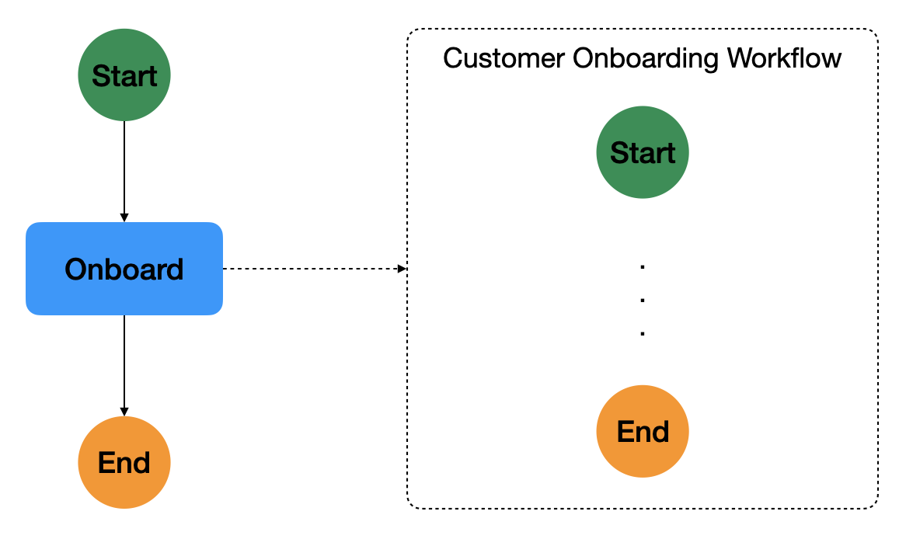
</p>

#### Workflow Definition

<table>
<tr>
    <th>JSON</th>
    <th>YAML</th>
</tr>
<tr>
<td valign="top">

```json
{
 "id": "onboardcustomer",
 "version": "1.0",
 "specVersion": "0.8",
 "name": "Onboard Customer",
 "description": "Onboard a Customer",
 "start": "Onboard",
 "states":[
  {
   "name":"Onboard", 
   "type":"operation",
   "actions":[
    {
     "subFlowRef": {
      "invoke": "async",
      "onParentComplete": "continue",
      "workflowId": "customeronboardingworkflow",
      "version": "1.0"
     }
    }
   ],
   "end": true
  }
 ]
}
```

</td>
<td valign="top">

```yaml
id: onboardcustomer
version: '1.0'
specVersion: '0.8'
name: Onboard Customer
description: Onboard a Customer
start: Onboard
states:
 - name: Onboard
   type: operation
   actions:
    - subFlowRef:
       invoke: async
       onParentComplete: continue
       workflowId: customeronboardingworkflow
       version: '1.0'
   end: true
```

</td>
</tr>
</table>

For the sake of the example, the definition of "customeronboardingworkflow" workflow invoked as a SubFlow 
is not shown. 

### Event Based Transitions Example

#### Description

In this example we use an Event-based [Switch State](../specification.md#switch-state) to wait for arrival
of the "VisaApproved", or "VisaRejected" Cloud Events. Depending on which type of event happens,
the workflow performs a different transition. If none of the events arrive in the defined 1 hour timeout
period, the workflow transitions to the "HandleNoVisaDecision" state.

#### Workflow Diagram

<p align="center">

</p>

#### Workflow Definition

<table>
<tr>
    <th>JSON</th>
    <th>YAML</th>
</tr>
<tr>
<td valign="top">

```json
{
"id": "eventbasedswitchstate",
"version": "1.0",
"specVersion": "0.8",
"name": "Event Based Switch Transitions",
"description": "Event Based Switch Transitions",
"start": "CheckVisaStatus",
"events": [
{
    "name": "visaApprovedEvent",
    "type": "VisaApproved",
    "source": "visaCheckSource"
},
{
    "name": "visaRejectedEvent",
    "type": "VisaRejected",
    "source": "visaCheckSource"
}
],
"states":[
  {
     "name":"CheckVisaStatus",
     "type":"switch",
     "eventConditions": [
        {
          "eventRef": "visaApprovedEvent",
          "transition": "HandleApprovedVisa"
        },
        {
          "eventRef": "visaRejectedEvent",
          "transition": "HandleRejectedVisa"
        }
     ],
     "eventTimeout": "PT1H",
     "defaultCondition": {
        "transition": "HandleNoVisaDecision"
     }
  },
  {
    "name": "HandleApprovedVisa",
    "type": "operation",
    "actions": [
      {
        "subFlowRef": "handleApprovedVisaWorkflowID"
      }
    ],
    "end": true
  },
  {
      "name": "HandleRejectedVisa",
      "type": "operation",
      "actions": [
        {
          "subFlowRef": "handleRejectedVisaWorkflowID"
        }
      ],
      "end": true
  },
  {
      "name": "HandleNoVisaDecision",
      "type": "operation",
      "actions": [
        {
          "subFlowRef": "handleNoVisaDecisionWorkflowId"
        }
      ],
      "end": true
  }
]
}
```

</td>
<td valign="top">

```yaml
id: eventbasedswitchstate
version: '1.0'
specVersion: '0.8'
name: Event Based Switch Transitions
description: Event Based Switch Transitions
start: CheckVisaStatus
events:
- name: visaApprovedEvent
  type: VisaApproved
  source: visaCheckSource
- name: visaRejectedEvent
  type: VisaRejected
  source: visaCheckSource
states:
- name: CheckVisaStatus
  type: switch
  eventConditions:
  - eventRef: visaApprovedEvent
    transition: HandleApprovedVisa
  - eventRef: visaRejectedEvent
    transition: HandleRejectedVisa
  eventTimeout: PT1H
  defaultCondition:
    transition: HandleNoVisaDecision
- name: HandleApprovedVisa
  type: operation
  actions:
    - subFlowRef: handleApprovedVisaWorkflowID
  end: true
- name: HandleRejectedVisa
  type: operation
    actions:
      - subFlowRef: handleRejectedVisaWorkflowID
  end: true
- name: HandleNoVisaDecision
  type: operation
    actions:
      - subFlowRef: handleNoVisaDecisionWorkflowId
  end: true
```

</td>
</tr>
</table>

### Applicant Request Decision Example

#### Description

This example shows off the [Switch State](../specification.md#switch-state) and the subflow action. The workflow is started with application information data as input:

```json
    {
      "applicant": {
        "fname": "John",
        "lname": "Stockton",
        "age": 22,
        "email": "js@something.com"
      }
    }
```

We use the switch state with two conditions to determine if the application should be made based on the applicants age.
If the applicants age is over 18 we start the application (subflow action). Otherwise the workflow notifies the
 applicant of the rejection.

#### Workflow Diagram

<p align="center">

</p>

#### Workflow Definition

<table>
<tr>
    <th>JSON</th>
    <th>YAML</th>
</tr>
<tr>
<td valign="top">

```json
{
   "id": "applicantrequest",
   "version": "1.0",
   "specVersion": "0.8",
   "name": "Applicant Request Decision Workflow",
   "description": "Determine if applicant request is valid",
   "start": "CheckApplication",
   "functions": [
     {
        "name": "sendRejectionEmailFunction",
        "operation": "http://myapis.org/applicationapi.json#emailRejection"
     }
   ],
   "states":[
      {
         "name":"CheckApplication",
         "type":"switch",
         "dataConditions": [
            {
              "condition": "${ .applicants | .age >= 18 }",
              "transition": "StartApplication"
            },
            {
              "condition": "${ .applicants | .age < 18 }",
              "transition": "RejectApplication"
            }
         ],
         "defaultCondition": {
            "transition": "RejectApplication"
         }
      },
      {
        "name": "StartApplication",
        "type": "operation",
        "actions": [
          {
            "subFlowRef": "startApplicationWorkflowId"
          }
        ],
        "end": true
      },
      {
        "name":"RejectApplication",
        "type":"operation",
        "actionMode":"sequential",
        "actions":[
           {
              "functionRef": {
                 "refName": "sendRejectionEmailFunction",
                 "arguments": {
                   "applicant": "${ .applicant }"
                 }
              }
           }
        ],
        "end": true
    }
   ]
}
```

</td>
<td valign="top">

```yaml
id: applicantrequest
version: '1.0'
specVersion: '0.8'
name: Applicant Request Decision Workflow
description: Determine if applicant request is valid
start: CheckApplication
functions:
- name: sendRejectionEmailFunction
  operation: http://myapis.org/applicationapi.json#emailRejection
states:
- name: CheckApplication
  type: switch
  dataConditions:
  - condition: "${ .applicants | .age >= 18 }"
    transition: StartApplication
  - condition: "${ .applicants | .age < 18 }"
    transition: RejectApplication
  defaultCondition:
    transition: RejectApplication
- name: StartApplication
  type: operation
  actions:
    - subFlowRef: startApplicationWorkflowId
  end: true
- name: RejectApplication
  type: operation
  actionMode: sequential
  actions:
  - functionRef:
      refName: sendRejectionEmailFunction
      arguments:
        applicant: "${ .applicant }"
  end: true
```

</td>
</tr>
</table>

### Provision Orders Example

#### Description

In this example we show off the states error handling capability. The workflow data input that's passed in contains
missing order information that causes the function in the "ProvisionOrder" state to throw a runtime exception. With the "onErrors" definition we
can transition the workflow to different error handling states. Each type of error
in this example is handled by simple delay states. If no errors are encountered the workflow can transition to the "ApplyOrder" state.

Workflow data is assumed to me:

```json
    {
      "order": {
        "id": "",
        "item": "laptop",
        "quantity": "10"
      }
    }
```

The data output of the workflow contains the information of the exception caught during workflow execution.

#### Workflow Diagram

<p align="center">

</p>

#### Workflow Definition

<table>
<tr>
    <th>JSON</th>
    <th>YAML</th>
</tr>
<tr>
<td valign="top">

```json
{
"id": "provisionorders",
"version": "1.0",
"specVersion": "0.8",
"name": "Provision Orders",
"description": "Provision Orders and handle errors thrown",
"start": "ProvisionOrder",
"functions": [
  {
     "name": "provisionOrderFunction",
     "operation": "http://myapis.org/provisioningapi.json#doProvision"
  }
],
"errors": [
 {
  "name": "Missing order id"
 },
 {
  "name": "Missing order item"
 },
 {
  "name": "Missing order quantity"
 }
],
"states":[
  {
    "name":"ProvisionOrder",
    "type":"operation",
    "actionMode":"sequential",
    "actions":[
       {
          "functionRef": {
             "refName": "provisionOrderFunction",
             "arguments": {
               "order": "${ .order }"
             }
          }
       }
    ],
    "stateDataFilter": {
       "output": "${ .exceptions }"
    },
    "transition": "ApplyOrder",
    "onErrors": [
       {
         "errorRef": "Missing order id",
         "transition": "MissingId"
       },
       {
         "errorRef": "Missing order item",
         "transition": "MissingItem"
       },
       {
        "errorRef": "Missing order quantity",
        "transition": "MissingQuantity"
       }
    ]
},
{
   "name": "MissingId",
   "type": "operation",
   "actions": [
     {
       "subFlowRef": "handleMissingIdExceptionWorkflow"
     }
   ],
   "end": true
},
{
   "name": "MissingItem",
   "type": "operation",
   "actions": [
     {
       "subFlowRef": "handleMissingItemExceptionWorkflow"
     }
   ],
   "end": true
},
{
   "name": "MissingQuantity",
   "type": "operation",
   "actions": [
     {
       "subFlowRef": "handleMissingQuantityExceptionWorkflow"
     }
   ],
   "end": true
},
{
   "name": "ApplyOrder",
   "type": "operation",
   "actions": [
     {
       "subFlowRef": "applyOrderWorkflowId"
     }
   ],
   "end": true
}
]
}
```

</td>
<td valign="top">

```yaml
id: provisionorders
version: '1.0'
specVersion: '0.8'
name: Provision Orders
description: Provision Orders and handle errors thrown
start: ProvisionOrder
functions:
 - name: provisionOrderFunction
   operation: http://myapis.org/provisioningapi.json#doProvision
errors:
 - name: Missing order id
 - name: Missing order item
 - name: Missing order quantity
states:
 - name: ProvisionOrder
   type: operation
   actionMode: sequential
   actions:
    - functionRef:
       refName: provisionOrderFunction
       arguments:
        order: "${ .order }"
   stateDataFilter:
    output: "${ .exceptions }"
   transition: ApplyOrder
   onErrors:
    - errorRef: Missing order id
      transition: MissingId
    - errorRef: Missing order item
      transition: MissingItem
    - errorRef: Missing order quantity
      transition: MissingQuantity
 - name: MissingId
   type: operation
   actions:
    - subFlowRef: handleMissingIdExceptionWorkflow
   end: true
 - name: MissingItem
   type: operation
   actions:
    - subFlowRef: handleMissingItemExceptionWorkflow
   end: true
 - name: MissingQuantity
   type: operation
   actions:
    - subFlowRef: handleMissingQuantityExceptionWorkflow
   end: true
 - name: ApplyOrder
   type: operation
   actions:
    - subFlowRef: applyOrderWorkflowId
   end: true
```

</td>
</tr>
</table>

### Monitor Job Example

#### Description

In this example we submit a job via an operation state action (serverless function call). It is assumed that it takes some time for
the submitted job to complete and that it's completion can be checked via another separate serverless function call.

To check for completion we first wait 5 seconds and then get the results of the "CheckJob" serverless function.
Depending on the results of this we either return the results or transition back to waiting and checking the job completion.
This is done until the job submission returns "SUCCEEDED" or "FAILED" and the job submission results are reported before workflow
finishes execution.

In the case job submission raises a runtime error, we transition to an Operation state which invokes
 a sub-flow responsible for handling the job submission issue.

#### Workflow Diagram

<p align="center">
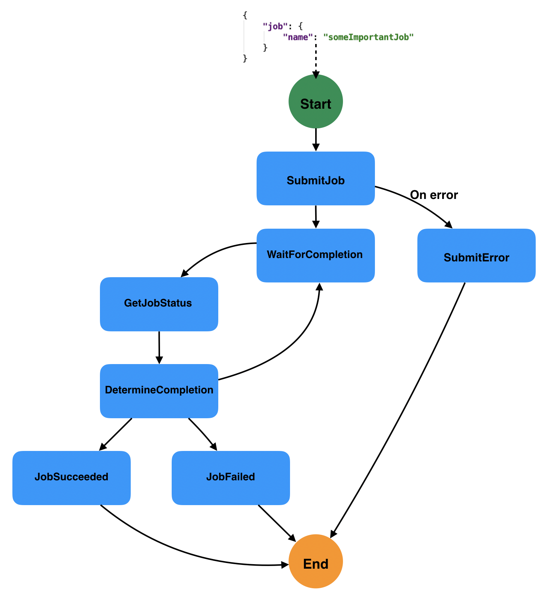
</p>

#### Workflow Definition

<table>
<tr>
    <th>JSON</th>
    <th>YAML</th>
</tr>
<tr>
<td valign="top">

```json
{
  "id": "jobmonitoring",
  "version": "1.0",
  "specVersion": "0.8",
  "name": "Job Monitoring",
  "description": "Monitor finished execution of a submitted job",
  "start": "SubmitJob",
  "functions": [
    {
      "name": "submitJob",
      "operation": "http://myapis.org/monitorapi.json#doSubmit"
    },
    {
      "name": "checkJobStatus",
      "operation": "http://myapis.org/monitorapi.json#checkStatus"
    },
    {
      "name": "reportJobSuceeded",
      "operation": "http://myapis.org/monitorapi.json#reportSucceeded"
    },
    {
      "name": "reportJobFailed",
      "operation": "http://myapis.org/monitorapi.json#reportFailure"
    }
  ],
  "states":[
    {
      "name":"SubmitJob",
      "type":"operation",
      "actionMode":"sequential",
      "actions":[
      {
          "functionRef": {
            "refName": "submitJob",
            "arguments": {
              "name": "${ .job.name }"
            }
          },
          "actionDataFilter": {
            "results": "${ .jobuid }"
          }
      }
      ],
      "stateDataFilter": {
          "output": "${ .jobuid }"
      },
      "transition": "WaitForCompletion"
  },
  {
      "name": "WaitForCompletion",
      "type": "sleep",
      "duration": "PT5S",
      "transition": "GetJobStatus"
  },
  {
      "name":"GetJobStatus",
      "type":"operation",
      "actionMode":"sequential",
      "actions":[
      {
        "functionRef": {
            "refName": "checkJobStatus",
            "arguments": {
              "name": "${ .jobuid }"
            }
          },
          "actionDataFilter": {
            "results": "${ .jobstatus }"
          }
      }
      ],
      "stateDataFilter": {
          "output": "${ .jobstatus }"
      },
      "transition": "DetermineCompletion"
  },
  {
    "name":"DetermineCompletion",
    "type":"switch",
    "dataConditions": [
      {
        "condition": "${ .jobStatus == \"SUCCEEDED\" }",
        "transition": "JobSucceeded"
      },
      {
        "condition": "${ .jobStatus == \"FAILED\" }",
        "transition": "JobFailed"
      }
    ],
    "defaultCondition": {
      "transition": "WaitForCompletion"
    }
  },
  {
      "name":"JobSucceeded",
      "type":"operation",
      "actionMode":"sequential",
      "actions":[
      {
        "functionRef": {
            "refName": "reportJobSuceeded",
            "arguments": {
              "name": "${ .jobuid }"
            }
        }
      }
      ],
      "end": true
  },
  {
    "name":"JobFailed",
    "type":"operation",
    "actionMode":"sequential",
    "actions":[
    {
        "functionRef": {
          "refName": "reportJobFailed",
          "arguments": {
            "name": "${ .jobuid }"
          }
        }
    }
    ],
    "end": true
  }
  ]
}
```

</td>
<td valign="top">

```yaml
id: jobmonitoring
version: '1.0'
specVersion: '0.8'
name: Job Monitoring
description: Monitor finished execution of a submitted job
start: SubmitJob
functions:
 - name: submitJob
   operation: http://myapis.org/monitorapi.json#doSubmit
 - name: checkJobStatus
   operation: http://myapis.org/monitorapi.json#checkStatus
 - name: reportJobSuceeded
   operation: http://myapis.org/monitorapi.json#reportSucceeded
 - name: reportJobFailed
   operation: http://myapis.org/monitorapi.json#reportFailure
states:
 - name: SubmitJob
   type: operation
   actionMode: sequential
   actions:
    - functionRef:
       refName: submitJob
       arguments:
        name: "${ .job.name }"
      actionDataFilter:
       results: "${ .jobuid }"
   stateDataFilter:
    output: "${ .jobuid }"
   transition: WaitForCompletion
 - name: WaitForCompletion
   type: sleep
   duration: PT5S
   transition: GetJobStatus
 - name: GetJobStatus
   type: operation
   actionMode: sequential
   actions:
    - functionRef:
       refName: checkJobStatus
       arguments:
        name: "${ .jobuid }"
      actionDataFilter:
       results: "${ .jobstatus }"
   stateDataFilter:
    output: "${ .jobstatus }"
   transition: DetermineCompletion
 - name: DetermineCompletion
   type: switch
   dataConditions:
    - condition: ${ .jobStatus == "SUCCEEDED" }
      transition: JobSucceeded
    - condition: ${ .jobStatus == "FAILED" }
      transition: JobFailed
   defaultCondition:
    transition: WaitForCompletion
 - name: JobSucceeded
   type: operation
   actionMode: sequential
   actions:
    - functionRef:
       refName: reportJobSuceeded
       arguments:
        name: "${ .jobuid }"
   end: true
 - name: JobFailed
   type: operation
   actionMode: sequential
   actions:
    - functionRef:
       refName: reportJobFailed
       arguments:
        name: "${ .jobuid }"
   end: true
```

</td>
</tr>
</table>

### Send CloudEvent On Workflow Completion Example

#### Description

This example shows how we can produce a CloudEvent on completion of a workflow. Let's say we have the following
workflow data containing orders that need to be provisioned by our workflow:

```json
{
  "orders": [{
    "id": "123",
    "item": "laptop",
    "quantity": "10"
  },
  {
      "id": "456",
      "item": "desktop",
      "quantity": "4"
    }]
}
```

Our workflow in this example uses a ForEach state to provision the orders in parallel. The "provisionOrder" function
used is assumed to have the following results:

```json
{
   "id": "123",
   "outcome": "SUCCESS"
}
```

After orders have been provisioned the ForEach states defines the end property which stops workflow execution.
It defines its end definition to be of type "event" in which case a CloudEvent will be produced which can be consumed
by other orchestration workflows or other interested consumers.

Note that we define the event to be produced in the workflows "events" property.

The data attached to the event contains the information on provisioned orders by this workflow. So the produced
CloudEvent upon completion of the workflow could look like:

```json
{
  "specversion" : "1.0",
  "type" : "provisionCompleteType",
  "datacontenttype" : "application/json",
  ...
  "data": {
    "provisionedOrders": [
        {
          "id": "123",
          "outcome": "SUCCESS"
        },
        {
          "id": "456",
          "outcome": "FAILURE"
        }
      ]
  }
}
```

#### Workflow Diagram

<p align="center">

</p>

#### Workflow Definition

<table>
<tr>
    <th>JSON</th>
    <th>YAML</th>
</tr>
<tr>
<td valign="top">

```json
{
"id": "sendcloudeventonprovision",
"version": "1.0",
"specVersion": "0.8",
"name": "Send CloudEvent on provision completion",
"start": "ProvisionOrdersState",
"events": [
{
    "name": "provisioningCompleteEvent",
    "type": "provisionCompleteType",
    "kind": "produced"
}
],
"functions": [
{
    "name": "provisionOrderFunction",
    "operation": "http://myapis.org/provisioning.json#doProvision"
}
],
"states": [
{
    "name": "ProvisionOrdersState",
    "type": "foreach",
    "inputCollection": "${ .orders }",
    "iterationParam": "singleorder",
    "outputCollection": "${ .provisionedOrders }",
    "actions": [
        {
            "functionRef": {
                "refName": "provisionOrderFunction",
                "arguments": {
                    "order": "${ .singleorder }"
                }
            }
        }
    ],
    "end": {
        "produceEvents": [{
            "eventRef": "provisioningCompleteEvent",
            "data": "${ .provisionedOrders }"
        }]
    }
}
]
}
```

</td>
<td valign="top">

```yaml
id: sendcloudeventonprovision
version: '1.0'
specVersion: '0.8'
name: Send CloudEvent on provision completion
start: ProvisionOrdersState
events:
- name: provisioningCompleteEvent
  type: provisionCompleteType
  kind: produced
functions:
- name: provisionOrderFunction
  operation: http://myapis.org/provisioning.json#doProvision
states:
- name: ProvisionOrdersState
  type: foreach
  inputCollection: "${ .orders }"
  iterationParam: singleorder
  outputCollection: "${ .provisionedOrders }"
  actions:
  - functionRef:
      refName: provisionOrderFunction
      arguments:
        order: "${ .singleorder }"
  end:
    produceEvents:
    - eventRef: provisioningCompleteEvent
      data: "${ .provisionedOrders }"
```

</td>
</tr>
</table>

### Monitor Patient Vital Signs Example

#### Description

In this example a hospital patient is monitored by a Vial Sign Monitoring system. This device can produce three different Cloud Events, namely
"High Body Temperature", "High Blood Pressure", and "High Respiration Rate".
Our workflow which needs to take proper actions depending on the event the Vital Sign Monitor produces needs to start
if any of these events occur. For each of these events a new instance of the workflow is started.

Since the hospital may include many patients that are being monitored it is assumed that all events include a patientId context attribute in the event
 message. We can use the value of this context attribute to associate the incoming events with the same patient as well as
 use the patient id to pass as parameter to the functions called by event activities. Here is an example of such event:

```json
{
    "specversion" : "1.0",
    "type" : "org.monitor.highBodyTemp",
    "source" : "monitoringSource",
    "subject" : "BodyTemperatureReading",
    "id" : "A234-1234-1234",
    "time" : "2020-01-05T17:31:00Z",
    "patientId" : "PID-12345",
    "data" : {
      "value": "98.6F"
    }
}
```

As you can see the "patientId" context attribute of the event includes our correlation key which is the unique
patient id. If we set it to be the correlation key in our events definition, all events that are considered must
have the matching patient id.

#### Workflow Diagram

<p align="center">

</p>

#### Workflow Definition

<table>
<tr>
    <th>JSON</th>
    <th>YAML</th>
</tr>
<tr>
<td valign="top">

```json
{
"id": "patientVitalsWorkflow",
"name": "Monitor Patient Vitals",
"version": "1.0",
"specVersion": "0.8",
"start": "MonitorVitals",
"events": [
{
    "name": "HighBodyTemperature",
    "type": "org.monitor.highBodyTemp",
    "source": "monitoringSource",
    "correlation": [
      {
        "contextAttributeName": "patientId"
      }
    ]
},
{
    "name": "HighBloodPressure",
    "type": "org.monitor.highBloodPressure",
    "source": "monitoringSource",
    "correlation": [
      {
        "contextAttributeName": "patientId"
      }
    ]
},
{
    "name": "HighRespirationRate",
    "type": "org.monitor.highRespirationRate",
    "source": "monitoringSource",
    "correlation": [
      {
        "contextAttributeName": "patientId"
      }
    ]
}
],
"functions": [
{
    "name": "callPulmonologist",
    "operation": "http://myapis.org/patientapis.json#callPulmonologist"
},
{
    "name": "sendTylenolOrder",
    "operation": "http://myapis.org/patientapis.json#tylenolOrder"
},
{
    "name": "callNurse",
    "operation": "http://myapis.org/patientapis.json#callNurse"
}
],
"states": [
{
"name": "MonitorVitals",
"type": "event",
"exclusive": true,
"onEvents": [{
        "eventRefs": ["HighBodyTemperature"],
        "actions": [{
            "functionRef": {
                "refName": "sendTylenolOrder",
                "arguments": {
                    "patientid": "${ .patientId }"
                }
            }
        }]
    },
    {
        "eventRefs": ["HighBloodPressure"],
        "actions": [{
            "functionRef": {
                "refName": "callNurse",
                "arguments": {
                    "patientid": "${ .patientId }"
                }
            }
        }]
    },
    {
        "eventRefs": ["HighRespirationRate"],
        "actions": [{
            "functionRef": {
                "refName": "callPulmonologist",
                "arguments": {
                    "patientid": "${ .patientId }"
                }
            }
        }]
    }
],
"end": {
    "terminate": true
}
}]
}
```

</td>
<td valign="top">

```yaml
id: patientVitalsWorkflow
name: Monitor Patient Vitals
version: '1.0'
specVersion: '0.8'
start: MonitorVitals
events:
- name: HighBodyTemperature
  type: org.monitor.highBodyTemp
  source: monitoringSource
  correlation:
  - contextAttributeName: patientId
- name: HighBloodPressure
  type: org.monitor.highBloodPressure
  source: monitoringSource
  correlation:
  - contextAttributeName: patientId
- name: HighRespirationRate
  type: org.monitor.highRespirationRate
  source: monitoringSource
  correlation:
  - contextAttributeName: patientId
functions:
- name: callPulmonologist
  operation: http://myapis.org/patientapis.json#callPulmonologist
- name: sendTylenolOrder
  operation: http://myapis.org/patientapis.json#tylenolOrder
- name: callNurse
  operation: http://myapis.org/patientapis.json#callNurse
states:
- name: MonitorVitals
  type: event
  exclusive: true
  onEvents:
  - eventRefs:
    - HighBodyTemperature
    actions:
    - functionRef:
        refName: sendTylenolOrder
        arguments:
          patientid: "${ .patientId }"
  - eventRefs:
    - HighBloodPressure
    actions:
    - functionRef:
        refName: callNurse
        arguments:
          patientid: "${ .patientId }"
  - eventRefs:
    - HighRespirationRate
    actions:
    - functionRef:
        refName: callPulmonologist
        arguments:
          patientid: "${ .patientId }"
  end:
    terminate: true
```

</td>
</tr>
</table>

### Finalize College Application Example

#### Description

In this example our workflow is instantiated when all requirements of a college application are completed.
These requirements include a student submitting an application, the college receiving the students SAT scores, as well
as a student recommendation letter from a former teacher.

We assume three Cloud Events "ApplicationSubmitted", "SATScoresReceived" and "RecommendationLetterReceived".
Each include the applicant id in their "applicantId" context attribute, so we can use it to associate these events with an individual applicant.

Our workflow is instantiated and performs the actions to finalize the college application for a student only
when all three of these events happened (in no particular order).

#### Workflow Diagram

<p align="center">

</p>

#### Workflow Definition

<table>
<tr>
    <th>JSON</th>
    <th>YAML</th>
</tr>
<tr>
<td valign="top">

```json
{
"id": "finalizeCollegeApplication",
"name": "Finalize College Application",
"version": "1.0",
"specVersion": "0.8",
"start": "FinalizeApplication",
"events": [
{
    "name": "ApplicationSubmitted",
    "type": "org.application.submitted",
    "source": "applicationsource",
    "correlation": [
    {
      "contextAttributeName": "applicantId"
    }
   ]
},
{
    "name": "SATScoresReceived",
    "type": "org.application.satscores",
    "source": "applicationsource",
    "correlation": [
      {
      "contextAttributeName": "applicantId"
      }
    ]
},
{
    "name": "RecommendationLetterReceived",
    "type": "org.application.recommendationLetter",
    "source": "applicationsource",
    "correlation": [
      {
      "contextAttributeName": "applicantId"
      }
    ]
}
],
"functions": [
{
    "name": "finalizeApplicationFunction",
    "operation": "http://myapis.org/collegeapplicationapi.json#finalize"
}
],
"states": [
{
    "name": "FinalizeApplication",
    "type": "event",
    "exclusive": false,
    "onEvents": [
        {
            "eventRefs": [
                "ApplicationSubmitted",
                "SATScoresReceived",
                "RecommendationLetterReceived"
            ],
            "actions": [
                {
                    "functionRef": {
                        "refName": "finalizeApplicationFunction",
                        "arguments": {
                            "student": "${ .applicantId }"
                        }
                    }
                }
            ]
        }
    ],
    "end": {
        "terminate": true
    }
}
]
}
```

</td>
<td valign="top">

```yaml
id: finalizeCollegeApplication
name: Finalize College Application
version: '1.0'
specVersion: '0.8'
start: FinalizeApplication
events:
- name: ApplicationSubmitted
  type: org.application.submitted
  source: applicationsource
  correlation:
  - contextAttributeName: applicantId
- name: SATScoresReceived
  type: org.application.satscores
  source: applicationsource
  correlation:
  - contextAttributeName: applicantId
- name: RecommendationLetterReceived
  type: org.application.recommendationLetter
  source: applicationsource
  correlation:
  - contextAttributeName: applicantId
functions:
- name: finalizeApplicationFunction
  operation: http://myapis.org/collegeapplicationapi.json#finalize
states:
- name: FinalizeApplication
  type: event
  exclusive: false
  onEvents:
  - eventRefs:
    - ApplicationSubmitted
    - SATScoresReceived
    - RecommendationLetterReceived
    actions:
    - functionRef:
        refName: finalizeApplicationFunction
        arguments:
          student: "${ .applicantId }"
  end:
    terminate: true
```

</td>
</tr>
</table>

### Perform Customer Credit Check Example

#### Description

In this example our serverless workflow needs to integrate with an external microservice to perform
a credit check. We assume that this external microservice notifies a human actor which has to make
the approval decision based on customer information. Once this decision is made the service emits a CloudEvent which
includes the decision information as part of its payload.
The workflow waits for this callback event and then triggers workflow transitions based on the
credit check decision results.

The workflow data input is assumed to be:

```json
{
  "customer": {
    "id": "customer123",
    "name": "John Doe",
    "SSN": 123456,
    "yearlyIncome": 50000,
    "address": "123 MyLane, MyCity, MyCountry",
    "employer": "MyCompany"
  }
}
```

The callback event that our workflow will wait on is assumed to have the following formats.
For approved credit check, for example:

```json
{
  "specversion" : "1.0",
  "type" : "creditCheckCompleteType",
  "datacontenttype" : "application/json",
  ...
  "data": {
    "creditCheck": [
        {
          "id": "customer123",
          "score": 700,
          "decision": "Approved",
          "reason": "Good credit score"
        }
      ]
  }
}
```

And for denied credit check, for example:

```json
{
  "specversion" : "1.0",
  "type" : "creditCheckCompleteType",
  "datacontenttype" : "application/json",
  ...
  "data": {
    "creditCheck": [
        {
          "id": "customer123",
          "score": 580,
          "decision": "Denied",
          "reason": "Low credit score. Recent late payments"
        }
      ]
  }
}
```

#### Workflow Diagram

<p align="center">

</p>

#### Workflow Definition

<table>
<tr>
    <th>JSON</th>
    <th>YAML</th>
</tr>
<tr>
<td valign="top">

```json
{
    "id": "customercreditcheck",
    "version": "1.0",
    "specVersion": "0.8",
    "name": "Customer Credit Check Workflow",
    "description": "Perform Customer Credit Check",
    "start": "CheckCredit",
    "functions": [
        {
            "name": "creditCheckFunction",
            "operation": "http://myapis.org/creditcheckapi.json#doCreditCheck"
        },
        {
            "name": "sendRejectionEmailFunction",
            "operation": "http://myapis.org/creditcheckapi.json#rejectionEmail"
        }
    ],
    "events": [
        {
            "name": "CreditCheckCompletedEvent",
            "type": "creditCheckCompleteType",
            "source": "creditCheckSource",
            "correlation": [
              {
                "contextAttributeName": "customerId"
              }
           ]
        }
    ],
    "states": [
        {
            "name": "CheckCredit",
            "type": "callback",
            "action": {
                "functionRef": {
                    "refName": "callCreditCheckMicroservice",
                    "arguments": {
                        "customer": "${ .customer }"
                    }
                }
            },
            "eventRef": "CreditCheckCompletedEvent",
            "timeouts": {
              "stateExecTimeout": "PT15M"
            },
            "transition": "EvaluateDecision"
        },
        {
            "name": "EvaluateDecision",
            "type": "switch",
            "dataConditions": [
                {
                    "condition": "${ .creditCheck | .decision == \"Approved\" }",
                    "transition": "StartApplication"
                },
                {
                    "condition": "${ .creditCheck | .decision == \"Denied\" }",
                    "transition": "RejectApplication"
                }
            ],
            "defaultCondition": {
               "transition": "RejectApplication"
            }
        },
        {
            "name": "StartApplication",
            "type": "operation",
            "actions": [
              {
                "subFlowRef": "startApplicationWorkflowId"
              }
            ],
            "end": true
        },
        {
            "name": "RejectApplication",
            "type": "operation",
            "actionMode": "sequential",
            "actions": [
                {
                    "functionRef": {
                        "refName": "sendRejectionEmailFunction",
                        "arguments": {
                            "applicant": "${ .customer }"
                        }
                    }
                }
            ],
            "end": true
        }
    ]
}
```

</td>
<td valign="top">

```yaml
id: customercreditcheck
version: '1.0'
specVersion: '0.8'
name: Customer Credit Check Workflow
description: Perform Customer Credit Check
start: CheckCredit
functions:
- name: creditCheckFunction
  operation: http://myapis.org/creditcheckapi.json#doCreditCheck
- name: sendRejectionEmailFunction
  operation: http://myapis.org/creditcheckapi.json#rejectionEmail
events:
- name: CreditCheckCompletedEvent
  type: creditCheckCompleteType
  source: creditCheckSource
  correlation:
  - contextAttributeName: customerId
states:
- name: CheckCredit
  type: callback
  action:
    functionRef:
      refName: callCreditCheckMicroservice
      arguments:
        customer: "${ .customer }"
  eventRef: CreditCheckCompletedEvent
  timeouts:
    stateExecTimeout: PT15M
  transition: EvaluateDecision
- name: EvaluateDecision
  type: switch
  dataConditions:
  - condition: ${ .creditCheck | .decision == "Approved" }
    transition: StartApplication
  - condition: ${ .creditCheck | .decision == "Denied" }
    transition: RejectApplication
  defaultCondition:
    transition: RejectApplication
- name: StartApplication
  type: operation
  actions:
  - subFlowRef: startApplicationWorkflowId
  end: true
- name: RejectApplication
  type: operation
  actionMode: sequential
  actions:
  - functionRef:
      refName: sendRejectionEmailFunction
      arguments:
        applicant: "${ .customer }"
  end: true
```

</td>
</tr>
</table>

### Handle Car Auction Bids Example

#### Description

In this example our serverless workflow needs to handle bits for an online car auction. The car auction has a specific start
and end time. Bids are only allowed to be made during this time period. All bids before or after this time should not be considered.
We assume that the car auction starts at 9am UTC on March 20th 2020 and ends at 3pm UTC on March 20th 2020.

Bidding is done via an online application and bids are received as events are assumed to have the following format:

```json
{
  "specversion" : "1.0",
  "type" : "carBidType",
  "datacontenttype" : "application/json",
  ...
  "data": {
    "bid": [
        {
          "carid": "car123",
          "amount": 3000,
          "bidder": {
            "id": "xyz",
            "firstName": "John",
            "lastName": "Wayne"
          }
        }
      ]
  }
}
```

#### Workflow Diagram

<p align="center">

</p>

#### Workflow Definition

<table>
<tr>
    <th>JSON</th>
    <th>YAML</th>
</tr>
<tr>
<td valign="top">

```json
{
    "id": "handleCarAuctionBid",
    "version": "1.0",
    "specVersion": "0.8",
    "name": "Car Auction Bidding Workflow",
    "description": "Store a single bid whole the car auction is active",
    "start": {
      "stateName": "StoreCarAuctionBid",
      "schedule": "R/PT2H"
    },
    "functions": [
        {
            "name": "StoreBidFunction",
            "operation": "http://myapis.org/carauctionapi.json#storeBid"
        }
    ],
    "events": [
        {
            "name": "CarBidEvent",
            "type": "carBidMadeType",
            "source": "carBidEventSource"
        }
    ],
    "states": [
        {
          "name": "StoreCarAuctionBid",
          "type": "event",
          "exclusive": true,
          "onEvents": [
            {
                "eventRefs": ["CarBidEvent"],
                "actions": [{
                    "functionRef": {
                        "refName": "StoreBidFunction",
                        "arguments": {
                            "bid": "${ .bid }"
                        }
                    }
                }]
            }
          ],
          "end": true
        }
    ]
}
```

</td>
<td valign="top">

```yaml
id: handleCarAuctionBid
version: '1.0'
specVersion: '0.8'
name: Car Auction Bidding Workflow
description: Store a single bid whole the car auction is active
start:
  stateName: StoreCarAuctionBid
  schedule: R/PT2H
functions:
- name: StoreBidFunction
  operation: http://myapis.org/carauctionapi.json#storeBid
events:
- name: CarBidEvent
  type: carBidMadeType
  source: carBidEventSource
states:
- name: StoreCarAuctionBid
  type: event
  exclusive: true
  onEvents:
  - eventRefs:
    - CarBidEvent
    actions:
    - functionRef:
        refName: StoreBidFunction
        arguments:
          bid: "${ .bid }"
  end: true
```

</td>
</tr>
</table>

### Check Inbox Periodically

#### Description

In this example we show the use of scheduled cron-based start event property. The example workflow checks the users inbox every 15 minutes
and send them a text message when there are important emails.

The results of the inbox service called is expected to be for example:

```json
{
    "messages": [
    {
      "title": "Update your health benefits",
      "from": "HR",
      "priority": "high"
    },
    {
      "title": "New job candidate resume",
      "from": "Recruiting",
      "priority": "medium"
    },
    ...
   ]
}
```

#### Workflow Diagram

<p align="center">

</p>

#### Workflow Definition

<table>
<tr>
    <th>JSON</th>
    <th>YAML</th>
</tr>
<tr>
<td valign="top">

```json
{
"id": "checkInbox",
"name": "Check Inbox Workflow",
"version": "1.0",
"specVersion": "0.8",
"description": "Periodically Check Inbox",
"start": {
    "stateName": "CheckInbox",
    "schedule": {
        "cron": "0 0/15 * * * ?"
    }
},
"functions": [
    {
        "name": "checkInboxFunction",
        "operation": "http://myapis.org/inboxapi.json#checkNewMessages"
    },
    {
        "name": "sendTextFunction",
        "operation": "http://myapis.org/inboxapi.json#sendText"
    }
],
"states": [
    {
        "name": "CheckInbox",
        "type": "operation",
        "actionMode": "sequential",
        "actions": [
            {
                "functionRef": "checkInboxFunction"
            }
        ],
        "transition": "SendTextForHighPriority"
    },
    {
        "name": "SendTextForHighPriority",
        "type": "foreach",
        "inputCollection": "${ .messages }",
        "iterationParam": "singlemessage",
        "actions": [
            {
                "functionRef": {
                    "refName": "sendTextFunction",
                    "arguments": {
                        "message": "${ .singlemessage }"
                    }
                }
            }
        ],
        "end": true
    }
]
}
```

</td>
<td valign="top">

```yaml
id: checkInbox
name: Check Inbox Workflow
description: Periodically Check Inbox
version: '1.0'
specVersion: '0.8'
start:
  stateName: CheckInbox
  schedule:
    cron: 0 0/15 * * * ?
functions:
- name: checkInboxFunction
  operation: http://myapis.org/inboxapi.json#checkNewMessages
- name: sendTextFunction
  operation: http://myapis.org/inboxapi.json#sendText
states:
- name: CheckInbox
  type: operation
  actionMode: sequential
  actions:
  - functionRef: checkInboxFunction
  transition: SendTextForHighPriority
- name: SendTextForHighPriority
  type: foreach
  inputCollection: "${ .messages }"
  iterationParam: singlemessage
  actions:
  - functionRef:
      refName: sendTextFunction
      arguments:
        message: "${ .singlemessage }"
  end: true
```

</td>
</tr>
</table>

### Event Based Service Invocation

#### Description

In this example we want to make a Veterinary appointment for our dog Mia. The vet service can be invoked only
via an event, and its completion results with the appointment day and time is returned via an event as well.

This shows a common scenario especially inside container environments where some services may not be exposed via
a resource URI, but only accessible by submitting an event to the underlying container events manager.

For this example we assume that that payload of the Vet service response event includes an "appointment"
object which contains our appointment info.

This info is then filtered to become the workflow data output. It could also be used to for example send us an
appointment email, a text message reminder, etc.

For this example we assume that the workflow instance is started given the following workflow data input:

```json
    {
      "patientInfo": {
        "name": "Mia",
        "breed": "German Shepherd",
        "age": 5,
        "reason": "Bee sting",
        "patientId": "Mia1"
      }
    }
```

#### Workflow Diagram

<p align="center">
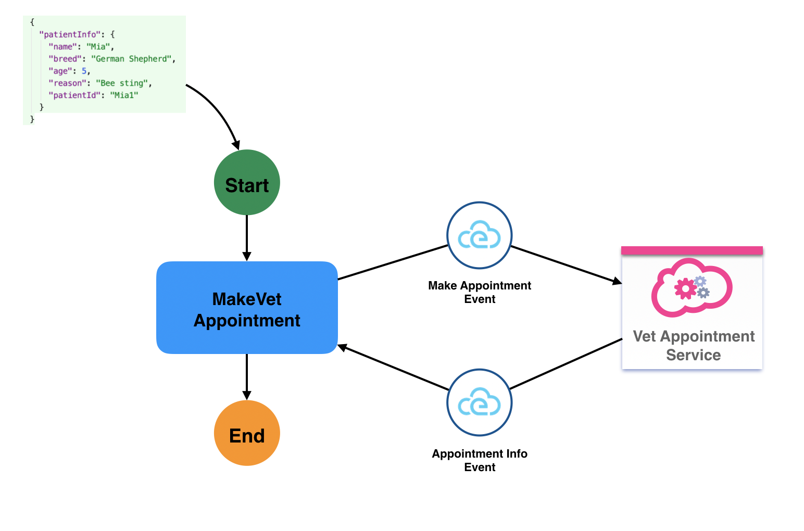
</p>

#### Workflow Definition

<table>
<tr>
    <th>JSON</th>
    <th>YAML</th>
</tr>
<tr>
<td valign="top">

```json
{
    "id": "VetAppointmentWorkflow",
    "name": "Vet Appointment Workflow",
    "description": "Vet service call via events",
    "version": "1.0",
    "specVersion": "0.8",
    "start": "MakeVetAppointmentState",
    "events": [
        {
            "name": "MakeVetAppointment",
            "source": "VetServiceSource",
            "type": "events.vet.appointments",
            "kind": "produced"
        },
        {
            "name": "VetAppointmentInfo",
            "source": "VetServiceSource",
            "type": "events.vet.appointments",
            "kind": "consumed"
        }
    ],
    "states": [
        {
            "name": "MakeVetAppointmentState",
            "type": "operation",
            "actions": [
                {
                    "name": "MakeAppointmentAction",
                    "eventRef": {
                       "triggerEventRef": "MakeVetAppointment",
                       "data": "${ .patientInfo }",
                       "resultEventRef":  "VetAppointmentInfo"
                    },
                    "actionDataFilter": {
                        "results": "${ .appointmentInfo }"
                    }
                }
            ],
            "timeouts": {
              "actionExecTimeout": "PT15M"
            },
            "end": true
        }
    ]
}
```

</td>
<td valign="top">

```yaml
id: VetAppointmentWorkflow
name: Vet Appointment Workflow
description: Vet service call via events
version: '1.0'
specVersion: '0.8'
start: MakeVetAppointmentState
events:
 - name: MakeVetAppointment
   source: VetServiceSource
   type: events.vet.appointments
   kind: produced
 - name: VetAppointmentInfo
   source: VetServiceSource
   type: events.vet.appointments
   kind: consumed
states:
 - name: MakeVetAppointmentState
   type: operation
   actions:
    - name: MakeAppointmentAction
      eventRef:
       triggerEventRef: MakeVetAppointment
       data: "${ .patientInfo }"
       resultEventRef: VetAppointmentInfo
      actionDataFilter:
       results: "${ .appointmentInfo }"
   timeouts:
    actionExecTimeout: PT15M
   end: true
```

</td>
</tr>
</table>

### Reusing Function And Event Definitions

#### Description

This example shows how [function](../specification.md#Function-Definition) and [event](../specification.md#Event-Definition) definitions
can be declared independently and referenced by workflow definitions.
This is useful when you would like to reuse event and function definitions across multiple workflows. In those scenarios it allows you to make
changed/updates to these definitions in a single place without having to modify multiple workflows.

For the example we have two files, namely our "functiondefs.json" and "eventdefs.yml" (to show that they can be expressed in either JSON or YAML).
These hold our function and event definitions which then can be referenced by multiple workflows.

* functiondefs.json

```json
{
  "functions": [
      {
        "name": "checkFundsAvailability",
        "operation": "file://myapis/billingapis.json#checkFunds"
      },
      {
        "name": "sendSuccessEmail",
        "operation": "file://myapis/emailapis.json#paymentSuccess"
      },
      {
        "name": "sendInsufficientFundsEmail",
        "operation": "file://myapis/emailapis.json#paymentInsufficientFunds"
      }
    ]
}
```

* eventdefs.yml

```yaml
events:
- name: PaymentReceivedEvent
  type: payment.receive
  source: paymentEventSource
  correlation:
  - contextAttributeName: accountId
- name: ConfirmationCompletedEvent
  type: payment.confirmation
  kind: produced

```

In our workflow definition then we can reference these files rather than defining function and events in-line.

#### Workflow Diagram

<p align="center">
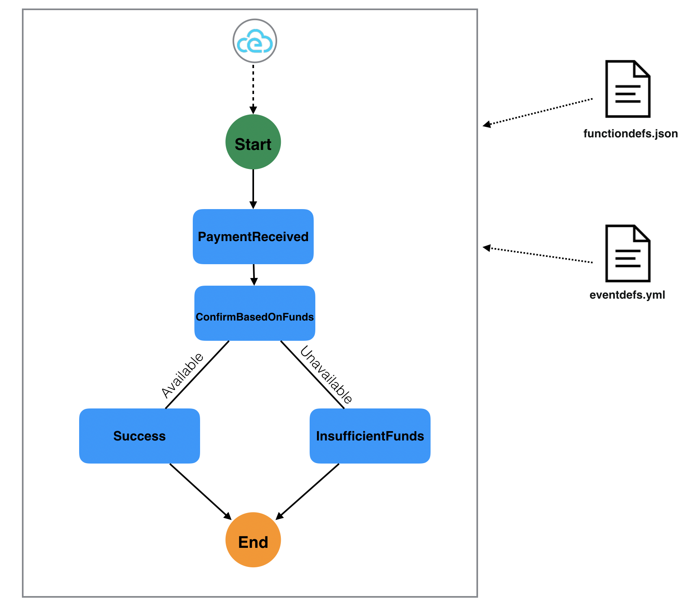
</p>

#### Workflow Definitions

<table>
<tr>
    <th>JSON</th>
    <th>YAML</th>
</tr>
<tr>
<td valign="top">

```json
{
  "id": "paymentconfirmation",
  "version": "1.0",
  "specVersion": "0.8",
  "name": "Payment Confirmation Workflow",
  "description": "Performs Payment Confirmation",
  "functions": "functiondefs.json",
  "events": "eventdefs.yml",
  "states": [
    {
      "name": "PaymentReceived",
      "type": "event",
      "onEvents": [
        {
          "eventRefs": [
            "PaymentReceivedEvent"
          ],
          "actions": [
            {
              "name": "checkfunds",
              "functionRef": {
                "refName": "checkFundsAvailability",
                "arguments": {
                  "account": "${ .accountId }",
                  "paymentamount": "${ .payment.amount }"
                }
              }
            }
          ]
        }
      ],
      "transition": "ConfirmBasedOnFunds"
    },
    {
      "name": "ConfirmBasedOnFunds",
      "type": "switch",
      "dataConditions": [
        {
          "condition": "${ .funds | .available == \"true\" }",
          "transition": "SendPaymentSuccess"
        },
        {
          "condition": "${ .funds | .available == \"false\" }",
          "transition": "SendInsufficientResults"
        }
      ],
      "defaultCondition": {
        "transition": "SendPaymentSuccess"
      }
    },
    {
      "name": "SendPaymentSuccess",
      "type": "operation",
      "actions": [
        {
          "functionRef": {
            "refName": "sendSuccessEmail",
            "arguments": {
              "applicant": "${ .customer }"
            }
          }
        }
      ],
      "end": {
        "produceEvents": [
          {
            "eventRef": "ConfirmationCompletedEvent",
            "data": "${ .payment }"
          }
        ]
      }
    },
    {
      "name": "SendInsufficientResults",
      "type": "operation",
      "actions": [
        {
          "functionRef": {
            "refName": "sendInsufficientFundsEmail",
            "arguments": {
              "applicant": "${ .customer }"
            }
          }
        }
      ],
      "end": {
        "produceEvents": [
          {
            "eventRef": "ConfirmationCompletedEvent",
            "data": "${ .payment }"
          }
        ]
      }
    }
  ]
}
```

</td>
<td valign="top">

```yaml
id: paymentconfirmation
version: '1.0'
specVersion: '0.8'
name: Payment Confirmation Workflow
description: Performs Payment Confirmation
functions: functiondefs.json
events: eventdefs.yml
states:
- name: PaymentReceived
  type: event
  onEvents:
  - eventRefs:
    - PaymentReceivedEvent
    actions:
    - name: checkfunds
      functionRef:
        refName: checkFundsAvailability
        arguments:
          account: "${ .accountId }"
          paymentamount: "${ .payment.amount }"
  transition: ConfirmBasedOnFunds
- name: ConfirmBasedOnFunds
  type: switch
  dataConditions:
  - condition: "${ .funds | .available == \"true\" }"
    transition: SendPaymentSuccess
  - condition: "${ .funds | .available == \"false\" }"
    transition: SendInsufficientResults
  defaultCondition:
    transition: SendPaymentSuccess
- name: SendPaymentSuccess
  type: operation
  actions:
  - functionRef:
      refName: sendSuccessEmail
      arguments:
        applicant: "${ .customer }"
  end:
    produceEvents:
    - eventRef: ConfirmationCompletedEvent
      data: "${ .payment }"
- name: SendInsufficientResults
  type: operation
  actions:
  - functionRef:
      refName: sendInsufficientFundsEmail
      arguments:
        applicant: "${ .customer }"
  end:
    produceEvents:
    - eventRef: ConfirmationCompletedEvent
      data: "${ .payment }"
```

</td>
</tr>
</table>

### New Patient Onboarding

#### Description

In this example we want to use a workflow to onboard a new patient (at a hospital for example).
To onboard a patient our workflow is invoked via a "NewPatientEvent" event. This events payload contains the
patient information, for example:

```json
{
  "name": "John",
  "condition": "chest pains"
}
```

When this event is received we want to create a new workflow instance and invoke three services
sequentially. The first service we want to invoke is responsible to store patient information,
second is to assign a doctor to a patient given the patient condition, and third to assign a
new appoitment with the patient and the assigned doctor.

In addition, in this example we need to handle a possible situation where one or all of the needed
services are not available (the server returns a http 503 (Service Unavailable) error). If our workflow
catches this error, we want to try to recover from this by issuing retries for the particular
service invocation that caused the error up to 10 times with three seconds in-between retries.
If the retries are not successful, we want to just gracefully end workflow execution.

#### Workflow Diagram

<p align="center">
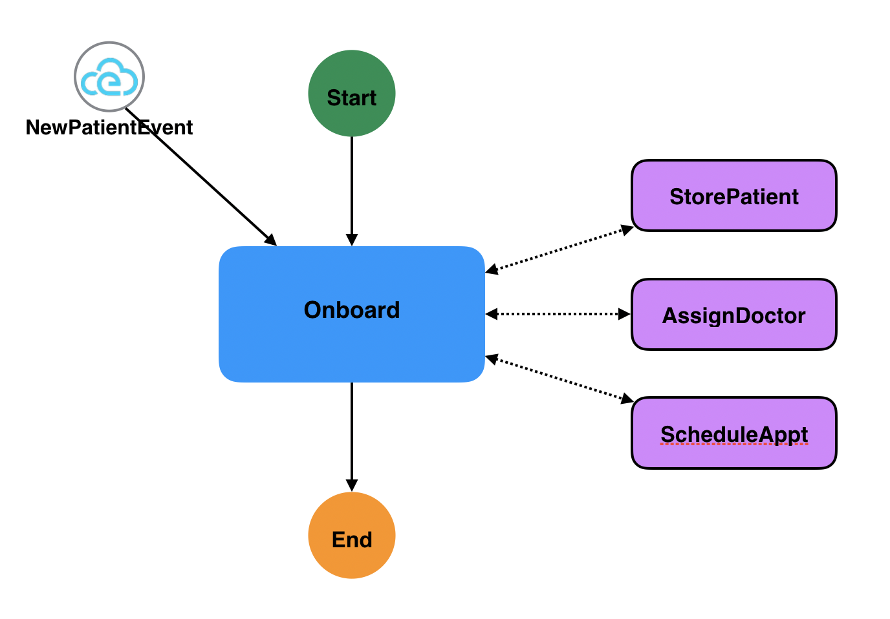
</p>

#### Workflow Definition

<table>
<tr>
    <th>JSON</th>
    <th>YAML</th>
</tr>
<tr>
<td valign="top">

```json
{
  "id": "patientonboarding",
  "name": "Patient Onboarding Workflow",
  "version": "1.0",
  "specVersion": "0.8",
  "start": "Onboard",
  "states": [
    {
      "name": "Onboard",
      "type": "event",
      "onEvents": [
        {
          "eventRefs": [
            "NewPatientEvent"
          ],
          "actions": [
            {
              "functionRef": "StorePatient",
              "retryRef": "ServicesNotAvailableRetryStrategy",
              "retryableErrors": ["ServiceNotAvailable"]
            },
            {
              "functionRef": "AssignDoctor",
              "retryRef": "ServicesNotAvailableRetryStrategy",
              "retryableErrors": ["ServiceNotAvailable"]
            },
            {
              "functionRef": "ScheduleAppt",
              "retryRef": "ServicesNotAvailableRetryStrategy",
              "retryableErrors": ["ServiceNotAvailable"]
            }
          ]
        }
      ],
      "onErrors": [
        {
          "errorRef": "ServiceNotAvailable",
          "end": true
        }
      ],
      "end": true
    }
  ],
  "events": [
    {
      "name": "StorePatient",
      "type": "new.patients.event",
      "source": "newpatient/+"
    }
  ],
  "functions": [
    {
      "name": "StoreNewPatientInfo",
      "operation": "api/services.json#addPatient"
    },
    {
      "name": "AssignDoctor",
      "operation": "api/services.json#assignDoctor"
    },
    {
      "name": "ScheduleAppt",
      "operation": "api/services.json#scheduleAppointment"
    }
  ],
  "errors": [
   {
    "name": "ServiceNotAvailable",
    "code": "503"
   }
  ],
  "retries": [
    {
      "name": "ServicesNotAvailableRetryStrategy",
      "delay": "PT3S",
      "maxAttempts": 10
    }
  ]
}
```

</td>
<td valign="top">

```yaml
id: patientonboarding
name: Patient Onboarding Workflow
version: '1.0'
specVersion: '0.8'
start: Onboard
states:
 - name: Onboard
   type: event
   onEvents:
    - eventRefs:
       - NewPatientEvent
      actions:
       - functionRef: StorePatient
         retryRef: ServicesNotAvailableRetryStrategy
         retryableErrors:
         - ServiceNotAvailable
       - functionRef: AssignDoctor
         retryRef: ServicesNotAvailableRetryStrategy
         retryableErrors:
         - ServiceNotAvailable
       - functionRef: ScheduleAppt
         retryRef: ServicesNotAvailableRetryStrategy
         retryableErrors:
        - ServiceNotAvailable
   onErrors:
    - errorRef: ServiceNotAvailable
      end: true
   end: true
events:
 - name: StorePatient
   type: new.patients.event
   source: newpatient/+
functions:
 - name: StoreNewPatientInfo
   operation: api/services.json#addPatient
 - name: AssignDoctor
   operation: api/services.json#assignDoctor
 - name: ScheduleAppt
   operation: api/services.json#scheduleAppointment
errors:
 - name: ServiceNotAvailable
   code: '503'
retries:
 - name: ServicesNotAvailableRetryStrategy
   delay: PT3S
   maxAttempts: 10
```

</td>
</tr>
</table>

#### Workflow Demo

This example is used in our Serverless Workflow Hands-on series videos [#1](https://www.youtube.com/watch?v=0gmpuGLP-_o)
and [#2](https://www.youtube.com/watch?v=6A6OYp5nygg).

### Purchase order deadline

#### Description

In this example our workflow processes purchase orders. An order event triggers instance of our workflow.
To complete the created order, our workflow must first wait for an order confirmation event (correlated to the
order id), and then wait for the shipment sent event (also correlated to initial order id).
We do not want to place an exact timeout limit for waiting for the confirmation and shipment events,
as this might take a different amount of time depending on the size of the order. However we do have the requirement
that a total amount of time for the order to be confirmed, once its created, is 30 days.
If the created order is not completed within 30 days it needs to be automatically closed.

This example shows the use of the workflow [execTimeout definition](../specification.md#ExecTimeout-Definition).

#### Workflow Diagram

<p align="center">
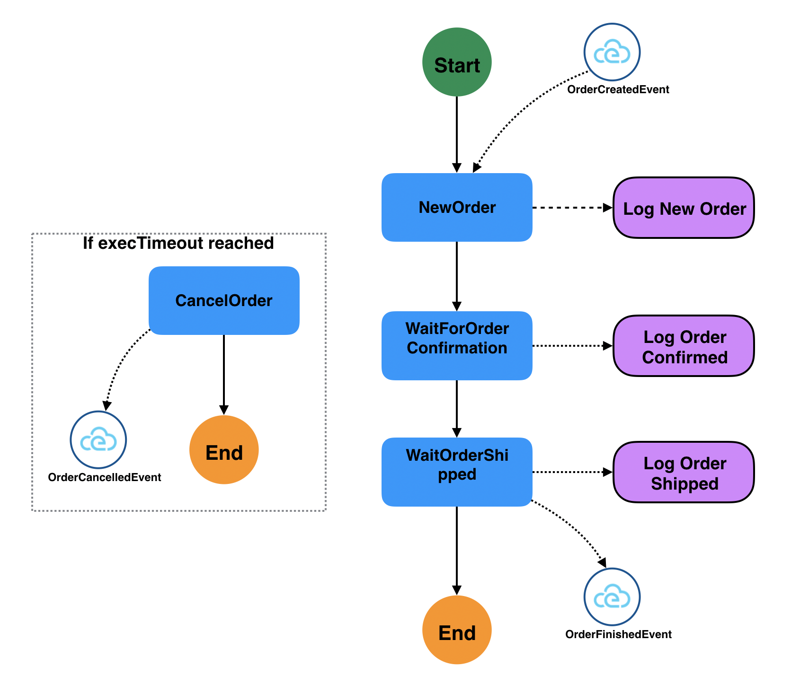
</p>

#### Workflow Definition

<table>
<tr>
    <th>JSON</th>
    <th>YAML</th>
</tr>
<tr>
<td valign="top">

```json
{
  "id": "order",
  "name": "Purchase Order Workflow",
  "version": "1.0",
  "specVersion": "0.8",
  "start": "StartNewOrder",
  "timeouts": {
    "workflowExecTimeout": {
      "duration": "PT30D",
      "runBefore": "CancelOrder"
    }
  },
  "states": [
    {
      "name": "StartNewOrder",
      "type": "event",
      "onEvents": [
        {
          "eventRefs": ["OrderCreatedEvent"],
          "actions": [
            {
              "functionRef": {
                "refName": "LogNewOrderCreated"
              }
            }
          ]
        }
      ],
      "transition": {
        "nextState": "WaitForOrderConfirmation"
      }
    },
    {
      "name": "WaitForOrderConfirmation",
      "type": "event",
      "onEvents": [
        {
          "eventRefs": ["OrderConfirmedEvent"],
          "actions": [
            {
              "functionRef": {
                "refName": "LogOrderConfirmed"
              }
            }
          ]
        }
      ],
      "transition": {
        "nextState": "WaitOrderShipped"
      }
    },
    {
      "name": "WaitOrderShipped",
      "type": "event",
      "onEvents": [
        {
          "eventRefs": ["ShipmentSentEvent"],
          "actions": [
            {
              "functionRef": {
                "refName": "LogOrderShipped"
              }
            }
          ]
        }
      ],
      "end": {
        "terminate": true,
        "produceEvents": [
          {
            "eventRef": "OrderFinishedEvent"
          }
        ]
      }
    },
    {
      "name": "CancelOrder",
      "type": "operation",
      "actions": [
        {
          "functionRef": {
            "refName": "CancelOrder"
          }
        }
      ],
      "end": {
        "terminate": true,
        "produceEvents": [
          {
            "eventRef": "OrderCancelledEvent"
          }
        ]
      }
    }
  ],
  "events": [
    {
      "name": "OrderCreatedEvent",
      "type": "my.company.orders",
      "source": "/orders/new",
      "correlation": [
        {
          "contextAttributeName": "orderid"
        }
      ]
    },
    {
      "name": "OrderConfirmedEvent",
      "type": "my.company.orders",
      "source": "/orders/confirmed",
      "correlation": [
        {
          "contextAttributeName": "orderid"
        }
      ]
    },
    {
      "name": "ShipmentSentEvent",
      "type": "my.company.orders",
      "source": "/orders/shipped",
      "correlation": [
        {
          "contextAttributeName": "orderid"
        }
      ]
    },
    {
      "name": "OrderFinishedEvent",
      "type": "my.company.orders",
      "kind": "produced"
    },
    {
      "name": "OrderCancelledEvent",
      "type": "my.company.orders",
      "kind": "produced"
    }
  ],
  "functions": [
    {
      "name": "LogNewOrderCreated",
      "operation": "http.myorg.io/ordersservices.json#logcreated"
    },
    {
      "name": "LogOrderConfirmed",
      "operation": "http.myorg.io/ordersservices.json#logconfirmed"
    },
    {
      "name": "LogOrderShipped",
      "operation": "http.myorg.io/ordersservices.json#logshipped"
    },
    {
      "name": "CancelOrder",
      "operation": "http.myorg.io/ordersservices.json#calcelorder"
    }
  ]
}
```

</td>
<td valign="top">

```yaml
id: order
name: Purchase Order Workflow
version: '1.0'
specVersion: '0.8'
start: StartNewOrder

timeouts:
  workflowExecTimeout:
    duration: PT30D
    runBefore: CancelOrder
states:
- name: StartNewOrder
  type: event
  onEvents:
  - eventRefs:
    - OrderCreatedEvent
    actions:
    - functionRef:
        refName: LogNewOrderCreated
  transition:
    nextState: WaitForOrderConfirmation
- name: WaitForOrderConfirmation
  type: event
  onEvents:
  - eventRefs:
    - OrderConfirmedEvent
    actions:
    - functionRef:
        refName: LogOrderConfirmed
  transition:
    nextState: WaitOrderShipped
- name: WaitOrderShipped
  type: event
  onEvents:
  - eventRefs:
    - ShipmentSentEvent
    actions:
    - functionRef:
        refName: LogOrderShipped
  end:
    terminate: true
    produceEvents:
    - eventRef: OrderFinishedEvent
- name: CancelOrder
  type: operation
  actions:
  - functionRef:
      refName: CancelOrder
  end:
    terminate: true
    produceEvents:
    - eventRef: OrderCancelledEvent
events:
- name: OrderCreatedEvent
  type: my.company.orders
  source: "/orders/new"
  correlation:
  - contextAttributeName: orderid
- name: OrderConfirmedEvent
  type: my.company.orders
  source: "/orders/confirmed"
  correlation:
  - contextAttributeName: orderid
- name: ShipmentSentEvent
  type: my.company.orders
  source: "/orders/shipped"
  correlation:
  - contextAttributeName: orderid
- name: OrderFinishedEvent
  type: my.company.orders
  kind: produced
- name: OrderCancelledEvent
  type: my.company.orders
  kind: produced
functions:
- name: LogNewOrderCreated
  operation: http.myorg.io/ordersservices.json#logcreated
- name: LogOrderConfirmed
  operation: http.myorg.io/ordersservices.json#logconfirmed
- name: LogOrderShipped
  operation: http.myorg.io/ordersservices.json#logshipped
- name: CancelOrder
  operation: http.myorg.io/ordersservices.json#calcelorder
```

</td>
</tr>
</table>

### Accumulate room readings

#### Description

In this example we have two IoT sensors for each room in our house. One reads temperature values
and the other humidity values of each room. We get these measurements for each of our rooms
as CloudEvents. We can correlate events send by our sensors by the room it is in.

For the example we want to accumulate the temperature and humidity values for each and send hourly reports
to the home owner for each room.

**Note:** In this example each rooms measurements will be accumulated by a single workflow instance per room.
Once we receive events for 1 hour (per room) each of the room-based workflow instances will create the report. Events
consumed after the report is created will trigger a new instance of our workflow (again, per room), accumulate
the data for an hour, send report, and so on.

#### Workflow Diagram

<p align="center">
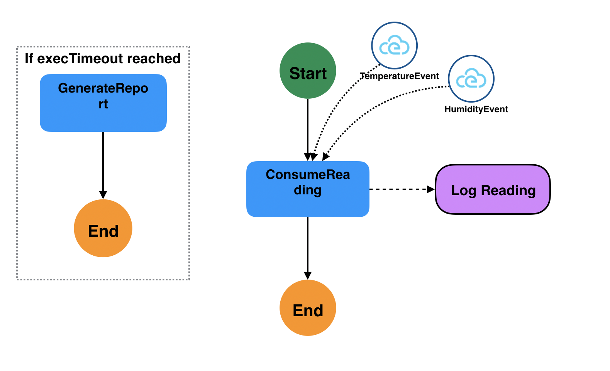
</p>

#### Workflow Definition

<table>
<tr>
    <th>JSON</th>
    <th>YAML</th>
</tr>
<tr>
<td valign="top">

```json
{
  "id": "roomreadings",
  "name": "Room Temp and Humidity Workflow",
  "version": "1.0",
  "specVersion": "0.8",
  "start": "ConsumeReading",
  "timeouts": {
    "workflowExecTimeout": {
      "duration": "PT1H",
      "runBefore": "GenerateReport"
    }
  },
  "keepActive": true,
  "states": [
    {
      "name": "ConsumeReading",
      "type": "event",
      "onEvents": [
        {
          "eventRefs": ["TemperatureEvent", "HumidityEvent"],
          "actions": [
            {
              "functionRef": {
                "refName": "LogReading"
              }
            }
          ],
          "eventDataFilter": {
            "toStateData": "${ .readings }"
          }
        }
      ],
      "end": true
    },
    {
      "name": "GenerateReport",
      "type": "operation",
      "actions": [
        {
          "functionRef": {
            "refName": "ProduceReport",
            "arguments": {
              "data": "${ .readings }"
            }
          }
        }
      ],
      "end": {
        "terminate": true
      }
    }
  ],
  "events": [
    {
      "name": "TemperatureEvent",
      "type": "my.home.sensors",
      "source": "/home/rooms/+",
      "correlation": [
        {
          "contextAttributeName": "roomId"
        }
      ]
    },
    {
      "name": "HumidityEvent",
      "type": "my.home.sensors",
      "source": "/home/rooms/+",
      "correlation": [
        {
          "contextAttributeName": "roomId"
        }
      ]
    }
  ],
  "functions": [
    {
      "name": "LogReading",
      "operation": "http.myorg.io/ordersservices.json#logreading"
    },
    {
      "name": "ProduceReport",
      "operation": "http.myorg.io/ordersservices.json#produceReport"
    }
  ]
}
```

</td>
<td valign="top">

```yaml
id: roomreadings
name: Room Temp and Humidity Workflow
version: '1.0'
specVersion: '0.8'
start: ConsumeReading
timeouts:
  workflowExecTimeout:
    duration: PT1H
    runBefore: GenerateReport
keepActive: true
states:
- name: ConsumeReading
  type: event
  onEvents:
  - eventRefs:
    - TemperatureEvent
    - HumidityEvent
    actions:
    - functionRef:
        refName: LogReading
    eventDataFilter:
      toStateData: "${ .readings }"
  end: true
- name: GenerateReport
  type: operation
  actions:
  - functionRef:
      refName: ProduceReport
      arguments:
        data: "${ .readings }"
  end:
    terminate: true
events:
- name: TemperatureEvent
  type: my.home.sensors
  source: "/home/rooms/+"
  correlation:
  - contextAttributeName: roomId
- name: HumidityEvent
  type: my.home.sensors
  source: "/home/rooms/+"
  correlation:
  - contextAttributeName: roomId
functions:
- name: LogReading
  operation: http.myorg.io/ordersservices.json#logreading
- name: ProduceReport
  operation: http.myorg.io/ordersservices.json#produceReport
```

</td>
</tr>
</table>

### Car Vitals Checks

#### Description

In this example we need to check car vital signs while our car is driving.
The workflow should start when we receive the "CarTurnedOnEvent" event and stop when the "CarTurnedOffEvent" event is consumed.
While the car is driving our workflow should repeatedly check the vitals every 1 second.

For this example we use the workflow [SubFlow](../specification.md#SubFlow-Action) actions to perform the vital checks.

#### Workflow Diagram

<p align="center">
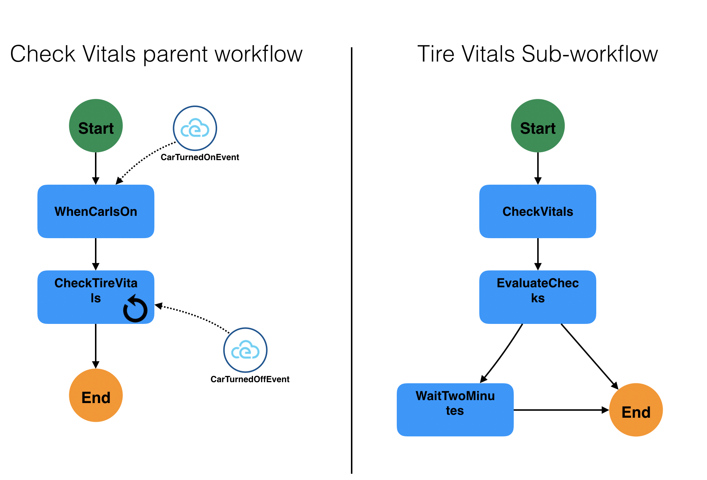
</p>

#### Workflow Definition

We fist define our top-level workflow for this example:

<table>
<tr>
    <th>JSON</th>
    <th>YAML</th>
</tr>
<tr>
<td valign="top">

```json
{
 "id": "checkcarvitals",
 "name": "Check Car Vitals Workflow",
 "version": "1.0",
 "specVersion": "0.8",
 "start": "WhenCarIsOn",
 "states": [
  {
   "name": "WhenCarIsOn",
   "type": "event",
   "onEvents": [
    {
     "eventRefs": ["CarTurnedOnEvent"]
    }
   ],
   "transition": "DoCarVitalChecks"
  },
  {
   "name": "DoCarVitalChecks",
   "type": "operation",
   "actions": [
    {
     "subFlowRef": "vitalscheck",
     "sleep": {
      "after": "PT1S"
     }
    }
   ],
   "transition": "CheckContinueVitalChecks"
  },
  {
   "name": "CheckContinueVitalChecks",
   "type": "switch",
   "eventConditions": [
    {
     "name": "Car Turned Off Condition",
     "eventRef": "CarTurnedOffEvent",
     "end": true
    }
   ],
   "defaultCondition": {
    "transition": "DoCarVitalChecks"
   }
  }
 ],
 "events": [
  {
   "name": "CarTurnedOnEvent",
   "type": "car.events",
   "source": "my/car"
  },
  {
   "name": "CarTurnedOffEvent",
   "type": "car.events",
   "source": "my/car"
  }
 ]
}
```

</td>
<td valign="top">

```yaml
id: checkcarvitals
name: Check Car Vitals Workflow
version: '1.0'
specVersion: '0.8'
start: WhenCarIsOn
states:
 - name: WhenCarIsOn
   type: event
   onEvents:
    - eventRefs:
       - CarTurnedOnEvent
   transition: DoCarVitalChecks
 - name: DoCarVitalChecks
   type: operation
   actions:
    - subFlowRef: vitalscheck
      sleep:
       after: PT1S
   transition: CheckContinueVitalChecks
 - name: CheckContinueVitalChecks
   type: switch
   eventConditions:
    - name: Car Turned Off Condition
      eventRef: CarTurnedOffEvent
      end: true
   defaultCondition:
    transition: DoCarVitalChecks
events:
 - name: CarTurnedOnEvent
   type: car.events
   source: my/car
 - name: CarTurnedOffEvent
   type: car.events
   source: my/car
```

</td>
</tr>
</table>

And then our reusable sub-workflow which performs the checking of our car vitals:

<table>
<tr>
    <th>JSON</th>
    <th>YAML</th>
</tr>
<tr>
<td valign="top">

```json
{
 "id": "vitalscheck",
 "name": "Car Vitals Check",
 "version": "1.0",
 "specVersion": "0.8",
 "start": "CheckVitals",
 "states": [
  {
   "name": "CheckVitals",
   "type": "operation",
   "actions": [
    {
     "functionRef": "Check Tire Pressure"
    },
    {
     "functionRef": "Check Oil Pressure"
    },
    {
     "functionRef": "Check Coolant Level"
    },
    {
     "functionRef": "Check Battery"
    }
   ],
   "end": {
    "produceEvents": [
     {
      "eventRef": "DisplayChecksOnDashboard",
      "data": "${ .evaluations }"
     }
    ]

   }
  }
 ],
 "functions": [
  {
   "name": "checkTirePressure",
   "operation": "mycarservices.json#checktirepressure"
  },
  {
   "name": "checkOilPressure",
   "operation": "mycarservices.json#checkoilpressure"
  },
  {
   "name": "checkCoolantLevel",
   "operation": "mycarservices.json#checkcoolantlevel"
  },
  {
   "name": "checkBattery",
   "operation": "mycarservices.json#checkbattery"
  }
 ]
}
```

</td>
<td valign="top">

```yaml
id: vitalscheck
name: Car Vitals Check
version: '1.0'
specVersion: '0.8'
start: CheckVitals
states:
 - name: CheckVitals
   type: operation
   actions:
    - functionRef: Check Tire Pressure
    - functionRef: Check Oil Pressure
    - functionRef: Check Coolant Level
    - functionRef: Check Battery
   end:
    produceEvents:
     - eventRef: DisplayChecksOnDashboard
       data: "${ .evaluations }"
functions:
 - name: checkTirePressure
   operation: mycarservices.json#checktirepressure
 - name: checkOilPressure
   operation: mycarservices.json#checkoilpressure
 - name: checkCoolantLevel
   operation: mycarservices.json#checkcoolantlevel
 - name: checkBattery
   operation: mycarservices.json#checkbattery
```

</td>
</tr>
</table>

### Book Lending

#### Description

In this example we want to create a book lending workflow. The workflow starts when a lender
submits a book lending request (via event "Book Lending Request Event").
The workflow describes our business logic around lending a book, from checking its current availability,
to waiting on the lender's response if the book is currently not available, to checking out the book and notifying
the lender.

This example expects the "Book Lending Request Event" event to have a payload of for example:

```json
{
    "book": {
        "title": " ... ",
        "id": " ... "
    },
    "lender": {
        "name": "John Doe",
        "address": " ... ",
        "phone": " ... "
    }
}
```

where the "book" property defines the book to be lent out, and the "lender" property provides info
about the person wanting to lend the book.

For the sake of the example we assume the functions and event definitions are defined in separate JSON files.

#### Workflow Diagram

<p align="center">
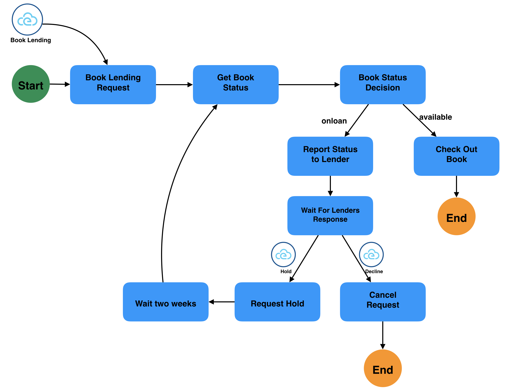
</p>

#### Workflow Definition

<table>
<tr>
    <th>JSON</th>
    <th>YAML</th>
</tr>
<tr>
<td valign="top">

```json
{
 "id": "booklending",
 "name": "Book Lending Workflow",
 "version": "1.0",
 "specVersion": "0.8",
 "start": "Book Lending Request",
 "states": [
  {
   "name": "Book Lending Request",
   "type": "event",
   "onEvents": [
    {
     "eventRefs": ["Book Lending Request Event"]
    }
   ],
   "transition": "Get Book Status"
  },
  {
   "name": "Get Book Status",
   "type": "operation",
   "actions": [
    {
     "functionRef": {
      "refName": "Get status for book",
      "arguments": {
       "bookid": "${ .book.id }"
      }
     }
    }
   ],
   "transition": "Book Status Decision"
  },
  {
   "name": "Book Status Decision",
   "type": "switch",
   "dataConditions": [
    {
     "name": "Book is on loan",
     "condition": "${ .book.status == \"onloan\" }",
     "transition": "Report Status To Lender"
    },
    {
     "name": "Check is available",
     "condition": "${ .book.status == \"available\" }",
     "transition": "Check Out Book"
    }
   ],
   "defaultCondition": {
    "end": true
   }
  },
  {
   "name": "Report Status To Lender",
   "type": "operation",
   "actions": [
    {
     "functionRef": {
      "refName": "Send status to lender",
      "arguments": {
       "bookid": "${ .book.id }",
       "message": "Book ${ .book.title } is already on loan"
      }
     }
    }
   ],
   "transition": "Wait for Lender response"
  },
  {
   "name": "Wait for Lender response",
   "type": "switch",
   "eventConditions": [
    {
     "name": "Hold Book",
     "eventRef": "Hold Book Event",
     "transition": "Request Hold"
    },
    {
     "name": "Decline Book Hold",
     "eventRef": "Decline Hold Event",
     "transition": "Cancel Request"
    }
   ],
   "defaultCondition": {
    "end": true
   }
  },
  {
   "name": "Request Hold",
   "type": "operation",
   "actions": [
    {
     "functionRef": {
      "refName": "Request hold for lender",
      "arguments": {
       "bookid": "${ .book.id }",
       "lender": "${ .lender }"
      }
     }
    }
   ],
   "transition": "Sleep two weeks"
  },
  {
   "name": "Sleep two weeks",
   "type": "sleep",
   "duration": "PT2W",
   "transition": "Get Book Status"
  },
  {
   "name": "Check Out Book",
   "type": "operation",
   "actions": [
    {
     "functionRef": {
      "refName": "Check out book with id",
      "arguments": {
       "bookid": "${ .book.id }"
      }
     }
    },
    {
     "functionRef": {
      "refName": "Notify Lender for checkout",
      "arguments": {
       "bookid": "${ .book.id }",
       "lender": "${ .lender }"
      }
     }
    }
   ],
   "end": true
  }
 ],
 "functions": "file://books/lending/functions.json",
 "events": "file://books/lending/events.json"
}
```

</td>
<td valign="top">

```yaml
id: booklending
name: Book Lending Workflow
version: '1.0'
specVersion: '0.8'
start: Book Lending Request
states:
 - name: Book Lending Request
   type: event
   onEvents:
    - eventRefs:
       - Book Lending Request Event
   transition: Get Book Status
 - name: Get Book Status
   type: operation
   actions:
    - functionRef:
       refName: Get status for book
       arguments:
        bookid: "${ .book.id }"
   transition: Book Status Decision
 - name: Book Status Decision
   type: switch
   dataConditions:
    - name: Book is on loan
      condition: ${ .book.status == "onloan" }
      transition: Report Status To Lender
    - name: Check is available
      condition: ${ .book.status == "available" }
      transition: Check Out Book
   defaultCondition:
    end: true
 - name: Report Status To Lender
   type: operation
   actions:
    - functionRef:
       refName: Send status to lender
       arguments:
        bookid: "${ .book.id }"
        message: Book ${ .book.title } is already on loan
   transition: Wait for Lender response
 - name: Wait for Lender response
   type: switch
   eventConditions:
    - name: Hold Book
      eventRef: Hold Book Event
      transition: Request Hold
    - name: Decline Book Hold
      eventRef: Decline Hold Event
      transition: Cancel Request
   defaultCondition:
    end: true
 - name: Request Hold
   type: operation
   actions:
    - functionRef:
       refName: Request hold for lender
       arguments:
        bookid: "${ .book.id }"
        lender: "${ .lender }"
   transition: Sleep two weeks
 - name: Sleep two weeks
   type: sleep
   duration: PT2W
   transition: Get Book Status
 - name: Check Out Book
   type: operation
   actions:
    - functionRef:
       refName: Check out book with id
       arguments:
        bookid: "${ .book.id }"
    - functionRef:
       refName: Notify Lender for checkout
       arguments:
        bookid: "${ .book.id }"
        lender: "${ .lender }"
   end: true
functions: file://books/lending/functions.json
events: file://books/lending/events.json
```

</td>
</tr>
</table>

### Filling a glass of water

#### Description

In this example we showcase the power of [expression functions](../specification.md#Using-Functions-For-Expression-Evaluation).
Our workflow definition is assumed to have the following data input:

```json
{
  "counts": {
    "current": 0,
    "max": 10
  }
}
```

Our workflow simulates filling up a glass of water one "count" at a time until "max" count is reached which
represents our glass is full.
Each time we increment the current count, the workflow checks if we need to keep refilling the glass.
If the current count reaches the max count, the workflow execution ends.
To increment the current count, the workflow invokes the "IncrementCurrent" expression function.
Its results are then merged back into the state data according to the "toStateData" property of the event data filter.

#### Workflow Diagram

<p align="center">
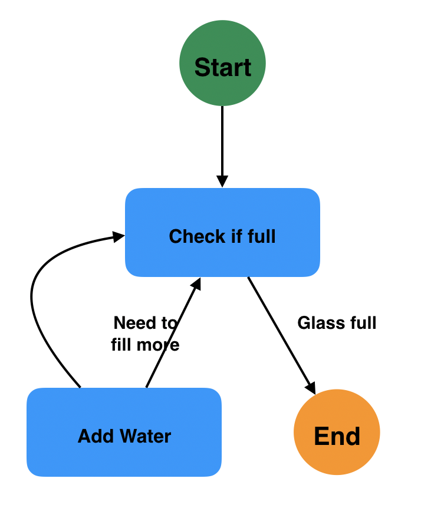
</p>

#### Workflow Definition

<table>
<tr>
    <th>JSON</th>
    <th>YAML</th>
</tr>
<tr>
<td valign="top">

```json
{
 "id": "fillglassofwater",
 "name": "Fill glass of water workflow",
 "version": "1.0",
 "specVersion": "0.8",
 "start": "Check if full",
 "functions": [
  {
   "name": "Increment Current Count Function",
   "type": "expression",
   "operation": ".counts.current += 1 | .counts.current"
  }
 ],
 "states": [
  {
   "name": "Check if full",
   "type": "switch",
   "dataConditions": [
    {
     "name": "Need to fill more",
     "condition": "${ .counts.current < .counts.max }",
     "transition": "Add Water"
    },
    {
     "name": "Glass full",
     "condition": ".counts.current >= .counts.max",
     "end": true
    }
   ],
   "defaultCondition": {
    "end": true
   }
  },
  {
   "name": "Add Water",
   "type": "operation",
   "actions": [
    {
     "functionRef": "Increment Current Count Function",
     "actionDataFilter": {
      "toStateData": ".counts.current"
     }
    }
   ],
   "transition": "Check if full"
  }
 ]
}
```

</td>
<td valign="top">

```yaml
id: fillglassofwater
name: Fill glass of water workflow
version: '1.0'
specVersion: '0.8'
start: Check if full
functions:
 - name: Increment Current Count Function
   type: expression
   operation: ".counts.current += 1 | .counts.current"
states:
 - name: Check if full
   type: switch
   dataConditions:
    - name: Need to fill more
      condition: "${ .counts.current < .counts.max }"
      transition: Add Water
    - name: Glass full
      condition: ".counts.current >= .counts.max"
      end: true
   defaultCondition:
    end: true
 - name: Add Water
   type: operation
   actions:
    - functionRef: Increment Current Count Function
      actionDataFilter:
       toStateData: ".counts.current"
   transition: Check if full
```

</td>
</tr>
</table>

### Online Food Ordering

#### Description

In this example we want to create an online food ordering workflow. The below image outlines the workflow
structure and the available services:

<p align="center">
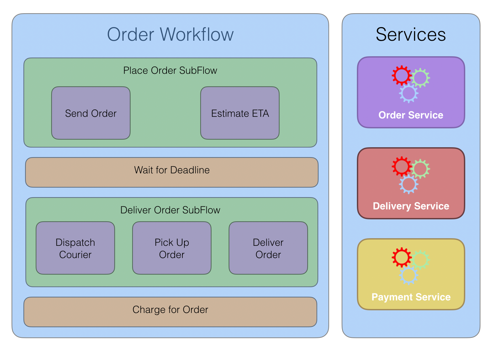
</p>

Our workflow starts with the "Place Order" [Subflow](../specification.md#SubFlow-Action), which is responsible
to send the received order to the requested restaurant and the estimated order ETA.
We then wait for the ETA time when our workflow should go into the "Deliver Order" SubFlow, responsible
for dispatching a Courier and sending her/him off to pick up the order. Once the order is picked up, the Courier needs to deliver the order to the customer.
After the order has been delivered to the customer, our workflow needs to charge the customer.

Our workflow needs to communicate with three services during its execution, namely the Order, Delivery, and
the Payment services.

For the sake of the example, we assume that our workflow can communicate to the Order and Delivery services via REST and the Payment service via gRPC.
Let's start by defining an example CloudEvent which triggers an instance of our workflow.
This event can be sent by a web UI, for example, or be pushed onto a Kafka/MQTT topic to start our order workflow.

```json
{
   "specversion": "1.0",
   "type": "org.orders",
   "source": "/orders/",
   "subject": "Food Order",
   "id": "A234-1234-1234",
   "time": "2021-03-05T17:31:00Z",
   "orderid": "ORDER-12345",
   "data": {
      "id": "ORDER-12345",
      "customerId": "CUSTOMER-12345",
      "status": [],
      "order": {
         "restaurantId": "RESTAURANT-54321",
         "items": [
            {
               "itemId": "ITEM-8765",
               "amount": 1,
               "addons": ""
            }
         ]
      },
      "delivery":{
         "address": "1234 MyStreet, MyCountry",
         "type": "contactless",
         "requestedTime": "ASAP",
         "location": "Front door",
         "instructions": ""
      }
   }
}
```

Note the `orderid` CloudEvent context attribute, which contains the unique ID of the order specified in this event. [Event correlation](../specification.md#Correlation-Definition) is done against CE context attributes, and as such, to be able
to correlate multiple order events to the same order id, it needs to be part of the CE context attributes, and
not its data (payload).

Now let's start defining our workflow. For the sake of this example, let's define our function and event definitions
as separate YAML files (and then reference them inside our workflow definition). This is useful in cases
when you want to reuse them between multiple workflow definitions.

#### Workflow Event Definition

``` yaml
events:
- name: Food Order Event
  source: "/orders/"
  type: org.orders
  correlation:
  - contextAttributeName: orderid
- name: ETA Deadline Event
  source: "/orderseta"
  type: org.orders.eta
  correlation:
  - contextAttributeName: orderid
- name: Order Picked Up Event
  source: "/orderspickup"
  type: org.orders.delivery
  correlation:
  - contextAttributeName: orderid
- name: Order Delievered Event
  source: "/orderdelivery"
  type: org.orders.delivery
  correlation:
  - contextAttributeName: orderid
```

#### Workflow Function Definition

``` yaml
functions:
- name: Submit Order Function
  operation: http://myorderservice.org/orders.json#submit
- name: Get Order ETA Function
  operation: http://myorderservice.org/orders.json#orderETA
- name: Dispatch Courrier Function
  operation: http://mydeliveryservice.org/deliveries.json#dispatch
- name: Deliver Order Function
  operation: http://mydeliveryservice.org/deliveries.json#deliver
- name: Charge For Order Function
  operation: http://mypaymentservice.org/payments.proto#PaymentService#ChargeUser
```

#### Main Workflow Definition

With the function and event definitions in place we can now start writing our main workflow definition:

```yaml
id: foodorderworkflow
name: Food Order Workflow
version: '1.0'
specVersion: '0.8'
start: Place Order
functions: file://orderfunctions.yml
events: file://orderevents.yml
states:
- name: Place Order
  type: operation
  actions:
  - subFlowRef: placeorderworkflow
  transition: Wait for ETA Deadline
- name: Wait for ETA Deadline
  type: event
  onEvents:
  - eventRefs:
    - ETA Deadline Event
    eventDataFilter:
      data: "${ .results.status }"
      toStateData: "${ .status }"
  transition: Deliver Order
- name: Deliver Order
  type: operation
  actions:
  - subFlowRef: deliverorderworkflow
  transition: Charge For Order
- name: Charge For Order
  type: operation
  actions:
  - functionRef:
      refName: Charge For Order Function
      arguments:
        order: "${ .order.id }"
    actionDataFilter:
      results: "${ .outcome.status }"
      toStateData: "${ .status }"
  stateDataFilter:
    output: '${ . | {"orderid": .id, "orderstatus": .status} | .orderstatus += ["Order
      Completed"] }'
  end: true
```

With this in place we can start defining our sub-workflows:

#### Place Order Sub-Workflow

```yaml
id: placeorderworkflow
name: Place Order Workflow
version: '1.0'
specVersion: '0.8'
start: Submit Order
states:
- name: Submit Order
  type: event
  onEvents:
  - eventRefs:
    - Food Order Event
    actions:
    - functionRef:
        refName: Submit Order Function
        arguments:
          order: "${ .order }"
      actionDataFilter:
        results: "${ .results.status }"
        toStateData: "${ .status }"
    - functionRef:
        refName: Get Order ETA Function
        arguments:
          customer: "${ .customerId }"
          restaurantid: "${ .order.restaurantId }"
          delivery: " ${ .delivery }"
      actionDataFilter:
        results: "${ .results.status }"
        toStateData: "${ .status }"
  end: true
```

#### Deliver Order Sub-Workflow

```yaml
id: deliverorderworkflow
name: Deliver Order Workflow
version: '1.0'
specVersion: '0.8'
start: Dispatch Courier
states:
- name: Dispatch Courier
  type: operation
  actions:
  - functionRef: Dispatch Courrier Function
  transition: Wait for Order Pickup
- name: Wait for Order Pickup
  type: event
  onEvents:
  - eventRefs:
    - Order Picked Up Event
    eventDataFilter:
      data: "${ .data.status }"
      toStateData: "${ .status }"
    actions:
    - functionRef: Deliver Order Function
  transition: Wait for Delivery Confirmation
- name: Wait for Delivery Confirmation
  type: event
  onEvents:
  - eventRefs:
    - Order Delievered Event
    eventDataFilter:
      data: "${ .data.status }"
      toStateData: "${ .status }"
  end: true
```

#### Workflow Results

For the example order event, the workflow output for a successful completion would look like for example:

```json
{
  "orderid": "ORDER-12345",
  "orderstatus": [
    "Order Submitted",
    "Order ETA Received",
    "Order Picked up",
    "Order Delievered",
    "Order Charged",
    "Order Completed"
  ]
}
```

### Continuing as a new Execution

#### Description

Some runtime implementations on which we run our workflows can have different quotas, such as maximum execution durations, maximum consumed events, etc. We can use the Serverless workflow "continueAs" functionality that can be used to stop the current workflow execution and start another one (of the same or a different type). This is very useful in cases where we have to ensure we don't reach the imposed quotas of single workflow execution.

This example assumes that the runtime we are using has a quota set to a maximum of one thousand consumed events per single workflow execution. 
Our sample workflow consumes a single customer event at a time and invokes the `emailCustomer` function. 
Note that we do not set a workflow `workflowExecTimeout`, so we intend to have a long-running workflow. However, because of the runtime restriction, in this case, we would run into the event consume limit, and our workflow would have to terminate. We can fix this problem by using [`continueAs`](../specification.md#Continuing-as-a-new-Execution), which will allow us to make sure that we reach the given limit and then continue our workflow execution as a new run.

We assume that our workflow input has the runtime-imposed quota:

```json
{
  "quota": {
   "maxConsumedEvents": 1000
  }
}
```

#### Workflow Diagram

<p align="center">
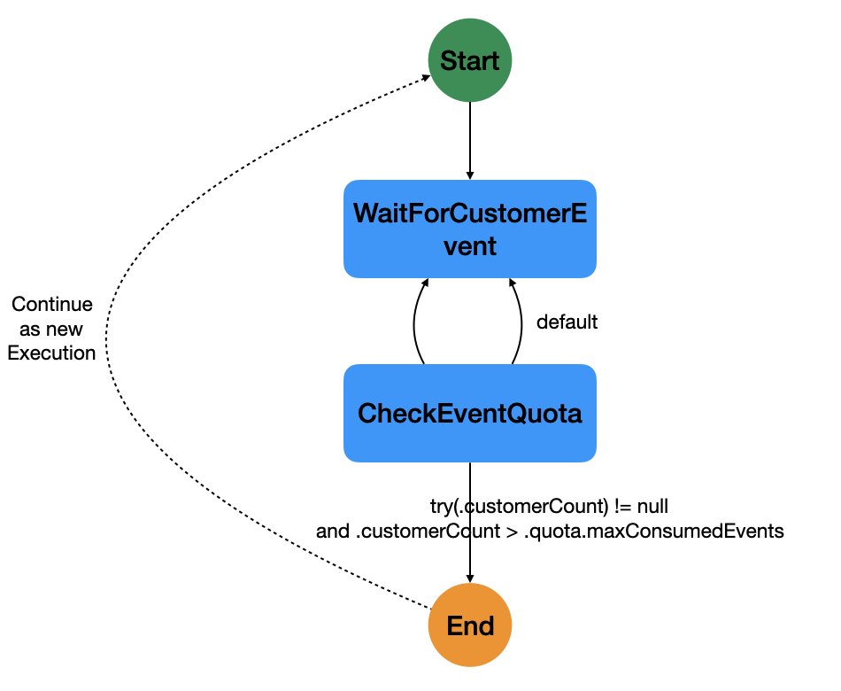
</p>

#### Workflow Definition

<table>
<tr>
    <th>JSON</th>
    <th>YAML</th>
</tr>
<tr>
<td valign="top">

```json
{
 "id":"notifycustomerworkflow",
 "name":"Notify Customer",
 "version":"1.0",
 "specVersion": "0.8",
 "start":"WaitForCustomerEvent",
 "states":[
  {
   "name":"WaitForCustomerEvent",
   "type":"event",
   "onEvents":[
    {
     "eventRefs":[
      "CustomerEvent"
     ],
     "eventDataFilter":{
      "data":"${ .customerId }",
      "toStateData":"${ .eventCustomerId }"
     },
     "actions":[
      {
       "functionRef":{
        "refName":"NotifyCustomerFunction",
        "arguments":{
         "customerId":"${ .eventCustomerId }"
        }
       }
      }
     ]
    }
   ],
   "stateDataFilter":{
    "output":"${ .count = .count + 1 }"
   },
   "transition":"CheckEventQuota"
  },
  {
   "name":"CheckEventQuota",
   "type":"switch",
   "dataConditions":[
    {
     "condition":"${ try(.customerCount) != null and .customerCount > .quota.maxConsumedEvents }",
     "end":{
      "continueAs": {
       "workflowId": "notifycustomerworkflow",
       "version": "1.0",
       "data": "${ del(.customerCount) }"
      }
     }
    }
   ],
   "defaultCondition":{
    "transition":"WaitForCustomerEvent"
   }
  }
 ],
 "events":[
  {
   "name":"CustomerEvent",
   "type":"org.events.customerEvent",
   "source":"customerSource"
  }
 ],
 "functions":[
  {
   "name":"NotifyCustomerFunction",
   "operation":"http://myapis.org/customerapis.json#notifyCustomer"
  }
 ]
}
```

</td>
<td valign="top">

```yaml
id: notifycustomerworkflow
name: Notify Customer
version: '1.0'
specVersion: '0.8'
start: WaitForCustomerEvent
states:
 - name: WaitForCustomerEvent
   type: event
   onEvents:
    - eventRefs:
       - CustomerEvent
      eventDataFilter:
       data: "${ .customerId }"
       toStateData: "${ .eventCustomerId }"
      actions:
       - functionRef:
          refName: NotifyCustomerFunction
          arguments:
           customerId: "${ .eventCustomerId }"
   stateDataFilter:
    output: "${ .count = .count + 1 }"
   transition: CheckEventQuota
 - name: CheckEventQuota
   type: switch
   dataConditions:
    - condition: "${ try(.customerCount) != null and .customerCount > .quota.maxConsumedEvents
      }"
      end:
       continueAs:
        workflowId: notifycustomerworkflow
        version: '1.0'
        data: "${ del(.customerCount) }"
   defaultCondition:
    transition: WaitForCustomerEvent
events:
 - name: CustomerEvent
   type: org.events.customerEvent
   source: customerSource
functions:
 - name: NotifyCustomerFunction
   operation: http://myapis.org/customerapis.json#notifyCustomer
```

</td>
</tr>
</table>

### Process Transactions

#### Description

This example shows how we can loop through a data input array (in parallel), and decide which action to perform
depending on the value of each element in the input array. 
We use the [action definition](../specification.md#Action-Definition) `condition` property to perform the action that 
is best suited for the transaction value.
Note that in this example we set the "large transaction amount" as a [workflow constant](../specification.md#Workflow-Constants). 
There are other ways to set 
this value, for example passing it as [workflow data input](../specification.md#Workflow-Data-Input), 
or if this data is sensitive, to use [workflow secrets](../specification.md#Workflow-Secrets). 

For the example, we assume the following workflow data input:

```json
{
  "customer": {
   "id": "abc123",
   "name": "John Doe",
   "transactions": [1000, 400, 60, 7000, 12000, 250]
  }
}
```

We use the [ForeEach workflow state](../specification.md#ForEach-State) to iterate through customer transactions (in parallel), and 
decide which activity to perform based on the transaction value.

#### Workflow Definition

<table>
<tr>
    <th>JSON</th>
    <th>YAML</th>
</tr>
<tr>
<td valign="top">

```json
{
 "id": "customerbankingtransactions",
 "name": "Customer Banking Transactions Workflow",
 "version": "1.0",
 "specVersion": "0.8",
 "autoRetries": true,
 "constants": {
  "largetxamount" : 5000
 },
 "states": [
  {
   "name": "ProcessTransactions",
   "type": "foreach",
   "inputCollection": "${ .customer.transactions }",
   "iterationParam": "${ .tx }",
   "actions": [
    {
     "name": "Process Larger Transaction",
     "functionRef": "Banking Service - Larger Tx",
     "condition": "${ .tx >= $CONST.largetxamount }"
    },
    {
     "name": "Process Smaller Transaction",
     "functionRef": "Banking Service - Smaller Tx",
     "condition": "${ .tx < $CONST.largetxamount }"
    }
   ],
   "end": true
  }
 ],
 "functions": [
  {
   "name": "Banking Service - Larger Tx",
   "type": "asyncapi",
   "operation": "banking.yaml#largerTransation"
  },
  {
   "name": "Banking Service - Smaller T",
   "type": "asyncapi",
   "operation": "banking.yaml#smallerTransation"
  }
 ]
}
```

</td>
<td valign="top">

```yaml
id: bankingtransactions
name: Customer Banking Transactions Workflow
version: '1.0'
specVersion: '0.8'
autoRetries: true
constants:
 largetxamount: 5000
states:
 - name: ProcessTransactions
   type: foreach
   inputCollection: "${ .customer.transactions }"
   iterationParam: "${ .tx }"
   actions:
    - name: Process Larger Transaction
      functionRef: Banking Service - Larger Tx
      condition: "${ .tx >= $CONST.largetxamount }"
    - name: Process Smaller Transaction
      functionRef: Banking Service - Smaller Tx
      condition: "${ .tx < $CONST.largetxamount }"
   end: true
functions:
 - name: Banking Service - Larger Tx
   type: asyncapi
   operation: banking.yaml#largerTransation
 - name: Banking Service - Smaller T
   type: asyncapi
   operation: banking.yaml#smallerTransation
```

</td>
</tr>
</table>
