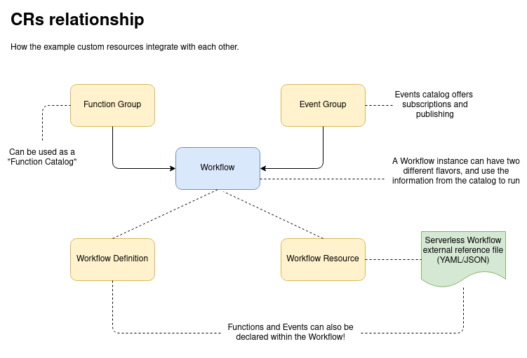

# Kubernetes Example

In this directory you will find an excerpt of a Kubernetes application project using the [Go SDK](../../go/README.md) of the Serverless Workflow specification.

We used the [Operator SDK](https://sdk.operatorframework.io/) to scaffold this example project and to generate all the types needed to create [Kubernetes Custom Resources](https://kubernetes.io/docs/concepts/extend-kubernetes/api-extension/custom-resources/). These resources can be used to deploy Serverless Workflow instance types in a Kubernetes cluster.

This project should be used as a **suggestion** of how to use the Go SDK to build a Kubernetes application. The CRDs and types offered here **should not** be used in production nor "as is" in implementations.

We also **do not** recommend using the Kubernetes API [Group](https://book.kubebuilder.io/cronjob-tutorial/gvks.html) of the example CRDs in your project such as: `serverlessworkflow.io`.

The following picture illustrates the relationship between the suggested Kubernetes custom resources offered by this example:



The `FunctionGroup` CR has an array of [Functions](https://github.com/cncf/wg-serverless-workflow/tree/master/specification#Function-Definition), so it can be used by a supposed implementation engine as a function catalog, this way these functions could be referenced in Workflows instances.

`EventGroup` has a similar concept (has an array of [Events](https://github.com/cncf/wg-serverless-workflow/tree/master/specification#Event-Definition). In this scenario, an Event Catalog could be provided by an engine for other Workflow instances in the environment to consume or publish to events in this catalog.

The suggestion for a Workflow representation in a Kubernetes context in this example comes in two flavors: 

1. `WorkflowResource`: A custom resource that has a reference to an external JSON or YAML file representing the [Serverless Workflow specification](https://github.com/cncf/wg-serverless-workflow/tree/master/specification)
2. `WorkflowDefinition`: A custom resource that embeds the specification, so users would define their workflow within the CR itself

## How to use

Please make sure your environment has the following pre requisites:

1. Cloned this repository
2. [`kubectl`](https://kubernetes.io/docs/tasks/tools/install-kubectl/) installed
3. A Kubernetes test cluster available ([minikube](https://kubernetes.io/docs/setup/learning-environment/minikube/) or [KIND](https://kubernetes.io/docs/setup/learning-environment/kind/))

You may deploy the CRDs in the test cluster to see them in action with the following commands:

```shell script
$ kubectl apply -f sdk/examples/kubernetes/deploy/crds/serverlessworkflow.io_eventgroups_crd.yaml
$ kubectl apply -f sdk/examples/kubernetes/deploy/crds/serverlessworkflow.io_functiongroups_crd.yaml
$ kubectl apply -f sdk/examples/kubernetes/deploy/crds/serverlessworkflow.io_workflowdefinitions_crd.yaml
$ kubectl apply -f sdk/examples/kubernetes/deploy/crds/serverlessworkflow.io_workflowresources_crd.yaml
```

Having applied all the custom types, you now may try one of our [examples](deploy/crds):

```shell script
$ kubectl apply -f sdk/examples/kubernetes/deploy/crds/serverlessworkflow.io_v1alpha2_workflowdefinitions_cr.yaml
```

This will create a new instance of `WorkflowDefinition` in your cluster. You can then describe its contents by running:

```shell script
$ kubectl describe workflowdefinition/eventbasedswitch
```

You shouldn't see any kind of workflow engine running in your cluster since this is just an example of how to create types based on the Go SDK. This is because we don't have a Kubernetes [controller](https://kubernetes.io/docs/concepts/architecture/controller/) watching for our type in the cluster. This would be a next step for an implementation, which is out of the scope of this example.