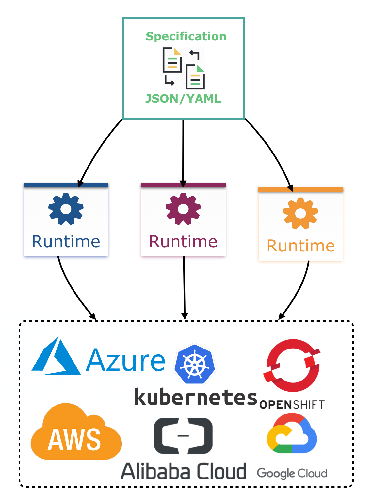
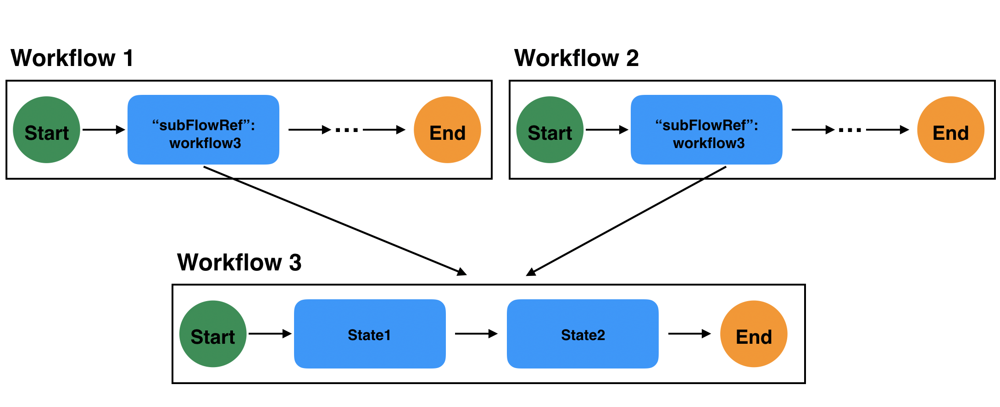

# Serverless Workflow Specification

## Table of Contents

- [Abstract](#abstract)
- [Status of this document](#status-of-this-document)
- [Overview](#overview)
  * [Why we need a specification?](#why-we-need-a-specification)
  * [Focus on standards](#focus-on-standards)
- [Project Components](#project-components)
- [Specification Details](#specification-details)
  * [Core Concepts](#core-concepts)
  * [Workflow Definition](#workflow-definition)
  * [Workflow Instance](#workflow-instance)
  * [Workflow Model](#workflow-model)
  * [Workflow Data](#workflow-data)
    + [Workflow Data Input](#workflow-data-input)
    + [Information Passing Between States](#information-passing-between-states)
    + [Workflow data output](#workflow-data-output)
    + [State data filters](#state-data-filters)
    + [Action data filters](#action-data-filters)
    + [Event data filters](#event-data-filters)
    + [Using multiple data filters](#using-multiple-data-filters)
    + [Data Merging](#data-merging)
  * [Workflow Functions](#workflow-functions)
    + [Using Functions for RESTful Service Invocations](#using-functions-for-restful-service-invocations)
    + [Using Functions for Async API Service Invocations](#using-functions-for-async-api-service-invocations)
    + [Using Functions for RPC Service Invocations](#using-functions-for-rpc-service-invocations)
    + [Using Functions for GraphQL Service Invocations](#using-functions-for-graphql-service-invocations)
      - [Invoking a GraphQL `Query`](#invoking-a-graphql-query)
      - [Invoking a GraphQL `Mutation`](#invoking-a-graphql-mutation)
    + [Using Functions for OData Service Invocations](#using-functions-for-odata-service-invocations)
      - [Creating an OData Function Definition](#creating-an-odata-function-definition)
      - [Invoking an OData Function Definition](#invoking-an-odata-function-definition)
    + [Using Functions for Expression Evaluation](#using-functions-for-expression-evaluation)
    + [Defining custom function types](#defining-custom-function-types)
  * [Workflow Expressions](#workflow-expressions)
  * [Workflow Definition Structure](#workflow-definition-structure)
    + [Workflow States](#workflow-states)
      - [Event State](#event-state)
      - [Operation State](#operation-state)
      - [Switch State](#switch-state)
      - [Sleep State](#sleep-state)
      - [Parallel State](#parallel-state)
      - [Inject State](#inject-state)
      - [ForEach State](#foreach-state)
      - [Callback State](#callback-state)
    + [Related State Definitions](#related-state-definitions)
      - [Function Definition](#function-definition)
      - [Event Definition](#event-definition)
      - [Auth Definition](#auth-definition)
        - [Basic Properties Definition](#basic-properties-definition)
        - [Bearer Properties Definition](#bearer-properties-definition)
        - [OAuth2 Properties Definition](#oauth2-properties-definition)
      - [Correlation Definition](#correlation-definition)
      - [OnEvents Definition](#onevents-definition)
      - [Action Definition](#action-definition)
      - [Subflow Action](#subflow-action)
      - [FunctionRef Definition](#functionref-definition)
      - [EventRef Definition](#eventref-definition)
      - [SubFlowRef Definition](#subflowref-definition)
      - [Error Definition](#error-definition)
      - [Retry Definition](#retry-definition)
      - [Transition Definition](#transition-definition)
      - [Switch State Data Conditions](#switch-state-data-conditions)
      - [Switch State Event Conditions](#switch-state-event-conditions)
      - [Parallel State Branch](#parallel-state-branch)
      - [Parallel State Handling Exceptions](#parallel-state-handling-exceptions)
      - [Start Definition](#start-definition)
      - [Schedule Definition](#schedule-definition)
      - [Cron Definition](#cron-definition)
      - [End Definition](#end-definition)
      - [ProducedEvent Definition](#producedevent-definition)
      - [Transitions](#transitions)
      - [Additional Properties](#additional-properties)
  * [Workflow Error Handling](#workflow-error-handling)
    + [Defining Errors](#defining-errors)
  * [Action retries](#action-retries)
    + [Retry actions on known errors](#retry-actions-on-known-errors)
    + [Automatic retries on known and unknown errors](#automatic-retries-on-known-and-unknown-errors)
  * [Workflow Timeouts](#workflow-timeouts)
    + [Workflow Timeout Definition](#workflow-timeout-definition)
      - [WorkflowExecTimeout Definition](#workflowexectimeout-definition)
    + [States Timeout Definition](#states-timeout-definition)
    + [Branch Timeout Definition](#branch-timeout-definition)
    + [Event Timeout Definition](#event-timeout-definition)
  * [Workflow Compensation](#workflow-compensation)
    + [Defining Compensation](#defining-compensation)
    + [Triggering Compensation](#triggering-compensation)
    + [Compensation Execution Details](#compensation-execution-details)
    + [Compensation and Active States](#compensation-and-active-states)
    + [Unrecoverable errors during compensation](#unrecoverable-errors-during-compensation)
  * [Continuing as a new Execution](#continuing-as-a-new-execution)
    + [ContinueAs in sub workflows](#continueas-in-sub-workflows)
  * [Workflow Versioning](#workflow-versioning)
  * [Workflow Constants](#workflow-constants)
  * [Workflow Secrets](#workflow-secrets)
  * [Workflow Metadata](#workflow-metadata)
  * [Workflow Context](#workflow-context)
- [Extensions](#extensions)
- [Use Cases](#use-cases)
- [Examples](#examples)
- [Comparison to other workflow languages](#comparison-to-other-workflow-languages)
- [References](#references)
- [License](#license)

## Abstract

The Serverless Workflow project defines a vendor-neutral and declarative workflow language,
targeting the Serverless computing technology domain.

## Status of this document

This document represents the current state of the specification.
It includes all features so far released
as well as all features planned to be added in the next release.

You can find all specification releases [here](https://github.com/serverlessworkflow/specification/releases).
You can find the specification roadmap [here](roadmap/README.md).

## Overview

Workflows allow us to capture and organize business requirements in a unified manner.
They can bridge the gap between how we express and model business logic.

A key component of workflows is the domain-specific language (DSL) we use to model our
business logic and solutions. Selecting the appropriate workflow language for our business and technology domains is
a very important decision to be considered.

Serverless Workflow focuses on defining a **vendor-neutral**, **platform-independent**, and **declarative** workflow
language that targets the serverless computing technology domain.
It can be used to significantly bridge the gap between your unique business domain and the target technology domain.

### Why we need a specification?

The lack of a common way to define and model workflows means that we must constantly re-learn
how to write them. This also limits the potential for common libraries, tooling and
infrastructure to aid workflow modeling and execution across different platforms.
Portability as well as productivity that can be achieved from workflow orchestration is hindered overall.

Serverless Workflow addresses the need for a community-driven, vendor-neutral and a platform-independent
workflow language specification that targets the serverless computing technology domain.

Having and using a specification-based workflow language allows us to model our workflows once and deploy them
onto many different container/cloud platforms, expecting the same execution results.

<p align="center">

</p>

For more information on the history, development and design rationale behind the specification, see the [Serverless Workflow Wiki](https://github.com/serverlessworkflow/specification/wiki).

### Focus on standards

<p align="center">

</p>

Serverless Workflow language takes advantage of well-established and known standards such as [CloudEvents](https://cloudevents.io/), [OpenAPI](https://www.openapis.org/) specifications,
[gRPC](https://grpc.io/) and [GraphQL](https://graphql.org/).

## Project Components

<p align="center">

</p>

The specification has multiple components:

* Definitions of the workflow language. This is defined via the [Workflow JSON Schema](schema/workflow.json). You can use both
  [JSON](https://www.json.org/json-en.html) and [YAML](https://yaml.org/) formats to model your workflows.
* Software Development Kits (SDKs) for [Go](https://github.com/serverlessworkflow/sdk-go), [Java](https://github.com/serverlessworkflow/sdk-java), [.NET](https://github.com/serverlessworkflow/sdk-net), [Typescript](https://github.com/serverlessworkflow/sdk-typescript) and [Python](https://github.com/serverlessworkflow/sdk-python), and we plan to add them for more languages in the future.
* Set of [Workflow Extensions](extensions/README.md) which
  allow users to define additional, non-execution-related workflow information. This information can be used to improve
  workflow performance.
  Some example workflow extensions include Key Performance Indicators (KPIs), Rate Limiting, Simulation, Tracing, etc.
* Technology Compatibility Kit (TCK) to be used as a specification conformance tool for runtime implementations.

## Specification Details

Following sections provide detailed descriptions of all parts of the Serverless Workflow language.

### Core Concepts

This section describes some of the core Serverless Workflow concepts:

### Workflow Definition

A workflow definition is a JSON or YAML file that conforms to the Serverless Workflow specification DSL. 
It consists of the core [Workflow Definition Structure](#Workflow-Definition-Structure)
and the [Workflow Model](#Workflow-Model) It defines a blueprint used by runtimes for its execution.

A business solution can be composed of any number of related workflow definitions.
Their relationships are explicitly modeled with the Serverless Workflow language (for example
by using [SubFlowRef Definition](#SubFlowRef-Definition) in actions).

Runtimes can initialize workflow definitions for some particular set of data inputs or events.

### Workflow Instance

A workflow instance represents a single workflow execution corresponding to the instructions provided by a
workflow definition. A workflow instance can be short or long-running. A single workflow instance
should be isolated, meaning it should not share state and data with other workflow instances.
Workflow instances should be able to communicate with each other via events.

Depending on their workflow definition, workflow instances can be short-lived or
can execute for days, weeks, or years.

Each workflow instances should have its unique identifier, which should remain
unchanged throughout its execution.

Workflow instances can be started providing some data input. This is described in detail in the 
[workflow data input](#Workflow-Data-Input) section.
Workflow instances can also wait for examples to start their execution, which is the case
where a workflow definition contains a [EventState](#Event-State) starting workflow state.

The workflow definition also explicitly defines when a workflow instance should be completed. 
By default, instances should be completed once there are no active workflow paths (all active
paths reach a state containing the default [end definition](#End-Definition)),
or if the defined [`workflowExecTimeout`](#Workflow-Timeouts) time is reached.
Other ways, such as using the `terminate` property of the [end definition](#End-Definition) to terminate instance execution,
or defining an [`workflowExecTimeout`](#Workflow-Timeouts) property are also possible.

For long-running workflow-executions, you can utilize the `keepActive` workflow property which 
provides more control as to when exactly to terminate workflow execution. In cases where a
workflow execution should be continued as a new one, the DSL also provides the `continueAs` property which is described
in detail in the [Continuing a new Execution](#Continuing-as-a-new-Execution) section.

### Workflow Model

The Serverless Workflow language is composed of:

* [Function definitions](#Function-Definition) -  Reusable functions that can declare services that need to be invoked, or expressions to be evaluated.
* [Event definitions](#Event-Definition) - Reusable declarations of events that need to be `consumed` to start or continue workflow instances, trigger function/service execution, or be `produced` during workflow execution.
* [Retry definitions](#Retry-Definition) - Reusable retry definitions. Can specify retry strategies for service invocations during workflow execution.
* [Timeout definitions](#Workflow-Timeouts) - Reusable timeout definitions. Can specify default workflow execution timeout, as well as workflow state, action, and branch execution timeouts.
* [Errors definition](#Defining-Errors) - Reusable error definitions. Provide domain-specific error definitions which can be referenced in workflow states error handling.
* [State definitions](#Workflow-States) - Definition of states, the building blocks of workflow `control flow logic`. States can reference the reusable function, event and retry definitions.

### Workflow Data

Serverless Workflow data is represented in [JSON](https://www.json.org/json-en.html) format.
Data flow and execution logic go hand in hand, meaning as workflow execution follows the workflow definition
logic, so does the workflow data:

<p align="center">

</p>

The initial [Workflow data input](#Workflow-data-input) is passed to the workflow starting state as its data input.
When a state finishes its execution, [its data output is passed as data input to the next state](#Information-passing-Between-States) that should be executed.

When workflow execution ends, the last executed workflow state's data output becomes the final [Workflow data output](#Workflow-data-output).

States can filter their data inputs and outputs using [State Data filters](#State-data-filters).

States can also consume events as well as invoke services. These event payloads and service invocation results
can be filtered using [Event data filters](#Event-data-filters) and [Action data filters](#Action-data-filters).

Data filters use [workflow expressions](#Workflow-Expressions) for selecting and manipulating state data
input and output, action inputs and results, and event payloads.

Multiple filters can be combined to gain high level of control of your workflow state data. You can find an example of that in
[this](#Using-multiple-data-filters) section.

Data from consumed events,and action execution results are added/merged
to state data. Reference the [data merging section](#Data-Merging) to learn about the merging rules that should be applied.

#### Workflow Data Input

The initial data input into a workflow instance. Must be a valid [JSON object](https://tools.ietf.org/html/rfc7159#section-4).
If no input is provided, the default data input should be an empty JSON object:

```json
{ }
```

Workflow data input is passed to the workflow starting state as its data input.

<p align="center">

</p>

#### Information Passing Between States

States in a workflow can receive data (data input) and produce a data result (data output). The state's data input is typically the previous state's data output.
When a state completes its execution, its data output is passed to the state's data input it transitions to.
There are two rules to consider here:

- If the state is the workflow starting state, its data input is the [workflow data input](#Workflow-data-input).
- When workflow execution ends, the data output of the last executed state becomes the [workflow data output](#Workflow-data-output).

<p align="center">

</p>

#### Workflow data output

Each workflow execution should produce a data output.
The workflow data output is the data output of the last executed workflow state.

#### State data filters

| Parameter | Description | Type | Required |
| --- | --- | --- | --- |
| input | Workflow expression to filter the states data input | string | no |
| output | Workflow expression that filters the states data output | string | no |

<details><summary><strong>Click to view example definition</strong></summary>
<p>

<table>
<tr>
    <th>JSON</th>
    <th>YAML</th>
</tr>
<tr>
<td valign="top">

```json
{
    "stateDataFilter": {
      "input": "${ .orders }",
      "output": "${ .provisionedOrders }"
    }
}
```

</td>
<td valign="top">

```yaml
stateDataFilter:
  input: "${ .orders }"
  output: "${ .provisionedOrders }"
```

</td>
</tr>
</table>

</details>

State data filters can be used to filter the state's data input and output.

The state data filters `input` property expression is applied when the workflow transitions to the current state and receives its data input.
It can be used to select only data that is needed and disregard what is not needed.
If `input` is not defined or does not select any parts of the state's data input, its data input is not filtered.

The state data filter `output` property expression is applied right before the state transitions to the next state defined.
It filters the state's data output to be passed as data input to the transitioning state.
If the current state is the workflow end state, the filtered state's data output becomes the workflow data output.
If `output` is not defined or does not select any parts of the state's data output, its data output is not filtered.

Results of the `input` expression should become the state data input.
Results of the `output` expression should become the state data output.

For more information on this you can reference the [data merging](#Data-Merging) section.

Let's take a look at some examples of state filters. For our examples let's say the data input to our state is as follows:

```json
{
  "fruits": [ "apple", "orange", "pear" ],
  "vegetables": [
    {
      "veggieName": "potato",
      "veggieLike": true
    },
    {
      "veggieName": "broccoli",
      "veggieLike": false
    }
  ]
}
```

For the first example, our state only cares about fruits data, and we want to disregard the vegetables. To do this
we can define a state filter:

```json
{
  "stateDataFilter": {
    "input": "${ {fruits: .fruits} }"
  }
}
```

The state data output then would include only the fruits data:

```json
{
  "fruits": [ "apple", "orange", "pear"]
}
```

<p align="center">

</p>

For our second example, let's say that we are interested in the only vegetable "veggie-like".
Here we have two ways of filtering our data, depending on if actions within our state need access to all vegetables, or
only the ones that are "veggie-like".

The first way would be to use both "input", and "output":

```json
{
  "stateDataFilter": {
    "input": "${ {vegetables: .vegetables} }",
    "output": "${ {vegetables: [.vegetables[] | select(.veggieLike == true)]} }"
  }
}
```

The states data input filter selects all the vegetables from the main data input. Once all actions have performed, before the state transition
or workflow execution completion (if this is an end state), the "output" of the state filter selects only the vegetables which are "veggie like".

<p align="center">

</p>

The second way would be to directly filter only the "veggie like" vegetables with just the data input path:

```json
{
  "stateDataFilter": {
    "input": "${ {vegetables: [.vegetables[] | select(.veggieLike == true)]} }"
  }
}
```

#### Action data filters

| Parameter | Description | Type | Required |
| --- | --- | --- | --- |
| fromStateData | Workflow expression that filters state data that can be used by the action | string | no |
| useResults | If set to `false`, action data results are not added/merged to state data. In this case 'results' and 'toStateData' should be ignored. Default is `true`.  | boolean | no |
| results | Workflow expression that filters the actions data results | string | no |
| toStateData | Workflow expression that selects a state data element to which the action results should be added/merged into. If not specified denotes the top-level state data element | string | no |

<details><summary><strong>Click to view example definition</strong></summary>
<p>

<table>
<tr>
    <th>JSON</th>
    <th>YAML</th>
</tr>
<tr>
<td valign="top">

```json
{
  "actionDataFilter": {
    "fromStateData": "${ .language }",
    "results": "${ .results.greeting }",
    "toStateData": "${ .finalgreeting }"
  }
}
```

</td>
<td valign="top">

```yaml
actionDataFilter:
  fromStateData: "${ .language }"
  results: "${ .results.greeting }"
  toStateData: "${ .finalgreeting }"
```

</td>
</tr>
</table>

</details>

Action data filters can be used inside [Action definitions.](#Action-Definition)
Each action can define this filter which can:

* Filter the state data to select only the data that can be used within function definition arguments using its `fromStateData` property.
* Filter the action results to select only the result data that should be added/merged back into the state data
  using its `results` property.
* Select the part of state data which the action data results should be added/merged to
  using the `toStateData` property.

To give an example, let's say we have an action which returns a list of breads and pasta types.
For our workflow, we are only interested into breads and not the pasta.

Action results:

```json
{
  "breads": ["baguette", "brioche", "rye"],
  "pasta": [ "penne",  "spaghetti", "ravioli"]
}
```

We can use an action data filter to filter only the breads data:

```json
{
"actions":[
    {
       "functionRef": "breadAndPastaTypesFunction",
       "actionDataFilter": {
          "results": "${ {breads: .breads} }"
       }
    }
 ]
}
```

The `results` will filter the action results, which would then be:

```json
{
  "breads": [
    "baguette",
    "brioche",
    "rye"
  ]
}
```

Now let's take a look at a similar example (same expected action results) and assume our current state data is:

```json
{
  "itemsToBuyAtStore": [
  ]
}
```

and have the following action definition:

```json
{
"actions":[
    {
       "functionRef": "breadAndPastaTypesFunction",
       "actionDataFilter": {
          "results": "${ [ .breads[0], .pasta[1] ] }",
          "toStateData": "${ .itemsToBuyAtStore }"
       }
    }
 ]
}
```

In this case, our `results` select the first bread and the second element of the pasta array.
The `toStateData` expression then selects the `itemsToBuyAtStore` array of the state data to add/merge these results
into. With this, after our action executes the state data would be:

```json
{
  "itemsToBuyAtStore": [
    "baguette",
    "spaghetti"
  ]
}
```

In the case action results should not be added/merged to state data, we can set the `useResults` property to `false`.
In this case, the `results` and `toStateData` properties should be ignored, and nothing is added/merged to state data.
If `useResults` is not specified (or it's value set to `true`), action results, if available, should be added/merged to state data.

#### Event data filters

| Parameter | Description | Type | Required |
| --- | --- | --- | --- |
| useData | If set to `false`, event payload is not added/merged to state data. In this case 'data' and 'toStateData' should be ignored. Default is `true`. | boolean | no |
| data | Workflow expression that filters the event data (payload) | string | no |
| toStateData | Workflow expression that selects a state data element to which the action results should be added/merged into. If not specified denotes the top-level state data element | string | no |

<details><summary><strong>Click to view example definition</strong></summary>
<p>

<table>
<tr>
    <th>JSON</th>
    <th>YAML</th>
</tr>
<tr>
<td valign="top">

```json
{
    "eventDataFilter": {
       "data": "${ .data.results }"
    }
}
```

</td>
<td valign="top">

```yaml
eventDataFilter:
  data: "${ .data.results }"
```

</td>
</tr>
</table>

</details>

Event data filters can be used to filter consumed event payloads.
They can be used to:

* Filter the event payload to select only the data that should be added/merged into the state data
  using its `data` property.
* Select the part of state data into which the event payload should be added/merged into
  using the `toStateData` property.

Allows event data to be filtered and added to or merged with the state data. All events have to be in the CloudEvents format
and event data filters can filter both context attributes and the event payload (data) using the `data` property.

Here is an example using an event filter:

<p align="center">

</p>

Note that the data input to the Event data filters depends on the `dataOnly` property of the associated [Event definition](#Event-Definition).
If this property is not defined (has default value of `true`), Event data filter expressions are evaluated against the event payload (the CloudEvents `data` attribute only). If it is set to
`false`, the expressions should be evaluated against the entire CloudEvent (including its context attributes).

In the case event data/payload should not be added/merged to state data, we can set the `useData` property to `false`.
In this case, the `data` and `toStateData` properties should be ignored, and nothing is added/merged to state data.
If `useData` is not specified (or it's value set to `true`), event payload, if available, should be added/merged to state data.


#### Using multiple data filters

As [Event states](#Event-State) can take advantage of all defined data filters. In the example below, we define
a workflow with a single event state and show how data filters can be combined.

```json
{
    "id": "GreetCustomersWorkflow",
    "name": "Greet Customers when they arrive",
    "version": "1.0.0",
    "specVersion": "0.8",
    "start": "WaitForCustomerToArrive",
    "states":[
         {
            "name": "WaitForCustomerToArrive",
            "type": "event",
            "onEvents": [{
                "eventRefs": ["CustomerArrivesEvent"],
                "eventDataFilter": {
                    "data": "${ .customer }",
                    "toStateData": "${ .customerInfo }"
                },
                "actions":[
                    {
                        "functionRef": {
                            "refName": "greetingFunction",
                            "arguments": {
                                "greeting": "${ .hello.spanish } ",
                                "customerName": "${ .customerInfo.name } "
                            }
                        },
                        "actionDataFilter": {
                            "fromStateData": "${ { hello, customerInfo } }",
                            "results": "${ .greetingMessageResult }",
                            "toStateData": "${ .finalCustomerGreeting }"
                        }
                    }
                ]
            }],
            "stateDataFilter": {
                "input": "${ .greetings } ",
                "output": "${ { finalCustomerGreeting } }"
            },
            "end": true
        }
    ],
    "events": [{
        "name": "CustomerArrivesEvent",
        "type": "customer-arrival-type",
        "source": "customer-arrival-event-source"
     }],
    "functions": [{
        "name": "greetingFunction",
        "operation": "http://my.api.org/myapi.json#greeting"
    }]
}
```

The workflow data input when starting workflow execution is assumed to include greetings in different languages:

```json
{
  "greetings": {
      "hello": {
        "english": "Hello",
        "spanish": "Hola",
        "german": "Hallo",
        "russian": "Здравствуйте"
      },
      "goodbye": {
        "english": "Goodbye",
        "spanish": "Adiós",
        "german": "Auf Wiedersehen",
        "russian": "Прощай"
      }
  }
}
```

The workflow data input then becomes the data input of the starting workflow state.

We also assume for this example that the CloudEvent that our event state consumes include the data (payload):

```json
{
 "customer": {
   "name": "John Michaels",
   "address": "111 Some Street, SomeCity, SomeCountry",
   "age": 40
 }
}
```

Here is a sample diagram showing our workflow, each numbered step on this diagram shows a certain defined point during
workflow execution at which data filters are invoked and correspond to the numbered items below.

<p align="center">

</p>

**(1) Workflow execution starts**: Workflow data is passed to our "WaitForCustomerToArrive" event state as data input.
Workflow executes its starting state, namely the "WaitForCustomerToArrive" event state.

The event state **stateDataFilter** is invoked to filter its data input. The filters "input" expression is evaluated and
selects only the "greetings" data. The rest of the state data input should be disregarded.

At this point our state data should be:

```json
{
  "hello": {
    "english": "Hello",
    "spanish": "Hola",
    "german": "Hallo",
    "russian": "Здравствуйте"
  },
  "goodbye": {
    "english": "Goodbye",
    "spanish": "Adiós",
    "german": "Auf Wiedersehen",
    "russian": "Прощай"
  }
}
```

**(2) CloudEvent of type "customer-arrival-type" is consumed**: Once the event is consumed, the "eventDataFilter" is triggered.
Its "data" expression selects the "customer" object from the events data. The "toStateData" expression
says that we should add/merge this selected event data to the state data in its "customerInfo" property. If this property
exists it should be merged, if it does not exist, one should be created.

At this point our state data contains:

```json
{
    "hello": {
      "english": "Hello",
      "spanish": "Hola",
      "german": "Hallo",
      "russian": "Здравствуйте"
    },
    "goodbye": {
      "english": "Goodbye",
      "spanish": "Adiós",
      "german": "Auf Wiedersehen",
      "russian": "Прощай"
    },
    "customerInfo": {
       "name": "John Michaels",
       "address": "111 Some Street, SomeCity, SomeCountry",
       "age": 40
     }
}
```

**(3) Event state performs its actions**:
Before the first action is executed, its actionDataFilter is invoked. Its "fromStateData" expression filters
the current state data to select from its data that should be available to action arguments. In this example
it selects the "hello" and "customerInfo" properties from the current state data.
At this point the action is executed.
We assume that for this example "greetingFunction" returns:

```json
{
   "execInfo": {
     "execTime": "10ms",
     "failures": false
   },
   "greetingMessageResult": "Hola John Michaels!"
}
```

After the action is executed, the actionDataFilter "results" expression is evaluated to filter the results returned from the action execution. In this case, we select only the "greetingMessageResult" element from the results.

The action filters "toStateData" expression then defines that we want to add/merge this action result to
state data under the "finalCustomerGreeting" element.

At this point, our state data contains:

```json
{
  "hello": {
      "english": "Hello",
      "spanish": "Hola",
      "german": "Hallo",
      "russian": "Здравствуйте"
    },
    "goodbye": {
      "english": "Goodbye",
      "spanish": "Adiós",
      "german": "Auf Wiedersehen",
      "russian": "Прощай"
    },
    "customerInfo": {
       "name": "John Michaels",
       "address": "111 Some Street, SomeCity, SomeCountry",
       "age": 40
     },
     "finalCustomerGreeting": "Hola John Michaels!"
}
```

**(4) Event State Completes  Execution**:

When our event state finishes its execution, the states "stateDataFilter" "output" filter expression is executed
to filter the state data to create the final state data output.

Because our event state is also an end state, its data output becomes the final [workflow data output](#Workflow-data-output). Namely:

```json
{
   "finalCustomerGreeting": "Hola John Michaels!"
}
```

#### Data Merging

Consumed event data (payload) and action execution results should be merged into the state data.
Event and action data filters can be used to give more details about this operation.

By default, with no data filters specified, when an event is consumed, its entire data section (payload) should be merged
to the state data. Merging should be applied to the entire state data JSON element.

In case of event and action filters, their "toStateData" property can be defined to select a specific element
of the state data with which merging should be done against. If this element does not exist, a new one should
be created first.

When merging, the state data element and the data (payload)/action result should have the same type, meaning
that you should not merge arrays with objects or objects with arrays etc.

When merging elements of type object should be done by inserting all the key-value pairs from both objects into
a single combined object. If both objects contain a value for the same key, the object of the event data/action results
should "win". To give an example, let's say we have the following state data:

```json
{
    "customer": {
        "name": "John",
        "address": "1234 street",
        "zip": "12345"
    }
}
```

and we have the following event payload that needs to be merged into the state data:

```json
{
    "customer": {
        "name": "John",
        "zip": "54321"
    }
}
```

After merging the state data should be:

```json
{
  "customer": {
    "name": "John",
    "address": "1234 street",
    "zip": "54321"
  }
}
```

Merging array types should be done by concatenating them into a larger array including unique elements of both arrays.  
To give an example, merging:

```json
{
    "customers": [
      {
        "name": "John",
        "address": "1234 street",
        "zip": "12345"
      },
      {
        "name": "Jane",
        "address": "4321 street",
        "zip": "54321"
      }
    ]
}
```

into state data:

```json
{
    "customers": [
      {
        "name": "Michael",
        "address": "6789 street",
        "zip": "6789"
      }
    ]
}
```

should produce state data:

```json
{
    "customers": [
      {
        "name": "Michael",
        "address": "6789 street",
        "zip": "6789"
      },
      {
        "name": "John",
        "address": "1234 street",
        "zip": "12345"
      },
      {
        "name": "Jane",
        "address": "4321 street",
        "zip": "54321"
      }
    ]
}
```

Merging number types should be done by overwriting the data from events data/action results into the merging element of the state data.
For example merging action results:

```json
{
    "age": 30
}
```

into state data:

```json
{
    "age": 20
}
```

would produce state data:

```json
{
    "age": 30
}
```

Merging string types should be done by overwriting the data from events data/action results into the merging element of the state data.

### Workflow Functions

Workflow [functions](#Function-Definition) are reusable definitions for service invocations and/or expression evaluation.
They can be referenced by their domain-specific names inside workflow [states](#Workflow-States).

Reference the following sections to learn more about workflow functions:

* [Using functions for RESTful service invocations](#Using-Functions-for-RESTful-Service-Invocations)
* [Using Functions for Async API Service Invocations](#Using-Functions-for-Async-API-Service-Invocations)
* [Using functions for gRPC service invocation](#Using-Functions-For-RPC-Service-Invocations)
* [Using functions for GraphQL service invocation](#Using-Functions-For-GraphQL-Service-Invocations)
* [Using Functions for OData Service Invocations](#Using-Functions-for-OData-Service-Invocations)
* [Using functions for expression evaluations](#Using-Functions-For-Expression-Evaluation)
* [Defining custom function types](#defining-custom-function-types)

We can define if functions are invoked sync or async. Reference
the [functionRef](#FunctionRef-Definition) to learn more on how to do this.

#### Using Functions for RESTful Service Invocations

[Functions](#Function-Definition) can be used to describe services and their operations that need to be invoked during
workflow execution. They can be referenced by states [action definitions](#Action-Definition) to clearly
define when the service operations should be invoked during workflow execution, as well as the data parameters
passed to them if needed.

Note that with Serverless Workflow, we can also define invocation of services which are triggered via an event.
To learn more about that, please reference the [event definitions](#Event-Definition) section,
as well as the [actions definitions](#Action-Definition) [eventRef](#EventRef-Definition) property.

Because of an overall lack of a common way to describe different services and their operations,
many workflow languages typically chose to define custom function definitions.
This approach, however, often runs into issues such as lack of portability, limited capabilities, as well as
forcing non-workflow-specific information, such as service authentication, to be added inside the workflow language.

To avoid these issues, the Serverless Workflow specification mandates that details about
RESTful services and their operations be described using the [OpenAPI Specification](https://www.openapis.org/).
OpenAPI is a language-agnostic standard that describes discovery of RESTful services.
This allows Serverless Workflow language to describe RESTful services in a portable
way, as well as workflow runtimes to utilize OpenAPI tooling and APIs to invoke service operations.

Here is an example function definition for a RESTful service operation.

```json
{
"functions": [
  {
    "name": "sendOrderConfirmation",
    "operation": "file://confirmationapi.json#sendOrderConfirmation"
  }
]
}
```

It can, as previously mentioned be referenced during workflow execution when the invocation of this service is desired.
For example:

```json
{
"states": [
  {
      "name":"SendConfirmState",
      "type":"operation",
      "actions":[
       {
       "functionRef": "sendOrderConfirmation"
      }],
      "end": true
  }]
}
```

Note that the referenced function definition type in this case must be `rest` (default type).

For more information about functions, reference the [Functions definitions](#Function-Definition) section.

#### Using Functions for Async API Service Invocations

[Functions](#Function-Definition) can be used to invoke PUBLISH and SUBSCRIBE operations on a message broker documented by the [Async API Specification](https://www.asyncapi.com/docs/specifications/v2.1.0).
[Async API operations](https://www.asyncapi.com/docs/specifications/v2.1.0#operationObject) are bound to a [channel](https://www.asyncapi.com/docs/specifications/v2.1.0#definitionsChannel) which describes the technology, security mechanisms, input and validation to be used for their execution.

Let's take a look at a hypothetical Async API document (assumed its stored locally with the file name `streetlightsapi.yaml`) and define a single publish operation:

```yaml
asyncapi: 2.1.0
info:
  title: Streetlights API
  version: 1.0.0
  description: |
    The Smartylighting Streetlights API allows you
    to remotely manage the city lights.
  license:
    name: Apache 2.0
    url: https://www.apache.org/licenses/LICENSE-2.0
servers:
  mosquitto:
    url: mqtt://test.mosquitto.org
    protocol: mqtt
channels:
  light/measured:
    publish:
      summary: Inform about environmental lighting conditions for a particular streetlight.
      operationId: onLightMeasured
      message:
        name: LightMeasured
        payload:
          type: object
          properties:
            id:
              type: integer
              minimum: 0
              description: Id of the streetlight.
            lumens:
              type: integer
              minimum: 0
              description: Light intensity measured in lumens.
            sentAt:
              type: string
              format: date-time
              description: Date and time when the message was sent.
```

To define a workflow action invocation, we can then use the following workflow [Function Definition](#Function-Definition) and set the `operation` to `onLightMeasured`:

```json
{
  "functions": [
  {
    "name": "publishLightMeasurements",
    "operation": "file://streetlightsapi.yaml#onLightMeasured",
    "type": "asyncapi"
  }]
}
```

Note that the [Function Definition](#Function-Definition)'s `operation` property must have the following format:

```text
<URI_to_asyncapi_file>#<OperationId>
```

Also note that the referenced function definition type in this case must have the value `asyncapi`.

Our defined function definition can then we referenced in a workflow [action](#Action-Definition), for example:

```json
{
  "name": "Publish Measurements",
  "type": "operation",
  "actions":[
    {
      "name": "Publish Light Measurements",
      "functionRef":{
        "refName": "publishLightMeasurements",
        "arguments":{
          "id": "${ .currentLight.id }",
          "lumens": "${ .currentLight.lumens }",
          "sentAt": "${ now }"
        }
      }
    }
  ]
}
```

#### Using Functions for RPC Service Invocations

Similar to defining invocations of operations on RESTful services, you can also use the workflow
[functions definitions](#Function-Definition) that follow the remote procedure call (RPC) protocol.
For RPC invocations, the Serverless Workflow specification mandates that they are described using [gRPC](https://grpc.io/),
a widely used RPC system.
gRPC uses [Protocol Buffers](https://developers.google.com/protocol-buffers/docs/overview) to define messages, services,
and the methods on those services that can be invoked.

Let's look at an example of invoking a service method using RPC. For this example let's say we have the following
gRPC protocol buffer definition in a myuserservice.proto file:

```text
service UserService {
    rpc AddUser(User) returns (google.protobuf.Empty) {
        option (google.api.http) = {
            post: "/api/v1/users"
            body: "*"
        };
    }
    rpc ListUsers(ListUsersRequest) returns (stream User) {
        option (google.api.http) = {
            get: "/api/v1/users"
        };
    }
    rpc ListUsersByRole(UserRole) returns (stream User) {
        option (google.api.http) = {
            get: "/api/v1/users/role"
        };
    }
    rpc UpdateUser(UpdateUserRequest) returns (User) {
        option (google.api.http) = {
            patch: "/api/v1/users/{user.id}"
            body: "*"
        };
    }
}
```

In our workflow definition, we can then use function definitions:

```json
{
"functions": [
  {
    "name": "listUsers",
    "operation": "file://myuserservice.proto#UserService#ListUsers",
    "type": "rpc"
  }
]
}
```

Note that the `operation` property has the following format:

```text
<URI_to_proto_file>#<Service_Name>#<Service_Method_Name>
```

Note that the referenced function definition type in this case must be `rpc`.

For more information about functions, reference the [Functions definitions](#Function-Definition) section.

#### Using Functions for GraphQL Service Invocations

If you want to use GraphQL services, you can also invoke them using a similar syntax to the above methods.

We'll use the following [GraphQL schema definition](https://graphql.org/learn/schema/) to show how that would work with both a query and a mutation:

```graphql
type Query {
    pets: [Pet]
    pet(id: Int!): Pet
}

type Mutation {
    createPet(pet: PetInput!): Pet
}

type Treat {
    id: Int!
}

type Pet {
    id: Int!
    name: String!
    favoriteTreat: Treat
}

input PetInput {
    id: Int!
    name: String!
    favoriteTreatId: Int
}
```

##### Invoking a GraphQL Query

In our workflow definition, we can then use a function definition for the `pet` query field as such:

```json
{
  "functions": [
    {
      "name": "getOnePet",
      "operation": "https://example.com/pets/graphql#query#pet",
      "type": "graphql"
    }
  ]
}
```

Note that the `operation` property has the following format for the `graphql` type:

```text
<url_to_graphql_endpoint>#<literal "mutation" or "query">#<mutation_or_query_field>
```

In order to invoke this query, we would use the following `functionRef` parameters:

```json
{
  "refName": "getOnePet",
  "arguments": {
    "id": 42
  },
  "selectionSet": "{ id, name, favoriteTreat { id } }"
}
```

Which would return the following result:

```json
{
  "pet": {
    "id": 42,
    "name": "Snuffles",
    "favoriteTreat": {
      "id": 9001
    }
  }
}
```

##### Invoking a GraphQL Mutation

Likewise, we would use the following function definition:

```json
{
  "functions": [
    {
      "name": "createPet",
      "operation": "https://example.com/pets/graphql#mutation#createPet",
      "type": "graphql"
    }
  ]
}
```

With the parameters for the `functionRef`:

```json
{
  "refName": "createPet",
  "arguments": {
    "pet": {
      "id": 43,
      "name":"Sadaharu",
      "favoriteTreatId": 9001
    }
  },
  "selectionSet": "{ id, name, favoriteTreat { id } }"
}
```

Which would execute the mutation, creating the object and returning the following data:

```json
{
  "pet": {
    "id": 43,
    "name": "Sadaharu",
    "favoriteTreat": {
      "id": 9001
    }
  }
}
```

Note you can include [expressions](#Workflow-Expressions) in both `arguments` and `selectionSet`:

```json
{
  "refName": "getOnePet",
  "arguments": {
    "id": "${ .petId }"
  },
  "selectionSet": "{ id, name, age(useDogYears: ${ .isPetADog }) { dateOfBirth, years } }"
}
```

Expressions must be evaluated before executing the operation.

Note that GraphQL Subscriptions are not supported at this time.

For more information about functions, reference the [Functions definitions](#Function-Definition) section.

#### Using Functions for OData Service Invocations

Similar to defining invocations of operations on GraphQL services, you can also use workflow
[Functions Definitions](#Function-Definition) to execute complex queries on an [OData](https://www.odata.org/documentation/) service.

##### Creating an OData Function Definition

We start off by creating a workflow [Functions Definitions](#Function-Definition). For example:


```json
{
"functions": [
  {
    "name": "queryPersons",
    "operation": "https://services.odata.org/V3/OData/OData.svc#Persons",
    "type": "odata"
  }
]
}
```

Note that the `operation` property must follow the following format:

```text
<URI_to_odata_service>#<Entity_Set_Name>
```

##### Invoking an OData Function Definition

In order to invoke the defined [OData](https://www.odata.org/documentation/) function, 
simply reference it in a workflow [Action Definition](#Action-Definition) and set its  function arguments. For example:

```json
{
  "refName": "queryPersons",
  "arguments": {
    "queryOptions":{
      "expand": "PersonDetail/Person",
      "select": "Id, PersonDetail/Person/Name",
      "top": 5,
      "orderby": "PersonDetail/Person/Name"
    }
  }
}
```

In order to ensure compatibility of OData support across runtimes, 
the`arguments` property of an [OData](https://www.odata.org/documentation/) function reference 
should follow the Serverless Workflow [OData Json schema](https://github.com/serverlessworkflow/specification/tree/main/schema/odata.json)

#### Using Functions for Expression Evaluation

In addition to defining RESTful, AsyncAPI, RPC, GraphQL and OData services and their operations, workflow [functions definitions](#Function-Definition)
can also be used to define expressions that should be evaluated during workflow execution.

Defining expressions as part of function definitions has the benefit of being able to reference
them by their logical name through workflow states where expression evaluation is required.

Expression functions must declare their `type` parameter to be `expression`.

Let's take a look at an example of such definitions:

```json
{
"functions": [
  {
    "name": "isAdult",
    "operation": ".applicant | .age >= 18",
    "type": "expression"
  },
  {
    "name": "isMinor",
    "operation": ".applicant | .age < 18",
    "type": "expression"
  }
]
}
```

Here we define two reusable expression functions. Expressions in Serverless Workflow
can be evaluated against the workflow, or workflow state data. Note that different data filters play a big role as to which parts of the
workflow data are being evaluated by the expressions. Reference the
[State Data Filters](#State-data-filters) section for more information on this.

Our expression function definitions can now be referenced by workflow states when they need to be evaluated. For example:

```json
{
"states":[
  {
     "name":"CheckApplicant",
     "type":"switch",
     "dataConditions": [
        {
          "name": "Applicant is adult",
          "condition": "${ fn:isAdult }",
          "transition": "ApproveApplication"
        },
        {
          "name": "Applicant is minor",
          "condition": "${ fn:isMinor }",
          "transition": "RejectApplication"
        }
     ],
     "defaultCondition": {
        "transition": "RejectApplication"
     }
  }
]
}
```

Our expression functions can also be referenced and executed as part of state [action](#Action-Definition) execution.
Let's say we have the following workflow definition:

```json
{
    "name": "simpleadd",
    "functions": [
        {
            "name": "Increment Count Function",
            "type": "expression",
            "operation": ".count += 1 | .count"
        }
    ],
    "start": "Initialize Count",
    "states": [
        {
            "name": "Initialize Count",
            "type": "inject",
            "data": {
                "count": 0
            },
            "transition": "Increment Count"
        },
        {
            "name": "Increment Count",
            "type": "operation",
            "actions": [
                {
                    "functionRef": "Increment Count Function",
                    "actionDataFilter": {
                        "toStateData": "${ .count }"
                    }
                }
            ],
            "end": true
        }
    ]
}
```

The starting [inject state](#Inject-State) "Initialize Count" injects the count element into our state data,
which then becomes the state data input of our "Increment Count" [operation state](#Operation-State).
This state defines an invocation of the "Increment Count Function" expression function defined in our workflow definition.

This triggers the evaluation of the defined expression. The input of this expression is by default the current state data.
Just like with "rest", and "rpc" type functions, expression functions also produce a result. In this case
the result of the expression is just the number 1.
The actions filter then assigns this result to the state data element "count" and the state data becomes:

``` json
{
    "count": 1
}
```

Note that the used function definition type in this case must be `expression`.

For more information about functions, reference the [Functions definitions](#Function-Definition) section.

For more information about workflow expressions, reference the [Workflow Expressions](#Workflow-Expressions) section.

#### Defining custom function types

[Function definitions](#function-definition) `type` property defines a list of function types that are set by
the specification.

Some runtime implementations might support additional function types that extend the ones
defined in the specification. In those cases you can define a custom function type with for example:

```json
{
"functions": [
  {
    "name": "sendOrderConfirmation",
    "operation": "/path/to/my/script/order.ts#myFunction",
    "type": "custom"
  }
]
}
```

In this example we define a custom function type that is meant to execute an external [TypeScript](https://www.typescriptlang.org/) script.

When a custom function type is specified, the operation property value has a **custom format**, meaning that
its format is controlled by the runtime which provides the custom function type.

Later, the function should be able to be used in an action as any other function supported by the specification:

```json
[{
  "states": [{
      "name": "handleOrder",
      "type": "operation",
      "actions": [
        {
          "name": "sendOrderConfirmation",
          "functionRef": {
            "refName": "sendOrderConfirmation",
            "arguments": {
              "order": "${ .order }"
            }
          }
        }
      ],
      "transition": "emailCustomer"
  }]
}]
```

Note that custom function types are not portable across runtimes.

### Workflow Expressions

Workflow model parameters can use expressions to select/manipulate workflow and/or state data.

Note that different data filters play a big role as to which parts of the states data are to be used when the expression is
evaluated. Reference the
[State Data Filtering](#State-data-filters) section for more information about state data filters.

By default, all workflow expressions should be defined using the [jq](https://stedolan.github.io/jq/) [version 1.6](https://github.com/stedolan/jq/releases/tag/jq-1.6) syntax.
You can find more information on jq in its [manual](https://stedolan.github.io/jq/manual/).

Serverless Workflow does not mandate the use of jq and it's possible to use an expression language
of your choice with the restriction that a single one must be used for all expressions
in a workflow definition. If a different expression language needs to be used, make sure to set the workflow
`expressionLang` property to identify it to runtime implementations.

Note that using a non-default expression language could lower the portability of your workflow definitions
across multiple container/cloud platforms.

All workflow expressions in this document, [specification examples](examples/README.md) as well as [comparisons examples](comparisons/README.md)
are written using the default jq syntax.

Workflow expressions have the following format:

```text
${ expression }
```

Where `expression` can be either an in-line expression, or a reference to a
defined [expression function definition](#Using-Functions-For-Expression-Evaluation).

To reference a defined [expression function definition](#Using-Functions-For-Expression-Evaluation)
the expression must have the following format, for example:

```text
${ fn:myExprFuncName }
```

Where `fn` is the namespace of the defined expression functions and
`myExprName` is the unique expression function name.

To show some expression examples, let's say we have the following state data:

```json
{
  "applicant": {
    "name": "John Doe",
    "age"      : 26,
    "email": "johndoe@something.com",
    "address"  : {
      "streetAddress": "Naist street",
      "city"         : "Nara",
      "postalCode"   : "630-0192"
    },
    "phoneNumbers": [
      {
        "type"  : "iPhone",
        "number": "0123-4567-8888"
      },
      {
        "type"  : "home",
        "number": "0123-4567-8910"
      }
    ]
  }
}
```

In our workflow model we can define our reusable expression function:

```json
{
"functions": [
  {
    "name": "IsAdultApplicant",
    "operation": ".applicant | .age > 18",
    "type": "expression"
  }
]
}
```

We will get back to this function definition in just a bit, but now let's take a look at using
an inline expression that sets an input parameter inside an action for example:

```json
{
"actions": [
    {
        "functionRef": {
            "refName": "confirmApplicant",
            "arguments": {
                "applicantName": "${ .applicant.name }"
            }
        }
    }
]
}
```

In this case our input parameter `applicantName` would be set to "John Doe".

Expressions can also be used to select and manipulate state data, this is in particularly useful for
state data filters.

For example let's use another inline expression:

```json
{
   "stateDataFilter": {
       "output": "${ .applicant | {applicant: .name, contactInfo: { email: .email, phone: .phoneNumbers }} }"
   }
}
```

This would set the data output of the particular state to:

```json
{
  "applicant": "John Doe",
  "contactInfo": {
    "email": "johndoe@something.com",
    "phone": [
      {
        "type": "iPhone",
        "number": "0123-4567-8888"
      },
      {
        "type": "home",
        "number": "0123-4567-8910"
      }
    ]
  }
}
```

[Switch state](#Switch-State) [conditions](#Switch-State-Data-Conditions) require for expressions to be resolved to a boolean value (`true`/`false`).

We can now get back to our previously defined "IsAdultApplicant" expression function and reference it:

```json
{
  "dataConditions": [ {
    "condition": "${ fn:IsAdultApplicant }",
    "transition": "StartApplication"
  }]
}
```

As previously mentioned, expressions are evaluated against certain subsets of data. For example
the `parameters` param of the [functionRef definition](#FunctionRef-Definition) can evaluate expressions
only against the data that is available to the [action](#Action-Definition) it belongs to.
One thing to note here are the top-level [workflow definition](#Workflow-Definition-Structure) parameters. Expressions defined
in them can only be evaluated against the initial [workflow data input](#Workflow-Data-Input).

For example let's say that we have a workflow data input of:

```json
{
   "inputVersion" : "1.0.0"
}
```

we can use this expression in the workflow "version" parameter:

```json
{
   "id": "MySampleWorkflow",
   "name": "Sample Workflow",
   "version": "${ .inputVersion }",
   "specVersion": "0.8"
}
```

which would set the workflow version to "1.0.0".
Note that the workflow "id" property value is not allowed to use an expression. The workflow
definition "id" must be a constant value.

### Workflow Definition Structure

| Parameter | Description | Type | Required |
| --- | --- |  --- | --- |
| id | Workflow unique identifier | string | yes (if `key` is not defined) |
| key | Domain-specific workflow identifier | string | yes (if `id` is not defined) |
| name | Workflow name | string | no |
| description | Workflow description | string | no |
| version | Workflow version. MUST respect the [semantic versioning](https://semver.org/) format | string | no |
| annotations | List of helpful terms describing the workflows intended purpose, subject areas, or other important qualities | array | no |
| dataInputSchema | Used to validate the workflow data input against a defined JSON Schema| string or object | no |
| [constants](#Workflow-Constants) | Workflow constants | string or object | no |
| [secrets](#Workflow-Secrets) | Workflow secrets | string or array | no |
| [start](#Start-Definition) | Workflow start definition | string or object | no |
| specVersion | Serverless Workflow specification release version | string | yes |
| expressionLang | Identifies the expression language used for workflow expressions. Default value is "jq" | string | no |
| [timeouts](#Workflow-Timeouts) | Defines the workflow default timeout settings | string or object | no |
| [errors](#Defining-Errors) | Defines checked errors that can be explicitly handled during workflow execution | string or array | no |
| keepActive | If `true`, workflow instances is not terminated when there are no active execution paths. Instance can be terminated with "terminate end definition" or reaching defined "workflowExecTimeout" | boolean | no |
| [auth](#Auth-Definition) | Workflow authentication definitions | array or string | no |
| [events](#Event-Definition) | Workflow event definitions.  | array or string | no |
| [functions](#Function-Definition) | Workflow function definitions. Can be either inline function definitions (if array) or URI pointing to a resource containing json/yaml function definitions (if string) | array or string| no |
| autoRetries | If set to `true`, [actions](#Action-Definition) should automatically be retried on unchecked errors. Default is `false` | boolean| no |
| [retries](#Retry-Definition) | Workflow retries definitions. Can be either inline retries definitions (if array) or URI pointing to a resource containing json/yaml retry definitions (if string) | array or string| no |
| [states](#Workflow-States) | Workflow states | array | yes |
| [extensions](#Extensions) | Workflow extensions definitions | array or string | no |
| [metadata](#Workflow-Metadata) | Metadata information | object | no |

<details><summary><strong>Click to view example definition</strong></summary>
<p>

<table>
<tr>
    <th>JSON</th>
    <th>YAML</th>
</tr>
<tr>
<td valign="top">

```json
{
   "id": "sampleWorkflow",
   "version": "1.0.0",
   "specVersion": "0.8",
   "name": "Sample Workflow",
   "description": "Sample Workflow",
   "start": "MyStartingState",
   "states": [],
   "functions": [],
   "events": [],
   "errors": [],
   "retries":[]
}
```

</td>
<td valign="top">

```yaml
id: sampleWorkflow
version: '1.0.0'
specVersion: '0.8'
name: Sample Workflow
description: Sample Workflow
start: MyStartingState
states: []
functions: []
events: []
errors: []
retries: []
```

</td>
</tr>
</table>

</details>

Defines the top-level structure of a serverless workflow model.
Following figure describes the main workflow definition blocks.

<p align="center">

</p>

The `id` property defines the unique, domain-specific workflow identifier, for example "orders", "payment", etc.

The `key` property defines the unique, domain-specific workflow identifier.
It can be used when the `id` property is auto-generated by a content-management system for example.
In these cases, you can specify the `key` property to be the domain-specific identifier of the workflow definition.
The `id` and `key` properties are mutually exclusive, meaning you cannot define both.

The `name` property is the workflow logical name.

The `description` property can be used to give further information about the workflow.

The `version` property can be used to provide a specific workflow version. It must use the [semantic versioning](https://semver.org/) format.

The `annotations` property defines a list of helpful terms describing the workflows intended purpose, subject areas, or other important qualities,
for example "machine learning", "monitoring", "networking", etc

The `dataInputSchema` property can be used to validate the workflow data input against a defined JSON Schema.
This check should be done before any states are executed. `dataInputSchema` can have two different types.
If it is an object type it has the following definition:

```json
"dataInputSchema": {
   "schema": "URL_to_json_schema",
   "failOnValidationErrors": false
}
```

It's `schema` property can be an URI, which points to the JSON schema used to validate the workflow data input, or it can be the JSON schema object.
If it's a JSON schema object, it has the following definition:

```json
"dataInputSchema": {
   "schema": {
     "title": "MyJSONSchema",
     "properties":{
       "firstName":{
         "type": "string"
       },
       "lastName":{
         "type": "string"
       }
     }
   },
   "failOnValidationErrors": false
}

```
It' `failOnValidationErrors` property  determines if workflow execution should continue in case of validation
errors. The default value of `failOnValidationErrors` is `true`.
If `dataInputSchema` has the string type, it has the following definition:

```json
"dataInputSchema": "URL_to_json_schema"
```

In this case the `failOnValidationErrors` default value of `true` is assumed.

The `dataInputSchema` property validates the [workflow data input](#Workflow-Data-Input). In case of
a starting [Event state](#Event-state), it is not used to validate its event payloads.

The `secrets` property allows you to use sensitive information such as passwords, OAuth tokens, ssh keys, etc. inside your
Workflow expressions.

It has two possible types, `string` or `array`.
If `string` type, it is an URI pointing to a JSON or YAML document
which contains an array of names of the secrets, for example:

```json
"secrets": "file://workflowsecrets.json"
```

If `array` type, it defines an array (of string types) which contains the names of the secrets, for example:

```json
"secrets": ["MY_PASSWORD", "MY_STORAGE_KEY", "MY_ACCOUNT"]
```

For more information about Workflow secrets, reference the [Workflow Secrets section](#Workflow-Secrets).

The `constants` property can be used to define Workflow constants values
which are accessible in [Workflow Expressions](#Workflow-Expressions).

It has two possible types, `string` or `object`.
If `string` type, it is an URI pointing to a JSON or YAML document
which contains an object of global definitions, for example:

```json
"constants": "file://workflowconstants.json"
```

If `object` type, it defines a JSON object which contains the constants definitions, for example:

```json
{
  "AGE": {
    "MIN_ADULT": 18
  }
}
```

For more information see the [Workflow Constants](#Workflow-Constants) section.

The `start` property defines the workflow starting information. For more information see the [start definition](#Start-Definition) section.
This property is not required. If not defined, the workflow starting state has to be 
the very first state defined in the [workflow states array](#Workflow-States).

The `specVersion` property is used to set the Serverless Workflow specification release version
the workflow markup adheres to.
It has to follow the specification release versions (excluding the leading "v"), meaning that for
the [release version v0.8](https://github.com/serverlessworkflow/specification/releases/tag/v0.8)
its value should be set to `"0.8"`.

The `expressionLang` property can be used to identify the expression language used for all expressions in
the workflow definition. The default value of this property is ["jq"](https://stedolan.github.io/jq/).
You should set this property if you chose to define [workflow expressions](#Workflow-Expressions)
with an expression language / syntax other than the default.

The `timeouts` property is used to define the default workflow timeouts for workflow, state, action, and branch
execution. For more information about timeouts and its use cases see the [Workflow Timeouts](#Workflow-Timeouts) section.

The `error` property is used to define checked errors that can be explicitly handled during workflow execution.
For more information about workflow error handling see [this section](#Defining-Errors).

The `auth` property can be either an inline [auth](#Auth-Definition) definition array, or a URI reference to
a resource containing an array of [auth](#Auth-Definition) definitions.
If defined in a separate resource file (Json or Yaml), `auth` definitions can be re-used by multiple workflow definitions.
Auth definitions can be used to define authentication that should be used to access
the resource defined in the `operation` property of the [function](#Function-Definition) definitions.
If we have the following function definition:

```json
{
   "functions": [
      {
         "name": "HelloWorldFunction",
         "operation": "https://secure.resources.com/myapi.json#helloWorld",
         "authRef": "My Basic Auth"
      }
   ]
}
```

The `authRef` property is used to reference an authentication definition in
the `auth` property and should be applied when invoking the `helloWorld` function. An [AuthRef](#AuthRef-Definition) object can alternatively be used to configure the authentication definition to use when accessing the function's resource and/or when invoking the function.

The `functions` property can be either an in-line [function](#Function-Definition) definition array, or an URI reference to
a resource containing an array of [functions](#Function-Definition) definition.
Referenced resource can be used by multiple workflow definitions.

Here is an example of using external resource for function definitions:

1. Workflow definition:

```json
{
   "id": "sampleWorkflow",
   "version": "1.0.0",
   "specVersion": "0.8",
   "name": "Sample Workflow",
   "description": "Sample Workflow",
   "start": "MyStartingState",
   "functions": "http://myhost:8080/functiondefs.json",
   "states":[
     ...
   ]
}
```

2. Function definitions resource:

```json
{
   "functions": [
      {
         "name":"HelloWorldFunction",
         "operation":"file://myapi.json#helloWorld"
      }
   ]
}
```

Referenced resource must conform to the specifications [Workflow Functions JSON Schema](schema/functions.json).

The `events` property can be either an in-line [event](#Event-Definition) definition array, or an [URI](https://en.wikipedia.org/wiki/Uniform_Resource_Identifier) reference to
a resource containing an array of [event](#Event-Definition) definition. Referenced resource can be used by multiple workflow definitions.

Here is an example of using external resource for event definitions:

1. Workflow definition:

```json
{
   "id": "sampleWorkflow",
   "version": "1.0.0",
   "specVersion": "0.8",
   "name": "Sample Workflow",
   "description": "Sample Workflow",
   "start": "MyStartingState",
   "events": "http://myhost:8080/eventsdefs.json",
   "states":[
     ...
   ]
}
```

2. Event definitions resource:

```json
{
   "events": [
      {
         "name": "ApplicantInfo",
         "type": "org.application.info",
         "source": "applicationssource",
         "correlation": [
          {
            "contextAttributeName": "applicantId"
          }
         ]
      }
   ]
}
```

Referenced resource must conform to the specifications [Workflow Events JSON Schema](schema/events.json).

The `retries` property can be either an in-line [retry](#Retry-Definition) definition array, or an URI reference to
a resource containing an array of [retry](#Retry-Definition) definition.
Referenced resource can be used by multiple workflow definitions. For more information about
using and referencing retry definitions see the [Workflow Error Handling](#Workflow-Error-Handling) section.

The `keepActive` property allows you to change the default behavior of workflow instances.
By default, as described in the [Core Concepts](#Core-Concepts) section, a workflow instance is terminated once there are no more
active execution paths, one of its active paths ends in a "terminate" [end definition](#End-Definition), or when
its [`workflowExecTimeout`](#Workflow-Timeouts) time is reached.

Setting the `keepActive` property to `true` allows you to change this default behavior in that a workflow instance
created from this workflow definition can only be terminated if one of its active paths ends in a "terminate" [end definition](#End-Definition), or when
its [`workflowExecTimeout`](#Workflow-Timeouts) time is reached.
This allows you to explicitly model workflows where an instance should be kept alive, to collect (event) data for example.

You can reference the [specification examples](#Examples) to see the `keepActive` property in action.

The `extensions` property can be used to define extensions for this workflow definition.
You can learn more about workflow extensions in the [Extensions](#extensions) section.
Sample `extensions` property definition could look like this for example:

```json
{
  "extensions": [
    {
      "extensionId": "workflow-ratelimiting-extension",
      "path": "file://myextensions/ratelimiting.yml"
    },
    {
      "extensionId": "workflow-kpi-extension",
      "path": "file://myextensions/kpi.yml"
    }
  ]
}
```

Here we define two workflow extensions, namely the [rate limiting](extensions/ratelimiting.md) and [kpi](extensions/kpi.md) extensions for our workflow definition.

#### Workflow States

Workflow states define building blocks of the workflow execution instructions. They define the
control flow logic instructions on what the workflow is supposed to do.
Serverless Workflow defines the following Workflow States:

| Name | Description | Consumes events? | Produces events? | Executes actions? | Handles errors/retries? | Allows parallel execution? | Makes data-based transitions? | Can be workflow start state? | Can be workflow end state? |
| --- | --- | --- | --- | --- | --- | --- | --- | --- | --- |
| **[Event](#Event-State)** | Define events that trigger action execution | yes | yes | yes | yes | yes | no | yes | yes |
| **[Operation](#Operation-State)** | Execute one or more actions | no | yes | yes | yes | yes | no | yes | yes |
| **[Switch](#Switch-State)** | Define data-based or event-based workflow transitions | no | yes | no | yes | no | yes | yes | no |
| **[Sleep](#Sleep-State)** | Sleep workflow execution for a specific time duration | no | yes | no | yes | no | no | yes | yes |
| **[Parallel](#Parallel-State)** | Causes parallel execution of branches (set of states) | no | yes | no | yes | yes | no | yes | yes |
| **[Inject](#Inject-State)** | Inject static data into state data | no | yes | no | yes | no | no | yes | yes |
| **[ForEach](#ForEach-State)** | Parallel execution of states for each element of a data array | no | yes | no | yes | yes | no | yes | yes |
| **[Callback](#Callback-State)** | Manual decision step. Executes a function and waits for callback event that indicates completion of the manual decision | yes | yes | yes | yes | no | no | yes | yes |

##### Event State

| Parameter | Description | Type | Required |
| --- | --- | --- | --- |
| name | Unique State name | string | yes |
| type | State type | string | yes |
| exclusive | If `true`, consuming one of the defined events causes its associated actions to be performed. If `false`, all of the defined events must be consumed in order for actions to be performed. Default is `true`  | boolean | no |
| [onEvents](#OnEvents-Definition) | Define the events to be consumed and optional actions to be performed | array | yes |
| [timeouts](#Workflow-Timeouts) | State specific timeout settings | object | no |
| [stateDataFilter](#State-data-filters) | State data filter definition| object | no |
| [transition](#Transitions) | Next transition of the workflow after all the actions have been performed | string or object | yes (if `end` is not defined) |
| [onErrors](#Error-Definition) | States error handling definitions | array | no |
| [end](#End-Definition) | Is this state an end state | boolean or object | yes (if `transition` is not defined) |
| [compensatedBy](#Workflow-Compensation) | Unique name of a workflow state which is responsible for compensation of this state | string | no |
| [metadata](#Workflow-Metadata) | Metadata information| object | no |

<details><summary><strong>Click to view example definition</strong></summary>
<p>

<table>
<tr>
    <th>JSON</th>
    <th>YAML</th>
</tr>
<tr>
<td valign="top">

```json
{
"name": "MonitorVitals",
"type": "event",
"exclusive": true,
"onEvents": [{
        "eventRefs": ["HighBodyTemperature"],
        "actions": [{
            "functionRef": {
                "refName": "sendTylenolOrder",
                "arguments": {
                    "patientid": "${ .patientId }"
                }
            }
        }]
    },
    {
        "eventRefs": ["HighBloodPressure"],
        "actions": [{
            "functionRef": {
                "refName": "callNurse",
                "arguments": {
                    "patientid": "${ .patientId }"
                }
            }
        }]
    },
    {
        "eventRefs": ["HighRespirationRate"],
        "actions": [{
            "functionRef": {
                "refName": "callPulmonologist",
                "arguments": {
                    "patientid": "${ .patientId }"
                }
            }
        }]
    }
],
"end": {
    "terminate": true
}
}
```

</td>
<td valign="top">

```yaml
name: MonitorVitals
type: event
exclusive: true
onEvents:
- eventRefs:
  - HighBodyTemperature
  actions:
  - functionRef:
      refName: sendTylenolOrder
      arguments:
        patientid: "${ .patientId }"
- eventRefs:
  - HighBloodPressure
  actions:
  - functionRef:
      refName: callNurse
      arguments:
        patientid: "${ .patientId }"
- eventRefs:
  - HighRespirationRate
  actions:
  - functionRef:
      refName: callPulmonologist
      arguments:
        patientid: "${ .patientId }"
end:
  terminate: true
```

</td>
</tr>
</table>

</details>

Event states await one or more events and perform actions when they are received.
If defined as the workflow starting state, the event state definition controls when the workflow
instances should be created.

The `exclusive` property determines if the state should wait for any of the defined events in the `onEvents` array, or
if all defined events must be present for their associated actions to be performed.

Following two figures illustrate the `exclusive` property:

<p align="center">

</p>

If the Event state in this case is a workflow starting state, the occurrence of *any* of the defined events would start a new workflow instance.

<p align="center">

</p>

If the Event state in this case is a workflow starting state, the occurrence of *all* defined events would start a new
workflow instance.

In order to consider only events that are related to each other, we need to set the `correlation` property in the workflow
[events definitions](#Event-Definition). This allows us to set up event correlation rules against the events
extension context attributes.

If the Event state is not a workflow starting state, the `timeout` property can be used to define the time duration from the
invocation of the event state. If the defined event, or events have not been received during this time,
the state should transition to the next state or can end the workflow execution (if it is an end state).

The `timeouts` property can be used to define state specific timeout settings. Event states can define the
`stateExecTimeout`, `actionExecTimeout`, and `eventTimeout` properties.
For more information about Event state specific event timeout settings reference [this section](#Event-Timeout-Definition).
For more information about workflow timeouts reference the [Workflow Timeouts](#Workflow-Timeouts) section.

Note that `transition` and `end` properties are mutually exclusive, meaning that you cannot define both of them at the same time.

##### Operation State

| Parameter | Description | Type | Required |
| --- | --- | --- | --- |
| name | Unique State name | string | yes |
| type | State type | string | yes |
| actionMode | Should actions be performed sequentially or in parallel. Default is `sequential`  | enum | no |
| [actions](#Action-Definition) | Actions to be performed | array | yes |
| [timeouts](#Workflow-Timeouts) | State specific timeout settings | object | no |
| [stateDataFilter](#State-data-filters) | State data filter | object | no |
| [onErrors](#Error-Definition) | States error handling and retries definitions | array | no |
| [transition](#Transitions) | Next transition of the workflow after all the actions have been performed | string or object | yes (if `end` is not defined) |
| [compensatedBy](#Workflow-Compensation) | Unique name of a workflow state which is responsible for compensation of this state | string | no |
| [usedForCompensation](#Workflow-Compensation) | If `true`, this state is used to compensate another state. Default is `false` | boolean | no |
| [metadata](#Workflow-Metadata) | Metadata information| object | no |
| [end](#End-Definition) | Is this state an end state | boolean or object | yes (if `transition` is not defined) |

<details><summary><strong>Click to view example definition</strong></summary>
<p>

<table>
<tr>
    <th>JSON</th>
    <th>YAML</th>
</tr>
<tr>
<td valign="top">

```json
{
    "name": "RejectApplication",
    "type": "operation",
    "actionMode": "sequential",
    "actions": [
        {
            "functionRef": {
                "refName": "sendRejectionEmailFunction",
                "arguments": {
                    "customer": "${ .customer }"
                }
            }
        }
    ],
    "end": true
}
```

</td>
<td valign="top">

```yaml
name: RejectApplication
type: operation
actionMode: sequential
actions:
- functionRef:
    refName: sendRejectionEmailFunction
    arguments:
      customer: "${ .customer }"
end: true
```

</td>
</tr>
</table>

</details>

Operation state defines a set of actions to be performed in sequence or in parallel.
Once all actions have been performed, a transition to another state can occur.

The `timeouts` property can be used to define state specific timeout settings. Operation states can define
the `stateExecTimeout` and `actionExecTimeout` settings. For more information on Workflow timeouts reference
the [Workflow Timeouts](#Workflow-Timeouts) section.

##### Switch State

| Parameter | Description | Type | Required |
| --- | --- | --- | --- |
| name | Unique State name | string | yes |
| type | State type | string | yes |
| [dataConditions](#Switch-state-Data-Conditions) | Defined if the Switch state evaluates conditions and transitions based on state data. | array | yes (if `eventConditions` is not defined) |
| [eventConditions](#Switch-State-Event-Conditions) | Defined if the Switch state evaluates conditions and transitions based on arrival of events. | array | yes (if `dataConditions` is not defined |
| [stateDataFilter](#State-data-filters) | State data filter | object | no |
| [onErrors](#Error-Definition) | States error handling and retries definitions | array | no |
| [timeouts](#Workflow-Timeouts) | State specific timeout settings | object | no |
| defaultCondition | Default transition of the workflow if there is no matching data conditions or event timeout is reached. Can be a transition or end definition | object | yes |
| [compensatedBy](#Workflow-Compensation) | Unique name of a workflow state which is responsible for compensation of this state | string | no |
| [usedForCompensation](#Workflow-Compensation) | If `true`, this state is used to compensate another state. Default is `false` | boolean | no |
| [metadata](#Workflow-Metadata) | Metadata information| object | no |

<details><summary><strong>Click to view example definition</strong></summary>
<p>

<table>
<tr>
    <th>JSON</th>
    <th>YAML</th>
</tr>
<tr>
<td valign="top">

```json
{
     "name":"CheckVisaStatus",
     "type":"switch",
     "eventConditions": [
        {
          "eventRef": "visaApprovedEvent",
          "transition": "HandleApprovedVisa"
        },
        {
          "eventRef": "visaRejectedEvent",
          "transition": "HandleRejectedVisa"
        }
     ],
     "timeouts": {
       "eventTimeout": "PT1H"
     },
     "defaultCondition": {
        "transition": "HandleNoVisaDecision"
     }
}
```

</td>
<td valign="top">

```yaml
name: CheckVisaStatus
type: switch
eventConditions:
- eventRef: visaApprovedEvent
  transition: HandleApprovedVisa
- eventRef: visaRejectedEvent
  transition: HandleRejectedVisa
timeouts:
  eventTimeout: PT1H
defaultCondition:
  transition: HandleNoVisaDecision
```

</td>
</tr>
</table>

</details>

Switch states can be viewed as workflow gateways: they can direct transitions of a workflow based on certain conditions.
There are two types of conditions for switch states:

* [Data-based conditions](#Switch-State-Data-Conditions)
* [Event-based conditions](#Switch-State-Event-Conditions)

These are exclusive, meaning that a switch state can define one or the other condition type, but not both.

At times multiple defined conditions can be evaluated to `true` by runtime implementations.
Conditions defined first take precedence over conditions defined later. This is backed by the fact that arrays/sequences
are ordered in both JSON and YAML. For example, let's say there are two `true` conditions: A and B, defined in that order.
Because A was defined first, its transition will be executed, not B's.

In case of data-based conditions definition, switch state controls workflow transitions based on the states data.
If no defined conditions can be matched, the state transitions is taken based on the `defaultCondition` property.
This property can be either a `transition` to another workflow state, or an `end` definition meaning a workflow end.

For event-based conditions, a switch state acts as a workflow wait state. It halts workflow execution
until one of the referenced events arrive, then making a transition depending on that event definition.
If events defined in event-based conditions do not arrive before the states `eventTimeout` property expires,
state transitions are based on the defined `defaultCondition` property.

The `timeouts` property can be used to define state specific timeout settings. Switch states can define the
`stateExecTimeout` setting. If `eventConditions` is defined, the switch state can also define the
`eventTimeout` property. For more information on workflow timeouts reference the [Workflow Timeouts](#Workflow-Timeouts) section.

##### Sleep State

| Parameter | Description | Type | Required |
| --- | --- | --- | --- |
| name | Unique State name | string | yes |
| type | State type | string | yes |
| duration | Duration (ISO 8601 duration format) to sleep. For example: "PT15M" (sleep 15 minutes), or "P2DT3H4M" (sleep 2 days, 3 hours and 4 minutes) | string | yes |
| [transition](#Transitions) | Next transition of the workflow after the sleep | string or object | yes (if `end` is not defined) |
| [end](#End-Definition) | Is this state an end state | boolean or object | yes (if `transition` is not defined) |

<details><summary><strong>Click to view example definition</strong></summary>
<p>

<table>
<tr>
    <th>JSON</th>
    <th>YAML</th>
</tr>
<tr>
<td valign="top">

```json
{
      "name": "SleepFiveSeconds",
      "type": "sleep",
      "duration": "PT5S",
      "transition": "GetJobStatus"
}
```

</td>
<td valign="top">

```yaml
name: SleepFiveSeconds
type: sleep
duration: PT5S
transition: GetJobStatus
```

</td>
</tr>
</table>

</details>

Sleep state 
suspends workflow execution for a given time duration. The delay is defined in its `duration` property using the ISO 8601 
duration format.

Note that `transition` and `end` properties are mutually exclusive, meaning that you cannot define both of them at the same time.
##### Parallel State

| Parameter | Description | Type | Required |
| --- | --- | --- | --- |
| name | Unique State name | string | yes |
| type | State type | string | yes |
| [branches](#Parallel-State-Branch) | List of branches for this parallel state| array | yes |
| completionType | Option types on how to complete branch execution. Default is "allOf" | enum | no |
| numCompleted | Used when branchCompletionType is set to `atLeast` to specify the least number of branches that must complete in order for the state to transition/end. | string or number | yes (if `completionType` is `atLeast`) |
| [timeouts](#Workflow-Timeouts) | State specific timeout settings | object | no |
| [stateDataFilter](#State-data-filters) | State data filter | object | no |
| [onErrors](#Error-Definition) | States error handling and retries definitions | array | no |
| [transition](#Transitions) | Next transition of the workflow after all branches have completed execution | string or object | yes (if `end` is not defined) |
| [compensatedBy](#Workflow-Compensation) | Unique name of a workflow state which is responsible for compensation of this state | string | no |
| [usedForCompensation](#Workflow-Compensation) | If `true`, this state is used to compensate another state. Default is `false` | boolean | no |
| [metadata](#Workflow-Metadata) | Metadata information| object | no |
| [end](#End-Definition) | Is this state an end state | boolean or object | yes (if `transition` is not defined) |

<details><summary><strong>Click to view example definition</strong></summary>
<p>

<table>
<tr>
    <th>JSON</th>
    <th>YAML</th>
</tr>
<tr>
<td valign="top">

```json
 {
     "name":"ParallelExec",
     "type":"parallel",
     "completionType": "allOf",
     "branches": [
        {
          "name": "Branch1",
          "actions": [
            {
                "functionRef": {
                    "refName": "functionNameOne",
                    "arguments": {
                        "order": "${ .someParam }"
                    }
                }
            }
        ]
        },
        {
          "name": "Branch2",
          "actions": [
              {
                  "functionRef": {
                      "refName": "functionNameTwo",
                      "arguments": {
                          "order": "${ .someParam }"
                      }
                  }
              }
          ]
        }
     ],
     "end": true
}
```

</td>
<td valign="top">

```yaml
name: ParallelExec
type: parallel
completionType: allOf
branches:
- name: Branch1
  actions:
  - functionRef:
      refName: functionNameOne
      arguments:
        order: "${ .someParam }"
- name: Branch2
  actions:
  - functionRef:
      refName: functionNameTwo
      arguments:
        order: "${ .someParam }"
end: true
```

</td>
</tr>
</table>

</details>

Parallel state defines a collection of `branches` that are executed in parallel.
A parallel state can be seen a state which splits up the current workflow instance execution path
into multiple ones, one for each branch. These execution paths are performed in parallel
and are joined back into the current execution path depending on the defined `completionType` parameter value.

The "completionType" enum specifies the different ways of completing branch execution:

* allOf: All branches must complete execution before the state can transition/end. This is the default value in case this parameter is not defined in the parallel state definition.
* atLeast: State can transition/end once at least the specified number of branches have completed execution. In this case you must also
  specify the `numCompleted` property to define this number.

Exceptions may occur during execution of branches of the Parallel state, this is described in detail in [this section](#Parallel-State-Handling-Exceptions).

The `timeouts` property can be used to set state specific timeout settings. Parallel states can define the
`stateExecTimeout` and `branchExecTimeout` timeout settings. For more information on workflow timeouts
reference the [Workflow Timeouts](#Workflow-Timeouts) section.

Note that `transition` and `end` properties are mutually exclusive, meaning that you cannot define both of them at the same time.

##### Inject State

| Parameter | Description | Type | Required |
| --- | --- | --- | --- |
| name | Unique State name | string | yes |
| type | State type | string | yes |
| data | JSON object which can be set as state's data input and can be manipulated via filter | object | yes |
| [stateDataFilter](#state-data-filters) | State data filter | object | no |
| [transition](#Transitions) | Next transition of the workflow after injection has completed | string or object | yes (if `end` is not defined) |
| [compensatedBy](#Workflow-Compensation) | Unique name of a workflow state which is responsible for compensation of this state | string | no |
| [usedForCompensation](#Workflow-Compensation) | If `true`, this state is used to compensate another state. Default is `false` | boolean | no |
| [metadata](#Workflow-Metadata) | Metadata information| object | no |
| [end](#End-Definition) | Is this state an end state | boolean or object | yes (if `transition` is not defined) |

<details><summary><strong>Click to view example definition</strong></summary>
<p>

<table>
<tr>
    <th>JSON</th>
    <th>YAML</th>
</tr>
<tr>
<td valign="top">

```json
{
     "name":"Hello",
     "type":"inject",
     "data": {
        "result": "Hello"
     },
     "transition": "World"
}
```

</td>
<td valign="top">

```yaml
name: Hello
type: inject
data:
  result: Hello
transition: World
```

</td>
</tr>
</table>

</details>

Inject state can be used to inject static data into state data input. Inject state does not perform any actions.
It is very useful for debugging, for example, as you can test/simulate workflow execution with pre-set data that would typically
be dynamic in nature (e.g., function calls, events).

The inject state `data` property allows you to statically define a JSON object which gets added to the states data input.
You can use the filter property to control the states data output to the transition state.

Here is a typical example of how to use the inject state to add static data into its states data input, which then is passed
as data output to the transition state:

<table>
<tr>
    <th>JSON</th>
    <th>YAML</th>
</tr>
<tr>
<td valign="top">

  ```json
  {
   "name":"SimpleInjectState",
   "type":"inject",
   "data": {
      "person": {
        "fname": "John",
        "lname": "Doe",
        "address": "1234 SomeStreet",
        "age": 40
      }
   },
   "transition": "GreetPersonState"
  }
  ```

</td>
<td valign="top">

```yaml
  name: SimpleInjectState
  type: inject
  data:
    person:
      fname: John
      lname: Doe
      address: 1234 SomeStreet
      age: 40
  transition: GreetPersonState
```

</td>
</tr>
</table>

The data output of the "SimpleInjectState" which then is passed as input to the transition state would be:

```json
{
 "person": {
      "fname": "John",
      "lname": "Doe",
      "address": "1234 SomeStreet",
      "age": 40
 }
}

```

If the inject state already receives a data input from the previous transition state, the inject data should be merged
with its data input.

You can also use the filter property to filter the state data after data is injected. Let's say we have:

<table>
<tr>
    <th>JSON</th>
    <th>YAML</th>
</tr>
<tr>
<td valign="top">

```json
  {
     "name":"SimpleInjectState",
     "type":"inject",
     "data": {
        "people": [
          {
             "fname": "John",
             "lname": "Doe",
             "address": "1234 SomeStreet",
             "age": 40
          },
          {
             "fname": "Marry",
             "lname": "Allice",
             "address": "1234 SomeStreet",
             "age": 25
          },
          {
             "fname": "Kelly",
             "lname": "Mill",
             "address": "1234 SomeStreet",
             "age": 30
          }
        ]
     },
     "stateDataFilter": {
        "output": "${ {people: [.people[] | select(.age < 40)]} }"
     },
     "transition": "GreetPersonState"
    }
```

</td>
<td valign="top">

```yaml
  name: SimpleInjectState
  type: inject
  data:
    people:
    - fname: John
      lname: Doe
      address: 1234 SomeStreet
      age: 40
    - fname: Marry
      lname: Allice
      address: 1234 SomeStreet
      age: 25
    - fname: Kelly
      lname: Mill
      address: 1234 SomeStreet
      age: 30
  stateDataFilter:
    output: "${ {people: [.people[] | select(.age < 40)]} }"
  transition: GreetPersonState
```

</td>
</tr>
</table>

In which case the states data output would include only people whose age is less than 40:

```json
{
  "people": [
    {
      "fname": "Marry",
      "lname": "Allice",
      "address": "1234 SomeStreet",
      "age": 25
    },
    {
      "fname": "Kelly",
      "lname": "Mill",
      "address": "1234 SomeStreet",
      "age": 30
    }
  ]
}
```

You can change your output path easily during testing, for example change the expression to:

```text
${ {people: [.people[] | select(.age >= 40)]} }
```

This allows you to test if your workflow behaves properly for cases when there are people whose age is greater or equal 40.

Note that `transition` and `end` properties are mutually exclusive, meaning that you cannot define both of them at the same time.

##### ForEach State

| Parameter | Description | Type | Required |
| --- | --- | --- | --- |
| name | Unique State name | string | yes |
| type | State type | string | yes |
| inputCollection | Workflow expression selecting an array element of the states data | string | yes |
| outputCollection | Workflow expression specifying an array element of the states data to add the results of each iteration | string | no |
| iterationParam | Name of the iteration parameter that can be referenced in actions/workflow. For each parallel iteration, this param should contain an unique element of the inputCollection array | string | no |
| batchSize | Specifies how many iterations may run in parallel at the same time. Used if `mode` property is set to `parallel` (default). If not specified, its value should be the size of the `inputCollection` | string or number | no |
| mode | Specifies how iterations are to be performed (sequentially or in parallel). Default is `parallel` | enum  | no |
| [actions](#Action-Definition) | Actions to be executed for each of the elements of inputCollection | array | yes |
| [timeouts](#Workflow-Timeouts) | State specific timeout settings | object | no |
| [stateDataFilter](#State-data-filters) | State data filter definition | object | no |
| [onErrors](#Error-Definition) | States error handling and retries definitions | array | no |
| [transition](#Transitions) | Next transition of the workflow after state has completed | string or object | yes (if `end` is not defined) |
| [compensatedBy](#Workflow-Compensation) | Unique name of a workflow state which is responsible for compensation of this state | string | no |
| [usedForCompensation](#Workflow-Compensation) | If `true`, this state is used to compensate another state. Default is `false` | boolean | no |
| [metadata](#Workflow-Metadata) | Metadata information| object | no |
| [end](#End-Definition) | Is this state an end state | boolean or object | yes (if `transition` is not defined) |

<details><summary><strong>Click to view example definition</strong></summary>
<p>

<table>
<tr>
    <th>JSON</th>
    <th>YAML</th>
</tr>
<tr>
<td valign="top">

```json
{
    "name": "ProvisionOrdersState",
    "type": "foreach",
    "inputCollection": "${ .orders }",
    "iterationParam": "singleorder",
    "outputCollection": "${ .provisionresults }",
    "actions": [
        {
            "functionRef": {
                "refName": "provisionOrderFunction",
                "arguments": {
                    "order": "${ $singleorder }"
                }
            }
        }
    ]
}
```

</td>
<td valign="top">

```yaml
name: ProvisionOrdersState
type: foreach
inputCollection: "${ .orders }"
iterationParam: "singleorder"
outputCollection: "${ .provisionresults }"
actions:
- functionRef:
    refName: provisionOrderFunction
    arguments:
      order: "${ $singleorder }"
```

</td>
</tr>
</table>

</details>

ForEach states can be used to execute [actions](#Action-Definition) for each element of a data set.

Each iteration of the ForEach state is by default executed in parallel by default.
However, executing iterations sequentially is also possible by setting the value of the `mode` property to
`sequential`.

The `mode` property defines if iterations should be done sequentially or in parallel. By default,
if `mode` is not specified, iterations should be done in parallel.

If the default `parallel` iteration mode is used, the `batchSize` property to the number of iterations (batch) 
that can be executed at a time. To give an example, if the number of iterations is 55 and `batchSize`
is set to `10`, 10 iterations are to be executed at a time, meaning that the state would execute 10 iterations in parallel,
then execute the next batch of 10 iterations. After 5 such executions, the remaining 5 iterations are to be executed in the last batch.
The batch size value must be greater than 1. If not specified, its value should be the size of the `inputCollection` (all iterations).

The `inputCollection` property is a workflow expression which selects an array in the states data. All iterations
are performed against data elements of this array. If this array does not exist, the runtime should throw
an error. This error can be handled inside the states [`onErrors`](#Error-Definition) definition.

The `outputCollection` property is a workflow expression which selects an array in the state data where the results
of each iteration should be added to. If this array does not exist, it should be created.

The `iterationParam` property defines the name of the iteration parameter passed to each iteration of the ForEach state.
It should contain the unique element of the `inputCollection` array and made available to actions of the ForEach state.
`iterationParam` can be accessed as an expression variable. [In JQ, expression variables are prefixed by $](https://stedolan.github.io/jq/manual/#Variable/SymbolicBindingOperator:...as$identifier|...). 
If `iterationParam` is not explicitly defined, runtimes should create one and populate it with the value of the unique 
iteration parameter for each iteration of the ForEach state.

The `actions` property defines actions to be executed in each state iteration.

Let's take a look at an example:

In this example the data input to our workflow is an array of orders:

```json
{
    "orders": [
        {
            "orderNumber": "1234",
            "completed": true,
            "email": "firstBuyer@buyer.com"
        },
        {
            "orderNumber": "5678",
            "completed": true,
            "email": "secondBuyer@buyer.com"
        },
        {
            "orderNumber": "9910",
            "completed": false,
            "email": "thirdBuyer@buyer.com"
        }
    ]
}
```

and our workflow is defined as:

<table>
<tr>
    <th>JSON</th>
    <th>YAML</th>
</tr>
<tr>
<td valign="top">

```json
{
  "id": "sendConfirmWorkflow",
  "name": "SendConfirmationForCompletedOrders",
  "version": "1.0.0",
  "specVersion": "0.8",
  "start": "SendConfirmState",
  "functions": [
  {
    "name": "sendConfirmationFunction",
    "operation": "file://confirmationapi.json#sendOrderConfirmation"
  }
  ],
  "states": [
  {
      "name":"SendConfirmState",
      "type":"foreach",
      "inputCollection": "${ [.orders[] | select(.completed == true)] }",
      "iterationParam": "completedorder",
      "outputCollection": "${ .confirmationresults }",
      "actions":[
      {
       "functionRef": {
         "refName": "sendConfirmationFunction",
         "arguments": {
           "orderNumber": "${ $completedorder.orderNumber }",
           "email": "${ $completedorder.email }"
         }
       }
      }],
      "end": true
  }]
}
```

</td>
<td valign="top">

```yaml
id: sendConfirmWorkflow
name: SendConfirmationForCompletedOrders
version: '1.0.0'
specVersion: '0.8'
start: SendConfirmState
functions:
- name: sendConfirmationFunction
  operation: file://confirmationapi.json#sendOrderConfirmation
states:
- name: SendConfirmState
  type: foreach
  inputCollection: "${ [.orders[] | select(.completed == true)] }"
  iterationParam: completedorder
  outputCollection: "${ .confirmationresults }"
  actions:
  - functionRef:
      refName: sendConfirmationFunction
      arguments:
        orderNumber: "${ $completedorder.orderNumber }"
        email: "${ $completedorder.email }"
  end: true
```

</td>
</tr>
</table>

The workflow data input containing order information is passed to the `SendConfirmState` [ForEach](#ForEach-State) state.
The ForEach state defines an `inputCollection` property which selects all orders that have the `completed` property set to `true`.

For each element of the array selected by `inputCollection` a JSON object defined by `iterationParam` should be
created containing an unique element of `inputCollection` and passed as the data input to the parallel executed actions.

So for this example, we would have two parallel executions of the `sendConfirmationFunction`, the first one having data:

```json
{
    "completedorder": {
        "orderNumber": "1234",
        "completed": true,
        "email": "firstBuyer@buyer.com"
    }
}
```

and the second:

```json
{
    "completedorder": {
        "orderNumber": "5678",
        "completed": true,
        "email": "secondBuyer@buyer.com"
    }
}
```

The results of each parallel action execution are stored as elements in the state data array defined by the `outputCollection` property.

The `timeouts` property can be used to set state specific timeout settings. ForEach states can define the
`stateExecTimeout` and `actionExecTimeout` settings. For more information on workflow timeouts reference the [Workflow Timeouts](#Workflow-Timeouts)
section.

Note that `transition` and `end` properties are mutually exclusive, meaning that you cannot define both of them at the same time.

##### Callback State

| Parameter | Description | Type | Required |
| --- | --- | --- | --- |
| name | Unique State name | string | yes |
| type | State type | string | yes |
| [action](#Action-Definition) | Defines the action to be executed | object | yes |
| eventRef | References an unique callback event name in the defined workflow [events](#Event-Definition) | string | yes |
| [timeouts](#Workflow-Timeouts) | State specific timeout settings | object | no |
| [eventDataFilter](#Event-data-filters) | Callback event data filter definition | object | no |
| [stateDataFilter](#State-data-filters) | State data filter definition | object | no |
| [onErrors](#Error-Definition) | States error handling and retries definitions | array | no |
| [transition](#Transitions) | Next transition of the workflow after callback event has been received | string or object | yes (if `end` is not defined) |
| [end](#End-Definition) | Is this state an end state | boolean or object | yes (if `transition` is not defined) |
| [compensatedBy](#Workflow-Compensation) | Uniaue name of a workflow state which is responsible for compensation of this state | string | no |
| [usedForCompensation](#Workflow-Compensation) | If `true`, this state is used to compensate another state. Default is `false` | boolean | no |
| [metadata](#Workflow-Metadata) | Metadata information| object | no |

<details><summary><strong>Click to view example definition</strong></summary>
<p>

<table>
<tr>
    <th>JSON</th>
    <th>YAML</th>
</tr>
<tr>
<td valign="top">

```json
{
        "name": "CheckCredit",
        "type": "callback",
        "action": {
            "functionRef": {
                "refName": "callCreditCheckMicroservice",
                "arguments": {
                    "customer": "${ .customer }"
                }
            }
        },
        "eventRef": "CreditCheckCompletedEvent",
        "timeouts": {
          "stateExecTimeout": "PT15M"
        },
        "transition": "EvaluateDecision"
}
```

</td>
<td valign="top">

```yaml
name: CheckCredit
type: callback
action:
  functionRef:
    refName: callCreditCheckMicroservice
    arguments:
      customer: "${ .customer }"
eventRef: CreditCheckCompletedEvent
timeouts:
  stateExecTimeout: PT15M
transition: EvaluateDecision
```

</td>
</tr>
</table>

</details>

Serverless orchestration can at times require manual steps/decisions to be made. While some work performed
in a serverless workflow can be executed automatically, some decisions must involve manual steps (e.g., human decisions).
The Callback state allows you to explicitly model manual decision steps during workflow execution.

The action property defines a function call that triggers an external activity/service. Once the action executes,
the callback state will wait for a CloudEvent (defined via the `eventRef` property), which indicates the completion
of the manual decision by the called service.

Note that the called decision service is responsible for emitting the callback CloudEvent indicating the completion of the
decision and including the decision results as part of the event payload. This event must be correlated to the
workflow instance using the callback events context attribute defined in the `correlation` property of the
referenced [Event Definition](#Event-Definition).

Once the completion (callback) event is received, the Callback state completes its execution and transitions to the next
defined workflow state or completes workflow execution in case it is an end state.

The callback event payload is merged with the Callback state data and can be filtered via the "eventDataFilter" definition.

If the defined callback event has not been received during this time period, the state should transition to the next state or end workflow execution if it is an end state.

The `timeouts` property defines state specific timeout settings. Callback states can define the
`stateExecTimeout`, `actionExecTimeout`, and `eventTimeout` properties.
For more information on workflow timeouts reference the [Workflow Timeouts](#Workflow-Timeouts)
section.

Note that `transition` and `end` properties are mutually exclusive, meaning that you cannot define both of them at the same time.

#### Related State Definitions

##### Function Definition

| Parameter | Description | Type | Required |
| --- | --- | --- | --- |
| name | Unique function name | string | yes |
| operation | If type is `rest`, <path_to_openapi_definition>#<operation_id>. If type is `asyncapi`, <path_to_asyncapi_definition>#<operation_id>. If type is `rpc`, <path_to_grpc_proto_file>#<service_name>#<service_method>. If type is `graphql`, <url_to_graphql_endpoint>#<literal \"mutation\" or \"query\">#<query_or_mutation_name>. If type is `odata`, <URI_to_odata_service>#<Entity_Set_Name>. If type is `expression`, defines the workflow expression. | string | yes |
| type | Defines the function type. Can be either `rest`, `asyncapi`, `rpc`, `graphql`, `odata`, `expression`, or [`custom`](#defining-custom-function-types). Default is `rest` | enum | no |
| authRef | References an [auth definition](#Auth-Definition) name to be used to access to resource defined in the operation parameter | string | no |
| [metadata](#Workflow-Metadata) | Metadata information. Can be used to define custom function information | object | no |

<details><summary><strong>Click to view example definition</strong></summary>
<p>

<table>
<tr>
    <th>JSON</th>
    <th>YAML</th>
</tr>
<tr>
<td valign="top">

```json
{
   "name": "HelloWorldFunction",
   "operation": "https://hellworldservice.api.com/api.json#helloWorld"
}
```

</td>
<td valign="top">

```yaml
name: HelloWorldFunction
operation: https://hellworldservice.api.com/api.json#helloWorld
```

</td>
</tr>
</table>

</details>

The `name` property defines an unique name of the function definition.

The `type` property defines the function type. Its value can be either `rest` or `expression`. Default value is `rest`.

Depending on the function `type`, the `operation` property can be:

* If `type` is `rest`, a combination of the function/service OpenAPI definition document URI and the particular service operation that needs to be invoked, separated by a '#'.
  For example `https://petstore.swagger.io/v2/swagger.json#getPetById`.
* If `type` is `asyncapi`, a combination of the AsyncApi definition document URI and the particular service operation that needs to be invoked, separated by a '#'.
  For example `file://streetlightsapi.yaml#onLightMeasured`.
* If `type` is `rpc`, a combination of the gRPC proto document URI and the particular service name and service method name that needs to be invoked, separated by a '#'.
  For example `file://myuserservice.proto#UserService#ListUsers`.
* If `type` is `graphql`, a combination of the GraphQL schema definition URI and the particular service name and service method name that needs to be invoked, separated by a '#'.
  For example `file://myuserservice.proto#UserService#ListUsers`. 
* If `type` is `odata`, a combination of the GraphQL schema definition URI and the particular service name and service method name that needs to be invoked, separated by a '#'.
  For example `https://services.odata.org/V3/OData/OData.svc#Products`.
* If `type` is `expression`, defines the expression syntax. Take a look at the [workflow expressions section](#Workflow-Expressions) for more information on this.

Defining custom function types is possible, for more information on that refer to the [Defining custom function types](#defining-custom-function-types) section.

The `authRef` property references a name of a defined workflow [auth definition](#Auth-Definition).
It is used to provide authentication info to access the resource defined in the `operation` property and/or to invoke the function.

The [`metadata`](#Workflow-Metadata) property allows users to define custom information to function definitions.
This allows you for example to define functions that describe of a command executions on a Docker image:

```yaml
functions:
- name: whalesayimage
  metadata:
    image: docker/whalesay
    command: cowsay
```

Note that using metadata for cases such as above heavily reduces the portability of your workflow markup.

Function definitions themselves do not define data input parameters. Parameters can be
defined via the `parameters` property in [function definitions](#FunctionRef-Definition) inside [actions](#Action-Definition).

###### AuthRef Definition

| Parameter | Description | Type | Required |
| --- | --- | --- | --- |
| resource | References an auth definition to be used to access the resource defined in the operation parameter | string | yes |
| invocation | References an auth definition to be used to invoke the operation | string | no |

The `authRef` property references a name of a defined workflow [auth definition](#Auth-Definition). It can be a string or an object.

If it's a string, the referenced [auth definition](#Auth-Definition) is used solely for the function's invocation.

If it's an object, it is possible to specify an [auth definition](#Auth-Definition) to use for the function's resource retrieval (as defined by the `operation` property) and another for its invocation.

Example of a function definition configured to use an [auth definition](#Auth-Definition) called "My Basic Auth" upon invocation:

```yaml
functions:
- name: SecuredFunctionInvocation
  operation: https://test.com/swagger.json#HelloWorld
  authRef: My Basic Auth
```

Example of a function definition configured to use an [auth definition](#Auth-Definition) called "My Basic Auth" to retrieve the resource defined by the `operation` property, and an [auth definition](#Auth-Definition) called "My OIDC Auth" upon invocation:

```yaml
functions:
- name: SecuredFunctionInvocation
  operation: https://test.com/swagger.json#HelloWorld
  authRef:
    resource: My Basic Auth
    invocation: My OIDC Auth
```

Note that if multiple functions share the same `operation` path (*which is the first component of the operation value, located before the first '#' character*), and if one of them defines an [auth definition](#Auth-Definition) for resource access, then it should always be used to access said resource.
In other words, when retrieving the resource of the function "MySecuredFunction2" defined in the following example, the "My Api Key Auth" [auth definition](#Auth-Definition) should be used, because the "MySecuredFunction1" has defined it for resource access. 
This is done to avoid unnecessary repetitions of [auth definition](#Auth-Definition) configuration when using the same resource for multiple defined functions.

```yaml
functions:
  - name: MySecuredFunction1
    operation: https://secure.resources.com/myapi.json#helloWorld
    authRef:
      resource: My ApiKey Auth 
  - name: MySecuredFunction2
    operation: https://secure.resources.com/myapi.json#holaMundo
```

It's worth noting that if an [auth definition](#Auth-Definition) has been defined for an OpenAPI function which's resource declare an authentication mechanism, the later should be used instead, thus ignoring entirely the [auth definition](#Auth-Definition).

##### Event Definition

| Parameter | Description | Type | Required |
| --- | --- | --- | --- |
| name | Unique event name | string | yes |
| source | CloudEvent source. If not set when `kind` is `produced`, runtimes are expected to use a default value, such as https://serverlessworkflow.io in order to comply with the [CloudEvent spec constraints](https://github.com/cloudevents/spec/blob/v1.0.2/cloudevents/spec.md#source-1))| string | yes (if `type` is not defined. |
| type | CloudEvent type | string | yes (if `source` is not defined) |
| kind | Defines the event is either `consumed` or `produced` by the workflow. Default is `consumed` | enum | no |
| [correlation](#Correlation-Definition) | Define event correlation rules for this event. Only used for consumed events | array | no |
| dataOnly | If `true` (default value), only the Event payload is accessible to consuming Workflow states. If `false`, both event payload and context attributes should be accessible | boolean | no |
| [metadata](#Workflow-Metadata) | Metadata information | object | no |

<details><summary><strong>Click to view example definition</strong></summary>
<p>

<table>
<tr>
    <th>JSON</th>
    <th>YAML</th>
</tr>
<tr>
<td valign="top">

```json
{
   "name": "ApplicantInfo",
   "type": "org.application.info",
   "source": "applicationssource",
   "kind": "consumed",
   "correlation": [
    {
      "contextAttributeName": "applicantId"
    }
   ]
}
```

</td>
<td valign="top">

```yaml
name: ApplicantInfo
type: org.application.info
source: applicationssource
kind: consumed
correlation:
- contextAttributeName: applicantId
```

</td>
</tr>
</table>

</details>

Used to define events and their correlations. These events can be either consumed or produced during workflow execution as well
as can be used to [trigger function/service invocations](#EventRef-Definition).

The Serverless Workflow specification mandates that all events conform to the [CloudEvents](https://github.com/cloudevents/spec) specification.
This is to assure consistency and portability of the events format used.

The `name` property defines a single name of the event that is unique inside the workflow definition. This event name can be
then referenced within [function](#Function-Definition) and [state](#Workflow-States) definitions.

The `source` property matches this event definition with the [source](https://github.com/cloudevents/spec/blob/main/cloudevents/spec.md#source-1)
property of the CloudEvent required attributes.

The `type` property matches this event definition with the [type](https://github.com/cloudevents/spec/blob/main/cloudevents/spec.md#type) property of the CloudEvent required attributes.

The `kind` property defines this event as either `consumed` or `produced`. In terms of the workflow, this means it is either an event
that triggers workflow instance creation, or continuation of workflow instance execution (consumed), or an event
that the workflow instance creates during its execution (produced).
The default value (if not specified) of the `kind` property is `consumed`.
Note that for `produced` event definitions, implementations must provide the value of the CloudEvent source attribute.
In this case (i.e., when the `kind` property is set to `produced`), the `source` property of the event is not required in the workflow definition.
Otherwise, (i.e., when the `kind` property is set to `consumed`), the `source` property must be defined in the event definition.

Event correlation plays a big role in large event-driven applications. Correlating one or more events with a particular workflow instance
can be done by defining the event correlation rules within the `correlation` property.
This property is an array of [correlation](#Correlation-Definition) definitions.
The CloudEvents specification allows users to add [Extension Context Attributes](https://github.com/cloudevents/spec/blob/main/cloudevents/spec.md#extension-context-attributes)
and the correlation definitions can use these attributes to define clear matching event correlation rules.
Extension context attributes are not part of the event payload, so they are serialized the same way as other standard required attributes.
This means that the event payload does not have to be inspected by implementations in order to read and evaluate the defined correlation rules.

Let's take a look at an example. Here we have two events that have an extension context attribute called "patientId" (as well as "department", which
will be used in further examples below):

```json
{
    "specversion" : "1.0",
    "type" : "com.hospital.patient.heartRateMonitor",
    "source" : "hospitalMonitorSystem",
    "subject" : "HeartRateReading",
    "id" : "A234-1234-1234",
    "time" : "2020-01-05T17:31:00Z",
    "patientId" : "PID-12345",
    "department": "UrgentCare",
    "data" : {
      "value": "80bpm"
    }
}
```

and

```json
{
    "specversion" : "1.0",
    "type" : "com.hospital.patient.bloodPressureMonitor",
    "source" : "hospitalMonitorSystem",
    "subject" : "BloodPressureReading",
    "id" : "B234-1234-1234",
    "time" : "2020-02-05T17:31:00Z",
    "patientId" : "PID-12345",
    "department": "UrgentCare",
    "data" : {
      "value": "110/70"
    }
}
```

We can then define a correlation rule, through which all consumed events with the "hospitalMonitorSystem", and the "com.hospital.patient.heartRateMonitor"
type that have the **same** value of the `patientId` property to be correlated to the created workflow instance:

```json
{
"events": [
 {
  "name": "HeartRateReadingEvent",
  "source": "hospitalMonitorSystem",
  "type": "com.hospital.patient.heartRateMonitor",
  "kind": "consumed",
  "correlation": [
    {
      "contextAttributeName": "patientId"
    }
  ]
 }
]
}
```

If a workflow instance is created (e.g., via Event state) by consuming a "HeartRateReadingEvent" event, all other consumed events
from the defined source and with the defined type that have the same "patientId" as the event that triggered the workflow instance
should then also be associated with the same instance.

You can also correlate multiple events together. In the following example, we assume that the workflow consumes two different event types,
and we want to make sure that both are correlated, as in the above example, with the same "patientId":

```json
{
"events": [
 {
  "name": "HeartRateReadingEvent",
  "source": "hospitalMonitorSystem",
  "type": "com.hospital.patient.heartRateMonitor",
  "kind": "consumed",
  "correlation": [
    {
      "contextAttributeName": "patientId"
    }
  ]
 },
 {
   "name": "BloodPressureReadingEvent",
   "source": "hospitalMonitorSystem",
   "type": "com.hospital.patient.bloodPressureMonitor",
   "kind": "consumed",
   "correlation": [
       {
         "contextAttributeName": "patientId"
       }
     ]
  }
]
}
```

Event correlation can be based on equality (values of the defined "contextAttributeName" must be equal), but it can also be based
on comparing it to custom defined values (string, or expression). For example:

```json
{
"events": [
 {
  "name": "HeartRateReadingEvent",
  "source": "hospitalMonitorSystem",
  "type": "com.hospital.patient.heartRateMonitor",
  "kind": "consumed",
  "correlation": [
    {
      "contextAttributeName": "patientId"
    },
    {
      "contextAttributeName": "department",
      "contextAttributeValue" : "UrgentCare"
    }
  ]
 }
]
}
```

In this example, we have two correlation rules defined: The first one is on the "patientId" CloudEvent context attribute, meaning again that
all consumed events from this source and type must have the same "patientId" to be considered. The second rule
says that these events must all have a context attribute named "department" with the value of "UrgentCare".

This allows developers to write orchestration workflows that are specifically targeted to patients that are in the hospital urgent care unit,
for example.

The `dataOnly` property deals with what Event data is accessible by the consuming Workflow states.
If its value is `true` (default value), only the Event payload is accessible to consuming Workflow states.
If `false`, both Event payload and context attributes should be accessible.

##### Auth Definition

Auth definitions can be used to define authentication information that should be applied to [function definitions](#Function-Definition).
It can be used for both the retrieval of the function's resource (as defined by the `operation` property) and for the function's invocation.

| Parameter | Description | Type | Required |
| --- | --- | --- | --- |
| name | Unique auth definition name | string | yes |
| scheme | Auth scheme, can be "basic", "bearer", or "oauth2". Default is "basic" | enum | no |
| properties | Auth scheme properties. Can be one of ["Basic properties definition"](#basic-properties-definition), ["Bearer properties definition"](#bearer-properties-definition), or ["OAuth2 properties definition"](#oauth2-properties-definition) | object | yes |

The `name` property defines the unique auth definition name.
The `scheme` property defines the auth scheme to be used. Can be "bearer", "basic" or "oauth2".
The `properties` property defines the auth scheme properties information.
Can be one of ["Basic properties definition"](#basic-properties-definition), ["Bearer properties definition"](#bearer-properties-definition), or ["OAuth2 properties definition"](#oauth2-properties-definition)

###### Basic Properties Definition

See [here](https://developer.mozilla.org/en-US/docs/Web/HTTP/Authentication#basic_authentication_scheme) for more information about Basic Authentication scheme.

The Basic properties definition can have two types, either `string` or `object`. 
If `string` type, it defines a [workflow expression](#workflow-expressions) that contains all needed Basic auth information.
If `object` type, it has the following properties:

| Parameter | Description | Type | Required |
| --- | --- | --- | --- |
| username | String or a workflow expression. Contains the user name | string | yes |
| password | String or a workflow expression. Contains the user password | string | yes |
| [metadata](#Workflow-Metadata) | Metadata information| object | no |

###### Bearer Properties Definition

See [here](https://datatracker.ietf.org/doc/html/rfc6750) for more information about Bearer Authentication scheme.

| Parameter | Description | Type | Required |
| --- | --- | --- | --- |
| token | String or a workflow expression. Contains the token information | string | yes |
| [metadata](#Workflow-Metadata) | Metadata information| object | no |

###### OAuth2 Properties Definition

See [here](https://oauth.net/2/) for more information about OAuth2 Authentication scheme.

| Parameter | Description | Type | Required |
| --- | --- | --- | --- |
| authority | String or a workflow expression. Contains the authority information | string | no |
| grantType | Defines the grant type. Can be "password", "clientCredentials", or "tokenExchange" | enum | yes |
| clientId | String or a workflow expression. Contains the client identifier | string | yes |
| clientSecret | Workflow secret or a workflow expression. Contains the client secret | string | no |
| scopes | Array containing strings or workflow expressions. Contains the OAuth2 scopes | array | no |
| username | String or a workflow expression. Contains the user name. Used only if grantType is 'resourceOwner' | string | no |
| password | String or a workflow expression. Contains the user password. Used only if grantType is 'resourceOwner' | string | no |
| audiences | Array containing strings or workflow expressions. Contains the OAuth2 audiences | array | no |
| subjectToken | String or a workflow expression. Contains the subject token | string | no |
| requestedSubject | String or a workflow expression. Contains the requested subject | string | no |
| requestedIssuer | String or a workflow expression. Contains the requested issuer | string | no |
| [metadata](#Workflow-Metadata) | Metadata information| object | no |

##### Correlation Definition

| Parameter | Description | Type | Required |
| --- | --- | --- | --- |
| contextAttributeName | CloudEvent Extension Context Attribute name | string | yes |
| contextAttributeValue | CloudEvent Extension Context Attribute value | string  | no |

<details><summary><strong>Click to view example definition</strong></summary>
<p>

<table>
<tr>
    <th>JSON</th>
    <th>YAML</th>
</tr>
<tr>
<td valign="top">

```json
{
   "correlation": [
       {
         "contextAttributeName": "patientId"
       },
       {
         "contextAttributeName": "department",
         "contextAttributeValue" : "UrgentCare"
       }
     ]
}
```

</td>
<td valign="top">

```yaml
correlation:
- contextAttributeName: patientId
- contextAttributeName: department
  contextAttributeValue: UrgentCare
```

</td>
</tr>
</table>

</details>

Used to define event correlation rules. Only usable for `consumed` event definitions.

The `contextAttributeName` property defines the name of the CloudEvent [extension context attribute](https://github.com/cloudevents/spec/blob/main/cloudevents/spec.md#extension-context-attributes).
The `contextAttributeValue` property defines the value of the defined CloudEvent [extension context attribute](https://github.com/cloudevents/spec/blob/main/cloudevents/spec.md#extension-context-attributes).

##### OnEvents Definition

| Parameter | Description | Type | Required |
| --- | --- | --- | --- |
| eventRefs | References one or more unique event names in the defined workflow [events](#Event-Definition) | array | yes |
| actionMode | Specifies how actions are to be performed (in sequence or in parallel). Default is `sequential` | enum | no |
| [actions](#Action-Definition) | Actions to be performed | array | no |
| [eventDataFilter](#Event-data-filters) | Event data filter definition | object | no |

<details><summary><strong>Click to view example definition</strong></summary>
<p>

<table>
<tr>
    <th>JSON</th>
    <th>YAML</th>
</tr>
<tr>
<td valign="top">

```json
{
    "eventRefs": ["HighBodyTemperature"],
    "actions": [{
        "functionRef": {
            "refName": "sendTylenolOrder",
            "arguments": {
                "patientid": "${ .patientId }"
            }
        }
    }]
}
```

</td>
<td valign="top">

```yaml
eventRefs:
- HighBodyTemperature
actions:
- functionRef:
    refName: sendTylenolOrder
    arguments:
      patientid: "${ .patientId }"
```

</td>
</tr>
</table>

</details>

OnEvent definition allow you to define which [actions](#Action-Definition) are to be performed
for the one or more [events definitions](#Event-Definition) defined in the `eventRefs` array.
Note that the values of `eventRefs` array must be unique.

The `actionMode` property defines if the defined actions need to be performed sequentially or in parallel.

The `actions` property defines a list of actions to be performed.

When specifying the `onEvents` definition it is important to consider the Event states `exclusive` property,
because it determines how 'onEvents' is interpreted.
Let's look at the following JSON definition of 'onEvents' to show this:

```json
{
	"onEvents": [{
		"eventRefs": ["HighBodyTemperature", "HighBloodPressure"],
		"actions": [{
				"functionRef": {
					"refName": "SendTylenolOrder",
					"arguments": {
						"patient": "${ .patientId }"
					}
				}
			},
			{
				"functionRef": {
					"refName": "CallNurse",
					"arguments": {
						"patient": "${ .patientId }"
					}
				}
			}
		]
	}]
}
```

Depending on the value of the Event states `exclusive` property, this definition can mean two different things:

1. If `exclusive` is set to `true`, the consumption of **either** the `HighBodyTemperature` or `HighBloodPressure` events will trigger action execution.

2. If `exclusive` is set to `false`, the consumption of **both** the `HighBodyTemperature` and `HighBloodPressure` events will trigger action execution.

This is visualized in the diagram below:

<p align="center">

</p>

##### Action Definition

| Parameter | Description | Type | Required |
| --- | --- | --- | --- |
| name | Unique Action name | string | no |
| [functionRef](#FunctionRef-Definition) | References a reusable function definition | object or string | yes (if `eventRef` & `subFlowRef` are not defined) |
| [eventRef](#EventRef-Definition) | References a `produce` and `consume` reusable event definitions | object | yes (if `functionRef` & `subFlowRef` are not defined) |
| [subFlowRef](#SubFlowRef-Definition) | References a workflow to be invoked | object or string | yes (if `eventRef` & `functionRef` are not defined) |
| [retryRef](#retry-definition) | References a defined workflow retry definition. If not defined uses the default runtime retry definition | string | no |
| nonRetryableErrors | List of references to defined [workflow errors](#Defining-Errors) for which the action should not be retried. Used only when `autoRetries` is set to `true` | array | no |
| retryableErrors | List of references to defined [workflow errors](#Defining-Errors) for which the action should be retried. Used only when `autoRetries` is set to `false` | array | no |
| [actionDataFilter](#Action-data-filters) | Action data filter definition | object | no |
| sleep | Defines time periods workflow execution should sleep before / after function execution | object | no |
| [condition](#Workflow-Expressions) | Expression, if defined, must evaluate to `true` for this action to be performed. If `false`, action is disregarded | string | no |

<details><summary><strong>Click to view example definition</strong></summary>
<p>

<table>
<tr>
    <th>JSON</th>
    <th>YAML</th>
</tr>
<tr>
<td valign="top">

```json
{
    "name": "Finalize Application Action",
    "functionRef": {
        "refName": "finalizeApplicationFunction",
        "arguments": {
            "applicantid": "${ .applicantId }"
        }
    }
}
```

</td>
<td valign="top">

```yaml
name: Finalize Application Action
functionRef:
  refName: finalizeApplicationFunction
  arguments:
    applicantid: "${ .applicantId }"
```

</td>
</tr>
</table>

</details>

Actions specify invocations of services or other workflows during workflow execution.
Service invocation can be done in three different ways:

* Reference [functions definitions](#Function-Definition) by its unique name using the `functionRef` property.
* Reference a `produced` and `consumed` [event definitions](#Event-Definition) via the `eventRef` property.
* Reference a sub-workflow invocation via the `subFlowRef` property.

Note that `functionRef`, `eventRef`, and `subFlowRef` are mutually exclusive, meaning that only one of them can be
specified in a single action definition.

The `name` property specifies the action name.
The `id` property specifies the unique action id.

In the event-based scenario a service, or a set of services we want to invoke
are not exposed via a specific resource URI for example, but can only be invoked via an event.
The [eventRef](#EventRef-Definition) property defines the
referenced `produced` event via its `produceEventRef` property and a `consumed` event via its `consumeEventRef` property.

The `sleep` property can be used to define time periods that workflow execution should sleep
before and/or after function execution. It can have two properties:
* `before` - defines the amount of time (ISO 8601 duration format) to sleep before function invocation.
* `after` - defines the amount of time (ISO 8601 duration format) to sleep after function invocation.

Function invocation timeouts should be handled via the states [timeouts](#Workflow-Timeouts) definition.

The `retryRef` property references one of the defined workflow retries by it's unique name. If not set, the action 
should be retried according to the default retry policy of the runtime implementation. For more information about workflow
retries reference [this section](#retry-definition).

The `nonRetryableErrors` property is a list that references one or more unique names of workflow error definitions. 
This is the list of known errors for which the action should not be retried for. 
It should be used only when the workflow top-level `autoRetries` property is set to `true`.

The `retryableErrors` property is a list that references one or more unique names of workflow error definitions.
This is the list of known errors for which the action should be retried for.
It should be used only when the workflow top-level `autoRetries` property is set to `false`.

The `condition` property is a [workflow expression](#Workflow-Expressions). If defined, it must evaluate to `true`
for this action to be performed. If it evaluates to `false` the action is skipped. 
If the `condition` property is not defined, the action is always performed.

##### Subflow Action

Often you want to group your workflows into small logical units that solve a particular business problem and can be reused in
multiple other workflow definitions.

<p align="center">

</p>

Reusable workflows are referenced by their `id` property via the SubFlow action `workflowId` parameter.

For the simple case, `subFlowRef` can be a string containing the `id` of the sub-workflow to invoke.
If you want to specify other parameters then a [subFlowRef](#SubFlowRef-Definition) should be provided instead.

Each referenced workflow receives the SubFlow actions data as workflow data input.

Referenced sub-workflows must declare their own [function](#Function-Definition) and [event](#Event-Definition) definitions.

##### FunctionRef Definition

`FunctionRef` definition can have two types, either `string` or `object`.
If `string` type, it defines the name of the referenced [function](#Function-Definition).
This can be used as a short-cut definition when you don't need to define any other parameters, for example:

```json
"functionRef": "myFunction"
```

Note that if used with `string` type, the invocation of the function is synchronous.

If you need to define parameters in your `functionRef` definition, you can define
it with its `object` type which has the following properties:

| Parameter | Description | Type | Required |
| --- | --- | --- | --- |
| refName | Name of the referenced [function](#Function-Definition) | string | yes |
| arguments | Arguments (inputs) to be passed to the referenced function | object | yes (if function type is `graphql`, otherwise no) |
| selectionSet | Used if function type is `graphql`. String containing a valid GraphQL [selection set](https://spec.graphql.org/June2018/#sec-Selection-Sets) | string | yes (if function type is `graphql`, otherwise no) |
| invoke | Specifies if the function should be invoked `sync` or `async`. Default is `sync` | enum | no |

<details><summary><strong>Click to view example definition</strong></summary>
<p>

<table>
<tr>
    <th>JSON</th>
    <th>YAML</th>
</tr>
<tr>
<td valign="top">

```json
{
    "refName": "finalizeApplicationFunction",
    "arguments": {
        "applicantid": "${ .applicantId }"
    }
}
```

</td>
<td valign="top">

```yaml
refName: finalizeApplicationFunction
arguments:
  applicantid: "${ .applicantId }"
```

</td>
</tr>
</table>

</details>

The `refName` property is the name of the referenced [function](#Function-Definition).

The `arguments` property defines the arguments that are to be passed to the referenced function.
Here is an example of using the `arguments` property:

```json
{
   "refName": "checkFundsAvailabe",
   "arguments": {
     "account": {
       "id": "${ .accountId }"
     },
     "forAmount": "${ .payment.amount }",
     "insufficientMessage": "The requested amount is not available."
   }
}
```

The `invoke` property defines how the function is invoked (sync or async). Default value of this property is
`sync`, meaning that workflow execution should wait until the function completes. 
If set to `async`, workflow execution should just invoke the function and should not wait until its completion.
Note that in this case the action does not produce any results and the associated actions actionDataFilter as well as 
its retry definition, if defined, should be ignored.
In addition, functions that are invoked async do not propagate their errors to the associated action definition and the 
workflow state, meaning that any errors that happen during their execution cannot be handled in the workflow states 
onErrors definition. Note that errors raised during functions that are invoked async should not fail workflow execution.

##### EventRef Definition

Allows defining invocation of a function via event. 

| Parameter | Description | Type | Required |
| --- | --- | --- | --- |
| [produceEventRef](#Event-Definition) | Reference to the unique name of a `produced` event definition | string | yes |
| [consumeEventRef](#Event-Definition) | Reference to the unique name of a `consumed` event definition | string | no |
| consumeEventTimeout | Maximum amount of time (ISO 8601 format) to wait for the consume event. If not defined it be set to the [actionExecutionTimeout](#Workflow-Timeout-Definition) | string | no |
| data | If string type, an expression which selects parts of the states data output to become the data (payload) of the event referenced by `produceEventRef`. If object type, a custom object to become the data (payload) of the event referenced by `produceEventRef`. | string or object | no |
| contextAttributes | Add additional event extension context attributes to the trigger/produced event | object | no |
| invoke | Specifies if the function should be invoked sync or async. Default is sync | enum | no |

<details><summary><strong>Click to view example definition</strong></summary>
<p>

<table>
<tr>
    <th>JSON</th>
    <th>YAML</th>
</tr>
<tr>
<td valign="top">

```json
{
   "eventRef": {
      "produceEventRef": "MakeVetAppointment",
      "data": "${ .patientInfo }",
      "consumeEventRef":  "VetAppointmentInfo"
   }
}
```

</td>
<td valign="top">

```yaml
eventRef:
  produceEventRef: MakeVetAppointment
  data: "${ .patientInfo }"
  consumeEventRef: VetAppointmentInfo
```

</td>
</tr>
</table>

</details>

References a `produced` and `consumed` [event definitions](#Event-Definition) via the `produceEventRef` and `consumeEventRef` properties, respectively.

The `data` property can have two types: string or object. If it is of string type, it is an expression that can select parts of state data
to be used as payload of the event referenced by `produceEventRef`. If it is of object type, you can define a custom object to be the event payload.

The `contextAttributes` property allows you to add one or more [extension context attributes](https://github.com/cloudevents/spec/blob/main/cloudevents/spec.md#extension-context-attributes)
to the trigger/produced event.

The `consumeEventTimeout` property defines the maximum amount of time (ISO 8601 format) to wait for the result event. If not defined it should default to the  [actionExecutionTimeout](#Workflow-Timeout-Definition).
If the event defined by the `consumeEventRef` property is not received in that set time, action invocation should raise an error
that can be handled in the states `onErrors` definition. In case the `consumeEventRef` is not defined, the `consumeEventTimeout` property is ignored.

The `invoke` property defines how the function is invoked (sync or async). Default value of this property is
`sync`, meaning that workflow execution should wait until the function completes (the result event is received).
If set to `async`, workflow execution should just produce the trigger event and should not wait for the result event.
Note that in this case the action does not produce any results (payload of the result event) and the associated actions eventDataFilter as well as
its retry definition, if defined, should be ignored.
Functions that are invoked via events (sync or async) do not propagate their errors to the associated action definition and the
workflow state, meaning that any errors that happen during their execution cannot be handled in the workflow states
onErrors definition. Note that errors raised during functions that are invoked sync or async in this case
should not fail workflow execution.

##### SubFlowRef Definition

`SubFlowRef` definition can have two types, namely `string` or `object`.

If `string` type, it defines the unique id of the sub-workflow to be invoked.
This short-hand definition can be used if sub-workflow lookup is done only by its `id`
property and not its `version` property.

```json
"subFlowRef": "mySubFlowId"
```

If you need to define the `version` properties, you can use its `object` type:

| Parameter | Description | Type | Required |
| --- | --- | --- | --- |
| workflowId | Sub-workflow unique id | string | yes |
| version | Sub-workflow version | string | no |
| invoke | Specifies if the subflow should be invoked `sync` or `async`. Default is `sync` | enum | no |
| onParentComplete | If `invoke` is `async`, specifies if subflow execution should `terminate` or `continue` when parent workflow completes. Default is `terminate` | enum | no |

<details><summary><strong>Click to view example definition</strong></summary>
<p>

<table>
<tr>
    <th>JSON</th>
    <th>YAML</th>
</tr>
<tr>
<td valign="top">

```json
{
    "workflowId": "handleApprovedVisaWorkflowID",
    "version": "2.0.0"
}
```

</td>
<td valign="top">

```yaml
workflowId: handleApprovedVisaWorkflowID
version: '2.0.0'
```

</td>
</tr>
</table>

</details>

The `workflowId` property define the unique ID of the sub-workflow to be invoked.
Usually, the workflow id should not be the same id of the workflow where the action is defined. Otherwise, it may occur undesired recurring calls to the same workflow.

The `version` property defined the unique version of the sub-workflow to be invoked.
If this property is defined, runtimes should match both the `id` and the `version` properties
defined in the sub-workflow definition.

The `invoke` property defines how the subflow is invoked (sync or async). Default value of this property is
`sync`, meaning that workflow execution should wait until the subflow completes.
If set to `async`, workflow execution should just invoke the subflow and not wait for its results.
Note that in this case the action does not produce any results, and the associated actions actionDataFilter as well as
its retry definition, if defined, should be ignored.
Subflows that are invoked async do not propagate their errors to the associated action definition and the
workflow state, meaning that any errors that happen during their execution cannot be handled in the workflow states
onErrors definition. Note that errors raised during subflows that are invoked async
should not fail workflow execution.

The `onParentComplete` property defines how subflow execution that is invoked async should behave if the parent workflow 
completes execution before the subflow completes its own execution.
The default value of this property is `terminate`, meaning that if the parent workflow (the workflow that invoked the subflow)
completes, execution of the subflow should be terminated.
If it is set to `continue`, if the parent workflow completes, the subflow execution is allowed to continue its own execution.

##### Error Definition

| Parameter | Description | Type | Required |
| --- | --- | --- | --- |
| errorRef or errorRefs | Reference one unique workflow error definition, or multiple unique workflow error definitions | string (errorRef) or array (errorRefs) | yes |
| [transition](#Transitions) | Transition to next state to handle the error | string or object | yes (if `end` is not defined) |
| [end](#End-Definition) | End workflow execution if this error is encountered | boolean or object | yes (if `transition` is not defined) |

<details><summary><strong>Click to view example definition</strong></summary>
<p>

<table>
<tr>
    <th>JSON</th>
    <th>YAML</th>
</tr>
<tr>
<td valign="top">

```json
{
   "errorRef": "Item not in inventory",
   "transition": "IssueRefundToCustomer"
}
```

</td>
<td valign="top">

```yaml
errorRef: Item not in inventory
transition: IssueRefundToCustomer
```

</td>
</tr>
</table>

</details>

Error definitions describe checked errors that can occur during workflow execution and how to handle them.

The `errorRef` property references the unique workflow error definition. For more info on workflow error handling
referece [this section](#Defining-Errors).

The `errorRefs`property references at least one of the defined workflow error definitions. 
Can be used when `errorRef` is not used. Usable when you want to define multiple error refs for which the same transition
or end definition should be applied.For more info on workflow error handling
referece [this section](#Defining-Errors).

Note that the `errorRef` and `errorRefs` properties are mutually exclusive, meaning that you can only specify one or the other,
but not both at the same time.

The `transition` property defines the transition to the next workflow state in cases when the defined
error happens during runtime execution.

If `transition` is not defined you can also define the `end` property which will end workflow execution at that point.
Note that the `transition` and `end` properties are mutually exclusive, meaning that you can only specify one or the other,
but not both at the same time.

For more information, see the [Workflow Error Handling](#Workflow-Error-Handling) sections.

##### Retry Definition

| Parameter | Description | Type | Required |
| --- | --- | --- | --- |
| name | Unique retry strategy name | string | yes |
| delay | Time delay between retry attempts (ISO 8601 duration format) | string | no |
| maxAttempts | Maximum number of retry attempts. Value of 1 means no retries are performed | string or number | yes |
| maxDelay | Maximum amount of delay between retry attempts (ISO 8601 duration format) | string | no |
| increment | Static duration which will be added to the delay between successive retries (ISO 8601 duration format) | string | no |
| multiplier | Float value by which the delay is multiplied before each attempt. For example: "1.2" meaning that each successive delay is 20% longer than the previous delay.  For example, if delay is 'PT10S', then the delay between the first and second attempts will be 10 seconds, and the delay before the third attempt will be 12 seconds. | float or string | no |
| jitter | If float type, maximum amount of random time added or subtracted from the delay between each retry relative to total delay (between 0.0 and 1.0). If string type, absolute maximum amount of random time added or subtracted from the delay between each retry (ISO 8601 duration format) | float or string | no |

<details><summary><strong>Click to view example definition</strong></summary>
<p>

<table>
<tr>
    <th>JSON</th>
    <th>YAML</th>
</tr>
<tr>
<td valign="top">

```json
{
   "name": "TimeoutRetryStrat",
   "delay": "PT2M",
   "maxAttempts": 3,
   "jitter": "PT0.001S"
}
```

</td>
<td valign="top">

```yaml
name: TimeoutRetryStrat
delay: PT2M
maxAttempts: 3
jitter: PT0.001S
```

</td>
</tr>
</table>

</details>

Defines the states retry policy (strategy). This is an explicit definition and can be reused across multiple
defined state [actions](#Action-Definition).

The `name` property specifies the unique name of the retry definition (strategy). This unique name
can be referred by workflow states [error definitions](#Error-Definition).

The `delay` property specifies the initial time delay between retry attempts (ISO 8601 duration format).

The `increment` property specifies a static duration which will be added to the delay between successive retries.
To explain this better, let's say we have the following retry definition:

```json
{
  "name": "Timeout Errors Strategy",
  "delay": "PT10S",
  "increment": "PT2S",
  "maxAttempts": 4
}
```

which means that we will retry up to 4 times after waiting with increasing delay between attempts;
in this example 10, 12, 14, and 16 seconds between retries.

The `multiplier` property specifies the value by which the interval time is increased for each of the retry attempts.
To explain this better, let's say we have the following retry definition:

```json
{
  "name": "Timeout Errors Strategy",
  "delay": "PT10S",
  "multiplier": 2,
  "maxAttempts": 4
}
```

which means that we will retry up to 4 times after waiting with increasing delay between attempts;
in this example 10, 20, 40, and 80 seconds between retries.

If both `increment` and `multiplier` properties are defined, `increment` should be applied first and then 
the `multiplier` when determining the next retry time.

The `maxAttempts` property determines the maximum number of retry attempts allowed and is a positive integer value.

The `jitter` property is important to prevent certain scenarios where clients
are retrying in sync, possibly causing or contributing to a transient failure
precisely because they're retrying at the same time. Adding a typically small,
bounded random amount of time to the period between retries serves the purpose
of attempting to prevent these retries from happening simultaneously, possibly
reducing total time to complete requests and overall congestion. How this value
is used in the exponential backoff algorithm is left up to implementations.

`jitter` may be specified as a percentage relative to the total delay.
Once the next retry attempt delay is calculated, we can apply `jitter` as a percentage value relative to this
calculated delay. For example, if your calculated delay for the next retry is six seconds, and we specify 
a `jitter` value of 0.3, a random amount of time between 0 and 1.8 (0.3 times 6) is to be added or subtracted
from the calculated delay. 

Alternatively, `jitter` may be defined as an absolute value specified as an ISO
8601 duration. This way, the maximum amount of random time added is fixed and
will not increase as new attempts are made.

The `maxDelay` property determines the maximum amount of delay that is desired between retry attempts, and is applied
after `increment`, `multiplier`, and `jitter`.

To explain this better, let's say we have the following retry definition:

```json
{
  "name": "Timeout Errors Strategy",
  "delay": "PT10S",
  "maxDelay": "PT100S",
  "multiplier": 4,
  "jitter": "PT1S",
  "maxAttempts": 4
}
```

which means that we will retry up to 4 times after waiting with increasing delay between attempts;
in this example we might observe the following series of delays:

* 11s (min(`maxDelay`, (`delay` +/- rand(`jitter`)) => min(100, 10 + 1))
* 43s (min(`maxDelay`, (11s * `multiplier`) +/- rand(`jitter`)) => min(100, (11 * 4) - 1))
* 100s (min(`maxDelay`, (43s * `multiplier`) +/- rand(`jitter`)) => min(100, (43 * 4) + 0))
* 100s (min(`maxDelay`, (100s * `multiplier`) +/- rand(`jitter`)) => min(100, (100 * 4) - 1))

##### Transition Definition

`Transition` definition can have two types, either `string` or `object`.
If `string`, it defines the name of the state to transition to.
This can be used as a short-cut definition when you don't need to define any other parameters, for example:

```json
"transition": "myNextState"
```

If you need to define additional parameters in your `transition` definition, you can define
it with its `object` type which has the following properties:

| Parameter | Description | Type | Required |
| --- | --- | --- | --- |
| [nextState](#Transitions) | Name of the state to transition to next | string | yes |
| [compensate](#Workflow-Compensation) | If set to `true`, triggers workflow compensation before this transition is taken. Default is `false` | boolean | no |
| produceEvents | Array of [producedEvent](#ProducedEvent-Definition) definitions. Events to be produced before the transition takes place | array | no |

<details><summary><strong>Click to view example definition</strong></summary>
<p>

<table>
<tr>
    <th>JSON</th>
    <th>YAML</th>
</tr>
<tr>
<td valign="top">

```json
{
   "produceEvents": [{
       "eventRef": "produceResultEvent",
       "data": "${ .result.data }"
   }],
   "nextState": "EvalResultState"
}
```

</td>
<td valign="top">

```yaml
produceEvents:
- eventRef: produceResultEvent
  data: "${ .result.data }"
nextState: EvalResultState
```

</td>
</tr>
</table>

</details>

The `nextState` property defines the name of the state to transition to next.
The `compensate` property allows you to trigger [compensation](#Workflow-Compensation) before the transition (if set to `true`).
The `produceEvents` property allows you to define a list of events to produce before the transition happens.

Transitions allow you to move from one state (control-logic block) to another. For more information see the
[Transitions section](#Transitions) section.

##### Switch State Data Conditions

| Parameter | Description | Type | Required |
| --- | --- | --- | --- |
| name | Data condition name | string | no |
| [condition](#Workflow-Expressions) | Workflow expression evaluated against state data. Must evaluate to `true` or `false` | string | yes |
| [transition](#Transitions) | Transition to another state if condition is `true` | string or object | yes (if `end` is not defined) |
| [end](#End-Definition) | End workflow execution if condition is `true` | boolean or object | yes (if `transition` is not defined) |
| [metadata](#Workflow-Metadata) | Metadata information| object | no |

<details><summary><strong>Click to view example definition</strong></summary>
<p>

<table>
<tr>
    <th>JSON</th>
    <th>YAML</th>
</tr>
<tr>
<td valign="top">

```json
{
      "name": "Eighteen or older",
      "condition": "${ .applicant | .age >= 18 }",
      "transition": "StartApplication"
}
```

</td>
<td valign="top">

```yaml
name: Eighteen or older
condition: "${ .applicant | .age >= 18 }"
transition: StartApplication
```

</td>
</tr>
</table>

</details>

Switch state data conditions specify a data-based condition statement, which causes a transition to another
workflow state if evaluated to `true`.
The `condition` property of the condition defines an expression (e.g., `${ .applicant | .age > 18 }`), which selects
parts of the state data input. The condition must evaluate to `true` or `false`.

If the condition is evaluated to `true`, you can specify either the `transition` or `end` definitions
to decide what to do, transition to another workflow state, or end workflow execution. Note that `transition` and `end`
definitions are mutually exclusive, meaning that you can specify either one or the other, but not both.

##### Switch State Event Conditions

| Parameter | Description | Type | Required |
| --- | --- | --- | --- |
| name | Event condition name | string | no |
| eventRef | References an unique event name in the defined workflow events | string | yes |
| [transition](#Transitions) | Transition to another state if condition is `true` | string or object | yes (if `end` is not defined) |
| [end](#End-Definition) | End workflow execution if condition is `true` | boolean or object | yes (if `transition` is not defined) |
| [eventDataFilter](#Event-data-filters) | Event data filter definition | object | no |
| [metadata](#Workflow-Metadata) | Metadata information| object | no |

<details><summary><strong>Click to view example definition</strong></summary>
<p>

<table>
<tr>
    <th>JSON</th>
    <th>YAML</th>
</tr>
<tr>
<td valign="top">

```json
{
      "name": "Visa approved",
      "eventRef": "visaApprovedEvent",
      "transition": "HandleApprovedVisa"
}
```

</td>
<td valign="top">

```yaml
name: Visa approved
eventRef: visaApprovedEvent
transition: HandleApprovedVisa
```

</td>
</tr>
</table>

</details>

Switch state event conditions specify events, which the switch state must wait for. Each condition
can reference one workflow-defined event. Upon arrival of this event, the associated transition is taken.
The `eventRef` property references a name of one of the defined workflow events.

If the referenced event is received, you can specify either the `transition` or `end` definitions
to decide what to do, transition to another workflow state, or end workflow execution.

The `eventDataFilter` property can be used to filter event data when it is received.

Note that `transition` and `end`
definitions are mutually exclusive, meaning that you can specify either one or the other, but not both.

##### Parallel State Branch

| Parameter | Description | Type | Required |
| --- | --- | --- | --- |
| name | Branch name | string | yes |
| [actions](#Action-Definition) | Actions to be executed in this branch | array | yes |
| [timeouts](#Workflow-Timeouts) | Branch specific timeout settings | object | no |

<details><summary><strong>Click to view example definition</strong></summary>
<p>

<table>
<tr>
    <th>JSON</th>
    <th>YAML</th>
</tr>
<tr>
<td valign="top">

```json
{
      "name": "Branch1",
      "actions": [
          {
              "functionRef": {
                  "refName": "functionNameOne",
                  "arguments": {
                      "order": "${ .someParam }"
                  }
              }
          },
          {
              "functionRef": {
                  "refName": "functionNameTwo",
                  "arguments": {
                      "order": "${ .someParamTwo }"
                  }
              }
          }
      ]
}
```

</td>
<td valign="top">

```yaml
name: Branch1
actions:
- functionRef:
    refName: functionNameOne
    arguments:
      order: "${ .someParam }"
- functionRef:
    refName: functionNameTwo
    arguments:
      order: "${ .someParamTwo }"
```

</td>
</tr>
</table>

</details>

Each branch receives the same copy of the Parallel state's data input.

A branch can define actions that need to be executed. For the [`SubFlowRef`](#SubFlowRef-Definition) action, the workflow id should not be the same id of the workflow where the branch is defined. Otherwise, it may occur undesired recurring calls to the same workflow.


The `timeouts` property can be used to set branch specific timeout settings. Parallel state branches can set the
`actionExecTimeout` and `branchExecTimeout` timeout properties. For more information on workflow timeouts reference the
[Workflow Timeouts](#Workflow-Timeouts) section.

##### Parallel State Handling Exceptions

Exceptions can occur during execution of Parallel state branches.

By default, exceptions that are not handled within branches stop branch execution and are propagated
to the Parallel state and should be handled with its `onErrors` definition.

If the parallel states branch defines actions, all exceptions that arise from executing these actions (after all
allotted retries are exhausted)
are propagated to the parallel state
and can be handled with the parallel states `onErrors` definition.

If the parallel states defines a subflow action, exceptions that occur during execution of the called workflow
can choose to handle exceptions on their own. All unhandled exceptions from the called workflow
execution however are propagated back to the parallel state and can be handled with the parallel states
`onErrors` definition.

Note that once an error that is propagated to the parallel state from a branch and handled by the
states `onErrors` definition is handled (its associated transition is taken) no further errors from branches of this
parallel state should be considered as the workflow control flow logic has already moved to a different state.

For more information, see the [Workflow Error Handling](#Workflow-Error-Handling) sections.

##### Start Definition

Can be either `string` or `object` type. If type string, it defines the name of the workflow starting state.

```json
"start": "MyStartingState"
```

In this case it's assumed that the `schedule` property is not defined.

If the start definition is of type `object`, it has the following structure:

| Parameter | Description | Type | Required |
| --- | --- | --- | --- |
| stateName | Name of the starting workflow state | string | no |
| [schedule](#Schedule-Definition) | Define the recurring time intervals or cron expressions at which workflow instances should be automatically started. | string or object | yes |

<details><summary><strong>Click to view example definition</strong></summary>
<p>

<table>
<tr>
    <th>JSON</th>
    <th>YAML</th>
</tr>
<tr>
<td valign="top">

```json
{
  "stateName": "MyStartingstate",
  "schedule": "2020-03-20T09:00:00Z/PT2H"
}
```

</td>
<td valign="top">

```yaml
stateName: MyStartingstate
schedule: 2020-03-20T09:00:00Z/PT2H
```

</td>
</tr>
</table>

</details>

Start definition explicitly defines how/when workflow instances should be created and what the workflow starting state is.

The start definition can be either `string` or `object` type.

If `string` type, it defines the name of the workflow starting state.

If `object` type, it provides the ability to set the workflow starting state name, as well as the `schedule` property.

The `stateName` property can be set to define the starting workflow state. If not specified, the first state
in the [workflow states definition](#Workflow-States) should be used as the starting workflow state.

The `schedule` property allows to define scheduled workflow instance creation.
Scheduled starts have two different choices. You can define a recurring time interval or cron-based schedule at which a workflow
instance **should** be created (automatically).

You can also define cron-based scheduled starts, which allows you to specify periodically started workflow instances based on a [cron](http://crontab.org/) definition.
Cron-based scheduled starts can handle absolute time intervals (i.e., not calculated in respect to some particular point in time).
One use case for cron-based scheduled starts is a workflow that performs periodical data batch processing.
In this case we could use a cron definition

``` text
0 0/5 * * * ?
```

to define that a workflow instance from the workflow definition should be created every 5 minutes, starting at full hour.

Here are some more examples of cron expressions and their meanings:

``` text
* * * * *   - Create workflow instance at the top of every minute
0 * * * *   - Create workflow instance at the top of every hour
0 */2 * * * - Create workflow instance every 2 hours
0 9 8 * *   - Create workflow instance at 9:00:00AM on the eighth day of every month
```

[See here](http://crontab.org/) to get more information on defining cron expressions.

One thing to discuss when dealing with cron-based scheduled starts is when the workflow starting state is an [Event](#Event-State).
Event states define that workflow instances are triggered by the existence of the defined event(s).
Defining a cron-based scheduled starts for the runtime implementations would mean that there needs to be an event service that issues
the needed events at the defined times to trigger workflow instance creation.

Defining a start definition is not required. If it's not defined, the starting workflow
state has to be the very first state defined in the [workflow states array](#Workflow-States).

##### Schedule Definition

`Schedule` definition can have two types, either `string` or `object`.
If `string` type, it defines time interval describing when the workflow instance should be automatically created.
This can be used as a short-cut definition when you don't need to define any other parameters, for example:

```json
{
  "schedule": "R/PT2H"
}
```

If you need to define the `cron` or the `timezone` parameters in your `schedule` definition, you can define
it with its `object` type which has the following properties:

| Parameter | Description | Type | Required |
| --- | --- | --- | --- |
| interval | A recurring time interval expressed in the derivative of ISO 8601 format specified below. Declares that workflow instances should be automatically created at the start of each time interval in the series. | string | yes (if `cron` is not defined) |
| [cron](#Cron-Definition) | Cron expression defining when workflow instances should be automatically created | object | yes (if `interval` is not defined) |
| timezone | Timezone name used to evaluate the interval & cron-expression. If the interval specifies a date-time w/ timezone then proper timezone conversion will be applied. (default: UTC). | string | no |

<details><summary><strong>Click to view example definition</strong></summary>
<p>

<table>
<tr>
    <th>JSON</th>
    <th>YAML</th>
</tr>
<tr>
<td valign="top">

```json
{
   "cron": "0 0/15 * * * ?"
}
```

</td>
<td valign="top">

```yaml
cron: 0 0/15 * * * ?
```

</td>
</tr>
</table>

</details>

The `interval` property uses a derivative of ISO 8601 recurring time interval format to describe a series of consecutive time intervals for workflow instances to be automatically created at the start of. Unlike full ISO 8601, this derivative format does not allow expression of an explicit number of recurrences or identification of a series by the date and time at the start and end of its first time interval.
There are three ways to express a recurring interval:

1. `R/<Start>/<Duration>`: Defines the start time and a duration, for example: "R/2020-03-20T13:00:00Z/PT2H", meaning workflow
   instances will be automatically created every 2 hours starting from March 20th 2020 at 1pm UTC.
2. `R/<Duration>/<End>`: Defines a duration and an end, for example: "R/PT2H/2020-05-11T15:30:00Z", meaning that workflow instances will be
   automatically created every 2 hours until until May 11th 2020 at 3:30pm UTC (i.e., the last instance will be created 2 hours prior to that, at 1:30pm UTC).
3. `R/<Duration>`: Defines a duration only, for example: "R/PT2H", meaning workflow instances will be automatically created every 2 hours. The start time of the first interval may be indeterminate, but should be delayed by no more than the specified duration and must repeat on schedule after that (this is effectively supplying the start time "out-of-band" as permitted ISO ISO 8601-1:2019 section 5.6.1 NOTE 1). Each runtime implementation should document how the start time for a duration-only interval is established.

The `cron` property uses a [cron expression](http://crontab.org/)
to describe a repeating interval upon which a workflow instance should be created automatically.
For more information see the [cron definition](#Cron-Definition) section.

The `timezone` property is used to define a time zone name to evaluate the cron or interval expression against. If not specified, it should default
to UTC time zone. See [here](https://en.wikipedia.org/wiki/List_of_tz_database_time_zones) for a list of timezone names.  For ISO 8601 date time
values in `interval` or `cron.validUntil`, runtimes should treat `timezone` as the 'local time' (UTC if `timezone` is not defined by the user).

Note that when the workflow starting state is an [Event](#Event-State)
defining cron-based scheduled starts for the runtime implementations would mean that there needs to be an event service that issues
the needed events at the defined times to trigger workflow instance creation.

##### Cron Definition

`Cron` definition can have two types, either `string` or `object`.
If `string` type, it defines the cron expression describing when the workflow instance should be created (automatically).
This can be used as a short-cut definition when you don't need to define any other parameters, for example:

```json
{
  "cron": "0 15,30,45 * ? * *"
}
```

If you need to define the `validUntil` parameters in your `cron` definition, you can define
it with its `object` type which has the following properties:

| Parameter | Description | Type | Required |
| --- | --- | --- | --- |
| expression | Cron expression describing when the workflow instance should be created (automatically) | string | yes |
| validUntil | Specific date and time (ISO 8601 format) when the cron expression is no longer valid | string | no |

<details><summary><strong>Click to view example definition</strong></summary>
<p>

<table>
<tr>
    <th>JSON</th>
    <th>YAML</th>
</tr>
<tr>
<td valign="top">

```json
{
    "expression": "0 15,30,45 * ? * *",
    "validUntil": "2021-11-05T08:15:30-05:00"
}
```

</td>
<td valign="top">

```yaml
expression: 0 15,30,45 * ? * *
validUntil: '2021-11-05T08:15:30-05:00'
```

</td>
</tr>
</table>

</details>

The `expression` property is a a [cron expression](http://crontab.org/) which defines
when workflow instances should be created (automatically).

The `validUntil` property defines a date and time (using ISO 8601 format). When the
`validUntil` time is reached, the cron expression for instances creations of this workflow
should no longer be valid.

For example let's say we have to following cron definitions:

```json
{
    "expression": "0 15,30,45 * ? * *",
    "validUntil": "2021-11-05T08:15:30-05:00"
}
```

This tells the runtime engine to create an instance of this workflow every hour
at minutes 15, 30 and 45. This is to be done until November 5, 2021, 8:15:30 am, US Eastern Standard Time
as defined by the `validUntil` property value.

##### End Definition

Can be either `boolean` or `object` type. If type boolean, must be set to `true`, for example:

```json
"end": true
```

In this case it's assumed that the `terminate` property has its default value of `false`, and the `produceEvents`,
`compensate`, and  `continueAs` properties are not defined.

If the end definition is of type `object`, it has the following structure:

| Parameter | Description | Type | Required |
| --- | --- | --- | --- |
| terminate | If `true`.  terminates workflow instance execution | boolean | no |
| produceEvents | Array of [producedEvent](#ProducedEvent-Definition) definitions. Defines events that should be produced. | array | no |
| [compensate](#Workflow-Compensation) | If set to `true`, triggers workflow compensation before workflow execution completes. Default is `false` | boolean | no |
| [continueAs](#continuing-as-a-new-execution) | Defines that current workflow execution should stop, and execution should continue as a new workflow instance of the provided id | string or object | no |

<details><summary><strong>Click to view example definition</strong></summary>
<p>

<table>
<tr>
    <th>JSON</th>
    <th>YAML</th>
</tr>
<tr>
<td valign="top">

```json
{
    "terminate": true,
    "produceEvents": [{
        "eventRef": "provisioningCompleteEvent",
        "data": "${ .provisionedOrders }"
    }]
}
```

</td>
<td valign="top">

```yaml
terminate: true
produceEvents:
- eventRef: provisioningCompleteEvent
  data: "${ .provisionedOrders }"

```

</td>
</tr>
</table>

</details>

End definitions are used to explicitly define execution completion of a workflow instance or workflow execution path.
A workflow definition must include at least one [workflow state](#Workflow-States).
Note that [Switch states](#Switch-State) cannot declare to be workflow end states. Their conditions however can 
define a stop of workflow execution.

The `terminate` property, if set to `true`, completes the workflow instance execution, this any other active
execution paths.
If a terminate end is reached inside a ForEach or Parallel state the entire workflow instance is terminated.

The [`produceEvents`](#ProducedEvent-Definition) allows defining events which should be produced
by the workflow instance before workflow stops its execution.

It's important to mention that if the workflow `keepActive` property is set to`true`,
the only way to complete execution of the workflow instance
is if workflow execution reaches a state that defines an end definition with `terminate` property set to `true`,
or, if the [`workflowExecTimeout`](#Workflow-Timeouts) property is defined, the time defined in its `interval`
is reached.

The [compensate](#Workflow-Compensation) property defines that workflow compensation should be performed before the workflow 
execution is completed.

The [continueAs](#Continuing-as-a-new-Execution) property defines that the current workflow instance should stop its execution,
and worklow execution should continue as a new instance of a new workflow.
When defined, it should be assumed that `terminate` is `true`. If `continueAs` is defined, and `terminate` is explicitly
set to `false`, runtimes should report this to users. Producing events, and compensation should still be performed (if defined)
before the workflow execution is stopped, and continued as a new workflow instance with the defined workflow id.

##### ProducedEvent Definition

| Parameter | Description | Type | Required |
| --- | --- | --- | --- |
| eventRef | Reference to a defined unique event name in the [events](#Event-Definition) definition | string | yes |
| data | If string type, an expression which selects parts of the states data output to become the data (payload) of the produced event. If object type, a custom object to become the data (payload) of produced event. | string or object | no |
| contextAttributes | Add additional event extension context attributes | object | no |

<details><summary><strong>Click to view example definition</strong></summary>
<p>

<table>
<tr>
    <th>JSON</th>
    <th>YAML</th>
</tr>
<tr>
<td valign="top">

```json
{
    "eventRef": "provisioningCompleteEvent",
    "data": "${ .provisionedOrders }",
    "contextAttributes": [{
         "buyerId": "${ .buyerId }"
     }]
 }
```

</td>
<td valign="top">

```yaml
eventRef: provisioningCompleteEvent
data: "${ .provisionedOrders }"
contextAttributes:
- buyerId: "${ .buyerId }"
```

</td>
</tr>
</table>

</details>

Defines the event (CloudEvent format) to be produced when workflow execution completes or during a workflow [transitions](#Transitions).
The `eventRef` property must match the name of
one of the defined `produced` events in the [events](#Event-Definition) definition.

The `data` property can have two types, object or string. If of string type, it is an expression that can select parts of state data
to be used as the event payload. If of object type, you can define a custom object to be the event payload.

The `contextAttributes` property allows you to add one or more [extension context attributes](https://github.com/cloudevents/spec/blob/main/cloudevents/spec.md#extension-context-attributes)
to the generated event.

Being able to produce events when workflow execution completes or during state transition
allows for event-based orchestration communication.
For example, completion of an orchestration workflow can notify other orchestration workflows to decide if they need to act upon
the produced event, or notify monitoring services of the current state of workflow execution, etc.
It can be used to create very dynamic orchestration scenarios.

##### Transitions

Serverless workflow states can have one or more incoming and outgoing transitions (from/to other states).
Each state can define a `transition` definition that is used to determine which
state to transition to next.

Implementers **must** use the unique State `name` property for determining the transition.

Events can be produced during state transitions. The `produceEvents` property of the `transition` definitions allows you
to reference one or more defined `produced` events in the workflow [events definitions](#Event-Definition).
For each of the produced events you can select what parts of state data to be the event payload.

Transitions can trigger compensation via their `compensate` property. See the [Workflow Compensation](#Workflow-Compensation)
section for more information.

##### Additional Properties

Specifying additional properties, namely properties which are not defined by the specification
are only allowed in the [Workflow Definition](#Workflow-Definition-Structure).
Additional properties serve the same purpose as [Workflow Metadata](#Workflow-Metadata).
They allow you to enrich the workflow definition with custom information.

Additional properties, just like workflow metadata, should not affect workflow execution.
Implementations may choose to use additional properties or ignore them.

It is recommended to use workflow metadata instead of additional properties in the workflow definition.

Let's take a look at an example of additional properties:

```json
{
  "id": "myworkflow",
  "version": "1.0.0",
  "specVersion": "0.8",
  "name": "My Test Workflow",
  "start": "My First State",
  "loglevel": "Info",
  "environment": "Production",
  "category": "Sales",
  "states": [ ... ]
}
```

In this example, we specify the `loglevel`, `environment`, and `category` additional properties.

Note the same can be also specified using workflow metadata, which is the preferred approach:

```json
{
  "id": "myworkflow",
  "version": "1.0.0",
  "specVersion": "0.8",
  "name": "Py Test Workflow",
  "start": "My First State",
  "metadata": {
    "loglevel": "Info",
    "environment": "Production",
    "category": "Sales"
  },
  "states": [ ... ]
}
```

### Workflow Error Handling

Serverless Workflow language allows you to define `explicit` error handling, meaning you can define what should happen
in case of errors inside your workflow model rather than some generic error handling entity.
This allows error handling to become part of your orchestration activities and as such part of your business problem
solutions.

The idea behind the way Serverless Workflow defines error handling is that workflows should only fail due to unknown bugs 
during execution. In general, you should always write your workflows so that they do not fail on any known failures.

Each workflow state can define error handling, which is related only to errors that may arise during its
execution. Error handling defined in one state cannot be used to handle errors that happened during execution of another state
during workflow execution.

Unknown errors that may arise during workflow state execution that are not explicitly handled within the workflow definition
should be reported by runtime implementations and halt workflow execution.

Within workflow definitions, errors defined are `domain specific`, meaning they are defined within
the actual business domain, rather than their technical (programming-language-specific) description.

For example, we can define errors such as "Order not found", or "Item not in inventory", rather than having to
use terms such as "java.lang.IllegalAccessError", or "response.status == 404", which
might make little to no sense to our specific problem domain, as well as may not be portable across various runtime implementations.

In addition to the domain specific error name, users have the option to also add an optional error code
to help runtime implementations with mapping defined errors to concrete underlying technical ones.

Runtime implementations must be able to map the error domain specific name (and the optional error code)
to concrete technical errors that arise during workflow execution.

#### Defining Errors

Known workflow errors, that we know we need to handle during workflow execution should be defined in
the workflow top-level 'errors' property. This property can be either a string type, meaning it can reference 
a reusable JSON or Yaml definition file including the error definitions, or it can have an array type where you can
define these checked errors in-line in your workflow definition.

Here is an example of such a definition for both cases:

1. Referencing a reusable JSON/Yaml error definition file:

<table>
<tr>
    <th>JSON</th>
    <th>YAML</th>
</tr>
<tr>
<td valign="top">

```json
{
"errors": "file://documents/reusable/errors.json"
}
```

</td>
<td valign="top">

```yaml
errors: file://documents/reusable/errors.json
```

</td>
</tr>
</table>

2. Defining workflow errors in-line:

<table>
<tr>
    <th>JSON</th>
    <th>YAML</th>
</tr>
<tr>
<td valign="top">

```json
{
"errors": [
  {
    "name": "Service not found error",
    "code": "404",
    "description": "Server has not found anything matching the provided service endpoint information"
  }
]
}
```

</td>
<td valign="top">

```yaml
errors:
  - name: Service not found error
    code: '404'
    description: Server has not found anything matching the provided service endpoint
      information
```

</td>
</tr>
</table>

These defined errors can then be referenced by their unique name in both states `onErrors` definitions as well as in 
actions `nonRetryableErrors` and `retryableErrors` properties.

### Action retries

Retries allow workflows to deal with intermittent failures of services they are trying to invoke.
In addition, retries allow workflows to continue (not fail) execution and allow us to fix possible errors with invoked 
services and continue execution after they are fixed. 
Retries are important for both short-lived and long-lived workflows, as well as in both stateless and stateful 
scenarios.

Serverless workflow supports two distinct ways of defining retries:
1. Retrying on specified known (checked) errors.
2. Automatic retrying on both known (checked) and not-known (unchecked) errors.

Which retry option the workflow should use by default is defined via the workflow top-level `autoRetries` property.
By default, the value of the `autoRetries` is set to `false`, meaning that retry option 1) is used by default.
You can enable automatic retrying (option 2) by setting `autoRetries` to `true`.

Regardless of the chosen retries option, note that workflows in general should be designed to not fail. 
Workflows should be able to recover from intermittent failures. 

The next sections provide more details to each action retry option.

#### Retry actions on known errors

This is the default option when the workflow top-level `autoRetries` property is not specified or is set to `false`.
This retry options is suited for stateless / short-running workflows where retries should  be performed when specifically
wanted. Note that in this scenario when unknown (unchecked) errors happen during action execution (service invocation), 
workflow execution should fail.

Let's take a look at an example. To start, let's define a workflow top-level `retries` definition:

<table>
<tr>
    <th>JSON</th>
    <th>YAML</th>
</tr>
<tr>
<td valign="top">

```json
{
"retries": [
  {
    "name": "FirstRetryStrategy",
    "delay": "PT1M",
    "maxAttempts": 5
  },
  {
    "name": "SecondRetryStrategy",
    "delay": "PT10M",
    "maxAttempts": 10
  }
]
}
```

</td>
<td valign="top">

```yaml
retries:
  - name: FirstRetryStrategy
    delay: PT1M
    maxAttempts: 5
  - name: SecondRetryStrategy
    delay: PT10M
    maxAttempts: 10

```

</td>
</tr>
</table>

Our `retries` definitions can be referenced by actions. For example:

<table>
<tr>
    <th>JSON</th>
    <th>YAML</th>
</tr>
<tr>
<td valign="top">

```json
{
  "actions": [
    {
      "functionRef": "MyFirstFunction",
      "retryRef": "FirstRetryStrategy",
      "retryableErrors": ["SomeErrorOne", "SomeErrorTwo"]
    },
    {
      "functionRef": "MySecondFunction",
      "retryRef": "SecondRetryStrategy",
      "retryableErrors": ["SomeErrorTwo", "SomeErrorThree"]
    },
    {
      "functionRef": "MyThirdFunction"
    }
  ]
}
```

</td>
<td valign="top">

```yaml
actions:
  - functionRef: MyFirstFunction
    retryRef: FirstRetryStrategy
    nonRetryableErrors:
      - SomeErrorOne
      - SomeErrorTwo
  - functionRef: MySecondFunction
    retryRef: SecondRetryStrategy
    nonRetryableErrors:
      - SomeErrorTwo
      - SomeErrorThree
  - functionRef: MyThirdFunction
```

</td>
</tr>
</table>

Each action can define the retry strategy it wants to use. If it does not define one, the action is in this case not retries.
Actions can define a list of known errors in its `retryableErrors` array. If defined, then the action should be retried
for those errors according to the referenced retry strategy.

In our example, "MyFirstFunction" invocation should be retried according to the "FirstRetryStrategy" policy only on known errors
"SomeErrorOne" and "SomeErrorTwo".

If for a known error (defined in `retryableErrors`) the retry limit is reached and the error still persist, it can be handled in the states
`onErrors` definition. 

If an unknown (unchecked) error happens during action execution, and this error is also not handled in the states `onErrors` definition, the
workflow execution should fail.

#### Automatic retries on known and unknown errors

This is the option used when the workflow top-level `autoRetries` property is set to `true`.
Automatic retries are well suited to long-running and stateful workflow orchestrations. It allows workflows
to recover from failures thus providing more resilience. There is a possible cost associated with automatic retries
in terms of resource and computing power utilization. 

With this retries option, action executions should be retried automatically for both known (checked) as well as unknown (unchecked)
errors. This means that you do not have to define a retry strategy for actions for them to have retried, it's included by default.
Users can still define a custom retry strategy for each action via the `retryRef` property.

If a retry strategy is not defined, a default retry strategy should be used.
Runtime implementations can define their own default retry strategy. Serverless Workflow recommends the following settings:

* `maxAttempts` to be `unlimited`, meaning that the action should be retried indefinitely until successful.
* `delay` to be set to one second, meaning that there is a one second delay between action retries.
* `multiplier` to be set to two meaning that the delay should be multiplied by two for each retry attempt.

Runtimes should document their default retry strategy to users, so it's clear which
property values they are using for the default.

Actions can define for which known (checked) errors they should not be retried for. 
This is done via the actions `nonRetryableErrors` property. If a known error happens during action execution 
which is included in the `nonRetryableErrors` property array, that action should not be retried and the error 
then should be handled in the workflow states `onErrors` property.

Let's take a look at an examples of defining retries when using the automatic retries option. 
This example assumes that the workfow top level `autoRetries` property is set to `true`.
To start, let's define a workflow top-level `retries` definition:

<table>
<tr>
    <th>JSON</th>
    <th>YAML</th>
</tr>
<tr>
<td valign="top">

```json
{
"retries": [
  {
    "name": "FirstRetryStrategy",
    "delay": "PT1M",
    "maxAttempts": 5
  },
  {
    "name": "SecondRetryStrategy",
    "delay": "PT10M",
    "maxAttempts": 10
  },
  {
    "name": "DoNotRetryStrategy",
    "maxAttempts": 1
  }
]
}
```

</td>
<td valign="top">

```yaml
retries:
  - name: FirstRetryStrategy
    delay: PT1M
    maxAttempts: 5
  - name: SecondRetryStrategy
    delay: PT10M
    maxAttempts: 10
  - name: DoNotRetryStrategy
    maxAttempts: 1

```

</td>
</tr>
</table>

Our retry definitions can be referenced by state actions. For example:

<table>
<tr>
    <th>JSON</th>
    <th>YAML</th>
</tr>
<tr>
<td valign="top">

```json
{
  "actions": [
    {
      "functionRef": "MyFirstFunction",
      "retryRef": "FirstRetryStrategy",
      "nonRetryableErrors": ["SomeErrorOne", "SomeErrorTwo"]
    },
    {
      "functionRef": "MySecondFunction",
      "retryRef": "SecondRetryStrategy",
      "nonRetryableErrors": ["SomeErrorTwo", "SomeErrorThree"]
    },
    {
      "functionRef": "MyThirdFunction"
    },
    {
      "functionRef": "MyFourthFunction",
      "retryRef": "DoNotRetryStrategy"
    }
  ]
}
```

</td>
<td valign="top">

```yaml
actions:
  - functionRef: MyFirstFunction
    retryRef: FirstRetryStrategy
    nonRetryableErrors:
      - SomeErrorOne
      - SomeErrorTwo
  - functionRef: MySecondFunction
    retryRef: SecondRetryStrategy
    nonRetryableErrors:
      - SomeErrorTwo
      - SomeErrorThree
  - functionRef: MyThirdFunction
  - functionRef: MyFourthFunction
    retryRef: DoNotRetryStrategy

```

</td>
</tr>
</table>

In our example the first action named `MyFirstFunction` is going to be retried according to the `FirstRetryStrategy`
retry policy
for all errors except `SomeErrorOne` and `SomeErrorTwo`.

The seconds action named `MySecondFunction` is going to be retried according to the `SecondRetryStrategy`
retry policy 
for all errors except `SomeErrorTwo` and `SomeErrorThree`.

The third action named `MyThirdFunction` is going to retried according to the default runtime retry policy.
It will be retried for all errors both known (checked) as well as unknown (unckecked).

The fourth action named `MyFourthFunction` is going to be retried according to the `DoNotRetryStrategy`
retry policy which has the `maxAttempts` property set to `1`, meaning that this action will not be retried.

### Workflow Timeouts

Workflow timeouts define the maximum times for:

1. Workflow execution
2. State execution
3. Action execution
4. Branch execution
5. Event consumption time

The specification allows for timeouts to be defined on the top-level workflow definition, as well as
in each of the workflow state definitions. Note that the timeout settings defined in states, and state branches overwrite the top-level
workflow definition for state, action and branch execution. If they are not defined, then the top-level
timeout settings should take in effect.

To give an example, let's say that in our workflow definition we define the timeout for state execution:

```json
{
   "id": "testWorkflow",
   ...
   "timeouts": {
     ...
     "stateExecTimeout": "PT2S"
   }
   ...
}
```

This top-level workflow timeout setting defines that the maximum execution time of all defined workflow states
is two seconds each.

Now let's say that we have worfklow states "A" and "B". State "A" does not define a timeout definition, but state
"B" does:

```json
{
   "name": "B",
   "type": "operation",
   ...
   "timeouts": {
     ...
     "stateExecTimeout": "PT10S"
   }
   ...
}
```

Since state "A" does not overwrite the top-level `stateExecTimeout`, its execution timeout should be inherited from
the top-level timeout definition.
On the other hand, state "B" does define it's own `stateExecTimeout`, in which case it would overwrite the default
setting, meaning that it would its execution time has a max limit of ten seconds.

Defining timeouts is not mandatory, meaning that if not defined, all the timeout settings should be assumed to
be "unlimited".

Note that the defined workflow execution timeout has precedence over all other defined timeouts.
Just to give an extreme example, let's say we define the workflow execution timeout to ten seconds,
and the state execution timeout to twenty seconds. In this case if the workflow execution timeout is reached
it should follow the rules of workflow execution timeout and end workflow execution, no matter what the
state execution time has been set to.

Let's take a look all possible timeout definitions:

#### Workflow Timeout Definition

Workflow timeouts are defined with the top-level `timeouts` property. It can have two types, `string` and `object`.
If `string` type it defines an URI that points to a Json or Yaml file containing the workflow timeout definitions.
If `object` type, it is used to define the timeout definitions in-line and has the following properties:

| Parameter | Description | Type | Required |
| --- | --- | --- | --- |
| [workflowExecTimeout](#workflowexectimeout-definition) | Workflow execution timeout (ISO 8601 duration format) | string or object | no |
| [stateExecTimeout](#states-timeout-definition) | Workflow state execution timeout (ISO 8601 duration format) | string | no |
| actionExecTimeout | Actions execution timeout (ISO 8601 duration format) | string | no |
| [branchExecTimeout](#branch-timeout-definition) | Branch execution timeout (ISO 8601 duration format) | string | no |
| [eventTimeout](#event-timeout-definition) | Default timeout for consuming defined events (ISO 8601 duration format) | string | no |

The `eventTimeout` property defines the maximum amount of time to wait to consume defined events. If not specified it should default to
"unlimited".

The `branchExecTimeout` property defines the maximum execution time for a single branch. If not specified it should default to
"unlimited".

The `actionExecTimeout` property defines the maximum execution time for a single actions definition. If not specified it should default to
"unlimited". Note that an action definition can include multiple actions.

The `stateExecTimeout` property defines the maximum execution time for a single workflow state. If not specified it should default to
"unlimited".

The `workflowExecTimeout` property defines the workflow execution timeout.
It is defined using the ISO 8601 duration format. If not defined, the workflow execution should be given "unlimited"
amount of time to complete.
`workflowExecTimeout` can have two possibly types, either `string` or `object`.
If `string` type, it defines the maximum workflow execution time.
If Object type it has the following format:

##### WorkflowExecTimeout Definition

| Parameter | Description | Type | Required |
| --- | --- | --- | --- |
| duration | Timeout duration (ISO 8601 duration format) | string | yes |
| interrupt | If `false`, workflow instance is allowed to finish current execution. If `true`, current workflow execution is stopped immediately. Default is `false`  | boolean | no |
| runBefore | Name of a workflow state to be executed before workflow instance is terminated | string | no |

<details><summary><strong>Click to view example definition</strong></summary>
<p>

<table>
<tr>
    <th>JSON</th>
    <th>YAML</th>
</tr>
<tr>
<td valign="top">

```json
{
   "duration": "PT2M",
   "runBefore": "createandsendreport"
}
```

</td>
<td valign="top">

```yaml
duration: PT2M
runBefore: createandsendreport
```

</td>
</tr>
</table>

</details>

The `duration` property defines the time duration of the execution timeout. Once a workflow instance is created,
and the amount of the defined time is reached, the workflow instance should be terminated.

The `interrupt` property defines if the currently running instance should be allowed to finish its current
execution flow before it needs to be terminated. If set to `true`, the current instance execution should stop immediately.

The `runBefore` property defines a name of a workflow state to be executed before workflow instance is terminated.
States referenced by `runBefore` (as well as any other states that they transition to) must obey following rules:

* They should not have any incoming transitions (should not be part of the main workflow control-flow logic)
* They cannot be states marked for compensation (have their `usedForCompensation` property set to `true`)
* If it is a single state, it must define an [end definition](#End-Definition), if it transitions to other states,
  at last one must define it.
* They can transition only to states are also not part of the main control flow logic (and are not marked
  for compensation).

Runtime implementations should raise compile time / parsing exceptions if any of the rules mentioned above are
not obeyed in the workflow definition.

#### States Timeout Definition

All workflow states can define the `timeouts` property and can define different timeout
settings depending on their state type.
Please reference each [workflow state definitions](#Workflow-States) for more information on which
timeout settings are available for each state type.

Workflow states timeouts cannot define the `workflowExecTimeout` property.

Workflow states can set their `stateExecTimeout` property inside the `timeouts` definition. 
The value of this property is a time duration (ISO 8601 duration format). 
It must be a duration that's greater than zero and defines the total state execution timeout. 
When this timeout is reached, state execution
should be stopped and can be handled as a timeout error in the states `onErrors` definition.

#### Branch Timeout Definition

[Parallel states](#Parallel-State) can define the `branchExecTimeout` property. If defined on the state
level, it applies to each [branch](#Parallel-State-Branch) of the Parallel state. Note that each parallel state branch
can overwrite this setting to define its own branch execution timeout.
If a branch does not define this timeout property, it should be inherited from it's state definition branch timeout setting.
If its state does not define it either, it should be inherited from the top-level workflow branch timeout settings.

#### Event Timeout Definition

The Event state `timeouts` property can be used to
specify state specific timeout settings. For event state it can contain the `eventTimeout` property
which is defined using the ISO 8601 data and time format.
You can specify for example "PT15M" to represent 15 minutes or "P2DT3H4M" to represent 2 days, 3 hours and 4 minutes.
`eventTimeout` values should always be represented as durations and not as specific time intervals.

The `eventTimeout` property needs to be described in detail  for Event states as it depends on whether or not the Event state is a workflow starting state or not.

If the Event state is a workflow starting state, incoming events may trigger workflow instances. In this case,
if the `exclusive` property is set to `true`, the `eventTimeout` property should be ignored.

If the `exclusive` property is set to `false`, in this case, the defined `eventTimeout` represents the time
between arrival of specified events. To give an example, consider the following:

```json
{
"states": [
{
    "name": "ExampleEventState",
    "type": "event",
    "exclusive": false,
    "timeouts": {
      "eventTimeout": "PT2M"
    }
    "onEvents": [
        {
            "eventRefs": [
                "ExampleEvent1",
                "ExampleEvent2"
            ],
            "actions": [
              ...
            ]
        }
    ],
    "end": {
        "terminate": true
    }
}
]
}
```

The first `eventTimeout` would start once any of the referenced events are consumed. If the second event does not occur within
the defined eventTimeout, no workflow instance should be created.

If the event state is not a workflow starting state, the `eventTimeout` property is relative to the time when the
state becomes active. If the defined event conditions (regardless of the value of the exclusive property)
are not satisfied within the defined timeout period, the event state should transition to the next state or end the workflow
instance in case it is an end state without performing any actions.

### Workflow Compensation

Compensation deals with undoing or reversing the work of one or more states which have
already successfully completed. For example, let's say that we have charged a customer $100 for an item
purchase. In the case customer laster on decides to cancel this purchase we need to undo it. One way of
doing that is to credit the customer $100.

It's important to understand that compensation with workflows is not the same as for example rolling back
a transaction (a strict undo). Compensating a workflow state which has successfully completed
might involve multiple logical steps and thus is part of the overall business logic that must be
defined within the workflow itself. To explain this let's use our previous example and say that when our
customer made the item purchase, our workflow has sent her/him a confirmation email. In the case, to
compensate this purchase, we cannot just "undo" the confirmation email sent. Instead, we want to
send a second email to the customer which includes purchase cancellation information.

Compensation in Serverless Workflow must be explicitly defined by the workflow control flow logic.
It cannot be dynamically triggered by initial workflow data, event payloads, results of service invocations, or
errors.

#### Defining Compensation

Each workflow state can define how it should be compensated via its `compensatedBy` property.
This property references another workflow state (by its unique name) which is responsible for the actual compensation.

States referenced by `compensatedBy` (as well as any other states that they transition to) must obey following rules:

* They should not have any incoming transitions (should not be part of the main workflow control-flow logic)
* They cannot be an [event state](#Event-State)
* They cannot define an [end definition](#End-definition). If they do, it should be ignored
* They must define the `usedForCompensation` property and set it to `true`
* They can transition only to states which also have their `usedForCompensation` property set to `true`
* They cannot themselves set their `compensatedBy` property to any state (compensation is not recursive)

Runtime implementations should raise compile time / parsing exceptions if any of the rules mentioned above are
not obeyed in the workflow definition.

Let's take a look at an example workflow state which defines its `compensatedBy` property, and the compensation
state it references:

<table>
<tr>
    <th>JSON</th>
    <th>YAML</th>
</tr>
<tr>
<td valign="top">

```json
 {
 "states": [
      {
          "name": "NewItemPurchase",
          "type": "event",
          "onEvents": [
            {
              "eventRefs": [
                "NewPurchase"
              ],
              "actions": [
                {
                  "functionRef": {
                    "refName": "DebitCustomerFunction",
                    "arguments": {
                        "customerid": "${ .purchase.customerid }",
                        "amount": "${ .purchase.amount }"
                    }
                  }
                },
                {
                  "functionRef": {
                    "refName": "SendPurchaseConfirmationEmailFunction",
                    "arguments": {
                        "customerid": "${ .purchase.customerid }"
                    }
                  }
                }
              ]
            }
          ],
          "compensatedBy": "CancelPurchase",
          "transition": "SomeNextWorkflowState"
      },
      {
        "name": "CancelPurchase",
        "type": "operation",
        "usedForCompensation": true,
        "actions": [
            {
              "functionRef": {
                "refName": "CreditCustomerFunction",
                "arguments": {
                    "customerid": "${ .purchase.customerid }",
                    "amount": "${ .purchase.amount }"
                }
              }
            },
            {
              "functionRef": {
                "refName": "SendPurchaseCancellationEmailFunction",
                "arguments": {
                    "customerid": "${ .purchase.customerid }"
                }
              }
            }
          ]
    }
 ]
 }
```

</td>
<td valign="top">

```yaml
states:
- name: NewItemPurchase
  type: event
  onEvents:
  - eventRefs:
    - NewPurchase
    actions:
    - functionRef:
        refName: DebitCustomerFunction
        arguments:
          customerid: "${ .purchase.customerid }"
          amount: "${ .purchase.amount }"
    - functionRef:
        refName: SendPurchaseConfirmationEmailFunction
        arguments:
          customerid: "${ .purchase.customerid }"
  compensatedBy: CancelPurchase
  transition: SomeNextWorkflowState
- name: CancelPurchase
  type: operation
  usedForCompensation: true
  actions:
  - functionRef:
      refName: CreditCustomerFunction
      arguments:
        customerid: "${ .purchase.customerid }"
        amount: "${ .purchase.amount }"
  - functionRef:
      refName: SendPurchaseCancellationEmailFunction
      arguments:
        customerid: "${ .purchase.customerid }"
```

</td>
</tr>
</table>

In this example our "NewItemPurchase" [event state](#Event-state) waits for a "NewPurchase" event and then
debits the customer and sends them a purchase confirmation email. It defines that it's compensated by the
"CancelPurchase" [operation state](#Operation-state) which performs two actions, namely credits back the
purchase amount to customer and sends them a purchase cancellation email.

#### Triggering Compensation

As previously mentioned, compensation must be explicitly triggered by the workflows control-flow logic.
This can be done via [transition](#Transition-definition) and [end](#End-definition) definitions.

Let's take a look at each:

1. Compensation triggered on transition:

<table>
<tr>
    <th>JSON</th>
    <th>YAML</th>
</tr>
<tr>
<td valign="top">

```json
{
  "transition": {
      "compensate": true,
      "nextState": "NextWorkflowState"
  }
}
```

</td>
<td valign="top">

```yaml
transition:
  compensate: true
  nextState: NextWorkflowState
```

</td>
</tr>
</table>

Transitions can trigger compensations by specifying the `compensate` property and setting it to `true`.
This means that before the transition is executed (workflow continues its execution to the "NextWorkflowState" in this example),
workflow compensation must be performed.

2. Compensation triggered by end definition:

<table>
<tr>
    <th>JSON</th>
    <th>YAML</th>
</tr>
<tr>
<td valign="top">

```json
{
  "end": {
    "compensate": true
  }
}
```

</td>
<td valign="top">

```yaml
end:
  compensate: true
```

</td>
</tr>
</table>

End definitions can trigger compensations by specifying the `compensate` property and setting it to `true`.
This means that before workflow finishes its execution workflow compensation must be performed. Note that
in case when the end definition has its `produceEvents` property set, compensation must be performed before
producing the specified events and ending workflow execution.
In the case the end definition has a `continueAs` property defined, compensation must be performed before 
workflow execution continues as a new workflow invocation.
In the case where the end definition has both `produceEvents`, and `continueAs` compensation is performed first, 
then the event should be produced, and then the workflow should continue its execution as a new workflow invocation.

#### Compensation Execution Details

Now that we have seen how to define and trigger compensation, we need to go into details on how compensation should be executed.
Compensation is performed on all already successfully completed states (that define `compensatedBy`) in **reverse** order.
Compensation is always done in sequential order, and should not be executed in parallel.

Let's take a look at the following workflow image:

<p align="center">

</p>

In this example lets say our workflow execution is at the "End" state which defines the `compensate` property to `true`
as shown in the previous section. States with a red border, namely "A", "B", "D" and "E" are states which have so far
been executed successfully. State "C" has not been executed during workflow execution in our example.

When workflow execution encounters our "End" state, compensation has to be performed. This is done in **reverse** order:

1. State "E" is not compensated as it does not define a `compensatedBy` state
2. State "D" is compensated by executing compensation "D1"
3. State "B" is compensated by executing "B1" and then "B1-2"
4. State C is not compensated as it was never active during workflow execution
5. State A is not comped as it does not define a `compensatedBy` state

So if we look just at the workflow execution flow, the same workflow could be seen as:

<p align="center">

</p>

In our example, when compensation triggers,
the current workflow data is passed as input to the "D1" state, the first compensation state for our example.
The states data output is then passed as states data input to "B1", and so on.

#### Compensation and Active States

In some cases when compensation is triggered, some states such as [Parallel](#Parallel-State) and [ForEach](#ForEach-State)
states can still be "active", meaning they still might have some async executions that are being performed.

If compensation needs to performed on such still active states, the state execution must be first cancelled.
After it is cancelled, compensation should be performed.

#### Unrecoverable errors during compensation

States that are marked as `usedForCompensation` can define [error handling](#Workflow-Error-Handling) via their
`onErrors` property just like any other workflow states. In case of unrecoverable errors during their execution
(errors not explicitly handled),
workflow execution should be stopped, which is the same behavior as when not using compensation as well.

### Continuing as a new Execution

In some cases our workflows are deployed and executed on runtimes and/or cloud platforms that expose some 
execution limitations such as finite execution duration, finite number of workflow transitions, etc.
Some runtimes, especially when dealing with stateful workflow orchestrations have a finite limit of 
execution history log sizes, meaning that once a long-running workflow reaches these limits workflow executions is 
likely to be forced to stop before reaching its completion. This can result in unexpected issues, especially with
mission-critical workflows.

For those cases, the Serverless Workflow DSL provides a way to explicitly define stopping the current workflow
instance execution, and starting a new one (for the same workflow id or a different one).
This can be done via the [end definitions](#end-definition) `continueAs` property.

The end definitions `continueAs` can be either of type `string` or `object`.
If string type, it contains the unique workflow id of the workflow that the execution should continue as, for example:


```json
{ 
  "end": {
    "continueAs": "myworkflowid"
  }
}
```

Defining this should stop the current workflow execution, and continue execution as a new workflow instance of the 
workflow which defines the workflow id of "myworkflowid". The state data where this is define should 
become the workflow data input of the workflow that is continuing the current workflow execution.

Note that any defined `produceEvents` and `compensate` definitions should be honored before `continueAs` is applied.

If `object` type, the `continueAs` property has the following properties:

| Parameter | Description | Type | Required |
| --- | --- | --- | --- |
| workflowId | Unique id of the workflow to continue execution as. | string | yes |
| version | Version of the workflow to continue execution as. | string | no |
| data | If string type, a workflow expression which selects parts of the states data output to become the workflow data input of continued execution. If object type, a custom object to become the workflow data input of the continued execution. | string or object | no |
| [`workflowExecTimeout`](#Workflow-Timeouts) | Workflow execution timeout to be used by the workflow continuing execution. Overwrites any specific settings set by that workflow. | string or object | no |

Continuing execution with `continueAs` can also be used inside sub-workflow executions, which brings its next use case.

#### ContinueAs in sub workflows

Workflows can invoke sub-workflows during their execution. In Serverless Workflow DSL, sub-workflows are invoked
similarly to other function types via the [SubFlowRef Definition](#SubFlowRef-Definition) 
in workflow states [Action](#Action-Definition) definitions.

Just like "parent" workflows, sub-workflow can also be long-running, and can run into the same type of runtime/serverless platform
limitations as previously discussed. As such they can also use `continueAs` to stop their current execution and continue it as 
a new one of the same or different workflow id.

Note that when a sub-workflow is invoked it can produce a result that is then merged into the parent workflow state data.
This may bring up a question as to what happens when a sub-workflow calls `continueAs` in terms of what is returned as
result to of its invocation by the parent workflow.

No matter how many times sub-workflow may use `continueAs`, to the parent workflow it should be as a single invocation is performed,
meaning that the results of the last sub-workflow invocation (triggered by `continueAs`) should be used as the 
data returned by the invocation of the sub-workflow to the parent workflow.

### Workflow Versioning

In any application, regardless of size or type, one thing is for sure: changes happen.
Versioning your workflow definitions is an important task to consider. Versions indicate
changes or updates of your workflow definitions to the associated execution runtimes.

There are two places in the [workflow definition](#Workflow-Definition-Structure) where versioning can be applied:

1. Top level workflow definition `version` property.
2. Actions [subflowRef](#SubFlowRef-Definition) `version` property.

The `version` property must respect the [semantic versioning](https://semver.org/) guidelines.

### Workflow Constants

Workflow constants are used to define static, and immutable, data which is available to [Workflow Expressions](#Workflow-Expressions).

Constants can be defined via the [Workflow top-level "constants" property](#Workflow-Definition-Structure),
for example:

```json
"constants": {
  "Translations": {
    "Dog": {
      "Serbian": "pas",
      "Spanish": "perro",
      "French": "chien"
    }
  }
}
```

Constants can only be accessed inside Workflow expressions via the `$CONST` variable.
Runtimes must make `$CONST` available to expressions as a predefined variable.

Here is an example of using constants in Workflow expressions:

```json
{
...,
"constants": {
  "AGE": {
    "MIN_ADULT": 18
  }
},
...
"states":[
  {
     "name":"CheckApplicant",
     "type":"switch",
     "dataConditions": [
        {
          "name": "Applicant is adult",
          "condition": "${ .applicant | .age >= $CONST.AGE.MIN_ADULT }",
          "transition": "ApproveApplication"
        },
        {
          "name": "Applicant is minor",
          "condition": "${ .applicant | .age < $CONST.AGE.MIN_ADULT }",
          "transition": "RejectApplication"
        }
     ],
     ...
  },
  ...
]
}
```

Note that constants can also be used in [expression functions](#Using-Functions-for-Expression-Evaluation),
for example:

```json
{
"functions": [
  {
    "name": "isAdult",
    "operation": ".applicant | .age >= $CONST.AGE.MIN_ADULT",
    "type": "expression"
  },
  {
    "name": "isMinor",
    "operation": ".applicant | .age < $CONST.AGE.MIN_ADULT",
    "type": "expression"
  }
]
}
```

Workflow constants values should only contain static data, meaning that their value should not
contain Workflow expressions.
Workflow constants data must be immutable.
Workflow constants should not have access to [Workflow secrets definitions](#Workflow-Secrets).

### Workflow Secrets

Secrets allow you access sensitive information, such as passwords, OAuth tokens, ssh keys, etc
inside your [Workflow Expressions](#Workflow-Expressions).

You can define the names of secrets via the [Workflow top-level "secrets" property](#Workflow-Definition-Structure),
for example:

```json
"secrets": ["MY_PASSWORD", "MY_STORAGE_KEY", "MY_ACCOUNT"]
```

If secrets are defined in a Workflow definition, runtimes must assure to provide their values
during Workflow execution.

Secrets can be used only in [Workflow expressions](#Workflow-Expressions) by referencing them via the `$SECRETS` variable.
Runtimes must make `$SECRETS` available to expressions as a predefined variable.

Here is an example on how to use secrets and pass them as arguments to a function invocation:

```json
"secrets": ["AZURE_STORAGE_ACCOUNT", "AZURE_STORAGE_KEY"],

...

{
  "refName": "uploadToAzure",
    "arguments": {
      "account": "${ $SECRETS.AZURE_STORAGE_ACCOUNT }",
      "account-key": "${ $SECRETS.AZURE_STORAGE_KEY }",
      ...
    }

}
```

Note that secrets can also be used in [expression functions](#Using-Functions-for-Expression-Evaluation).

Secrets are immutable, meaning that workflow expressions are not allowed to change their values.

### Workflow Metadata

Metadata enables you to enrich the serverless workflow model with information beyond its core definitions.
It is intended to be used by clients, such as tools and libraries, as well as users that find this information relevant.

Metadata should not affect workflow execution. Implementations may choose to use metadata information or ignore it.
Note, however, that using metadata to control workflow execution can lead to vendor-locked implementations that do not comply with the main goals of this specification, which is to be completely vendor-neutral.

Metadata includes key/value pairs (string types). Both keys and values are completely arbitrary and non-identifying.

Metadata can be added to:

- [Workflow Definition](#Workflow-Definition-Structure)
- [Function definitions](#Function-Definition)
- [Event definitions](#Event-Definition)
- [State definitions](#Workflow-States)
- [Switch state](#Switch-State) [data](#Switch-State-Data-Conditions) and [event](#Switch-State-Event-Conditions) conditions.

Here is an example of metadata attached to the core workflow definition:

```json
{
  "id": "processSalesOrders",
  "name": "Process Sales Orders",
  "version": "1.0.0",
  "specVersion": "0.8",
  "start": "MyStartingState",
  "metadata": {
    "loglevel": "Info",
    "environment": "Production",
    "category": "Sales",
    "giturl": "github.com/myproject",
    "author": "Author Name",
    "team": "Team Name",
    ...
  },
  "states": [
    ...
  ]
}
```

Some other examples of information that could be recorded in metadata are:

- UI tooling information such as sizing or scaling factors.
- Build, release, or image information such as timestamps, release ids, git branches, PR numbers, etc.
- Logging, monitoring, analytics, or audit repository information.
- Labels used for organizing/indexing purposes, such as "release" "stable", "track", "daily", etc.

### Workflow Context

Similar to [Constants](https://github.com/serverlessworkflow/specification/blob/main/specification.md#workflow-constants) and [Secrets](https://github.com/serverlessworkflow/specification/blob/main/specification.md#workflow-secrets), workflows expressions can have access to the context information of a running instance via the keyword `WORKFLOW`. 

Implementations may use this keyword to give access to any relevant information of the running instance within an expression. For example:

```json

{
  "id": "processSalesOrders",
  "name": "Process Sales Orders",
  "version": "1.0.0",
  "specVersion": "0.8",
  "start": "MyStartingState",
  "functions": [{
    "name": "myFunction",
    "operation": "myopenapi.json#myFunction"
  }],
  "states":[
  {
     "name":"MyStartingState",
     "type":"operation",
     "actions": [{
       "functionRef": "myFunction",
       "args": {
          "order": "${ .orderId }",
          "callerId": "${ $WORKFLOW.instanceId  }"
       }
     }],
     "end": true
  }]   
}
```

In this use case, a third-party service may require information from the caller for traceability purposes.

The specification doesn't define any specific variable within the `WORKFLOW` bucket, but it's considered a reserved keyword.

## Extensions

The workflow extension mechanism allows you to enhance your model definitions with additional information useful for
things like analytics, rate limiting, logging, simulation, debugging, tracing, etc.

Model extensions do no influence control flow logic (workflow execution semantics).
They enhance it with extra information that can be consumed by runtime systems or tooling and
evaluated with the end goal being overall workflow improvements in terms of time, cost, efficiency, etc.

Serverless Workflow specification provides extensions which can be found [here](extensions/README.md).

You can define extensions in your workflow definition using its top-level `extensions` property.
For more information about this property, see the `extensions` property in the 
[Workflow Definition Structure section](#Workflow-Definition-Structure).

Even tho users can define their own extensions, it is encouraged to use the ones provided by the specification.
We also encourage users to contribute their extensions to the specification. That way they can be shared
with the rest of the community.

If you have an idea for a new workflow extension, or would like to enhance an existing one,
please open an `New Extension Request` issue in this repository.

## Use Cases

You can find different Serverless Workflow use cases [here](usecases/README.md).

## Examples

You can find many Serverless Workflow examples [here](examples/README.md).

## Comparison to other workflow languages

You can find info how the Serverless Workflow language compares with
other workflow languages [here](comparisons/README.md).

## References

You can find a list of other languages, technologies and specifications related to workflows [here](references/README.md).

## License

Serverless Workflow specification operates under the
[Apache License version 2.0](LICENSE).
