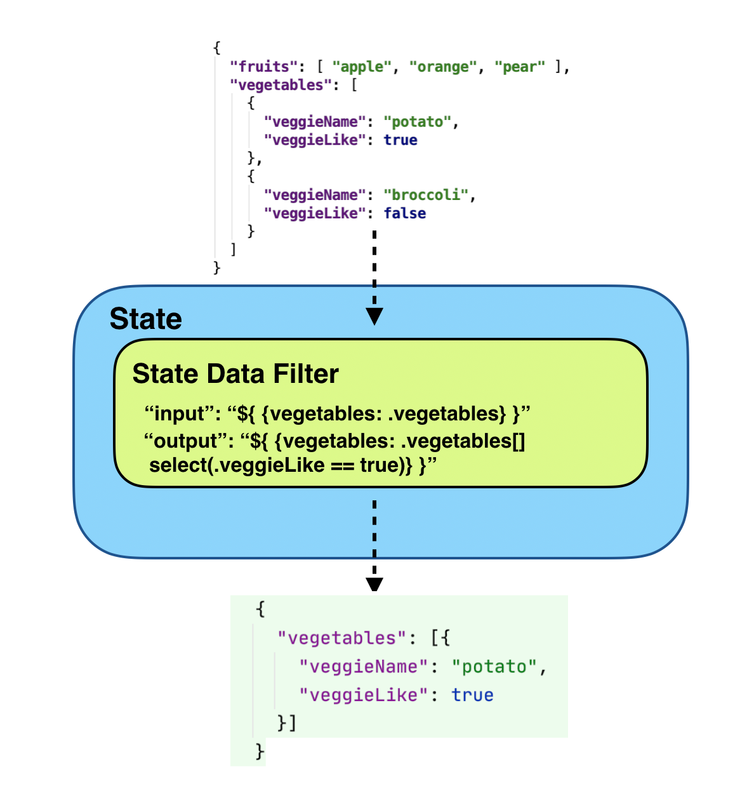

# Serverless Workflow

## Abstract

A specification for defining declarative workflow models
that orchestrate event-driven, serverless applications.

## Status of this document

This document is a working draft.

## Table of Contents

- [Overview](#Overview)
- [Specification Goals](#Specification-Goals)
- [Specification Details](#Specification-Details)
  - [Workflow Model](#Workflow-Model)
  - [Workflow Data](#Workflow-Data)
  - [Workflow Data Expressions](#Workflow-Data-Expressions)
  - [Workflow Definition](#Workflow-Definition)
  - [Workflow Error Handling](#Workflow-Error-Handling)
  - [Workflow Metadata](#Workflow-Metadata)
- [Extensions](#Extensions)
- [Use Cases](#Use-Cases)
- [Examples](#Examples)
- [References](#References)
- [License](#License)

## Overview

Workflows have become a key component for orchestration and execution management of event-driven microservices
(serverless applications).

The lack of a common way to define and model workflows means that developers must constantly re-learn 
how to write them. This also limits the potential for common libraries, tooling and 
infrastructure to aid modeling and execution of workflows across different cloud/container platforms.
Portability as well as productivity that can be achieved from workflow orchestration is hindered overall.

Serverless Workflow specification focuses on defining a `vendor-neutral`, `platform-independent`, and
`declarative` workflow model which can be used across multiple cloud/container platforms. 
This allows users to move their workflow definitions from one cloud/container platform to another and 
expect the exact same, defined, execution steps to be performed on each. 

For more information on the history, development and design rationale behind the specification, see the [Serverless Workflow Wiki](https://github.com/serverlessworkflow/specification/wiki).

## Specification Goals

The specification provides a [Workflow JSON Schema](schema/workflow.json)
which defines the structure of the workflow model. This allows workflow models to be defined in both
[JSON](https://www.json.org/json-en.html) and [YAML](https://yaml.org/) formats. Both are considered specification compliant
if they validate against the defined schema.

The specification also provides Software Development Kits (SDKs) for both [Go](https://github.com/serverlessworkflow/sdk-go) and [Java](https://github.com/serverlessworkflow/sdk-java)
and we plan to add them for more languages in the future.

In addition, the specification provides a set of [Workflow Extensions](extensions/README.md) which 
allow users to define additional, non-execution-related workflow information. This information can be used to improve
workflow performance. 
Some example workflow extensions include Key Performance Indicators (KPIs), Simulation, Tracing, etc 

We are also working on a Technology Compatibility Kit (TCK) to be used as a specification conformance
tool for runtime implementations.

The specification relies on runtime implementations to adopt the defined workflow model and provide execution semantics.

<p align="center">

</p>

With all this in place the specification goals focus on portability and vendor-neutrality. Using the workflow model
defined by the specification allows users to orchestrate event-driven microservices
on may different runtimes and cloud/container platforms.

<p align="center">

</p>

## Specification Details

Following sections provide a detailed descriptions of all parts of the workflow model. 

### Workflow Model

The Serverless Workflow model is composed of: 

* Set of [functions](#Function-Definition) (services) that need to be `invoked` during workflow execution. 
* Set of [events](#Event-Definition) that need to be `consumed` to start workflow instances, trigger functions, or be `produced` during workflow execution.
* Set of [states](#State-Definition) and [transitions](#Transitions) between them. States define the workflow `control flow logic`, manage workflow data, and can reference defined functions and events. 
Transitions connect workflow states.

The defined workflow model is a declarative language that can be used to model small or complex orchestrations
for event-driven, serverless applications.
to start workflow instances or trigger functions,

### Workflow Data

Serverless Workflow data is represented in [JSON](https://www.json.org/json-en.html) format.
Data flow during workflow execution can be divided into:

- [Workfow data input](#Workflow-data-input)
- [Event data](#Event-data)
- [Action data](#Action-data)
- [Information passing between states](#Information-passing-Between-States)
- [State Data filtering](#State-data-filtering)
- [Workflow data output](#Workflow-data-output)

### Workflow Data Expressions

Workflow model parameters may use expressions to access the JSON data. 
Note that different data filters play a big role as to which parts of the state data is queried against. Reference the 
[State Data Filtering](#State-Data-Filtering) section for more information.

All expressions must follow the [JsonPath](https://github.com/json-path/JsonPath) format and can be evaluated with a JsonPath expression evaluator. 
JsonPath expressions can select and extract the workflow JSON data. 

All expressions are written inside double braces:

```text
{{ expression }}
```

Expressions should be resolved and the result returned exactly where the expression is written.

To show some expression examples, let's say that we have the following JSON data:

```json
{
  "firstName": "John",
  "lastName" : "Doe",
  "age"      : 26,
  "address"  : {
    "streetAddress": "Naist street",
    "city"         : "Nara",
    "postalCode"   : "630-0192"
  },
  "phoneNumbers": [
    {
      "type"  : "iPhone",
      "number": "0123-4567-8888"
    },
    {
      "type"  : "home",
      "number": "0123-4567-8910"
    }
  ]
}
```

We can use an expression inside a string type parameter, for example:

```json
{
    "paramName": "Hello {{ $.firstName }} {{ $.lastName }}"
}
```

would set the value of `paramName` to `Hello John Doe`.

Expressions can also be used to select a portion of the JSON data, this is in particularly useful for data filters. For example:

```json
{
   "stateDataFilter": {
       "dataOutputPath": "{{ $.phoneNumbers }}"
   }
}
```

Would set the data output of the particular state to:

```json
[
   {
      "type" : "iPhone",
      "number" : "0123-4567-8888"
   },
   {
      "type" : "home",
      "number" : "0123-4567-8910"
   }
]
```

Some parameters require an expression to resolve to a boolean (true / false). In this case JsonPath expressions can also be used.
The expression should evaluate to true, if the result contains a subset of the JSON data, and false if it is empty. For example:

```json
{
   "isAdult" : "{{ $.[?(@.age  > 18)] }}"
}
```

would set the value if `isAdult` to true, as the expression returns a non-empty subset of the JSON data. Similarly 

```json
{
   "isChild" : "{{ $.[?(@.age  < 18)] }}"
}
```

would return false as the result of the JsonPath expression is empty.

JsonPath also includes a limited set of built-in functions that can be used inside expressions. For example the expression

```json
{
   "phoneNums" : "{{ $.phoneNumbers.length() }}"
}
```

would set the value of `phoneNums` to `2`.

As previously mentioned, expressions are evaluated against the subset of data that can see. For example 
the `parameters` param of the [functionRef definition](#FunctionRef-Definition) can evaluate expressions 
only against the data that is available to the [action](#Action-Definition) it belongs to.
One thing to note here are the top-level [workflow definition](#Workflow-Definition) parameters. Expressions defined
in them can only be evaluated against the initial [workflow data input](#Workflow-Data-Input) JSON.
For example let's say that we have a workflow data input of:

```json
{
   "inputVersion" : "1.0.0"
}
```

we can then define a workflow definition:

```json
{
   "id": "MySampleWorkflow",
   "name": "Sample Workflow",
   "version": "{{ $.inputVersion }}"
}
```

which would set the workflow version to `1.0.0`.

### Workflow Definition

| Parameter | Description | Type | Required |
| --- | --- |  --- | --- |
| id | Workflow unique identifier | string | yes |
| name | Workflow name | string | yes |
| description | Workflow description | string | no |
| version | Workflow version | string | no |
| schemaVersion | Workflow schema version | string | no |
| [dataInputSchema](#Workflow-Data-Input) | URI to JSON Schema that workflow data input adheres to | string | no |
| [dataOutputSchema](#Workflow-data-output) | URI to JSON Schema that workflow data output adheres to | string | no |
| [events](#Event-Definition) | Workflow event definitions. Defines events that can be consumed or produced | array | no |
| [functions](#Function-Definition) | Workflow function definitions | array | no |
| [states](#State-Definition) | Workflow states | array | yes |
| [metadata](#Workflow-Metadata) | Metadata information| object | no |

<details><summary><strong>Click to view example definition</strong></summary>
<p>

<table>
<tr>
    <th>JSON</th>
    <th>YAML</th>
</tr>
<tr>
<td valign="top">

```json
{  
   "id": "sampleWorkflow",
   "version": "1.0",
   "name": "Sample Workflow",
   "description": "Sample Workflow",
   "functions": [],
   "events": [],
   "states":[]
}
```

</td>
<td valign="top">

```yaml
id: sampleWorkflow
version: '1.0'
name: Sample Workflow
description: Sample Workflow
functions: []
events: []
states: []
```

</td>
</tr>
</table>

</details>

Defines the top-level structure of a serverless workflow model.
Following figure describes the main workflow definition blocks.

<p align="center">

</p>

#### Function Definition

| Parameter | Description | Type | Required |
| --- | --- | --- | --- |
| name | Unique function name | string | yes |
| resource | Function resource (URI) | string | yes |
| type | Function type | string | no |
| [metadata](#Workflow-Metadata) | Metadata information | object | no |

<details><summary><strong>Click to view example definition</strong></summary>
<p>

<table>
<tr>
    <th>JSON</th>
    <th>YAML</th>
</tr>
<tr>
<td valign="top">

```json
{  
   "name": "HelloWorldFunction",
   "resource": "https://hellworldservice.test.com:8443/api/hellofunction",
   "type": "REST",
   "metadata": {
      "authToken": "{{ $.token }}"
   }
}
```

</td>
<td valign="top">

```yaml
name: HelloWorldFunction
resource: https://hellworldservice.test.com:8443/api/hellofunction
type: REST
metadata:
  authToken: "{{ $.token }}"
```

</td>
</tr>
</table>

</details>

Function definitions allow one to define invocation information of services that need to be invoked during the
workflow execution. 

They can be referenced by name in [actions](#Action-Definition) defined in [Event](#Event-State), [Operation](#Operation-State), or [Callback](#Callback-State) workflow states.

The `resource` property defines the exposed URI of the service that allows its invocation (e.g., via REST).

The type parameter allows implementations to give more information regarding the function to the readers. 
It should not affect workflow execution or service invocation. 

Function definitions themselves do not define data input parameters as they are reusable definitions. Parameters can be 
defined via the `parameters` property of [function definitions](#FunctionRef-Definition) inside [actions](#Action-Definition).

#### Event Definition

| Parameter | Description | Type | Required |
| --- | --- | --- | --- |
| name | Unique event name | string | yes |
| source | CloudEvent source | string | yes if kind is set to "consumed", otherwise no |
| type | CloudEvent type | string | yes |
| kind | Defines the event is either `consumed` or `produced` by the workflow. Default is `consumed` | enum | no |
| [correlation](#Correlation-Definition) | Define event correlation rules for this event. Only used for consumed events | array | no |
| [metadata](#Workflow-Metadata) | Metadata information | object | no |

<details><summary><strong>Click to view example definition</strong></summary>
<p>

<table>
<tr>
    <th>JSON</th>
    <th>YAML</th>
</tr>
<tr>
<td valign="top">

```json
{  
   "name": "ApplicantInfo",
   "type": "org.application.info",
   "source": "applicationssource",
   "kind": "consumed",
   "correlation": [
    { 
      "contextAttributeName": "applicantId"
    } 
   ]
}
```

</td>
<td valign="top">

```yaml
name: ApplicantInfo
type: org.application.info
source: applicationssource
kind: consumed
correlation:
- contextAttributeName: applicantId
```

</td>
</tr>
</table>

</details>

Used to define events and their correlations. These events can be either consumed or produced during workflow execution.

The Serverless Workflow specification mandates that all events conform to the [CloudEvents](https://github.com/cloudevents/spec) specification. 
This is to assure consistency and portability of the events format used.

The `name` property defines the name of the event that is unique inside the workflow definition. This event name can be 
then referenced within [function](#Function-Definition) and [state](#State-Definition) definitions.

The `source` property matches this event definition with the [source](https://github.com/cloudevents/spec/blob/master/spec.md#source-1)
property of the CloudEvent required attributes.

The `type` property matches this event definition with the [type](https://github.com/cloudevents/spec/blob/master/spec.md#type) property of the 
CloudEvent required attributes.

The `kind` property defines this event as either `consumed` or `produced`. In terms of the workflow, this means it is either an event 
that triggers workflow instance creation, or continuation of workflow instance execution (consumed), or an event 
that the workflow instance creates during its execution (produced).
The default value (if not specified) of the `kind` property is `consumed`. 
Note that for `produced` event definitions, implementations must provide the value of the CloudEvent source attribute. 
In this case (i.e., when the `kind` property is set to `produced`), the `source` property of the event definition is not required.
Otherwise (i.e., when the `kind` property is set to `consumed`), the `source` property must be defined in the event definition.


Event correlation plays a big role in large event-driven applications. Correlating one or more events with a particular workflow instance
can be done by defining the event correlation rules within the `correlation` property. 
This property is an array of [correlation](#Correlation-Definition) definitions.
The CloudEvents specification allows users to add [Extension Context Attributes](https://github.com/cloudevents/spec/blob/master/spec.md#extension-context-attributes)
and the correlation definitions can use these attributes to define clear matching event correlation rules.
Extension context attributes are not part of the event payload, so they are serialized the same way as other standard required attributes.
This means that the event payload does not have to be inspected by implementations in order to read and evaluate the defined correlation rules.


Let's take a look at an example. Here we have two events that have an extension context attribute called "patientId" (as well as "department", which 
will be used in further examples below):

```json
{
    "specversion" : "1.0",
    "type" : "com.hospital.patient.heartRateMonitor",
    "source" : "hospitalMonitorSystem",
    "subject" : "HeartRateReading",
    "id" : "A234-1234-1234",
    "time" : "2020-01-05T17:31:00Z",
    "patientId" : "PID-12345",
    "department": "UrgentCare",
    "data" : {
      "value": "80bpm"
    }
}
```

and

```json
{
    "specversion" : "1.0",
    "type" : "com.hospital.patient.bloodPressureMonitor",
    "source" : "hospitalMonitorSystem",
    "subject" : "BloodPressureReading",
    "id" : "B234-1234-1234",
    "time" : "2020-02-05T17:31:00Z",
    "patientId" : "PID-12345",
    "department": "UrgentCare",
    "data" : {
      "value": "110/70"
    }
}
```

We can then define a correlation rule, through which all consumed events with the "hospitalMonitorSystem", and the "com.hospital.patient.heartRateMonitor"
type that have the **same** value of the `patientId` property to be correlated to the created workflow instance:

```json
{
"events": [
 {
  "name": "HeartRateReadingEvent",
  "source": "hospitalMonitorSystem",
  "type": "com.hospital.patient.heartRateMonitor",
  "kind": "consumed",
  "correlation": [
    { 
      "contextAttributeName": "patientId"
    }
  ]
 }
]
}
```

If a workflow instance is created (e.g., via Event state) by consuming a "HeartRateReadingEvent" event, all other consumed events
from the defined source and with the defined type that have the same "patientId" as the event that triggered the workflow instance
should then also be associated with the same instance.

You can also correlate multiple events together. In the following example, we assume that the workflow consumes two different event types
and we want to make sure that both are correlated, as in the above example, with the same "patientId": 


```json
{
"events": [
 {
  "name": "HeartRateReadingEvent",
  "source": "hospitalMonitorSystem",
  "type": "com.hospital.patient.heartRateMonitor",
  "kind": "consumed",
  "correlation": [
    { 
      "contextAttributeName": "patientId"
    }
  ]
 },
 {
   "name": "BloodPressureReadingEvent",
   "source": "hospitalMonitorSystem",
   "type": "com.hospital.patient.bloodPressureMonitor",
   "kind": "consumed",
   "correlation": [
       { 
         "contextAttributeName": "patientId"
       }
     ]
  }
]
}
```

Event correlation can be based on equality (values of the defined "contextAttributeName" must be equal), but it can also be based
on comparing it to custom defined values (string, or expression). For example:

```json
{
"events": [
 {
  "name": "HeartRateReadingEvent",
  "source": "hospitalMonitorSystem",
  "type": "com.hospital.patient.heartRateMonitor",
  "kind": "consumed",
  "correlation": [
    { 
      "contextAttributeName": "patientId"
    },
    {
      "contextAttributeName": "department",
      "contextAttributeValue" : "UrgentCare"
    }
  ]
 }
]
}
```

In this example, we have two correlation rules defined: The first one is on the "patientId" CloudEvent context attribute, meaning again that 
all consumed events from this source and type must have the same "patientId" to be considered. The second rule
says that these events must all have a context attribute named "department" with the value of "UrgentCare".

This allows developers to write orchestration workflows that are specifically targeted to patients that are in the hospital urgent care unit, 
for example.


#### Correlation Definition

| Parameter | Description | Type | Required |
| --- | --- | --- | --- |
| contextAttributeName | CloudEvent Extension Context Attribute name | string | yes |
| contextAttributeValue | CloudEvent Extension Context Attribute name | string  | no |

<details><summary><strong>Click to view example definition</strong></summary>
<p>

<table>
<tr>
    <th>JSON</th>
    <th>YAML</th>
</tr>
<tr>
<td valign="top">

```json
{  
   "correlation": [
       { 
         "contextAttributeName": "patientId"
       },
       {
         "contextAttributeName": "department",
         "contextAttributeValue" : "UrgentCare"
       }
     ]
}
```

</td>
<td valign="top">

```yaml
correlation:
- contextAttributeName: patientId
- contextAttributeName: department
  contextAttributeValue: UrgentCare
```

</td>
</tr>
</table>

</details>

Used to define event correlation rules. Only usable for `consumed` event definitions.

The `contextAttributeName` property defines the name of the CloudEvent [extension context attribute](https://github.com/cloudevents/spec/blob/master/spec.md#extension-context-attributes).
The `contextAttributeValue` property defines the value of the defined the CloudEvent [extension context attribute](https://github.com/cloudevents/spec/blob/master/spec.md#extension-context-attributes).

#### State Definition

States define building blocks of the Serverless Workflow. The specification defines the following states:

| Name | Description | Consumes events? | Produces events? | Executes actions? | Handles errors? | Allows parallel execution? | Makes data-based transitions? | Can be workflow start state? | Can be workflow end state? |
| --- | --- | --- | --- | --- | --- | --- | --- | --- | --- |
| **[Event](#Event-State)** | Define events that trigger action execution | yes | yes | yes | yes (includes retries) | yes | no | yes | yes |
| **[Operation](#Operation-State)** | Execute one or more actions | no | yes | yes | yes (includes retries) | yes | no | yes | yes |
| **[Switch](#Switch-State)** | Define data-based or event-based workflow transitions | no | yes | no | yes | no | yes | yes | no |
| **[Delay](#Delay-State)** | Delay workflow execution | no | yes | no | yes | no | no | yes | yes |
| **[Parallel](#Parallel-State)** | Causes parallel execution of branches (set of states) | no | yes | no | yes (includes retries) | yes | no | yes | yes |
| **[SubFlow](#SubFlow-State)** | Represents the invocation of another workflow from within a workflow | no | yes | no | yes | no | no | yes | yes |
| **[Inject](#Inject-State)** | Inject static data into state data | no | yes | no | yes | no | no | yes | yes |
| **[ForEach](#ForEach-State)** | Parallel execution of states for each element of a data array | no | yes | no | yes (includes retries) | yes | no | yes | yes |
| **[Callback](#Callback-State)** | Manual decision step. Executes a function and waits for callback event that indicates completion of the manual decision | yes | yes | yes (including retries) | yes | no | no | yes | yes |

The following is a detailed description of each of the defined states.

#### Event State

| Parameter | Description | Type | Required |
| --- | --- | --- | --- |
| id | Unique state id | string | no |
| name | State name | string | yes |
| type | State type | string | yes |
| exclusive | If true consuming one of the defined events causes its associated actions to be performed. If false all of the defined events must be consumed in order for actions to be performed. Default is "true"  | boolean | no |
| [eventsActions](#eventstate-eventactions) | Define the events to be consumed and one or more actions to be performed | array | yes |
| [timeout](#eventstate-timeout) | Time period to wait for incoming events (ISO 8601 format). For example: "PT15M" (wait 15 minutes), or "P2DT3H4M" (wait 2 days, 3 hours and 4 minutes)| string | no |
| [stateDataFilter](#state-data-filter) | State data filter definition| object | no |
| [dataInputSchema](#Information-Passing-Between-States) | URI to JSON Schema that state data input adheres to | string | no |
| [dataOutputSchema](#Information-Passing-Between-States) | URI to JSON Schema that state data output adheres to | string | no |
| [transition](#Transitions) | Next transition of the workflow after all the actions have been performed | object | yes |
| [retry](#workflow-retrying) | States retry definitions | array | no |
| [onError](#Workflow-Error-Handling) | States error handling definitions | array | no |
| [start](#Start-Definition) | Is this state a starting state | object | no |
| [end](#End-Definition) | Is this state an end state | object | no |
| [metadata](#Workflow-Metadata) | Metadata information| object | no |

<details><summary><strong>Click to view example definition</strong></summary>
<p>

<table>
<tr>
    <th>JSON</th>
    <th>YAML</th>
</tr>
<tr>
<td valign="top">

```json
{
"name": "MonitorVitals",
"type": "event",
"start": {
    "kind": "default"
},
"exclusive": true,
"eventsActions": [{
        "eventRefs": ["HighBodyTemperature"],
        "actions": [{
            "functionRef": {
                "refName": "sendTylenolOrder",
                "parameters": {
                    "patientid": "{{ $.patientId }}"
                }
            }
        }]
    },
    {
        "eventRefs": ["HighBloodPressure"],
        "actions": [{
            "functionRef": {
                "refName": "callNurse",
                "parameters": {
                    "patientid": "{{ $.patientId }}"
                }
            }
        }]
    },
    {
        "eventRefs": ["HighRespirationRate"],
        "actions": [{
            "functionRef": {
                "refName": "callPulmonologist",
                "parameters": {
                    "patientid": "{{ $.patientId }}"
                }
            }
        }]
    }
],
"end": {
    "kind": "terminate"
}
}
```

</td>
<td valign="top">

```yaml
name: MonitorVitals
type: event
start:
  kind: default
exclusive: true
eventsActions:
- eventRefs:
  - HighBodyTemperature
  actions:
  - functionRef:
      refName: sendTylenolOrder
      parameters:
        patientid: "{{ $.patientId }}"
- eventRefs:
  - HighBloodPressure
  actions:
  - functionRef:
      refName: callNurse
      parameters:
        patientid: "{{ $.patientId }}"
- eventRefs:
  - HighRespirationRate
  actions:
  - functionRef:
      refName: callPulmonologist
      parameters:
        patientid: "{{ $.patientId }}"
end:
  kind: terminate
```

</td>
</tr>
</table>

</details>

Event states await one or more events and perform actions when they are received.
If defined as the workflow starting state, the event state definition controls when the workflow
instances should be created.

The `exclusive` property determines if the state should wait for any of the defined events in the eventsActions array, or 
if all defined events must be present for their associated actions to be performed.

Following two figures illustrate the `exclusive` property:

<p align="center">

</p>

If the event state in this case is a starting state, the occurence of *any* of the defined events would start a new workflow instance.

<p align="center">

</p>

If the event state in this case is a starting state, the occurrence of *all* defined events would start a new
 workflow instance.
  
In order to consider only events that are related to each other, we need to set the `correlation` property in the workflow
 [events definitions](#Event-Definition). This allows us to set up event correlation rules against the events 
 extension context attributes.

The `timeout` property defines the time duration from the invocation of the event state. If the defined events
have not been received during this time, the state should transition to the next state or end the workflow execution (i.e., if it is an end state).

#### <a name="eventstate-eventactions"></a> Event State: Event Actions

| Parameter | Description | Type | Required |
| --- | --- | --- | --- |
| eventRefs | References one or more unique event names in the defined workflow [events](#Event-Definition) | array | yes |
| actionMode | Specifies how actions are to be performed (in sequence of parallel) | string | no |
| [actions](#Action-Definition) | Actions to be performed | array | yes |
| [eventDataFilter](#event-data-filter) | Event data filter definition | object | no |

<details><summary><strong>Click to view example definition</strong></summary>
<p>

<table>
<tr>
    <th>JSON</th>
    <th>YAML</th>
</tr>
<tr>
<td valign="top">

```json
{
    "eventRefs": ["HighBodyTemperature"],
    "actions": [{
        "functionRef": {
            "refName": "sendTylenolOrder",
            "parameters": {
                "patientid": "{{ $.patientId }}"
            }
        }
    }]
}
```

</td>
<td valign="top">

```yaml
eventRefs:
- HighBodyTemperature
actions:
- functionRef:
    refName: sendTylenolOrder
    parameters:
      patientid: "{{ $.patientId }}"
```

</td>
</tr>
</table>

</details>

Event actions reference one or more events in the workflow [events definitions](#Event-Definition).
Both the source and type of incoming events must match the ones defined in the references events in order for
the event to be considered. 

You can set event correlation rules via the `correlation` property. See more info on event correlation [here](#Correlation-Definition).

The actions array property defines a list of actions to be performed.

#### <a name="eventstate-timeout"></a> Event State: Timeout

The event state timeout period is described in the ISO 8601 data and time format.
You can specify for example "PT15M" to represent 15 minutes or "P2DT3H4M" to represent 2 days, 3 hours and 4 minutes.
Timeout values should always be represented as durations and not as time/repeating intervals.

The timeout property needs to be described in detail as it depends on whether or not the event state is a starting workflow
state or not.

If the event state is a starting state, incoming events may trigger workflow instances. If the event waits for
any of the defined events (exclusive property is set to true), the timeout property should be ignored.

If exclusive property is set to false (all defined events must occur), the defined timeout represents the time
between arrival of specified events. To give an example, consider the following:

```json
{
"states": [
{
    "name": "ExampleEventState",
    "type": "event",
    "exclusive": false,
    "timeout": "PT2M",
    "eventsActions": [
        {
            "eventRefs": [
                "ExampleEvent1",
                "ExampleEvent2",
                "ExampleEvent3"
            ],
            "actions": [
            ]
        }
    ],
    "end": {
        "kind": "terminate"
    }
}
]
}
```

The first timeout would start once any of the referenced events are consumed. If the next event does not occur within
the defined timeout, no workflow instance should be created. Otherwise, the timeout
resets while we are waiting for the next defined event.

If the event state is not a starting state, the timeout property is relative to the time when the
state becomes active. If the defined event conditions (regardless of the value of the exclusive property)
are not satisfied within the defined timeout period, the event state should transition to the next state or end the workflow
instance in case it is an end state without performing any actions.

#### Action Definition

| Parameter | Description | Type | Required |
| --- | --- | --- | --- |
| name | Unique action name | string | no |
| [functionRef](#FunctionRef-Definition) | References a reusable function definition | object | yes if `eventRef` is not used |
| [eventRef](#EventRef-Definition) | References a `trigger` and `result` reusable event definitions | object | yes if `functionRef` is not used |
| timeout | Time period to wait for function execution to complete or the resultEventRef to be consumed (ISO 8601 format). For example: "PT15M" (15 minutes), or "P2DT3H4M" (2 days, 3 hours and 4 minutes)| string | no |
| [actionDataFilter](#action-data-filter) | Action data filter definition | object | no |

<details><summary><strong>Click to view example definition</strong></summary>
<p>

<table>
<tr>
    <th>JSON</th>
    <th>YAML</th>
</tr>
<tr>
<td valign="top">

```json
{
    "name": "Finalize Application Action",
    "functionRef": {
        "refName": "finalizeApplicationFunction",
        "parameters": {
            "student": "{{ $.applicantId }}"
        }
    },
    "timeout": "PT15M"
}
```

</td>
<td valign="top">

```yaml
name: Finalize Application Action
functionRef:
  refName: finalizeApplicationFunction
  parameters:
    student: "{{ $.applicantId }}"
timeout: PT15M
```

</td>
</tr>
</table>

</details>

Actions specify invocations of services during workflow execution.
Service invocation can be done in two different ways:

* Reference [functions definitions](#Function-Definition) by its unique name using the `functionRef` property.
* Reference a `produced` and `consumed` [event definitions](#Event-Definition) via the `eventRef` property. 
In this scenario a service or a set of services we want to invoke
are not exposed via a specific resource URI for example, but can only be invoked via events. 
The [eventRef](#EventRef-Definition) defines the 
referenced `produced` event via its `triggerEventRef` property and a `consumed` event via its `resultEventRef` property.

The `timeout` property defines the amount of time to wait for function execution to complete or the consumed event referenced by the 
`resultEventRef` to become available.
It is described in ISO 8601 format, so for example "PT2M" would mean the maximum time for the function to complete
its execution is two minutes. 

If the set timeout period is exceeded, the state should handle this via its ["retry" and "onError" definitions](#workflow-retrying).
In the case they are not defined, the state should proceed with transitioning to the next state, or ending 
the workflow execution in case it is an end state. 

#### FunctionRef Definition

| Parameter | Description | Type | Required |
| --- | --- | --- | --- |
| refName | Name of the referenced [function](#Function-Definition) | string | yes |
| parameters | Parameters to be passed to the referenced function | object | no |

<details><summary><strong>Click to view example definition</strong></summary>
<p>

<table>
<tr>
    <th>JSON</th>
    <th>YAML</th>
</tr>
<tr>
<td valign="top">

```json
{
    "refName": "finalizeApplicationFunction",
    "parameters": {
        "student": "{{ $.applicantId }}"
    }
}
```

</td>
<td valign="top">

```yaml
refName: finalizeApplicationFunction
parameters:
  student: "{{ $.applicantId }}"
```

</td>
</tr>
</table>

</details>

Used by actions to reference a defined serverless function by its unique name. Parameters are values passed to the
function. They can include either static values or reference the states data input.

#### EventRef Definition

| Parameter | Description | Type | Required |
| --- | --- | --- | --- |
| [triggerEventRef](#Event-Definition) | Reference to the unique name of a `produced` event definition | string | yes |
| [resultEventRef](#Event-Definitions) | Reference to the unique name of a `consumed` event definition | string | yes |
| data | If string type, an expression which selects parts of the states data output to become the data (payload) of the produced event. If object type, a custom object to become the data (payload) of trigger/produced event. | string or object | no |
| contextAttributes | Add additional event extension context attributes to the trigger/produced event | object | no |

<details><summary><strong>Click to view example definition</strong></summary>
<p>

<table>
<tr>
    <th>JSON</th>
    <th>YAML</th>
</tr>
<tr>
<td valign="top">

```json
{
   "eventRef": {
      "triggerEventRef": "MakeVetAppointment",
      "data": "{{ $.patientInfo }}",
      "resultEventRef":  "VetAppointmentInfo"
   }
}
```

</td>
<td valign="top">

```yaml
eventRef:
  triggerEventRef: MakeVetAppointment
  data: "{{ $.patientInfo }}"
  resultEventRef: VetAppointmentInfo
```

</td>
</tr>
</table>

</details>

References a `produced` and `consumed` [event definitions](#Event-Definition) via the "triggerEventRef" and `resultEventRef` properties, respectively.

The `data` property can have two types: string or object. If it is of string type, it is an expression that can select parts of state data
to be used as the trigger/produced event payload. If it is of object type, you can define a custom object to be the event payload.

The `contextAttributes` property allows you to add one or more [extension context attributes](https://github.com/cloudevents/spec/blob/master/spec.md#extension-context-attributes)
to the trigger/produced event. 

#### Error Definition

Error definitions define runtime errors that can occur during workflow execution and how to handle them. For more information,
see the [Workflow Error Handling section](#Workflow-Error-Handling).

| Parameter | Description | Type | Required |
| --- | --- | --- | --- |
| expression | JsonPath expression. Should be evaluated against error data. True if expression result is not empty | string | yes |
| [errorDataFilter](#error-data-filter) | Error data filter definition | object | yes |
| [transition](#Transitions) | Next transition of the workflow when `expression` is true | object | yes |

<details><summary><strong>Click to view example definition</strong></summary>
<p>

<table>
<tr>
    <th>JSON</th>
    <th>YAML</th>
</tr>
<tr>
<td valign="top">

```json
{
   "expression": "{{ $.exceptions }}",
   "errorDataFilter": {
     "dataOutputPath": "{{ $.exceptions[0] }}"
   },
   "transition": {
     "nextState": "SubmitError"
   }
}
```

</td>
<td valign="top">

```yaml
expression: "{{ $.exceptions }}"
errorDataFilter:
  dataOutputPath: "{{ $.exceptions[0] }}"
transition:
  nextState: SubmitError
```

</td>
</tr>
</table>

</details>

#### Retry Definition

| Parameter | Description | Type | Required |
| --- | --- | --- | --- |
| expression | JsonPath expression. Should be evaluated against state data. True if the expression result is not empty. | string | yes |
| interval | Interval value for retry (ISO 8601 repeatable format). For example: "R5/PT15M" (Starting from now repeat 5 times with 15 minute intervals)| string | no |
| multiplier | Multiplier value by which interval increases during each attempt (ISO 8601 time format). For example: "PT3S" meaning the second attempt interval is increased by 3 seconds, the third interval by 6 seconds and so on | string | no |
| maxAttempts | Maximum number of retry attempts. Value of 0 means no retries are performed | string or integer | no |

<details><summary><strong>Click to view example definition</strong></summary>
<p>

<table>
<tr>
    <th>JSON</th>
    <th>YAML</th>
</tr>
<tr>
<td valign="top">

```json
{
   "expression": "{{ $.errors[?(@.name == 'FunctionError')] }}",
   "interval": "PT2M",
   "maxAttempts": 3
}
```

</td>
<td valign="top">

```yaml
expression: "{{ $.errors[?(@.name == 'FunctionError')] }}"
interval: PT2M
maxAttempts: 3
```

</td>
</tr>
</table>

</details>

Defines the state retry policy. 
The `expression` property is a JsonPath expression that is evaluated against state data.
This assures that both execution errors as well as actions error results can be used during evaluation.
The expression must evaluate return a result in order to be true.

The `interval` property specifies the retry interval (in ISO 8601 repeatable format). For example, "R5/PT1M" would mean repeat 5 times with 1 minute intervals before each retry.

The `multiplier` property specifies the value by which the interval time is increased for each of the retry attempts.
To explain this better, let's say we have:

```json
{
  "expression": "...",
  "interval": "R4/PT1M",
  "multiplier": "PT2M",
  "maxAttempts": 4
}
```

which means that we will retry 4 times after waiting 1, 3 (1 + 2), 5 (1 + 2 + 2), and 7 (1 + 2 + 2 + 2) minutes.  

The maxAttempts property determines the maximum number of retry attempts allowed. If this property is set to 0 no retries are performed.

For more information, refer to the [Workflow Error Handling - Retrying](#workflow-retrying) section.

#### Transition Definition

| Parameter | Description | Type | Required |
| --- | --- | --- | --- |
| expression | JsonPath expression. Must return a result for the transition to be valid | string | no |
| [produceEvent](#ProduceEvent-Definition) | Event to be produced when this transition happens | object | no |
| [nextState](#Transitions) | State to transition to next | string | yes |

<details><summary><strong>Click to view example definition</strong></summary>
<p>

<table>
<tr>
    <th>JSON</th>
    <th>YAML</th>
</tr>
<tr>
<td valign="top">

```json
{
   "expression": "{{ $.result }}",
   "produceEvent": {
       "eventRef": "produceResultEvent",
       "data": "{{ $.result.data }}"
   },
   "nextState": "EvalResultState"
}
```

</td>
<td valign="top">

```yaml
expression: "{{ $.result }}"
produceEvent:
  eventRef: produceResultEvent
  data: "{{ $.result.data }}"
nextState: EvalResultState
```

</td>
</tr>
</table>

</details>

Defines a transition from point A to point B in the serverless workflow. For more information, see the
[Transitions section](#Transitions).

#### Operation State

| Parameter | Description | Type | Required |
| --- | --- | --- | --- |
| id |  Unique state id | string | no |
| name | State name | string | yes |
| type | State type | string | yes |
| actionMode | Should actions be performed sequentially or in parallel | string | no |
| [actions](#Action-Definition) | Actions to be performed | array | yes |
| [stateDataFilter](#state-data-filter) | State data filter | object | no |
| [retry](#workflow-retrying) | States retry definitions | array | no |
| [onError](#Workflow-Error-Handling) | States error handling definitions | array | no |
| [transition](#Transitions) | Next transition of the workflow after all the actions have been performed | object | yes (if end is not defined) |
| [dataInputSchema](#Information-Passing-Between-States) | URI to JSON Schema that state data input adheres to | string | no |
| [dataOutputSchema](#Information-Passing-Between-States) | URI to JSON Schema that state data output adheres to | string | no |
| [metadata](#Workflow-Metadata) | Metadata information| object | no |
| [start](#Start-Definition) | Is this state a starting state | object | no |
| [end](#End-Definition) | Is this state an end state | object | no |

<details><summary><strong>Click to view example definition</strong></summary>
<p>

<table>
<tr>
    <th>JSON</th>
    <th>YAML</th>
</tr>
<tr>
<td valign="top">

```json
{
    "name": "RejectApplication",
    "type": "operation",
    "actionMode": "sequential",
    "actions": [
        {
            "functionRef": {
                "refName": "sendRejectionEmailFunction",
                "parameters": {
                    "applicant": "{{ $.customer }}"
                }
            }
        }
    ],
    "end": {
        "kind": "default"
    }
}
```

</td>
<td valign="top">

```yaml
name: RejectApplication
type: operation
actionMode: sequential
actions:
- functionRef:
    refName: sendRejectionEmailFunction
    parameters:
      applicant: "{{ $.customer }}"
end:
  kind: default
```

</td>
</tr>
</table>

</details>

Operation state defines a set of actions to be performed in sequence or in parallel.
Once all actions have been performed, a transition to another state can occur.

#### Switch State

| Parameter | Description | Type | Required |
| --- | --- | --- | --- |
| id | Unique state id | string | no |
| name | State name | string | yes |
| type | State type | string | yes |
| [dataConditions](#switch-state-dataconditions) or [eventConditions](#switch-state-eventconditions) | Defined if the Switch state evaluates conditions and transitions based on state data, or arrival of events. | array | yes (one) |
| [stateDataFilter](#state-data-filter) | State data filter | object | no |
| [onError](#Workflow-Error-Handling) | States error handling definitions | array | no |
| eventTimeout | If eventConditions is used, defines the time period to wait for events (ISO 8601 format). For example: "PT15M" (15 minutes), or "P2DT3H4M" (2 days, 3 hours and 4 minutes)| string | yes only if eventConditions is defined |
| [default](#Transitions) | Next transition of the workflow if there is no matching data conditions, or event timeout is reached | object | yes |
| [dataInputSchema](#Information-Passing-Between-States) | URI to JSON Schema that state data input adheres to | string | no |
| [dataOutputSchema](#Information-Passing-Between-States) | URI to JSON Schema that state data output adheres to | string | no |
| [metadata](#Workflow-Metadata) | Metadata information| object | no |
| [start](#Start-Definition) | Is this state a starting state | object | no |

<details><summary><strong>Click to view example definition</strong></summary>
<p>

<table>
<tr>
    <th>JSON</th>
    <th>YAML</th>
</tr>
<tr>
<td valign="top">

```json
{  
     "name":"CheckVisaStatus",
     "type":"switch",
     "start": {
        "kind": "default"
     },
     "eventConditions": [
        {
          "eventRef": "visaApprovedEvent",
          "transition": {
            "nextState": "HandleApprovedVisa"
          }
        },
        {
          "eventRef": "visaRejectedEvent",
          "transition": {
            "nextState": "HandleRejectedVisa"
          }
        }
     ],
     "eventTimeout": "PT1H",
     "default": {
        "nextState": "HandleNoVisaDecision"
     }
}
```

</td>
<td valign="top">

```yaml
name: CheckVisaStatus
type: switch
start:
  kind: default
eventConditions:
- eventRef: visaApprovedEvent
  transition:
    nextState: HandleApprovedVisa
- eventRef: visaRejectedEvent
  transition:
    nextState: HandleRejectedVisa
eventTimeout: PT1H
default:
  nextState: HandleNoVisaDecision
```

</td>
</tr>
</table>

</details>

Switch states can be viewed as workflow gateways: they can direct transitions of a workflow based on certain conditions.
There are two types of conditions for switch states:
* [Data-based conditions](#switch-state-dataconditions)
* [Event-based conditions](#switch-state-eventconditions)

These are exclusive, meaning that a switch state can define one or the other condition type, but not both.

In case of data-based conditions definition, switch state controls workflow transitions based on the states data.
If no defined conditions can be matched, the state transitions based on the defined "default" transition property.

For event-based conditions, a switch state acts as a workflow wait state. It halts workflow execution 
until one of the referenced events arrive, then making a transition depending on that event definition.
If events defined in event-based conditions do not arrive before the states `eventTimeout` property expires, 
 state transitions are based on the defined "default" transition property.

Switch states cannot be workflow ending states.

#### <a name="switch-state-dataconditions"></a>Switch State: Data Conditions

| Parameter | Description | Type | Required |
| --- | --- | --- | --- |
| condition | JsonPath expression evaluated against state data. True if results are not empty | string | yes |
| [transition](#Transitions) | Next transition of the workflow if condition is matched | object | yes |
| [metadata](#Workflow-Metadata) | Metadata information| object | no |

<details><summary><strong>Click to view example definition</strong></summary>
<p>

<table>
<tr>
    <th>JSON</th>
    <th>YAML</th>
</tr>
<tr>
<td valign="top">

```json
{
      "condition": "{{ $.applicants[?(@.age >= 18)] }}",
      "transition": {
        "nextState": "StartApplication"
      }
}
```

</td>
<td valign="top">

```yaml
condition: "{{ $.applicants[?(@.age >= 18)] }}"
transition:
  nextState: StartApplication
```

</td>
</tr>
</table>

</details>

Switch state data conditions specify a data-based condition statement, which causes a transition to another 
workflow state if evaluated to true.
The `condition` property of the condition defines a JsonPath expression (e.g., `$.applicants[?(@.age >= 18)]`), which selects
parts of the state data input. The condition is evaluated as "true" if it results a non-empty result.

#### <a name="switch-state-eventconditions"></a>Switch State: Event Conditions

| Parameter | Description | Type | Required |
| --- | --- | --- | --- |
| eventRef | References an unique event name in the defined workflow events | string | yes |
| [transition](#Transitions) | Next transition of the workflow if condition is matched | object | yes |
| [eventDataFilter](#event-data-filter) | Event data filter definition | object | no |
| [metadata](#Workflow-Metadata) | Metadata information| object | no |

<details><summary><strong>Click to view example definition</strong></summary>
<p>

<table>
<tr>
    <th>JSON</th>
    <th>YAML</th>
</tr>
<tr>
<td valign="top">

```json
{
      "eventRef": "visaApprovedEvent",
      "transition": {
        "nextState": "HandleApprovedVisa"
      }
}
```

</td>
<td valign="top">

```yaml
eventRef: visaApprovedEvent
transition:
  nextState: HandleApprovedVisa
```

</td>
</tr>
</table>

</details>

Switch state event conditions specify events, which the switch state must wait for. Each condition
can reference one workflow-defined event. Upon arrival of this event, the associated transition is taken.
The `eventRef` property references a name of one of the defined workflow events. 
The `transition` property defines the workflow transition to be taken when the referenced event arrives.
the "eventDataFilter" defines the event data filter to be used to filter event data before the transition is made.

#### Delay State

| Parameter | Description | Type | Required |
| --- | --- | --- | --- |
| id | Unique state id | string | no |
| name |State name | string | yes |
| type |State type | string | yes |
| timeDelay |Amount of time (ISO 8601 format) to delay when in this state. For example: "PT15M" (delay 15 minutes), or "P2DT3H4M" (delay 2 days, 3 hours and 4 minutes) | integer | yes |
| [stateDataFilter](#state-data-filter) | State data filter | object | no |
| [onError](#Workflow-Error-Handling) | States error handling definitions | array | no |
| [transition](#Transitions) | Next transition of the workflow after the delay | object | yes (if end is not defined) |
| [dataInputSchema](#Information-Passing-Between-States) | URI to JSON Schema that state data input adheres to | string | no |
| [dataOutputSchema](#Information-Passing-Between-States) | URI to JSON Schema that state data output adheres to | string | no |
| [start](#Start-Definition) | Is this state a starting state | object | no |
| [end](#End-Definition) |If this state an end state | object | no |

<details><summary><strong>Click to view example definition</strong></summary>
<p>

<table>
<tr>
    <th>JSON</th>
    <th>YAML</th>
</tr>
<tr>
<td valign="top">

```json
{
      "name": "WaitForCompletion",
      "type": "delay",
      "timeDelay": "PT5S",
      "transition": {
        "nextState":"GetJobStatus"
      }
}
```

</td>
<td valign="top">

```yaml
name: WaitForCompletion
type: delay
timeDelay: PT5S
transition:
  nextState: GetJobStatus
```

</td>
</tr>
</table>

</details>

Delay state waits for a certain amount of time before transitioning to a next state. The amount of delay is specified by the `timeDelay` property in ISO 8601 format.

#### Parallel State

| Parameter | Description | Type | Required |
| --- | --- | --- | --- |
| id | Unique state id | string | no |
| name | State name | string | yes |
| type | State type | string | yes |
| [branches](#parallel-state-branch) | List of branches for this parallel state| array | yes |
| completionType | Option types on how to complete branch execution. | enum | no |
| n | Used when branchCompletionType is set to `n_of_m` to specify the `n` value. | string or integer | no |
| [stateDataFilter](#state-data-filter) | State data filter | object | no |
| [retry](#workflow-retrying) | States retry definitions | array | no |
| [onError](#Workflow-Error-Handling) | States error handling definitions | array | no |
| [transition](#Transitions) | Next transition of the workflow after all branches have completed execution | object | yes (if end is not defined) |
| dataInputSchema | URI to JSON Schema that state data input adheres to | string | no |
| dataOutputSchema | URI to JSON Schema that state data output adheres to | string | no |
| [metadata](#Workflow-Metadata) | Metadata information| object | no |
| [start](#Start-Definition) | Is this state a starting state | object | no |
| [end](#End-Definition) | If this state and end state | object | no |

<details><summary><strong>Click to view example definition</strong></summary>
<p>

<table>
<tr>
    <th>JSON</th>
    <th>YAML</th>
</tr>
<tr>
<td valign="top">

```json
 {  
     "name":"ParallelExec",
     "type":"parallel",
     "start": {
       "kind": "default"
     },
     "completionType": "and",
     "branches": [
        {
          "name": "Branch1",
          "actions": [
            {
                "functionRef": {
                    "refName": "functionNameOne",
                    "parameters": {
                        "order": "{{ $.someParam }}"
                    }
                }
            }
        ]
        },
        {
          "name": "Branch2",
          "actions": [
              {
                  "functionRef": {
                      "refName": "functionNameTwo",
                      "parameters": {
                          "order": "{{ $.someParam }}"
                      }
                  }
              }
          ]
        }
     ],
     "end": {
       "kind": "default"
     }
}
```

</td>
<td valign="top">

```yaml
name: ParallelExec
type: parallel
start:
  kind: default
completionType: and
branches:
- name: Branch1
  actions:
  - functionRef:
      refName: functionNameOne
      parameters:
        order: "{{ $.someParam }}"
- name: Branch2
  actions:
  - functionRef:
      refName: functionNameTwo
      parameters:
        order: "{{ $.someParam }}"
end:
  kind: default
```

</td>
</tr>
</table>

</details>

Parallel state defines a collection of `branches` that are executed in parallel.

Branches contain set of actions that need to be performed or a reference to another workflow that needs to be executed. 

The "completionType" enum specifies the different ways of completing branch execution:
* and: All branches must complete execution before state can perform its transition
* xor: State can transition when one of the branches completes execution
* n_of_m: State can transition once `n` number of branches have completed execution. In this case you should also
specify the `n` property to define this number.

Exceptions may occur during execution of branches of the Parallel state, this is described in detail in [this section](#parallel-state-exceptions).

#### <a name="parallel-state-branch"></a>Parallel State: Branch

| Parameter | Description | Type | Required |
| --- | --- | --- | --- |
| name | Branch name | string | yes |
| [actions](#Action-Definition) | Actions to be executed in this branch | array | yes if workflowId is not defined |
| workflowId | Unique Id of a workflow to be executed in this branch | string | yes if actions is not defined |

<details><summary><strong>Click to view example definition</strong></summary>
<p>

<table>
<tr>
    <th>JSON</th>
    <th>YAML</th>
</tr>
<tr>
<td valign="top">

```json
{
      "name": "Branch1",
      "actions": [
          {
              "functionRef": {
                  "refName": "functionNameOne",
                  "parameters": {
                      "order": "{{ $.someParam }}"
                  }
              }
          },
          {
              "functionRef": {
                  "refName": "functionNameTwo",
                  "parameters": {
                      "order": "{{ $.someParamTwo }}"
                  }
              }
          }
      ]
}
```

</td>
<td valign="top">

```yaml
name: Branch1
actions:
- functionRef:
    refName: functionNameOne
    parameters:
      order: "{{ $.someParam }}"
- functionRef:
    refName: functionNameTwo
    parameters:
      order: "{{ $.someParamTwo }}"
```

</td>
</tr>
</table>

</details>

Each branch receives the same copy of the Parallel state's data input.

A branch can define either actions or a workflow id of the workflow that needs to be executed.
The workflow id defined cannot be the same id of the workflow there the branch is defined.

#### <a name="parallel-state-exceptions"></a>Parallel State: Handling Exceptions

Exceptions can occur during execution of Parallel state branches.

By default, exceptions that are not handled within branches stop branch execution and are propagated 
to the Parallel state.

If the parallel states branch defines actions, all exceptions are propagated to the parallel state 
and can be handled with the parallel states `onError` definition.

If the parallel states defines a `workflowId`, exceptions that occur during execution of the called workflow
can chose to handle exceptions on their own. All unhandled exceptions from the called workflow
execution however are propagated back to the parallel state and can be handled with the parallel states
`onError` definition.

The same rules should apply for any timeout exception.

For more information, see the [workflow error handling and retrying section](#workflow-retrying).

#### SubFlow State

| Parameter | Description | Type | Required |
| --- | --- | --- | --- |
| id | Unique state id | string | no |
| name |State name | string | yes |
| type |State type | string | yes |
| waitForCompletion |If workflow execution must wait for sub-workflow to finish before continuing | boolean | yes |
| workflowId |Sub-workflow unique id | boolean | no |
| [stateDataFilter](#state-data-filter) | State data filter | object | no |
| [onError](#Workflow-Error-Handling) | States error handling definitions | array | no |
| [transition](#Transitions) |Next transition of the workflow after subflow has completed | object | yes (if end is not defined) |
| dataInputSchema | URI to JSON Schema that state data input adheres to | string | no |
| dataOutputSchema | URI to JSON Schema that state data output adheres to | string | no |
| [metadata](#Workflow-Metadata) | Metadata information| object | no |
| [start](#Start-Definition) | Is this state a starting state | object | no |
| [end](#End-Definition) | If this state and end state | object | no |

<details><summary><strong>Click to view example definition</strong></summary>
<p>

<table>
<tr>
    <th>JSON</th>
    <th>YAML</th>
</tr>
<tr>
<td valign="top">

```json
{
    "name": "HandleApprovedVisa",
    "type": "subflow",
    "workflowId": "handleApprovedVisaWorkflowID",
    "end": {
      "kind": "default"
    }
}
```

</td>
<td valign="top">

```yaml
name: HandleApprovedVisa
type: subflow
workflowId: handleApprovedVisaWorkflowID
end:
  kind: default
```

</td>
</tr>
</table>

</details>

It is often the case that you want to group your workflows into small, reusable logical units that perform certain needed functionality.
Even though you can use the Event or Callback states to call externally deployed services (via function), at times
there is a need to include/inject another serverless workflow (from classpath/local file system etc, depending on the implementation logic).
In that case you would use the SubFlow state.
It also allows developers to model their workflows with reusability and logical grouping in mind.

This state allows developers to include/inject a uniquely identified sub-workflow and start its execution.
Another use of this state is within [branches](#parallel-state-branch) of the [Parallel State](#Parallel-State). 
Instead of having to define all states
in each branch, you could separate the branch states into individual sub-workflows and call the SubFlow state
as a single state in each.

Sub-workflows must have a defined start and end states.
The `waitForCompletion` property defines if the SubFlow state should wait until execution of the sub-workflow
is completed or not.

Each sub-workflow receives the same copy of the SubFlow state's data input.
If the `waitForCompletion` property is set to true, sub-workflows have the ability to edit the parent's workflow data.
If the `waitForCompletion` property is set to false, data access to the parent workflow should not be allowed.

Sub-workflows inherit all the [function](#Function-Definition) and [event](#Event-Definition) definitions of their parent workflow.

#### Inject State

| Parameter | Description | Type | Required |
| --- | --- | --- | --- |
| id | Unique state id | string | no |
| name | State name | string | yes |
| type | State type | string | yes |
| data | JSON object which can be set as state's data input and can be manipulated via filter | object | no |
| [stateDataFilter](#state-data-filter) | State data filter | object | no |
| [transition](#Transitions) | Next transition of the workflow after subflow has completed | object | yes (if end is set to false) |
| dataInputSchema | URI to JSON Schema that state data input adheres to | string | no |
| dataOutputSchema | URI to JSON Schema that state data output adheres to | string | no |
| [metadata](#Workflow-Metadata) | Metadata information| object | no |
| [start](#Start-Definition) | Is this state a starting state | object | no |
| [end](#End-Definition) | If this state and end state | object | no |

<details><summary><strong>Click to view example definition</strong></summary>
<p>

<table>
<tr>
    <th>JSON</th>
    <th>YAML</th>
</tr>
<tr>
<td valign="top">

```json
{  
     "name":"Hello",
     "type":"inject",
     "start": {
       "kind": "default"
     },
     "data": {
        "result": "Hello"
     },
     "transition": {
       "nextState": "World"
     }
}
```

</td>
<td valign="top">

```yaml
name: Hello
type: inject
start:
  kind: default
data:
  result: Hello
transition:
  nextState: World
```

</td>
</tr>
</table>

</details>

Inject state can be used to inject static data into state data input. Inject state does not perform any actions.
It is very useful for debugging, for example, as you can test/simulate workflow execution with pre-set data that would typically
be dynamic in nature (e.g., function calls, events).

The inject state `data` property allows you to statically define a JSON object which gets added to the states data input.
You can use the filter property to control the states data output to the transition state.

Here is a typical example of how to use the inject state to add static data into its states data input, which then is passed
as data output to the transition state:

<table>
<tr>
    <th>JSON</th>
    <th>YAML</th>
</tr>
<tr>
<td valign="top">

  ```json
  {  
   "name":"SimpleInjectState",
   "type":"inject",
   "data": {
      "person": {
        "fname": "John",
        "lname": "Doe",
        "address": "1234 SomeStreet",
        "age": 40
      }
   },
   "transition": {
      "nextState": "GreetPersonState"
   }
  }
  ```

</td>
<td valign="top">

```yaml
  name: SimpleInjectState
  type: inject
  data:
    person:
      fname: John
      lname: Doe
      address: 1234 SomeStreet
      age: 40
  transition:
    nextState: GreetPersonState
```

</td>
</tr>
</table>

The data output of the "SimpleInjectState" which then is passed as input to the transition state would be:

```json
{
 "person": {
      "fname": "John",
      "lname": "Doe",
      "address": "1234 SomeStreet",
      "age": 40
 }
}

```

If the inject state already receives a data input from the previous transition state, the inject data should be merged
with its data input.

You can also use the filter property to filter the state data after data is injected. Let's say we have:

<table>
<tr>
    <th>JSON</th>
    <th>YAML</th>
</tr>
<tr>
<td valign="top">

```json
  {  
     "name":"SimpleInjectState",
     "type":"inject",
     "data": {
        "people": [
          {
             "fname": "John",
             "lname": "Doe",
             "address": "1234 SomeStreet",
             "age": 40
          },
          {
             "fname": "Marry",
             "lname": "Allice",
             "address": "1234 SomeStreet",
             "age": 25
          },
          {
             "fname": "Kelly",
             "lname": "Mill",
             "address": "1234 SomeStreet",
             "age": 30
          }
        ]
     },
     "stateDataFilter": {
        "dataOutputPath": "{{ $.people[?(@.age < 40)] }}"
     },
     "transition": {
        "nextState": "GreetPersonState"
     }
    }
```

</td>
<td valign="top">

```yaml
  name: SimpleInjectState
  type: inject
  data:
    people:
    - fname: John
      lname: Doe
      address: 1234 SomeStreet
      age: 40
    - fname: Marry
      lname: Allice
      address: 1234 SomeStreet
      age: 25
    - fname: Kelly
      lname: Mill
      address: 1234 SomeStreet
      age: 30
  stateDataFilter:
    dataOutputPath: "{{ $.people[?(@.age < 40)] }}"
  transition:
    nextState: GreetPersonState
```

</td>
</tr>
</table>

In which case the states data output would include people whose age is less than 40.
You can change your output path easily during testing, for example:

```text
$.people[?(@.age >= 40)]
```

This allows you to test if your workflow behaves properly for cases when there are people whose age is greater or equal 40.

#### ForEach State

| Parameter | Description | Type | Required |
| --- | --- | --- | --- |
| id | Unique state id | string | no |
| name | State name | string | yes |
| type | State type | string | yes |
| inputCollection | JsonPath expression selecting an array element of the states data | string | yes |
| outputCollection | JsonPath expression specifying an array element of the states data to add the results of each iteration | string | no |
| iterationParam | Name of the iteration parameter that can be referenced in actions/workflow. For each parallel iteration, this param should contain an unique element of the inputCollection array | string | yes |
| max | Specifies how upper bound on how many iterations may run in parallel | string or integer | no |
| [actions](#Action-Definition) | Actions to be executed for each of the elements of inputCollection | array | yes if subflowId is not defined |
| workflowId | Unique Id of a workflow to be executed for each of the elements of inputCollection | string | yes if actions is not defined |
| [stateDataFilter](#state-data-filter) | State data filter definition | object | no |
| [retry](#workflow-retrying) | States retry definitions | array | no |
| [onError](#Workflow-Error-Handling) | States error handling definitions | array | no |
| [transition](#Transitions) | Next transition of the workflow after state has completed | object | yes (if end is not defined) |
| dataInputSchema | URI to JSON Schema that state data input adheres to | string | no |
| dataOutputSchema | URI to JSON Schema that state data output adheres to | string | no |
| [metadata](#Workflow-Metadata) | Metadata information| object | no |
| [start](#Start-Definition) | Is this state a starting state | object | no |
| [end](#End-Definition) | Is this state an end state | object | no |

<details><summary><strong>Click to view example definition</strong></summary>
<p>

<table>
<tr>
    <th>JSON</th>
    <th>YAML</th>
</tr>
<tr>
<td valign="top">

```json
{
    "name": "ProvisionOrdersState",
    "type": "foreach",
    "start": {
       "kind": "default"
    },
    "inputCollection": "{{ $.orders }}",
    "iterationParam": "singleorder",
    "outputCollection": "{{ $.provisionresults }}",
    "actions": [
        {
            "functionRef": {
                "refName": "provisionOrderFunction",
                "parameters": {
                    "order": "{{ $.singleorder }}"
                }
            }
        }
    ]
}
```

</td>
<td valign="top">

```yaml
name: ProvisionOrdersState
type: foreach
start:
  kind: default
inputCollection: "{{ $.orders }}"
iterationParam: "singleorder"
outputCollection: "{{ $.provisionresults }}"
actions:
- functionRef:
    refName: provisionOrderFunction
    parameters:
      order: "{{ $.singleorder }}"
```

</td>
</tr>
</table>

</details>

ForEach states can be used to execute a defined actions, or execute a sub-workflow for each element of a data array.
Each iteration of the ForEach state should be executed in parallel.

You can use the `max` property to set the upper bound on how many iterations may run in parallel. The default
of the `max` property is zero, which places no limit on number of parallel executions.

The `inputCollection` property is a JsonPath expression which selects an array in the states data. All iterations 
of are done against the data elements of this array. This array must exist.

The `outputCollection` property is a JsonPath expression which selects an array in the state data where the results
of each iteration should be added to. If this array does not exist, it should be created.

The `iterationParam` property defines the name of the iteration parameter passed to each parallel execution of the foreach state.
It should contain the unique element of the `inputCollection` array and passed as data input to the actions/workflow defined.
`iterationParam` should be created for each iteration, so it can be referenced/used in defined actions / workflow data input.

The `actions` property defines actions to be executed in each state iteration.

If actions are not defined, you can specify the `workflowid` to reference a workflow id which needs to be executed
for each iteration. Note that `workflowid` should not be the same as the workflow id of the workflow wher the foreach state
is defined.

Let's take a look at an example:

In this example the data input to our workflow is an array of orders:

```json
{
    "orders": [
        {
            "orderNumber": "1234",
            "completed": true,
            "email": "firstBuyer@buyer.com"
        },
        {
            "orderNumber": "5678",
            "completed": true,
            "email": "secondBuyer@buyer.com"
        },
        {
            "orderNumber": "9910",
            "completed": false,
            "email": "thirdBuyer@buyer.com"
        }
    ]
}
```

and our workflow is defined as:

<table>
<tr>
    <th>JSON</th>
    <th>YAML</th>
</tr>
<tr>
<td valign="top">

```json
{
  "id": "sendConfirmWorkflow",
  "name": "SendConfirmationForCompletedOrders",
  "version": "1.0",
  "functions": [
  {
    "name": "sendConfirmationFunction",
    "resource": "functionResourseUri"
  }
  ],
  "states": [
  {
      "start": { "kind":  "default" },
      "name":"SendConfirmState",
      "type":"foreach",
      "inputCollection": "{{ $.orders[?(@.completed == true)] }}",
      "iterationParam": "completedorder",
      "outputCollection": "{{ $.confirmationresults }}",
      "actions":[  
      {  
       "functionRef": {
         "refName": "sendConfirmationFunction",
         "parameters": {
           "orderNumber": "{{ $.completedorder.orderNumber }}",
           "email": "{{ $.completedorder.email }}"
         }
       }
      }],
      "end": { "kind": "default" }
  }]
}
```

</td>
<td valign="top">

```yaml
id: sendConfirmWorkflow
name: SendConfirmationForCompletedOrders
version: '1.0'
functions:
- name: sendConfirmationFunction
  resource: functionResourseUri
states:
- start:
    kind: default
  name: SendConfirmState
  type: foreach
  inputCollection: "{{ $.orders[?(@.completed == true)] }}"
  iterationParam: "completedorder"
  outputCollection: "{{ $.confirmationresults }}"
  actions:
  - functionRef:
      refName: sendConfirmationFunction
      parameters:
        orderNumber: "{{ $.completedorder.orderNumber }}"
        email: "{{ $.completedorder.email }}"
  end:
    kind: default
```

</td>
</tr>
</table>

The workflow data input containing order information is passed to the `SendConfirmState` foreach state.
The foreach state defines an `inputCollection` property which selects all orders that have the `completed` property set to `true`.

For each element of the array selected by `inputCollection` a JSON object defined by `iterationParam` should be
created containing an unique element of `inputCollection` and passed as the data input to the parallel executed actions.

So for this example, we would have two parallel executions of the `sendConfirmationFunction`, the first one having data:

```json
{
    "completedorder": {
        "orderNumber": "1234",
        "completed": true,
        "email": "firstBuyer@buyer.com"
    }
}
```

and the second:

```json
{
    "completedorder": {
        "orderNumber": "5678",
        "completed": true,
        "email": "secondBuyer@buyer.com"
    }
}
```

The results of each parallel action execution are stored as elements in the state data array defined by the `outputCollection` property.

#### Callback State

| Parameter | Description | Type | Required |
| --- | --- | --- | --- |
| id | Unique state id | string | no |
| name | State name | string | yes |
| type | State type | string | yes |
| [action](#Action-Definition) | Defines the action to be executed | object | yes |
| eventRef | References an unique callback event name in the defined workflow [events](#Event-Definition) | string | yes |
| [timeout](#eventstate-timeout) | Time period to wait from when action is executed until the callback event is received (ISO 8601 format). For example: "PT15M" (wait 15 minutes), or "P2DT3H4M" (wait 2 days, 3 hours and 4 minutes)| string | yes |
| [eventDataFilter](#event-data-filter) | Callback event data filter definition | object | no |
| [stateDataFilter](#state-data-filter) | State data filter definition | object | no |
| [retry](#workflow-retrying) | States retry definitions | array | no |
| [onError](#Workflow-Error-Handling) | States error handling definitions | array | no |
| [dataInputSchema](#Information-Passing-Between-States) | URI to JSON Schema that state data input adheres to | string | no |
| [dataOutputSchema](#Information-Passing-Between-States) | URI to JSON Schema that state data output adheres to | string | no |
| [transition](#Transitions) | Next transition of the workflow after callback event has been received | object | yes |
| [start](#Start-Definition) | Is this state a starting state | object | no |
| [end](#End-Definition) | Is this state an end state | object | no |
| [metadata](#Workflow-Metadata) | Metadata information| object | no |

<details><summary><strong>Click to view example definition</strong></summary>
<p>

<table>
<tr>
    <th>JSON</th>
    <th>YAML</th>
</tr>
<tr>
<td valign="top">

```json
{
        "name": "CheckCredit",
        "type": "callback",
        "start": {
           "kind": "default"
        },
        "action": {
            "functionRef": {
                "refName": "callCreditCheckMicroservice",
                "parameters": {
                    "customer": "{{ $.customer }}"
                }
            }
        },
        "eventRef": "CreditCheckCompletedEvent",
        "timeout": "PT15M",
        "transition": {
            "nextState": "EvaluateDecision"
        }
}
```

</td>
<td valign="top">

```yaml
name: CheckCredit
type: callback
start:
  kind: default
action:
  functionRef:
    refName: callCreditCheckMicroservice
    parameters:
      customer: "{{ $.customer }}"
eventRef: CreditCheckCompletedEvent
timeout: PT15M
transition:
  nextState: EvaluateDecision
```

</td>
</tr>
</table>

</details>

Serverless orchestration can at times require manual steps/decisions to be made. While some work performed
in a serverless workflow can be executed automatically, some decisions must involve manual steps (e.g., human decisions).
The Callback state allows you to explicitly model manual decision steps during workflow execution.

The action property defines a function call that triggers an external activity/service. Once the action executes,
the callback state will wait for a CloudEvent (defined via the `eventRef` property), which indicates the completion
of the manual decision by the called service.

Note that the called decision service is responsible for emitting the callback CloudEvent indicating the completion of the
decision and including the decision results as part of the event payload. This event must be correlated to the
workflow instance using the callback events context attribute defined in the `correlation` property of the
referenced [Event Definition](#Event-Definition).

Once the completion (callback) event is received, the Callback state completes its execution and transitions to the next
defined workflow state or completes workflow execution in case it is an end state.

The callback event payload is merged with the Callback state data and can be filtered via the "eventDataFilter" definition.

The Callback state `timeout` property defines a time period from the action execution until the callback event should be received.

If the defined callback event has not been received during this time period, the state should transition to the next state or end workflow execution if it is an end state.

#### Start Definition

| Parameter | Description | Type | Required |
| --- | --- | --- | --- |
| kind | End kind ("default", "scheduled") | enum | yes |
| [schedule](#Schedule-Definition) | If kind is "scheduled", define time/repeating intervals at which workflow instances can/should be started | object | yes only if kind is "scheduled" |

<details><summary><strong>Click to view example definition</strong></summary>
<p>

<table>
<tr>
    <th>JSON</th>
    <th>YAML</th>
</tr>
<tr>
<td valign="top">

```json
{
  "kind": "scheduled",
  "schedule": {
    "interval": "2020-03-20T09:00:00Z/2020-03-20T15:00:00Z"
  }
}
```

</td>
<td valign="top">

```yaml
kind: scheduled
schedule:
  interval: 2020-03-20T09:00:00Z/2020-03-20T15:00:00Z
```

</td>
</tr>
</table>

</details>

Any state can declare to be the start state of the workflow, meaning that when a workflow instance is created it will be the initial
state to be executed. A workflow definition can declare one workflow start state.

The start definition provides a `kind` property, which describes the starting options:

- **default** - The start state is always "active" and there are no restrictions imposed on its execution.
- **scheduled** - Scheduled start states have two different choices. You can define time-based intervals during which workflow instances are **allowed**
to be created, or cron-based repeating times at which a workflow instance **should** be created. 

Defining a schedule for the start definition allows you to set time intervals during which workflow instances can be created, or 
periodic times at which workflow instance should be created.  

One use case for the interval-based schedule is the following. Let's say
we have a workflow that orchestrates an online auction and should be "available" only from when the auction starts until it ends. 
Customer bids should only be allowed during this time interval. Bids made before or after the defined time interval should not be allowed.

There are two cases to discuss when dealing with interval-based scheduled starts:

1. **Starting States in [Parallel](#Parallel-State) state [branches](#parallel-state-branch)**: if a state in a parallel state branch defines a scheduled start state that is not "active" at the time the branch is executed, the parent workflow should not wait until it becomes active, and just complete the execution of the branch.
2. **Starting states in [SubFlow](#SubFlow-State) states**: if a state in a workflow definition (referenced by SubFlow state) defines a scheduled start state that is not "active" at the time the SubFlow state is executed, the parent workflow should not wait until it becomes active, and just complete the execution of the SubFlow state.

You can also define cron-based scheduled starts, which allow to define periodically started workflow instances based on a [cron](http://crontab.org/) definition.
Cron-based scheduled starts can handle absolute time intervals (i.e., not calculated in respect to some particular point in time).
One use case for cron-based scheduled starts is a workflow that performs periodical data batch processing. 
In this case we could use a cron definition

``` text
0 0/5 * * * ?
```

to define that this workflow should be triggered every 5 minutes, starting at full hour. 

Here are some more examples of cron expressions and their meanings:

``` text
* * * * *   - Trigger workflow instance at the top of every minute
0 * * * *   - Trigger workflow instance at the top of every hour
0 */2 * * * - Trigger workflow instance every 2 hours
0 9 8 * *   - Trigger workflow instance at 9:00:00AM on the eighth day of every month
```

[See here](http://crontab.org/) to get more information on defining cron expressions.

One thing to discuss when dealing with cron-based scheduled starts is when the starting state of the workflow is an [Event](#Event-State).
Event states define that workflow instances are triggered by the existence of the defined event(s). 
Defining a cron-based scheduled starts for the runtime implementations would mean that there needs to be an event service that issues 
the needed events at the defined times to trigger workflow instance creation.

#### Schedule Definition

| Parameter | Description | Type | Required |
| --- | --- | --- | --- |
| interval | Time interval describing when the workflow starting state is active. (ISO 8601 time interval format). | string | yes if `cron` not defined |
| cron | Repeating interval (cron expression) describing when the workflow starting state should be triggered | string | yes if `interval` not defined |
| directInvoke | Define if workflow instances can be created outside of the defined interval/cron | enum | yes |
| timezone | Timezone name (for example "America/Los_Angeles") used to evaluate the cron expression against. Not used for `interval` property as timezone can be specified there directly. If not specified, should default to local machine timezone | string | no |

<details><summary><strong>Click to view example definition</strong></summary>
<p>

<table>
<tr>
    <th>JSON</th>
    <th>YAML</th>
</tr>
<tr>
<td valign="top">

```json
{
   "cron": "0 0/15 * * * ?",
   "directInvoke": "allow"
}
```

</td>
<td valign="top">

```yaml
cron: 0 0/15 * * * ?
directInvoke: allow
```

</td>
</tr>
</table>

</details>

The interval property uses the ISO 8601 time interval format to describe when the starting state is active.
There is a number of ways to express the time interval:

1. **Start** + **End**: Defines the start and end time, for example "2020-03-20T13:00:00Z/2021-05-11T15:30:00Z", meaning this start state is active
from March 20th 2020 at 1PM UTC until May 11th 2021 at 3:30pm UTC.
2. **Start** + **Duration**: Defines the start time and the duration, for example: "2020-03-20T13:00:00Z/P1Y2M10DT2H30M", meaning this start state is active
from March 20th 2020 at 1pm UTC and will stay active for 1 year, 2 months, 10 days 2 hours and 30 minutes.
3. **Duration** + **End**: Defines the duration and an end, for example: "P1Y2M10DT2H30M/2020-05-11T15:30:00Z", meaning that this start state is active for
1 year, 2 months, 10 days 2 hours and 30 minutes, or until May 11th 2020 at 3:30PM UTC, whichever comes first.
4. **Duration**: Defines the duration only, for example: ""P1Y2M10DT2H30M"", meaning this start state is active for 1 year, 2 months, 10 days 2 hours and 30 minutes.
Implementations have to provide the context in this case on when the duration should start to be counted, as it may be the workflow deployment time or the first time this workflow instance is created, for example.

A case to consider here is when an [Event](#Event-State) state is also a workflow start state and the schedule definition is defined. Let's say we have a starting exclusive [Event](#Event-State) state
that waits to consume event "X", meaning that the workflow instance should be created when event "X" occurs. If we also define
a specific interval in the start schedule definition, the "waiting" for event "X" should only be started when the starting state becomes active.

Once a workflow instance is created, the start state schedule can be ignored for that particular workflow instance. States should from then on rely on their timeout properties, for example, to restrict the waiting time of incoming events, function executions, etc.  

The `cron` property uses a [cron expression](http://crontab.org/) 
to describe a repeating interval upon which the state becomes active and a new workflow instance is created.

The `timezone` property is used to define a time zone name to evaluate the cron expression against. If not specified, it should default to the local
machine time zone. See [here](https://en.wikipedia.org/wiki/List_of_tz_database_time_zones) for a list of timezone names.

Note that when the starting state of the workflow is an [Event](#Event-State) 
defining cron-based scheduled starts for the runtime implementations would mean that there needs to be an event service that issues 
the needed events at the defined times to trigger workflow instance creation.

The `directInvoke` property defines if workflow instances are allowed to be created outside of the defined interval or cron expression.

#### End Definition

| Parameter | Description | Type | Required |
| --- | --- | --- | --- |
| kind | End kind ("default", "terminate", or "event") | enum | yes |
| [produceEvent](#ProduceEvent-Definition) | If kind is "event", define what type of event to produce | object | yes only if kind is "EVENT" |

<details><summary><strong>Click to view example definition</strong></summary>
<p>

<table>
<tr>
    <th>JSON</th>
    <th>YAML</th>
</tr>
<tr>
<td valign="top">

```json
{
    "kind": "event",
    "produceEvent": {
        "eventRef": "provisioningCompleteEvent",
        "data": "{{ $.provisionedOrders }}"
    }
}
```

</td>
<td valign="top">

```yaml
kind: event
produceEvent:
  eventRef: provisioningCompleteEvent
  data: "{{ $.provisionedOrders }}"
```

</td>
</tr>
</table>

</details>

Any state with the exception of the [Switch](#Switch-State) state can declare to be the end state of the workflow, meaning that after the execution of this state is completed, workflow execution ends. Switch states require a transition to happen after their execution, thus cannot be workflow end states.

The end definitions provides different ways to complete workflow execution, which is set by the `kind` property:

- **default** - Default workflow execution completion; no other special behavior.
- **terminate** - Completes all execution flows in the given workflow instance. All activities/actions being executed
are completed. If a terminate end is reached inside a ForEach, Parallel, or SubFlow state, the entire workflow instance is terminated.
- **event** - Workflow executions completes, and a CloudEvent is produced according to the [produceEvent](#ProduceEvent-Definition) definition.

#### ProduceEvent Definition

| Parameter | Description | Type | Required |
| --- | --- | --- | --- |
| eventRef | Reference to a defined unique event name in the [events](#Event-Definition) definition | string | yes |
| data | If string type, an expression which selects parts of the states data output to become the data (payload) of the produced event. If object type, a custom object to become the data (payload) of produced event. | string or object | no |
| contextAttributes | Add additional event extension context attributes | object | no |

<details><summary><strong>Click to view example definition</strong></summary>
<p>

<table>
<tr>
    <th>JSON</th>
    <th>YAML</th>
</tr>
<tr>
<td valign="top">

```json
{
    "eventRef": "provisioningCompleteEvent",
    "data": "{{ $.provisionedOrders }}",
    "contextAttributes": [{
         "buyerId": "{{ $.buyerId }}"
     }]
 }
```

</td>
<td valign="top">

```yaml
eventRef: provisioningCompleteEvent
data: "{{ $.provisionedOrders }}"
contextAttributes:
- buyerId: "{{ $.buyerId }}"
```

</td>
</tr>
</table>

</details>

Defines the event (CloudEvent format) to be produced when workflow execution completes or during a workflow [transitions](#Transitions). 
The `eventRef` property must match the name of
one of the defined `produced` events in the [events](#Event-Definition) definition.

The `data` property can have two types, object or string. If of string type, it is an expression that can select parts of state data
to be used as the event payload. If of object type, you can define a custom object to be the event payload.

The `contextAttributes` property allows you to add one or more [extension context attributes](https://github.com/cloudevents/spec/blob/master/spec.md#extension-context-attributes)
to the generated event. 

Being able to produce an event when workflow execution completes or during state transition
allows for event-based orchestration communication.
For example, completion of an orchestration workflow can notify other orchestration workflows to decide if they need to act upon
the produced event, or notify monitoring services of the current state of workflow execution, etc. 
It can be used to create very dynamic orchestration scenarios.

#### Transitions

Serverless workflow states can have one or more incoming and outgoing transitions (from/to other states).
Each state has a "transition" definition that is used to determines which
state to transition to next.

To define a transition, set the `nextState` property in your transition definitions.

Implementers can choose to use the states "name" string property
for determining the transition; however, we realize that in most cases this is not an
optimal solution that can lead to ambiguity. This is why each state also include an "id"
property. Implementers can choose their own id generation strategy to populate the `id` property
for each of the states and use it as the unique state identifier that is to be used as the "nextState" value.

So the options for next state transitions are:

- Use the state name property
- Use the state id property
- Use a combination of name and id properties

Events can be produced during state transitions. The `produceEvent` property allows you
to reference one of the defined `produced` events in the workflow [events definitions](#Event-Definition).
It also allows you to select part of states data to be sent as the event payload.

#### Restricting Transitions based on state output

In addition to specifying the `nextState` property a transition also defines a boolean expression which must
evaluate to true for the transition to happen. Having this data-based restriction capabilities can help
 stop transitions within workflow execution that can have serious and harmful business impacts.

The expression parameter is a JsonPath expression and is evaluated 
against state data output. It evaluates to true if the expression returns non empty results.

Here is an example of a restricted transition which only allows transition to the "highRiskState" if the
output of the state to transition from includes an user with the title "MANAGER".

<table>
<tr>
    <th>JSON</th>
    <th>YAML</th>
</tr>
<tr>
<td valign="top">

```json
{  
"functions": [
  {
   "name": "doLowRistOperationFunction",
   "resource": "functionResourse"
  },
  {
   "name": "doHighRistOperationFunction",
   "resource": "functionResourse"
  }
],
"states":[  
  {  
   "start": {
     "kind": "default"
   },
   "name":"lowRiskState",
   "type":"operation",
   "actionMode":"Sequential",
   "actions":[  
    {  
     "functionRef":{
        "refName": "doLowRistOperationFunction"
     }
    }
    ],
    "transition": {
      "nextState":"highRiskState",
      "expression": "{{ $.users[?(@.title == 'MANAGER')] }}"
    }
  },
  {  
   "name":"highRiskState",
   "type":"operation",
   "end": {
     "kind": "default"
   },
   "actionMode":"Sequential",
   "actions":[  
    {  
     "functionRef":{
       "refName": "doHighRistOperationFunction"
     }
    }
   ]
  }
]
}
```

</td>
<td valign="top">

```yaml
functions:
- name: doLowRistOperationFunction
  resource: functionResourse
- name: doHighRistOperationFunction
  resource: functionResourse
states:
- start:
    kind: default
  name: lowRiskState
  type: operation
  actionMode: Sequential
  actions:
  - functionRef:
      refName: doLowRistOperationFunction
  transition:
    nextState: highRiskState
    expression: "{{ $.users[?(@.title == 'MANAGER')] }}"
- name: highRiskState
  type: operation
  end:
    kind: default
  actionMode: Sequential
  actions:
  - functionRef:
      refName: doHighRistOperationFunction
```

</td>
</tr>
</table>

Implementers should decide how to handle data-based transitions that return false (do not proceed).
The default should be that if this happens workflow execution should halt and a detailed message
 on why the transition failed should be provided.

#### Workflow Data Input

The initial data input into a workflow instance must be a valid [JSON object](https://tools.ietf.org/html/rfc7159#section-4).
If no input is provided the default data input is the empty object:

```json
{

}
```

Workflow data input is passed to the workflow's [start state](#Start-Definition) state as data input.

<p align="center">

</p>

In order to define the structure of expected workflow data input you can use the workflow
`dataInputSchema` property. This property allows you to link to a [JSON Schema](https://json-schema.org/) definition
that describes the expected workflow data input. This can be used for documentation purposes or implementations may
decide to strictly enforce it.

#### Event Data

[Event states](#Event-State) wait for arrival of defined CloudEvents, and when consumed perform a number of defined actions.
CloudEvents can contain data which is needed to make further orchestration decisions. Data from consumed CloudEvents
can be merged with the data of the Event state, so it can be used inside defined actions
or be passed as data output to transition states.

<p align="center">

</p>

Similarly for Callback states, the callback event data is merged with the data of the Callback state.

Merging of this data case be controlled via [data filters](#State-Information-Filtering).

#### Action Data

[Event](#Event-State), [Callback](#Callback-State), and [Operation](#Operation-State) states can execute [actions](#Action-Definition). 
Actions can invoke different services (functions). Functions can return results that may be needed to make
further orchestration decisions. Function results can be  merged with the state data.

<p align="center">

</p>

Merging of this data case be controlled via [data filters](#State-Information-Filtering).

#### Information Passing Between States

States in a workflow can receive data (data input) as well as produce a data result (data output). The states data input is
typically the previous states data output.
When a state completes its tasks, its data output is passed to the data input of the state it transitions to.

There are two of rules to consider here:

- If the state is the starting state its data input is the [workflow data input](#Workflow-data-input).
- If the state is an end state (`end` property is defined), its data output is the [workflow data output](#Workflow-data-output).  

<p align="center">

</p>

In order to define the structure of expected state data input and output you can use the workflow
"dataInputSchema" and `dataOutputSchema` properties. These property allows you to link to [JSON Schema](https://json-schema.org/) definitions
that describes the expected workflow data input/output. This can be used for documentation purposes or implementations may
decide to strictly enforce it.

#### State Data Filtering

Data filters allow you to select and extract specific data that is useful and needed during workflow execution.
Filters use [JsonPath](https://github.com/json-path/JsonPath) expressions for extracting portions of state's data
input and output, actions data and results, event data, as well as error data.

There are several types of data filters:

- [State Data Filter](#state-data-filter)
- [Action Data Filter](#action-data-filter)
- [Event Data Filter](#event-data-filter)
- [Error Data Filter](#error-data-filter)

All states can define state and error data filters. States which can consume events can define event data filters, and states
that can perform actions can define action data filters for each of the actions they perform.

#### <a name="state-data-filter"></a> State data filtering - State Data Filter

| Parameter | Description | Type | Required |
| --- | --- | --- | --- |
| dataInputPath | JsonPath expression to filter the states data input | string | no |
| dataOutputPath | JsonPath expression that filters the states data output | string | no |

<details><summary><strong>Click to view example definition</strong></summary>
<p>

<table>
<tr>
    <th>JSON</th>
    <th>YAML</th>
</tr>
<tr>
<td valign="top">

```json
{
    "dataInputPath": "{{ $.orders }}",
    "dataOutputPath": "{{ $.provisionedOrders }}"
}
```

</td>
<td valign="top">

```yaml
dataInputPath: "{{ $.orders }}"
dataOutputPath: "{{ $.provisionedOrders }}"
```

</td>
</tr>
</table>

</details>

State data filters can be used to filter the states data input and output.

The state data filters `dataInputPath` expression is applied when the workflow transitions to the current state and it receives its data input.
It filters this data input selecting parts of it (only the selected data is considered part of the states data during its execution).
If `dataInputPath` is not defined, or it does not select any parts of the states data input, the states data input is not filtered.

The state data filter `dataOutputPath` is applied right before the state transitions to the next state defined. It filters the states data
output to be passed as data input to the transitioning state. If the current state is the workflow end state, the filtered states data
output becomes the workflow data output.
If `dataOutputPath` is not defined, or it does not select any parts of the states data output, the states data output is not filtered.

Let's take a look at some examples of state filters. For our examples the data input to our state is as follows:

```json
{
  "fruits": [ "apple", "orange", "pear" ],
  "vegetables": [
    {
      "veggieName": "potato",
      "veggieLike": true
    },
    {
      "veggieName": "broccoli",
      "veggieLike": false
    }
  ]
}
```

For the first example our state only cares about fruits data, and we want to disregard the vegetables. To do this
we can define a state filter:

```json
{
  "name": "FruitsOnlyState",
  "type": "inject",
  "stateDataFilter": {
    "dataInputPath": "{{ $.fruits }}"
  },
  "transition": {
     "nextState": "someNextState"
  }
}
```

The state data output then would include only the fruits data.

<p align="center">

</p>

For our second example let's say that we are interested in only vegetable that are "veggie like".
Here we have two ways of filtering our data, depending on if actions within our state need access to all vegetables, or
only the ones that are "veggie like".
The first way would be to use both "dataInputPath", and "dataOutputPath":

```json
{
  "name": "VegetablesOnlyState",
  "type": "inject",
  "stateDataFilter": {
    "dataInputPath": "{{ $.vegetables }}",
    "dataOutputPath": "{{ $.[?(@.veggieLike)] }}"
  },
  "transition": {
     "nextState": "someNextState"
  }
}
```

The states data input filter selects all the vegetables from the main data input. Once all actions have performed, before the state transition
or workflow execution completion (if this is an end state), the "dataOutputPath" of the state filter selects only the vegetables which are "veggie like".

<p align="center">

</p>

The second way would be to directly filter only the "veggie like" vegetables with just the data input path:

```json
{
  "name": "VegetablesOnlyState",
  "type": "inject",
  "stateDataFilter": {
    "dataInputPath": "{{ $.vegetables.[?(@.veggieLike)] }}"
  },
  "transition": {
     "nextState": "someNextState"
  }
}
```

#### <a name="action-data-filter"></a> State data filtering - Action Data Filter

| Parameter | Description | Type | Required |
| --- | --- | --- | --- |
| dataInputPath | JsonPath expression that filters states data that can be used by the state action | string | no |
| dataResultsPath | JsonPath expression that filters the actions data result, to be added to or merged with the states data | string | no |

<details><summary><strong>Click to view example definition</strong></summary>
<p>

<table>
<tr>
    <th>JSON</th>
    <th>YAML</th>
</tr>
<tr>
<td valign="top">

```json
{
  "dataInputPath": "{{ $.language }}", 
  "dataResultsPath": "{{ $.payload.greeting }}"
}
```

</td>
<td valign="top">

```yaml
dataInputPath: "{{ $.language }} "
dataResultsPath: "{{ $.payload.greeting }}"
```

</td>
</tr>
</table>

</details>

[Actions](#Action-Definition) have access to the state data. 
They can filter this data using an action data filter 'dataInputPath' expression before invoking functions.
This is useful if you want to restrict the data that can be passed as parameters to functions during action invocation.

Actions can reference [functions](#Function-Definition) that need to be invoked. 
The results of these functions are considered the output of the action which needs to be added to or merged with the states data. 
You can filter the results of actions with the `dataResultsPath` property, to only select
parts of the action results that need to go into the states data.

To give an example, let's say we have an action which returns a list of breads and pasta types.
For our workflow, we are only interested into breads and not the pasta.

Action results:

```json
{
  "breads": ["baguette", "brioche", "rye"],
  "pasta": [ "penne",  "spaghetti", "ravioli"]
}
```

We can use an action data filter to filter only the breads data:

```json
{
"actions":[  
    {  
       "functionRef": {
          "refName": "breadAndPastaTypesFunction"
       },
       "actionDataFilter": {
          "dataResultsPath": "{{ $.breads }}"
       }
    }
 ]
}
```

With this action data filter in place only the bread types returned by the function invocation will be added to or merged
with the state data.

#### <a name="event-data-filter"></a> State data filtering - Event Data Filter

| Parameter | Description | Type | Required |
| --- | --- | --- | --- |
| dataOutputPath | JsonPath expression that filters of the event data, to be added to or merged with states data | string | no |

<details><summary><strong>Click to view example definition</strong></summary>
<p>

<table>
<tr>
    <th>JSON</th>
    <th>YAML</th>
</tr>
<tr>
<td valign="top">

```json
{
    "dataOutputPath": "{{ $.data.results }}"
}
```

</td>
<td valign="top">

```yaml
dataOutputPath: "{{ $.data.results }}"
```

</td>
</tr>
</table>

</details>

Allows event data to be filtered and added to or merged with the state data. All events have to be in the CloudEvents format
and event data filters can filter both context attributes and the event payload (data) using the `dataOutputPath` property.

Here is an example using an event filter:

<p align="center">

</p>

#### <a name="error-data-filter"></a> State data filtering - Error Data Filter

| Parameter | Description | Type | Required |
| --- | --- | --- | --- |
| dataOutputPath | JsonPath expression filters error data, to be added to or merged with states data | string | no |

<details><summary><strong>Click to view example definition</strong></summary>
<p>

<table>
<tr>
    <th>JSON</th>
    <th>YAML</th>
</tr>
<tr>
<td valign="top">

```json
{
  "dataOutputPath": "{{ $.exception }}"
}
```

</td>
<td valign="top">

```yaml
dataOutputPath: "{{ $.exception }}"
```

</td>
</tr>
</table>

</details>

States can define [error handling](#Workflow-Error-Handling) with the `onError` property. The runtime error contains data
which is merged with the states data. You can use the error data filter to filter what error data is to be added to or merged
with the states data.

Here is an example using an error filter:

<p align="center">

</p>

#### <a name="error-data-filter"></a> State data filtering - Using multiple filters

As [Event states](#Event-State) can take advantage of all defined data filters, it is probably the best way to
show how we can combine them all to filter state data.

Let's say we have a workflow which consumes events defining a customer arrival (to your store for example),
and then lets us know how to greet this customer in different languages. We could model this workflow as follows:

```json
{
    "id": "GreetCustomersWorkflow",
    "name": "Greet Customers when they arrive",
    "version": "1.0",
    "events": [{
        "name": "CustomerArrivesEvent",
        "type": "customer-arrival-type",
        "source": "customer-arrival-event-source"
     }],
    "functions": [{
        "name": "greetingFunction",
        "resource": "functionResourse"
    }],
    "states":[
        {
            "start": {
               "kind": "default"
            },
            "name": "WaitForCustomerToArrive",
            "type": "event",
            "eventsActions": [{
                "eventRefs": ["CustomerArrivesEvent"],
                "eventDataFilter": {
                    "dataInputPath": "{{ $.customer }}"
                },
                "actions":[
                    {
                        "functionRef": {
                            "refName": "greetingFunction",
                            "parameters": {
                                "greeting": "{{ $.languageGreetings.spanish }} ",
                                "customerName": "{{ $.customer.name }} "
                            }
                        },
                        "actionDataFilter": {
                            "dataResultsPath": "{{ $.finalCustomerGreeting }}"
                        }
                    }
                ]
            }],
            "stateDataFilter": {
                "dataInputPath": "{{ $.hello }} ",
                "dataOutputPath": "{{ $.finalCustomerGreeting }}"
            },
            "end": {
              "kind": "default"
            }
        }
    ]
}
```

The example workflow contains an event state which consumes CloudEvents of type "customer-arrival-type", and then
calls the "greetingFunction" function passing in the greeting in Spanish and the name of the customer to greet.

The workflow data input when starting workflow execution is assumed to include greetings in different languages:

```json
{
  "hello": {
    "english": "Hello",
    "spanish": "Hola",
    "german": "Hallo",
    "russian": ""
  },
  "goodbye": {
    "english": "Goodbye",
    "spanish": "Adis",
    "german": "Auf Wiedersehen",
    "russian": ""
  }
}
```

We also assume for this example that the CloudEvent that our event state is set to consume (has the "customer-arrival-type" type) include the data:

```json
{
  "data": {
     "customer": {
       "name": "John Michaels",
       "address": "111 Some Street, SomeCity, SomeCountry",
       "age": 40
     }
  }
}
```

Here is a sample diagram showing our workflow, each numbered step on this diagram shows a certain defined point during
workflow execution at which data filters are invoked and correspond to the numbered items below.

<p align="center">

</p>

**(1) Workflow execution starts**: Workflow data is passed to our "WaitForCustomerToArrive" event state as data input.
Workflow transitions to its starting state, namely the "WaitForCustomerToArrive" event state.

The event state **stateDataFilter** is invoked to filter this data input. Its "dataInputPath" is evaluated and filters
 only the "hello" greetings in different languages. At this point our event state data contains:

```json
{
  "hello": {
      "english": "Hello",
      "spanish": "Hola",
      "german": "Hallo",
      "russian": ""
    }
}
```

**(2) CloudEvent of type "customer-arrival-type" is consumed**: First the "eventDataFilter" is triggered. Its "dataInputPath"
expression selects the "customer" object from the events data and places it into the state data.

At this point our event state data contains:

```json
{
  "hello": {
      "english": "Hello",
      "spanish": "Hola",
      "german": "Hallo",
      "russian": ""
    },
    "customer": {
       "name": "John Michaels",
       "address": "111 Some Street, SomeCity, SomeCountry",
       "age": 40
     }
}
```

**(3) Event state performs its actions**:
Before the first action is executed, its actionDataFilter is invoked. Its "dataInputPath" expression selects
the entire state data as the data available to functions that should be executed. Its "dataResultsPath" expression
specifies that results of all functions executed in this action should be placed back to the state data as part
of a new "finalCustomerGreeting" object.

The action then calls the "greetingFunction" function passing in as parameters the spanish greeting and the name of the customer that arrived.

We assume that for this example "greetingFunction" returns:

```json
{
   "finalCustomerGreeting": "Hola John Michaels!"
}
```

which then becomes the result of the action.

**(4) Event State Completes Workflow Execution**: The results of action executions as defined in the actionDataFilter are placed into the
states data under the "finalCustomerGreeting" object. So at this point our event state data contains:

```json
{
  "hello": {
      "english": "Hello",
      "spanish": "Hola",
      "german": "Hallo",
      "russian": ""
    },
    "customer": {
       "name": "John Michaels",
       "address": "111 Some Street, SomeCity, SomeCountry",
       "age": 40
     },
     "finalCustomerGreeting": "Hola John Michaels!"
}
```

Since our event state has performed all actions it is ready to either transition to the next state or end workflow execution if it is an end state.
Before this happens though, the "stateDataFilter" is again invoked to filter this states data, specifically the "dataOutputPath" expression
selects only the "finalCustomerGreeting" object to make it the data output of the state.

Because our event state is also an end state, its data output becomes the final [workflow data output](#Workflow-data-output). Namely:

```json
{
   "finalCustomerGreeting": "Hola John Michaels!"
}
```

Note that in case of multiple actions with each containing an "actionDataFilter", you must be careful for their results
not to overwrite each other after actions complete and their results are added to the state data.
Also note that in case of parallel execution of actions, the results of only those that complete before the state
transitions to the next one or ends workflow execution (end state) can be considered to be added to the state data.

#### Workflow data output

Once a workflow instance reaches an end state (where the `end` property is defined) and the workflow finishes its execution
the data output of that result state becomes the workflow data output. This output can be logged or indexed depending on the
implementation details.

In order to define the structure of expected workflow data output you can use the workflow
`dataOutputSchema` property. This property allows you to link to a [JSON Schema](https://json-schema.org/) definition
that describes the expected workflow data output. This can be used for documentation purposes or implementations may
decide to strictly enforce it.

### Workflow Error Handling

Any state can encounter runtime errors. Errors can arise from state failures such as exceptions thrown during function
execution, network errors, or errors in the workflow definition (e.g., incorrect paths).
If a runtime error is not explicitly handled within the state definition, the default course of action should be to
halt workflow execution.

In the case of runtime errors, implementations should expose these errors to the workflow state via the "error" JSON object.
This object should include properties "name", "message", and "trace".
Here is an example of such error object:

```json
{
  "error": {
    "name": "FunctionExecutionError",
     "message": "Write permission denied on file: '/xxx/yyy'",
     "trace": "Exception in thread 'main' java.lang.RuntimeException:\nat com.MyFunction.methodXYZ(MyFunction.java:13)"
  }
}
```

Each state can explicitly catch runtime errors via its `onError` property. This property includes one or more
definitions matching the error object properties and defining a transition to a workflow state representing the
workflow execution flow in case of that particular error.

Let's take a look an an example "onError" definition inside a state:

<table>
<tr>
    <th>JSON</th>
    <th>YAML</th>
</tr>
<tr>
<td valign="top">

```json
{
"onError": [
  {
    "expression": "{{ $.errors[?(@.name == 'FunctionExecutionError')] }}",
    "transition": {
      "nextState": "afterFunctionErrorState"
    }
  },
  {
    "expression": "{{ $.errors[?(@.name != 'FunctionExecutionError')] }}",
    "transition": {
      "nextState": "afterAnyOtherErrorState"
    }
  }
]
}
```

</td>
<td valign="top">

```yaml
onError:
- expression: "{{ $.errors[?(@.name == 'FunctionExecutionError')] }}"
  transition:
    nextState: afterFunctionErrorState
- expression: "{{ $.errors[?(@.name != 'FunctionExecutionError')] }}"
  transition:
    nextState: afterAnyOtherErrorState
```

</td>
</tr>
</table>

Here we define "onError" with two elements. The first one handles the error which name property is "FunctionExecutionError" and
declares to transition to the "afterFunctionErrorState" state in case this error is encountered.
The second element handles all errors except "FunctionExecutionError".

#### <a name="workflow-retrying"></a> Workflow Error Handling - Retrying

[Operation](#Operation-State), [Event](#Event-State), [Parallel](#Parallel-State), [ForEach](#ForEach-State), and [Callback](#Callback-State)
 states can define a retry policy in case of errors. A retry policy defines that execution
of that state should be retried if an error occurs during its execution. The retry definition expression
is evaluated against states data output. This assures that both execution errors as well as error results of actions can be evaluated against.

Let's take a look at a retry definition:

<table>
<tr>
    <th>JSON</th>
    <th>YAML</th>
</tr>
<tr>
<td valign="top">

```json
{
"retry": [
  {
    "expression": "{{ $.errors[?(@.name == 'FunctionExecutionError')] }}",
    "maxAttempts": 3,
    "interval": "PT2M"
  },
  {
    "expression": "{{ $.errors[?(@.name != 'FunctionExecutionError')] }}",
    "maxAttempts": 0
  }
]
}
```

</td>
<td valign="top">

```yaml
retry:
- expression: "{{ $.errors[?(@.name == 'FunctionExecutionError')] }}"
  maxAttempts: 3
  interval: PT2M
- expression: "{{ $.errors[?(@.name != 'FunctionExecutionError')] }}"
  maxAttempts: 0
```

</td>
</tr>
</table>

Here we have two retry definitions. The first one matches an error with name "FunctionExecutionError" and defines
the maximum number of attempts to be 3. The "interval" value defines the amount of time to wait before each
retry attempt, in this case two minutes. The second retry definition states that for any errors other than "FunctionExecutionError",
no retries should be performed (maxAttempts is set to zero).

You can combine retry and onError definitions to define powerful error handling inside your state. For example:

<table>
<tr>
    <th>JSON</th>
    <th>YAML</th>
</tr>
<tr>
<td valign="top">

```json
{
"retry": [
  {
    "expression": "{{ $.errors[?(@.name == 'FunctionExecutionError')] }}",
    "maxAttempts": 3,
    "interval": "PT2M"
  },
  {
    "expression": "{{ $.errors[?(@.name != 'FunctionExecutionError')] }}",
    "maxAttempts": 2,
    "interval": "PT1M"
  }
],
"onError": [
  {
    "expression": "{{ $.errors[?(@.name == 'FunctionExecutionError')] }}'",
    "transition": {
      "nextState": "afterFunctionErrorState"
    }
  },
  {
    "expression": "{{ $.errors[?(@.name != 'FunctionExecutionError')] }}",
    "transition": {
      "nextState": "afterAnyOtherErrorState"
    }
  }
]
}
```

</td>
<td valign="top">

```yaml
retry:
- expression: "{{ $.errors[?(@.name == 'FunctionExecutionError')] }}"
  maxAttempts: 3
  interval: PT2M
- expression: "{{ $.errors[?(@.name != 'FunctionExecutionError')] }}"
  maxAttempts: 2
  interval: PT1M
onError:
- expression: "{{ $.errors[?(@.name == 'FunctionExecutionError')] }}"
  transition:
    nextState: afterFunctionErrorState
- expression: "{{ $.errors[?(@.name != 'FunctionExecutionError')] }}"
  transition:
    nextState: afterAnyOtherErrorState
```

</td>
</tr>
</table>

In this example in case the "FunctionExecutionError" occurs, first it will be retried 3 times with 2 minute intervals.
If the error occurs after the "maxAttempts" value is reached, the "onError" definition kicks in transitioning the workflow to
the "afterFunctionErrorState" state. In case of any other errors, they will be retried 2 times with 1 minute intervals.
If those errors occur after a maximum of 2 retries, the "onError" definition states that workflow should transition to the
"afterAnyOtherErrorState" state.

### Workflow Metadata

Metadata enables you to enrich the serverless workflow model with information beyond its core definitions.
It is intended to be used by clients, such as tools and libraries, as well as users that find this information relevant.

Metadata should not affect workflow execution. Implementations may choose to use metadata information or ignore it.
Note, however, that using metadata to control workflow execution can lead to vendor-locked implementations that do not comply with the main goals of this specification, which is to be completely vendor-neutral.

Metadata includes key/value pairs (string types). Both keys and values are completely arbitrary and non-identifying.

Metadata can be added to:

- [Core Workflow definition](#Workflow-Definition)
- [Function definitions](#Function-Definition)
- [Event definitions](#Event-Definition)
- [State definitions](#State-Definition)
- [Switch state conditions](#switch-state-conditions)

Here is an example of metadata attached to the core workflow definition:

```json
{
  "id": "processSalesOrders",
  "name": "Process Sales Orders",
  "version": "1.0",
  "startsAt": "NewOrder",
  "metadata": {
    "loglevel": "Info",
    "environment": "Production",
    "category": "Sales",
    "giturl": "github.com/myproject",
    "author": "Author Name",
    "team": "Team Name",
    ...
  },
  "states": [
    ...
  ]
}
```

Some other examples of information that could be recorded in metadata are:

- UI tooling information such as sizing or scaling factors.
- Build, release, or image information such as timestamps, release ids, git branches, PR numbers, etc.
- Logging, monitoring, analytics, or audit repository information.
- Labels used for organizing/indexing purposes, such as "release" "stable", "track", "daily", etc.
 
## Extensions

The workflow extension mechanism allows you to enhance your model definitions with additional information useful for 
things like analytics, logging, simulation, debugging, tracing, etc.

Model extensions do no influence control flow logic (workflow execution semantics). 
They enhance it with extra information that can be consumed by runtime systems or tooling and 
evaluated with the end goal being overall workflow improvements in terms of time, cost, efficiency, etc.

Serverless Workflow specification provides extensions which can be found [here](extensions/README.md).

Even tho users can define their own extensions, it is encouraged to use the ones provided by the specification,
and for the community to contribute their extension to the specification so they can grow alongside it.

If you have an idea for a new workflow extension, or would like to enhance an existing one, 
please open an `New Extension Request` issue in this repository.

## Use Cases

You can find different Serverless Workflow use cases [here](usecases/README.md).

## Examples

You can find different Serverless Workflow examples [here](examples/README.md).

## References

You can find a list of other languages, technologies and specifications related to workflows [here](references/README.md).

## License

Serverless Workflow specification operates under the
[Apache License version 2.0](LICENSE).