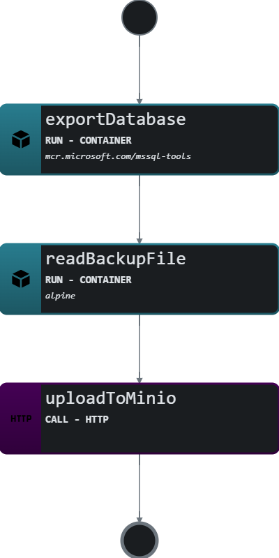

# Use Case: Automated Data Backup

## Overview

### System

This system automates the backup of an SQL Server database and uploads the backup file to a Minio object storage service on a regular schedule. The workflow consists of three main steps: exporting the database to a file, encoding the backup file in Base64 format, and uploading it to the Minio API.

### Actors

- **Database Administrator:** The user who configures and manages the workflow for database backups.
- **SQL Server:** The database system from which the data is being exported.
- **Minio Object Storage:** The service used for storing the backup files securely.
- **Workflow Engine:** Orchestrates the execution of the defined tasks.

### Goals

- **Automated Backups:** To facilitate automated backups of critical database data without manual intervention, ensuring regular data protection.
- **Data Security:** To ensure backup files are securely uploaded to a reliable storage solution (Minio).
- **Efficiency:** To streamline the backup process, reducing the time and effort required to perform database backups.

### Preconditions

- The SQL Server instance is accessible from the container environment.
- The Minio object storage service is running and accessible via the provided endpoint.
- Necessary permissions and credentials for both SQL Server and Minio are available.

## Scenario

### Triggers

The workflow is triggered automatically based on a cron schedule that executes the backup process daily at midnight.

### Flow Breakdown

1. **Export Database:**
   - A container runs the `mcr.microsoft.com/mssql-tools` image to back up the specified database to a file located in a mounted volume. The command utilizes environment variables to securely provide the SQL Server connection details and the database name.

2. **Read Backup File:**
   - Another container, using the Alpine image, reads the backup file from the mounted volume and encodes it in Base64. The Base64 encoded content is then exported for use in the next step.

3. **Upload to Minio:**
   - An HTTP call is made to the Minio API to upload the Base64 encoded backup file. The request includes the necessary authentication and specifies the content type as `application/octet-stream`.

### Visualization

The following diagram represents the high-level flow of the workflow:



*Visualization generated by Synapse.*

### Example

```yaml
document:
  dsl: '1.0.2'
  namespace: default
  name: sql-export-to-minio
  version: 0.1.2
do:
- exportDatabase:
    run:
      container:
        image: mcr.microsoft.com/mssql-tools
        command: >
          /bin/bash -c "sqlcmd -S $SQLSERVER_HOST -U $SQLSERVER_USER -P '$SQLSERVER_PASSWORD'  -Q 'BACKUP DATABASE [$DATABASE_NAME] TO DISK = N\'/var/backup/db.bak\''  && echo 'Database backup completed'"
        volumes:
          /var/backup: /backup
        environment:
          SQLSERVERHOST: sqlserver
          SQLSERVERUSER: SA
          SQLSERVERPASSWORD: P@ssw0rd
          DATABASENAME: YourDatabase
- readBackupFile:
    run:
      container:
        image: alpine
        command: >
          /bin/sh -c "cat /backup/YourDatabase.bak | base64"
        volumes:
          /var/backup: /backup
    export:
      as: '$context + { base64Backup: . }'
- uploadToMinio:
    call: http
    with:
      method: put
      endpoint:
        uri: https://minio.example.com/backups/db.bak
        authentication:
          bearer:
            token: 2548qsd5a8qsd43a
      headers:
        contentType: application/octet-stream
      body: ${ $context.base64Backup }
schedule:
  cron: 0 0 * * *
```

## Conclusion

This workflow effectively automates the process of backing up an SQL Server database and securely uploading it to a Minio storage solution, enhancing data management and security for database administrators.