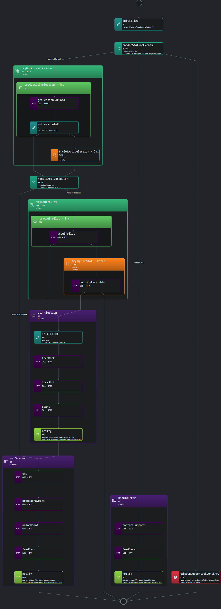

# Use Case: Managing EV Charging Stations

## Overview

### System

This use case focuses on managing Electric Vehicle (EV) charging stations using a serverless workflow. The system handles various events related to the charging process, including card scanning, charging session management, and error handling. The system interacts with the EV power supplier's API to perform necessary operations like starting or ending sessions, locking and unlocking slots, processing payments, and handling errors.

### Actors

- **EV Owner:** The person using the charging station.
- **Charging Station:** The physical unit where vehicles are charged.
- **EV Power Supplier API:** The external system responsible for managing the charging process, slot availability, and session data.

### Goals

- **Automate Charging Station Operations:** Automate the process of handling charging sessions, from card scanning to payment processing and error management.
- **Improve User Experience:** Provide a smooth and efficient charging experience by ensuring slots are managed effectively and errors are promptly addressed.
- **Ensure System Integrity:** Implement robust error handling to maintain service continuity and prevent misuse or unauthorized access.

### Preconditions

- The charging station must be connected to the EV Power Supplier's network.
- The card used for charging must be registered and valid.
- The charging station has two available slots, each capable of handling one vehicle at a time.

## Scenario

### Triggers

The workflow is triggered by two types of events:
1. **Card Scanned Event:** Occurs when a user scans their card at the charging station.
2. **Fault Event:** Occurs when the charging station reports an error or fault.

### Flow Breakdown

#### 1. **Initialization:**
   - Capture the event details and store them in the workflow context.

#### 2. **Handle Station Events:**
   - Depending on the event type, the workflow either attempts to manage a charging session or handles an error.

#### 3. **Try to Get Active Session:**
   - Check if there is an active session for the scanned card.

#### 4. **Handle Active Session:**
   - If a session is in progress, attempt to end it. If no session is in progress, try to acquire an available slot.

#### 5. **Try to Acquire Slot:**
   - If an available slot is found, start a new charging session. If no slots are available, make the station’s LED flicker red and end the workflow.

#### 6. **Start Session:**
   - Initialize a new charging session, lock the slot, and start the charging process.

#### 7. **End Session:**
   - End the charging session, process the payment, unlock the slot, and notify the user by flickering the LED.

#### 8. **Handle Error:**
   - Contact support, activate the red LED, and notify the system about the error.

### Visualization

The following diagram represents the high-level flow of the workflow:



*Visualization generated by Synapse.*

### Example

```yaml
document:
  dsl: '1.0.0'
  namespace: default
  name: manage-ev-charging-stations
  version: '0.1.0'
schedule:
  on:
    any:
      - with:
          type: com.ev-power-supplier.charging-station.card-scanned.v1
      - with:
          type: com.ev-power-supplier.charging-station.faulted.v1
do:

  - initialize:
      set:
        event: ${ $workflow.input[0].data }
      export:
        as: .event

  - handleStationEvents:
      switch:
        - sessionStarted:
            when: .event.type == "com.ev-power-supplier.charging-station.card-scanned.v1"
            then: tryGetActiveSession
        - stationError:
            when: .event.type == "com.ev-power-supplier.charging.station-faulted.v1"
            then: handleError
      then: raiseUnsupportedEventError

  - tryGetActiveSession:
      try:
        - getSessionForCard:
            call: http
            with:
              method: get
              endpoint: https://ev-power-supplier.com/api/v2/stations/{stationId}/session/{cardId}
        - setSessionInfo:
            set:
              session: ${ .session }
      catch:
        errors:
          with:
            status: 404
      
  - handleActiveSession:
      switch:
        - sessionInProgress:
            when: .session != null
            then: endSession
      then: tryAquireSlot

  - tryAquireSlot:
      try:
        - acquireSlot:
            call: http
            with:
              method: post
              endpoint: https://ev-power-supplier.com/api/v2/stations/{stationId}
              body:
                card: ${ $context.card }
            export:
              as: '$context + { slot: .slot }'
      catch:
        errors:
          with:
            status: 400
        when: .detail == "No charging slots available"
        do:
          - noSlotsAvailable:
              call: http
              with:
                method: post
                endpoint: https://ev-power-supplier.com/api/v2/stations/{stationId}/leds/main
                body:
                  action: flicker
                  color: red
                  duration: 3000
              then: end
      
  - startSession:
      do:
        - initialize:
            set:
              session:
                card: ${ $context.card }
                slotNumber: ${ $context.slot.number }
            export:
              as: '$context + { session: . }'
        - feedBack:
            call: http
            with:
              method: post
              endpoint: https://ev-power-supplier.com/api/v2/stations/{stationId}/leds/{slotNumber}
              body:
                action: 'on'
                color: blue
        - lockSlot:
            call: http
            with:
              method: put
              endpoint: https://ev-power-supplier.com/api/v2/stations/{stationId}/slot/{slotNumber}/lock
        - start:
            call: http
            with:
              method: put
              endpoint: https://ev-power-supplier.com/api/v2/sessions/{sessionId}/start
        - notify:
            emit:
              event:
                with:
                  source: https://ev-power-supplier.com
                  type: com.ev-power-supplier.charging-station.session-started.v1
                  data: ${ $context.session }

  - endSession:
      do:
        - end:
            call: http
            with:
              method: put
              endpoint: https://ev-power-supplier.com/api/v2/sessions/{sessionId}/end
        - processPayment:
            call: http
            with:
              method: put
              endpoint: https://ev-power-supplier.com/api/v2/sessions/{sessionId}/pay
        - unlockSlot:
            call: http
            with:
              method: put
              endpoint: https://ev-power-supplier.com/api/v2/stations/{stationId}/slot/{slotNumber}/unlock
        - feedBack:
            call: http
            with:
              method: post
              endpoint: https://ev-power-supplier.com/api/v2/stations/{stationId}/leds/{slotNumber}
              body:
                action: flicker
                color: white
                duration: 3000
        - notify:
            emit:
              event:
                with:
                  source: https://ev-power-supplier.com
                  type: com.ev-power-supplier.charging-station.session-ended.v1
                  data: ${ $context.session }
      then: end

  - handleError:
      do:
        - contactSupport:
            call: http
            with:
              method: post
              endpoint: https://ev-power-supplier.com/api/v2/stations/{stationId}/support
              body: 
                error: ${ $context.event.data.error }
        - feedBack:
            call: http
            with:
              method: post
              endpoint: https://ev-power-supplier.com/api/v2/stations/{stationId}/leds/main
              body:
                action: 'on'
                color: red
        - notify:
            emit:
              event:
                with:
                  source: https://ev-power-supplier.com
                  type: com.ev-power-supplier.charging-station.out-of-order.v1
                  data: ${ $context.event.data.error }
      then: end

  - raiseUnsupportedEventError:
      raise:
        error:
          type: https://serverlessworkflow.io/spec/1.0.0/errors/runtime
          status: 400
          title: Unsupported Event
          detail: ${ "The specified station event '\($context.event.type)' is not supported in this context" }
      then: end
```

## Conclusion

This use case demonstrates the automation of key tasks in managing EV charging stations. By integrating with the EV Power Supplier API, the workflow efficiently handles charging sessions, processes payments, manages slot availability, and responds to errors. This ensures a seamless and user-friendly experience while maintaining operational integrity.