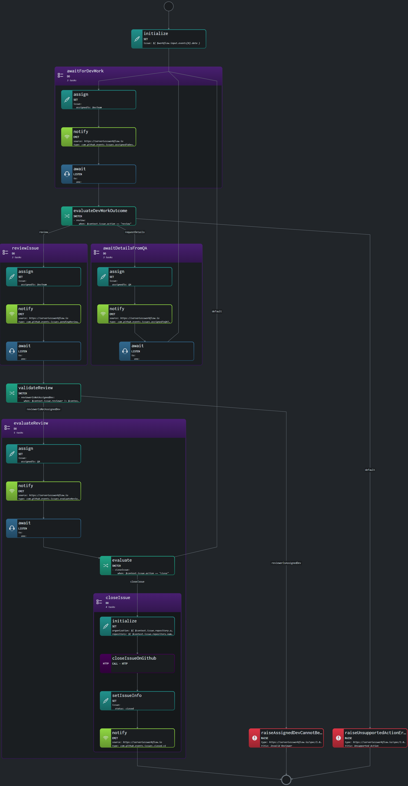

# Use Case: Managing GitHub Issues

## Overview

### System

The system is a GitHub-based issue management workflow designed to automate the lifecycle of an issue. It leverages Serverless Workflow (SW) DSL to handle various stages, from assignment and development to review and closure.

### Actors

- **QA Team:** Creates and provides details for issues.
- **Development Team:** Works on resolving issues.
- **Reviewers:** Evaluate the work done by the development team.
- **GitHub API:** External system for managing and updating issue states.

### Goals

- **Automate Issue Management:** Streamline the process from issue creation to closure, reducing manual tasks and ensuring consistent handling.
- **Facilitate Collaboration:** Coordinate between different teams (QA, Dev, Reviewers) through automated task assignments and notifications.
- **Ensure Integrity:** Implement error handling to avoid common pitfalls, like assigning reviewers who are also the developers of the issue.

### Preconditions

- The workflow assumes a GitHub repository where issues are tracked.
- Teams and roles (QA, Dev, Reviewer) are predefined and recognized by the system.
- Relevant GitHub events are configured to trigger the workflow.

## Scenario

### Triggers

The workflow is triggered when a new issue is created in the GitHub repository by a member of the QA team.

### Flow Breakdown

1. **Initialization:**
   - The workflow starts by capturing the issue details from the trigger event and storing them in the workflow context.

2. **Assign to Development Team:**
   - The issue is assigned to the development team, and a notification is emitted. The workflow then waits for the development work to be completed.

3. **Evaluate Development Outcome:**
   - The workflow evaluates the development outcome based on the data returned. It decides the next steps, such as sending the issue for review or requesting more details.

4. **Review Process:**
   - The issue is assigned to a reviewer (excluding the developer who worked on it). A notification is sent out, and the workflow waits for the review to be completed.

5. **Issue Closure:**
   - Upon successful review, the workflow triggers a GitHub API call to close the issue. A final notification is sent to confirm the closure.

6. **Error Handling:**
   - The workflow includes steps to handle errors, such as when an unsupported action is taken, or a developer is incorrectly assigned as a reviewer.

### Visualization

The following diagram represents the high-level flow of the workflow:



*Visualization generated by Synapse.*

### Example

```yaml
document:
  dsl: '1.0.0'
  namespace: default
  name: manage-github-issues
  version: '0.1.0'
schedule:
  on:
    one:
      with:
        type: com.github.events.issues.opened.v1
        data: ${ .data.author.team == "QA" }
do:

  - initialize: 
      set:
        issue: ${ $workflow.input[0].data }
      export:
        as: .issue

  - awaitForDevWork:
      do:
        - assign: 
            set:
              issue:
                assignedTo: DevTeam
                status: inProgress
        - notify: 
            emit:
              event:
                with:
                  source: https://serverlessworkflow.io
                  type: com.github.events.issues.assignedToDevTeam.v1
                  data:
                    issue: ${ .issue }
        - await:
            listen:
              to:
                one:
                  with:
                    type: com.github.events.issues.devWorkCompleted.v1
            export:
              as: '$context + { issue: ($context.issue + { action: .data.nextAction, dev: .data.dev }) }'
      then: evaluateDevWorkOutcome
  
  - evaluateDevWorkOutcome:
      switch:
        - review:
            when: $context.issue.action == "review"
            then: reviewIssue
        - requestDetails:
            when: $context.issue.action == "requestDetails"
            then: awaitDetailsFromQA
        - default:
            then: raiseUnsupportedActionError
              
  - awaitDetailsFromQA:
      do:
        - assign: 
            set:
              issue:
                assignedTo: QA
                status: awaitingDetails
                assignTo: ${ $context.issue.author }
        - notify: 
            emit:
              event:
                with:
                  source: https://serverlessworkflow.io
                  type: com.github.events.issues.assignedToQATeam.v1
                  data:
                    issue: ${ $context.issue }
        - await:
            listen:
              to:
                one:
                  with:
                    type: com.github.events.issues.detailsProvided.v1
            export:
              as: '$context + { issue: ($context.issue + { action: .data.nextAction }) }'
      then: awaitForDevWork
              
  - reviewIssue:
      do:
        - assign: 
            set:
              issue:
                assignedTo: DevTeam
                status: reviewing
        - notify: 
            emit:
              event:
                with:
                  source: https://serverlessworkflow.io
                  type: com.github.events.issues.pendingReview.v1
                  data:
                    issue: ${ $context.issue }
                    review:
                      exclude: ${ $context.issue.dev }
        - await:
            listen:
              to:
                one:
                  with:
                    type: com.github.events.issues.reviewed.v1
            export:
              as: '$context + { issue: ($context.issue + { reviewer: .data.reviewer }) }'
      
  - validateReview:
       switch:
         - reviewerIsNotAssignedDev:
              when: $context.issue.reviewer != $context.issue.dev
              then: evaluateReview
         - reviewerIsAssignedDev:
              then: raiseAssignedDevCannotBeReviewer

  - evaluateReview:
      do:
        - assign: 
            set:
              issue:
                assignedTo: QA
                status: evaluating
        - notify: 
            emit:
              event:
                with:
                  source: https://serverlessworkflow.io
                  type: com.github.events.issues.evaluateReview.v1
                  data:
                    issue: ${ $context.issue }
                    assignTo: ${ $context.issue.author }
        - await:
            listen:
              to:
                one:
                  with:
                    type: com.github.events.issues.evaluated.v1
            export:
              as: '$context + { issue: ($context.issue + { action: .data.nextAction }) }'
        - evaluate:
            switch:
              - closeIssue:
                  when: $context.issue.action == "close"
                  then: closeIssue
              - default:
                  then: exit
        - closeIssue:
            do:
              - initialize: 
                  set:
                    organization: ${ $context.issue.repository.organization }
                    repository: ${ $context.issue.repository.name }
                    issueNumber: ${ $context.issue.number }
              - closeIssueOnGithub:
                  call: http
                  with:
                    endpoint: https://api.github.com/repos/{organization}/{repository}/issues/{issueNumber}
                    method: patch
                    body:
                      state: closed
              - setIssueInfo: 
                  set:
                    issue:
                      status: closed
              - notify: 
                  emit:
                    event:
                      with:
                        source: https://serverlessworkflow.io
                        type: com.github.events.issues.closed.v1
                        data:
                          issue: ${ $context.issue }
            then: end
      then: awaitForDevWork
        
  - raiseUnsupportedActionError:
      raise:
        error:
          type: https://serverlessworkflow.io/spec/1.0.0/errors/runtime
          status: 400
          title: Unsupported Action
          detail: The specified action is not supported in this context
      then: end
  
  - raiseAssignedDevCannotBeReviewer:
      raise:
        error:
          type: https://serverlessworkflow.io/spec/1.0.0/errors/runtime
          status: 400
          title: Invalid Reviewer
          detail: The developer that has performed the work associated with the issue cannot be the reviewer of its own work
      then: end

```

## Conclusion

This use case illustrates the powerful capabilities of Serverless Workflow in automating complex processes such as GitHub issue management. The workflow is flexible, scalable, and easy to maintain, making it an ideal choice for orchestrating tasks in modern development environments. By leveraging Serverless Workflow, teams can ensure efficient and consistent handling of issues, improving productivity and achieving better project outcomes.