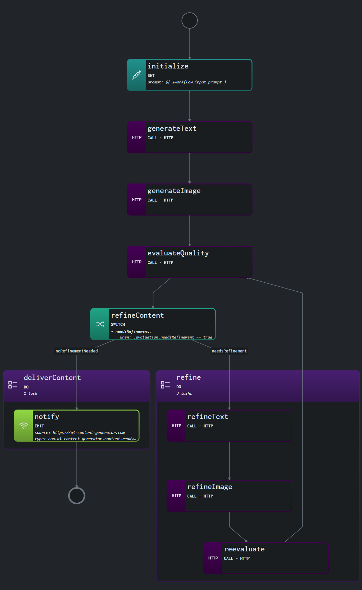

# Use Case: Multi-Agent Collaboration for AI Content Generation

## Overview

### System

The system is designed to facilitate collaboration between multiple AI agents, each specializing in different aspects of content creation, such as text generation, image generation, and quality evaluation. The workflow coordinates these agents to produce high-quality, refined AI content.

### Actors

- **Text Generator Agent:** Generates initial text content based on provided prompts.
- **Image Generator Agent:** Creates images based on the generated text.
- **Quality Evaluator Agent:** Assesses the quality of the generated text and images, providing feedback for improvements.
- **Refinement Agent:** Makes adjustments to the content based on the evaluator’s feedback.
- **User:** The end user who initiates the content generation process and provides the initial prompts.

### Goals

- **Streamline AI Collaboration:** Facilitate efficient communication and collaboration between AI agents to generate cohesive and high-quality content.
- **Improve Content Quality:** Utilize iterative feedback and refinement cycles to enhance the quality of the generated content.
- **User Satisfaction:** Ensure that the final output meets high standards and aligns with the user’s expectations.

### Preconditions

- The system has access to pre-trained AI models for text generation, image generation, and quality evaluation.
- A user-provided prompt initiates the content generation process.

## Scenario

### Triggers

The workflow is triggered when a user submits a prompt to generate AI content.

### Flow Breakdown

1. **Initialize Workflow:**
   - The workflow begins by capturing the user prompt and storing it in the workflow context.

2. **Generate Initial Text:**
   - The Text Generator Agent creates initial text content based on the user prompt.

3. **Generate Associated Image:**
   - The Image Generator Agent generates an image that corresponds to the text.

4. **Evaluate Quality:**
   - The Quality Evaluator Agent assesses the generated text and image, providing feedback on areas for improvement.

5. **Refine Content:**
   - The Refinement Agent adjusts the text and image based on the evaluator’s feedback.

6. **Final Evaluation:**
   - The refined content is re-evaluated to ensure that it meets quality standards. If further refinement is needed, the workflow loops back to the refinement step.

7. **Content Delivery:**
   - Once the content passes the final evaluation, it is delivered to the user.

### Visualization

The following diagram represents the high-level flow of the workflow:



*Visualization generated by Synapse.*

### Example

```yaml
document:
  dsl: '1.0.2'
  namespace: default
  name: multi-agent-collaboration-for-ai-content
  version: '0.1.0'
input:
  schema:
    document:
      type: object
      properties:
        prompt:
          type: string
      required: [ prompt ]
do:

  - initialize:
      set:
        prompt: ${ $workflow.input.prompt }
      export:
        as: .prompt

  - generateText:
      call: http
      with:
        method: post
        endpoint: https://ai-content-generator.com/api/v1/generate-text
        body:
          prompt: ${ .prompt }
      export:
        as: $context + { text: .text } 

  - generateImage:
      call: http
      with:
        method: post
        endpoint: https://ai-content-generator.com/api/v1/generate-image
        body:
          text: ${ .text }
      export:
        as: $context + { image: .image }

  - evaluateQuality:
      call: http
      with:
        method: post
        endpoint: https://ai-content-generator.com/api/v1/evaluate
        body:
          text: ${ .text }
          image: ${ .image }
      export:
        as: $context + { evaluation: .evaluation }

  - refineContent:
      switch:
        - needsRefinement:
            when: .evaluation.needsRefinement == true
            then: refine
        - noRefinementNeeded:
            when: .evaluation.needsRefinement == false
            then: deliverContent

  - refine:
      do:
        - refineText:
            call: http
            with:
              method: post
              endpoint: https://ai-content-generator.com/api/v1/refine-text
              body:
                text: ${ .text }
                feedback: ${ .evaluation.text_feedback }
        - refineImage:
            call: http
            with:
              method: post
              endpoint: https://ai-content-generator.com/api/v1/refine-image
              body:
                image: ${ .image }
                feedback: ${ .evaluation.image_feedback }
        - reevaluate:
            call: http
            with:
              method: post
              endpoint: https://ai-content-generator.com/api/v1/evaluate
              body:
                text: ${ .refined_text }
                image: ${ .refined_image }
            export:
              as: .evaluation
      then: evaluateQuality

  - deliverContent:
      do:
        - notify:
            emit:
              event:
                with:
                  source: https://ai-content-generator.com
                  type: com.ai-content-generator.content.ready.v1
                  data:
                    text: ${ .text }
                    image: ${ .image }
      then: end
```

## Conclusion

This use case demonstrates how multiple AI agents can collaborate efficiently to generate high-quality content. By leveraging the Serverless Workflow DSL, the system ensures that each agent’s output is evaluated and refined in a coordinated manner, leading to superior results. This approach allows for iterative improvements, making it an ideal solution for complex content generation tasks.